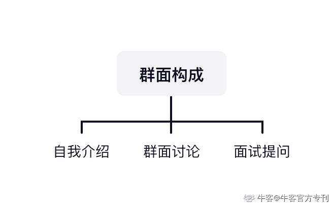
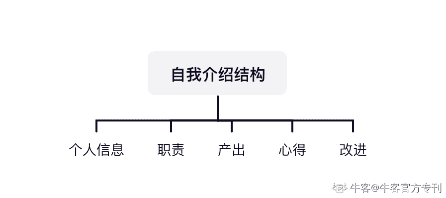
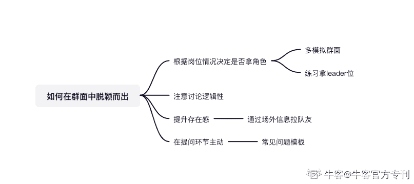

# 第四章 第 3 节 面试之群面通关

> 原文：[`www.nowcoder.com/tutorial/10055/09b704b6c36a4b76becf4e14dc3ba1a1`](https://www.nowcoder.com/tutorial/10055/09b704b6c36a4b76becf4e14dc3ba1a1)

# 1.群面

首先，群面与专业面不同的一点是，你需要突破众多面试者的人海让面试官记住你、并且产生正向评价。在整体风格上，要更主动积极一点，不发言或少发言，是一定会被淹没的。 群面主要考核的是领导力、沟通能力、情商、逻辑思维能力，其实不会深挖你的专业能力，而且平均下来每个人的时间不超过 20 分钟，也展示不出什么深刻的专业能力，所以声音清晰洪亮这种气场信息还是很有用的，在发言的时候要注意逻辑清晰和声音洪亮，以保证全程都能听清你的表述。群面大致分为【自我介绍】+【群面讨论】+【面试提问】三个环节，下面将分别阐述。

## （**1）如何做自我介绍？**

群面开场，面试官一般会让大家先做一轮自我介绍。在时间把控上，群面的自我介绍对时间限制较为严格，建议私下练习的时候时间控制在一分半左右，主要介绍亮点经历和核心产出。在正式面试时，如果因为时间过长被打断，建议两句话之内结束自我介绍，一方面我认为在面试官面前挑战这种规则没有太大意义，显得我们没有时间观念并且有些不尊重人，另一方面被打断突然不说，结束的太仓促了也不太得体，两句话做一个结束是最好的选择。
**自我介绍内容，我推荐按照【内容=个人信息+职责+产出+心得+改进】 的结构进行展示。**

> 举例：【个人信息】我是来自 xx 大学 xx 专业的 xx，【职责】曾任就业中心助理，主要负责用人单位沟通&展位安排，【产出】秋季双选会中因信息沟通和展位安排出现问题的次数历年最低。【心得】擅长切入对方的利益点进行沟通。【改进】复盘中发现更应该通过制度解决问题，推动了双选会筹备过程信息化。

另外，在自我介绍的时候可以给自己设定一个场外的强记忆点，大家都说实习经历&成绩的时候，我在腾讯的面试中说了我手游吃鸡王牌，全服排名前 4%，效果也不错。但是看情况慎用吧，如果面试官一看就是很不苟言笑的，还是不要轻易尝试。

## （2）如何在群面讨论中脱颖而出

### 1）**是否要在群面中找到自己的角色定位？**

群面面经里常说，在群面中你要抢一个角色，leader、timer 等等，其中 leader 负责带领大家推进讨论并纠偏总结，领头汇报；timer 负责计时提醒，进行时间控制。但我的经验是，抢角色的本质是基于自己的特质和群面的环境，思考自己能为所在小组产出什么价值，如果拿角色反而会负向影响自己的表现，那不如不拿。我曾经强行抢 leader，但我并不了解当时面试的岗位结果带着整组跑偏。理所当然，那场面试我挂了。拿了某公司管培的朋友也有一个小建议，如果你有充足的时间，建议提前模拟群面，尝试引导自己去做 leader。面试通过专业能力获得面试官注意，能提出全新的观点且被面试官认同的人还是少之又少的。leader 相对更占优势，因为 leader 相对有更多展示自己的机会，且总结陈词的底层逻辑可以在短期内得到提升，遵守金字塔原理对大家的观点进行汇总即可，多模拟群面几场就通了。

### 2）注重群面讨论的逻辑性

群面中，大家一般都会比较紧张，在项目讨论中很容易出现各说各话、东讨论一下西讨论一下的情况。这时候如果想要脱颖而出，就要注重展示自己有逻辑性这一差异点。比如，在讨论中说，我认为这个问题可以分为「筹备期」、「上线中」、「结束复盘」三个模块进行讨论，各自花 8 分钟进行讨论，当前集中在「筹备期」的讨论，我们推进起来更清晰一些。

### 3）**如何提升自己在群面中的存在感？**

参与同一场群面的同学，大多都是互相不熟悉的，可以进场前就和同伴中看起来气场合的多说说话混个脸熟，记住名字。群面的时候可以说“我认同 xx 的观点，我认为 xxx 是合理的，在此基础上我补充一点.....”，此时你就获取一位愿意倾听你观点的盟友了！

### 4）**面试提问环节如何应对？**

一般群面结束面试官都会问 1-2 个问题，大家这时候其实都是没有很好很成熟的观点的，我建议只要你有大致不荒唐的思路就可以抢一下回答的机会，这个环节能有效让面试官记住你，也能和面试官就问题有个简短的讨论，不论回答的好坏都算是有益处的。还有的面试官会问面试者有没有问题要问，保持开放思考的心态你一般是有问题的（除非非常紧张光顾着紧张了，问不出问题），不知道问啥就建议你问：您认为刚刚的讨论中，我们做得好和做得不好的点在哪里？有什么改进建议嘛？建议抓住这样的机会，一方面是在面试官面前露个脸，另一方面，面试官都是很优秀的人，可以就自己的面试中疑问和面试官进行讨论，非常有利于自己的提升。群面是面试的第一关，总之一定要保持自信，积极复盘。如果对群面还有不清楚的地方，可以阅读牛客专刊[《群面钻石通关攻略》](https://www.nowcoder.com/tutorial/10030/index)，本篇专刊拆解了群面的各个角色，从应届者求职角度如何去提升，同时从面试官的角度来看应届求职者最应该表现出来的素质。