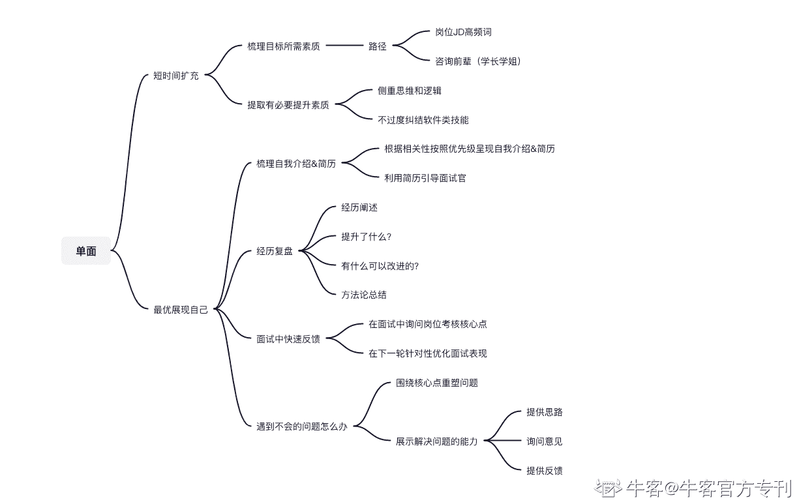

# 第四章 第 4 节 面试通关之综合单面

> 原文：[`www.nowcoder.com/tutorial/10055/a5fe6fc7f4604394a8623546cd27b637`](https://www.nowcoder.com/tutorial/10055/a5fe6fc7f4604394a8623546cd27b637)

# 1.单面

区别于群面，专业面主要考量的就是你的专业匹配度。我觉得是没什么速成的渠道的，很需要你平时在专业领域的实践和思考，从接收到面试通知的时刻开始，能做的只有两件事【通知面试后短时间精准扩充自己】【基于现有能力最好展现】

## （1）通知面试后，如何短时间精准扩充自己？

1.  **梳理目标岗位所需素质**

1.  查面试岗位 JD，画出来所需素质；查行业内该岗位的 JD，画出来所需素质，重叠度最高的就是行业内都需要的素质。

1.  问相关岗位学长学姐，你可以得到岗位所需的隐形素质。（很重要，也许你的岗位需要的某些素质是不方便放在网络上明说但是强需求的，通过这个能评估自己到底能不能喜欢&胜任工作，也能更好准备）

**    2\. 提取有必要快速准备&提升的素质**

1.  校招更看重你的思维和潜力，所以有些技能点短期来看是不那么重要的。例如运营岗位面试，没人会考核你的 office 能力。

1.  校招不会对软件技能很严苛，但没有岗位思维是一定不行的。同样时间更少的时候可以选择去听学习类 app 的专业课，1.5 倍速，比你读书来的快很多。

## （2）如何基于现有能力，在单面中更好地表现自己？

### 

*   1）**梳理自我介绍&简历**

关于自我介绍的结构在前面讲过了，但相对于群面，单面时间更为宽裕，根据单面的岗位按照原有结果进行梳理即可。 但是注意单面自我介绍内容要和面试工作岗位所需素质强相关，和岗位无关的事情就没必要说了。在我的认知中，简历是对面试整个流程的一个引导。部分面试官会在你自我介绍的时候，顺便看简历然后提问，所以单面环节的简历还是很重要的。我会根据单面的方向、岗位描述针对性调整简历。秋招精力有限，不是所有的岗位我们都会针对性地制作简历，很可能是依靠一份通用简历，幸运地通过了笔试和群面，但走到单面的流程上，为了提升单面通过率，有必要根据单面的岗位针对性地调整简历。针对想要被关注和提问的内容，我会通过排版在前面、文字加粗等方式引起面试官的注意。我会在单面开始前，递给面试官这份新的简历，说明自己最近对历史经验进行了复盘并更新了简历，确保替换了历史简历后开始自我介绍。

### 

*   **2）经历复盘**

专业面试拆解开其实就两块：经历挖掘&回答面试官问题在专业问题方面很考量底层能力，但是经历挖掘是完全可以提前准备的。 可以复盘自己以前的经历，从以下几个方面入手准备：

1.  经历阐述：我在经历中是什么角色、做了什么、有什么突出贡献？

1.  提升：在经历中我学到了什么、提升了什么？

1.  改进：我有什么地方做的不好、如何改进？

1.  总结：通过经历我总结出了什么看待 or 解决问题的方法论？

### 

*   3）**在面试中快速反馈**

一般如果有多轮专业面是很有可能安排在一起的，我会在一面的结尾面试官问：你有没有什么问题问我？的时候，选择问【我认为 xx 岗位需要 xx、xx、xx 能力，您认为这个岗位需要什么能力呢？想要做好该岗位的工作我需要在思维上有什么转变呢？】然后根据面试官的反馈、快速调整下一轮的自我介绍&引导关注点。举例：面试官回答我岗位很需要目标拆解能力，下一轮自我介绍我就会把迎新晚会的筹备组织放在前面，成绩就带过。当然这个是基于上一阶段准备的很好，能快速在知识库里重组内容。

### 

*   4）**如何应对不会的问题**

面试中难免遇到不那么会的问题，我目前有两种解决方案：1.**围绕面试官的核心关注点、自己重塑问题**京东面试的时候，面试官曾经问我，你觉得京东最近做的好的营销是什么？然而我当时没注意过京东做的好的营销，我思考了一下说，相较于好的营销，倒是有另一个做的不大好的案例给我印象深刻，我能跟你说说这个案例带给我的启示吗？只要核心关注点是一致的，面试官大概率会愿意听你说。**2.提供思路+询问意见+提供反馈**这种更适用于完全懵逼不熟悉的领域。 例如面试官问：你认为内容付费需要关注什么？我不会回答的时候会说，我不大熟悉这一细分领域，如果有足够时间我会选择和前辈请教同时了解公司产品。但如果现在要我输出方案，我会觉得可以按照阶段分即为：产品、运营、用户拆分不同端关注的点吧啦吧啦。然后问面试官意见，他反馈之后你就能大致建立一个思维框架，你总结一下说出来就 OK。核心在于，在自己不够专业的情况下，展示我是能主动拆分并解决问题，同时能快速成长学习的人。

## 2.总监面

恭喜你，如果你到了总监面的环节，证明你距离拿到 offer 已经非常接近了。总监面的时候，面试官也不太会关注考核细节问题的，因为你的细节问题考核，在前几轮的面试中都已经考核过了。这时候他们会比较喜欢问宏观问题和个人性格问题。建议面试前读一下公司相关的报道、研报、从公司层面做一下市场环境分析、竞品分析，应对面试中的宏观问题。个人性格类问题，注意展现自己乐观积极的一面即可。

## 3.HR 面

HR 面的时候，HR 更关注你为什么加入这家公司？你的个性是否适配岗位？你的稳定性怎么样？等通用问题。只要是保持良好的积极的态度，一般都不太可能翻车。一般来说，HR 面不太会挂人。但有部分公司也会选择在 HR 面大量卡人，这种一般是部门有 HC 限制，可以通过关注牛友发的帖子获取信息。

## 4.如何谈薪水

校招其实不用非常关注薪酬问题，因为对这个阶段的你来说，好的成长环境、优秀的业务、成熟的 leader 更为重要，但在能拿到 offer 的情况下，如果想要聊薪资的话，可以关注以下几个方面。关注同职位的人，行业内、公司内都能拿到多少薪水，建立自己的薪资预期。如果拿到了 a 公司的 offer，可以用来在 b 公司谈薪酬的时候辅助证明自己的能力，以争取好的薪资。当然前提是两个公司及岗位有可比性，不要拿不在同一量级、不同的岗位去对比。比如，京东的产品经理和不知名公司的运营，显然是不能做对比的。