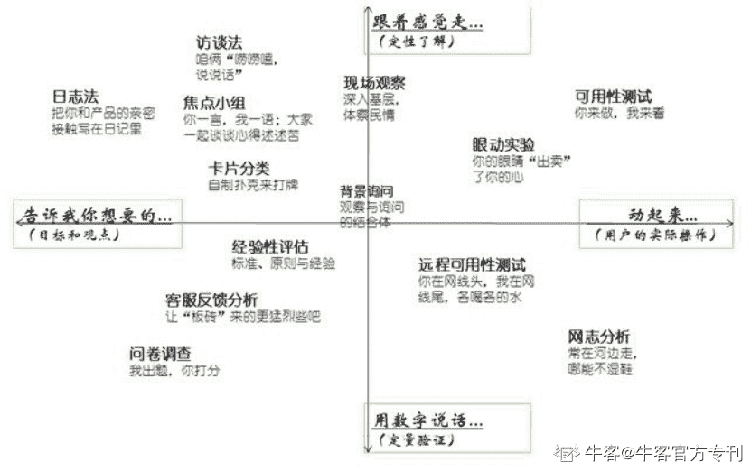
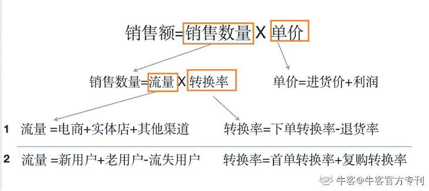
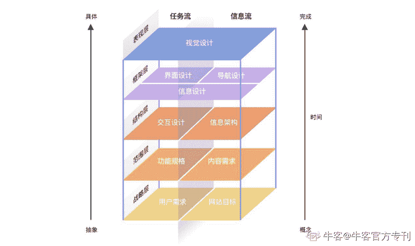
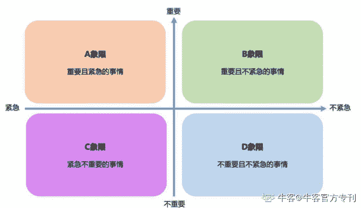
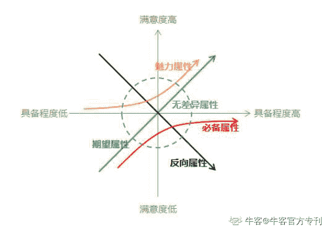
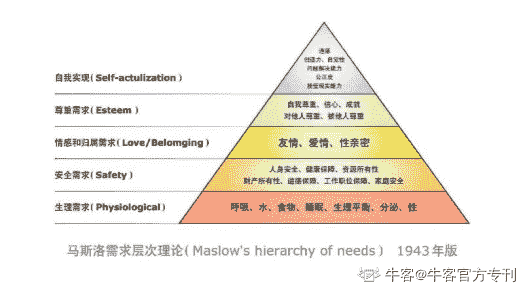

# 第三章 第 1 节 笔试简介与题型解析

> 原文：[`www.nowcoder.com/tutorial/10027/72c2aefb56f540e994141064235611a5`](https://www.nowcoder.com/tutorial/10027/72c2aefb56f540e994141064235611a5)

# **笔试****简介与题型解析**

产品岗位笔试题题型分为客观题和主观题，根据近几年的企业笔试真题，产品岗客观题和主观题题目类型大概有如下几类：

## 笔试简介

#### **1、****客观题**

数理逻辑：逻辑推理题，考察考生逻辑思维能力，主要来自于行测题。

行业资讯：互联网行业及产品讯息，考察考生是否关注行业热点。

岗位知识：考察对产品岗位工作内容、能力框架、专业知识的了解和掌握程度。

#### **2、主观题**

数理逻辑                    行业分析                                岗位认知

项目管理                    需求分析&用户研究               名词解释

竞品分析                    数据分析&数据估算               产品设计

产品规划                    产品运营

 **而****不同****公司的产品岗所考的试卷题型组合也是不一样****。以往年的试卷为例（每年不固定，仅供参考）：**

*   腾讯：行测题+数理逻辑+产品分析+产品运营
*   爱奇艺：行测题+行测题+产品设计+产品运营
*   京东：行测题+岗位认知+竞品分析+产品设计+需求分析+产品规划 
*   BIGO：岗位认知+竞品分析+产品设计+产品运营
*   网易：数理逻辑+竞品分析+数据分析&数据估算+产品规划
*   欢聚集团：竞品分析+产品运营

以上题型中，数理逻辑，行业分析，岗位认知，项目管理更多的来自于平时的知识积累，近几年的出现频率相对较少，在此不多赘述，大家可直接通过以下方式直接练习。

**（1）牛客网>公司真题>****职业方向****：****产品****/****运营****/游戏策划**

**（2）牛客网>专项练习>产品运营**

 下面，重点讲解后面几类题型。

**备注：****题型解析一部分是企业提供，一部分由来自互联网名企的学长学姐提供，仅供参考。**

### 题型解析

#### 1、 名词解释

**①****题型介绍**

早期的名词解释比较简单，就是解释一些常见术语或者行业热门名词，例如 ASO，UGC，SAAS，NFC 等等。

近些年的名词解释出现了一些变形，会结合一些具体场景考核考生对于产品及其核心功能和特色的认知，例如“一句话向 60 后的父母解释什么是产品经理”，“如何向老人解释 YY live 是什么”等等。

**②****解题思路**

该类型考查素质：语言组织，概括能力

该类型考查知识点：用户思维，产品洞察

*   **用户思维：**由于对象的年龄、知识结构等差异，叙述名词需要考虑对方的接受能力，针对不同对象，进行形象化的订制解答。需要注意的是：少用专业名词及缩写，措辞浅显易懂，可以拿受众易于理解的事物做类比。
*   **产品****洞察：**需要洞察该产品（名词）的核心功能和核心卖点，满足了对方在哪些重要场景下的需求。

 **③****案例分析**

**【案例】**PV、UV、Visits 的含义和定义分别是什么？（京东校招产品真题）

**【参考答案】**

（1）PV：页面浏览量，指页面被浏览且加载完成的总次数，同一访客 n 次打开或刷新同一页面，被计为 n 次浏览，即 n 个 PV。

（2）UV：独立访客数，指不同的、通过互联网访问、浏览所统计页面的自然人。

（3）Visits：访问次数，指访客在网站上的会话次数，一次会话过程中可能浏览多个页面。

#### 2、 需求分析&用户研究

**①****题型介绍**

作为产品经理，用户思维和需求分析是这个岗位所需的部分核心能力之一。该类问题除了考察具体的方法论，经常结合具体应用或场景，考察应试者的逻辑思维、洞察力等。比如，让应试者判断是否需要删掉或者添加某项功能，某产品功能的上线顺序等。

**②****解题思路**

该题型考察素质：逻辑思维，系统思考

该题型考察知识点：用户调研方法，需求分析

**·用户研究：**首先，熟悉用户研究的常用方法，包括了常见的定性研究方法和定量研究方法，以及每种用研方法的使用方式和优缺点。然后，根据用研目的、对象，采取最适合的方法进行用户研究。

                                                                                          上图用户研究方法

*   **需求分析：**需求分析是从用户提出的需求出发，挖掘用户内心真正的目标，并转为产品需求的过程。用户需求的定义可分为构建用户角色，描述使用场景，定义用户问题。然后，借助 KANO 模型、四象限法则、时间评估与性价比等模型工具，确定需求的优先级。最终将用户需求转化为产品需求。

 **③****案例分析**

**【案例】**现在给你一个关键词：音乐直播，你来分析一下搜索这个关键词可能的用户群特征，以及具体的用户需求。

**【参考答案】**

1、 用户群特征

1.1 年龄分布

音乐直播的用户群的年龄分布主要集中在 18-35 岁。

1.2 性别分布

男性偏多。 

1.3 用户场景

PC 端和移动端，用户一般通过弹幕、留言点歌、购买虚拟道具赠送等，在秀场模式、多人语音的公会模式与主播互动。

2、 具体用户需求

2.1 基础的音乐直播需求。

2.2 与主播线上实时互动（弹幕）。

2.3 礼物打赏，用户可以购买平台的虚拟礼物给喜欢的主播打赏，获得主播关注，在用户之间体验到优越感。

2.4 用户之间通过发文字信息互相查看动态来满足社交需求。

2.5 滤镜、BGM、声卡、表情等功能，能活跃社区氛围。

#### 3、 数据估算&数据分析

**①****题型介绍**

数据的估算与分析是产品岗位常用的技能要求，该类问题往往是给定限定信息，并对其进行有可能计算的数量的猜想的验证，可以参考费米问题（在科学研究中用来做量纲分析、估算和清晰地验证一个假设的估算问题，例如:“估算今年全国通过网络参加考研培训的人数？”）的解决，主要考察分析问题的能力、逻辑思考的能力。

 **②****解题思路**

**该题型考察素质：**

逻辑分析能力（能否清晰有条理解决问题）

数据能力（对数据的敏感性，是否关注日常数据）

细节把握能力(是否注意分析细节，并结合实际情况去细化)

** 该题型考察知识点：**用户画像，市场分析，数据分析

*   依据生活常识，选择与题目相关的数据信息。
*   通过信息筛选，选择解题路径：估算的关键因素、因素的参数、参数间逻辑。
*   通过量化估计，计算整条逻辑链，完成问题的解决。

 **解题要点：**

有根据有来源的数据越多，估算结果就越有说服力。可以使用漏斗模型、用户分类和画像等方法进行解题。解题的思路比最终得出结果的更为重要。该类型题目考察的重点是主要结构化思维逻辑。

 **③****案例分析**

**【案例】**随着传统文化的传播，汉服越来越受年轻人的欢迎（腾讯校招产品运营真题）

 1）你会如何估算汉服的市场规模

 2）如果你开一家汉服店，会如何做大销售额

**【参考答案】**

1.市场规模我们一般用自上向下和自下向上的方法

*   自上向下：先从行业宏观市场 推演，层层细分，找到自己服务的微观市场

假定从资料查到，目前服饰市场规模约 2 万亿；服饰类包括服装和首饰，若假设服装市场大小占服饰市场的 50%，汉服市场占服装市场 5%，那么汉服市场的规模就是 500 亿人民币。

*   自下向上：先找到实际符合产品的用户，然后计算市场大小

定位宏观市场的用户群——假设全国 400 万汉服爱好者，会买汉服的占 75%，约 300 万

计算每次购买的客单价——每一件汉服的价格*每次购买的件数（假设是 500*2= 1000 元）

计算每年的采购频次——假设是 2 次

那么整个市场规模是 300 万*1000 元*2=300 亿

2.销售额=销售数量 x 单价，经过以下拆解方法，就要提高销售数量和单价，基于单价和销量之间存在最优性关系，所以我们针对第一种流量拆分方式，将扩大各个平台的曝光及流量，提高服务与产品质量，提高转化率；针对第二种流量拆分方式，我将扩大宣传种草，吸引用户下单，同时进行客户关系管理，保证老用户不流失，并促进复购。

#### 4、竞品分析

**①****题型介绍**

竞品分析是基本的产品分析方法，一般是对竞品进行功能层面的横向比较。在考试中，该题型也经常会以模糊的竞品分析的形式出现，此时需要考生自行划分对比维度。

**②****解题思路**

（1）对于一般的竞品分析，可以参照产品体验五要素，分别从五个要素层面对竞品进行分析。

产品体验五要素：

*   **战略层**：企业与用户对产品的期望和目标。
*   **范围层**：产品功能及其内容需求整合。
*   **结构层：**确定各个要呈现给用户的选项的模式和顺序——即交互设计及其信息架构。
*   **框架层**：界面设计，导航设计，内容（信息）设计。
*   **表现层**：用户可直接感知的产品和内容的视觉呈现。

                                                                           上图用户体验五要素（2）对于一些特殊的竞品分析，则因题而异，一般可采取下面的思路步骤进行分析： *   **划分维度：**根据题目要求和对于竞品的理解，划分竞品分析的维度。
*   **对比分析：**基于不同维度，对竞品作对比分析。
*   **得出结论：**基于以上分析，得出相应的结论。

 **③****案例分析**

**【案例 1】**这两年涌现了大批的语音交友、视频交友等娱乐社交 App，YY、虎牙、荔枝 FM 等老牌直播平台也开发出了多样的娱乐社交方式，请列举 3 个以上的独立娱乐社交 App，并分析直播和娱乐社交的异同点，可重点分析一款娱乐社交 App。（欢聚集团校招产品真题）

**【评分标准】**

正确列出 3 个以上娱乐社交 App（+3 分）

能合理分析直播和娱乐社交的异同点，包括从产品形态、互动方式、生态角色、组织结构、内容表现及商业模式等角度分析（+15 分）

其他言之有理可酌情给分。 **【案例 2】**请罗列平时你最常用的 5 款 APP，如果你在使用中对某些功能有改进意见，请选择 1 到 2 项进行阐述，并提出你的改进设计方案。（京东校招产品真题） **【****参考答案****】**

解题思路：满足了用户什么场景，提供了什么功能，哪里做的不足，尽量提供竞品对照；

一般我们选择一些大众的 APP，打车、外卖、旅游、听歌等 APP，容易和面试官产生互动，

也可以回答 1-2 个小众 APP，比如画音、绿洲等 APP，面试官可能没用过，这样你可以侃侃而谈，且侧面反映你对于新事物的好奇心和产品经理基础素质。

 **例子：**

1.微信读书：提供了发现好书的线上阅读功能，整个产品定位，就是基于微信人际关系的一款阅读类产品，可以随时分享阅读想法，阅读体验感好；但书单功能目前比较鸡肋，没有做到像网易云音乐那样可以分享和查看好友的书单。我将进一步在社区中加入书单等社交元素，闭环产品体验。

2.小红书：生活分享社区，作为社区高质量内容是吸引用户的亮点，但是商城商品很少，高质量用户难以在小红书实现变现，相比较于目前电商的直播带货，小红书难以满足用户从种草到拔草到闭环操作。我将整合商城供应链与物流等方面，强化电商模块，打通变现道路。

3.大众点评是 O2O 的本地生活服务平台，由于前期评分功能沉淀，在店铺点评中具有绝对优势，但是目前内容社区小红书、短视频平台抖音凭借短视频除了在美食方面有优势，家装、婚礼等模块也很全面，点评的优势削弱。我将集中发力在更具潜力的行业（如结婚、丽人、家装等），而保持已经有优势的美食、团购等方面，在特定业务优势上形成竞争壁垒。

#### 5、 产品设计

**①****题型介绍**

产品设计题往往是出题频率最高，在整张卷中分值最高，一般也是最难的题。重点考察对用户痛点的理解、需求的把控、产品的定位和核心功能的归纳。

**②****解题思路**

产品设计题型一般的解题思路为：

目标用户——用户需求或痛点——核心功能——使用场景

考察考点：需求分析、原型设计、PRD 撰写。

答题要点：

*   交代需求背景、需求目的、需求概要、涉及范围、全局规则、名词说明、交互原型地址等。
*   将功能、流程、页面等通过用例图、实体图、状态图、流程图等清晰地、整体的呈现出来。
*   将具体的页面元素、细则说明、各种情况下的跳转、原型等说明清楚。

 **③****案例分析**

**【案例 1】**请设计一款电视遥控器，并画出设计草图，请解释为何如此设计的原因，并解释该遥控器为何能够吸引用户购买或使用。

请注意：遥控器的设计需要必须包含操作电视的功能，但可以不仅是操作电视，且并不限制是传统硬件。（欢聚集团校招产品真题）

**【评分标准】**

设计图及解释设计原则（以下 1-2 点每点 5 分，第 3 点 10 分）

1\. 解释设计成硬件，软件 app，可穿戴设备等载体的合理原因

2\. 具有产品设计的基础草图概念，手绘清晰，结构合理，同时要注意一定要有电视操作功能

3\. 对设计，是否进行了合理的叙述，最好是能有针对性的设计（如针对老年人的语音输入等）

能否吸引用户购买或使用：（以下每点 10 分）

1\. 是否有陈述该遥控器的受众人群（3 分），以及该人群具有的哪些需求（7 分）

2. 该遥控器为何可以满足这些需求，或者跟市面上遥控器的区别是什么（需求满足需要符合逻辑）

**【案例 2】**假如你需要设计一款老年人新闻阅读 iPad 应用，试阐述你的设计思路（京东校招产品真题）

**【参考答案】**

方案需体现同理心，站在老人角度思考，如老年人身体特征、生活习惯、阅读偏好、iPad 特性等。

#### 6、产品规划

**①****题型介绍**

产品规划主要在了解市场、用户需求、竞品、外在机会与风险、市场和技术发展态势的基础上，根据公司自身的情况和发展方向，制定出可以把握市场机会，满足消费者需要的产品的远景目标以及实施该远景目标的战略、战术的过程。

考试中多表现为考核以下内容：用户画像，需求分析，产品设计，功能优先级管理等等。

**②****解题思路**

用户画像/需求分析/产品设计在其他部分均有涉及，在此不多赘述。

产品功能优先级管理，主要从产品战略定位、用户影响程度、技术实现难度三个方面综合考量，可以借助四象限法则、RICE 工具（产品管理优先级排序工具）、KANO 模型、马斯洛需求理论模型等工具。  上图 KANO 模型

上图 KANO 模型 上图四象限法则

                                                        上图 KANO 模型                                                 上图马斯洛需求理论模型  **③****案例分析** **【案例 1】**你近一年发现的认为比较好的社交产品是什么？你觉得他的亮点和好的地方在哪里？目前面临的最大问题是什么？你如果是这个产品的负责人，接下来半年你对该产品如何规划和演进？给出你的思考和你的措施方案（除了微信，QQ，微博）（BIGO 校招产品真题）

**【参考答案】**

解题思路：社交产品一直是产品中一个重要的方向，初步可以分为熟人社交、陌生人社交、兴趣社交等，目前市场上社交产品有；腾讯的的猫呼、轻聊、有记、回音；头条系的飞聊、多闪；小众社交产品：探探、如故、same、soul、画音等。

该题主要考察大家对产品好奇心和敏锐度，产品分析能力以及思考问题的逻辑性，分析产品的问题所在，并给出相应的解决方案即可。

**【案例 2】**请发散你的思维，根据你对网易云音乐的理解，设计出一套让网易云音乐发展更上一个新台阶的、切实可行的战略方案，可以是营收方向，也可以是运营体系搭建，还可以是音乐人、电台等方向都可以。

**【参考答案】**

1.基本型需求

1）努力争取更多更全的音乐版权，无版权的歌曲考虑原唱歌曲 MV、优秀翻唱作为替代；

2）保持鲜度和热度，对专业音乐人新歌、最新音乐综艺或节目歌曲以最快的速度上线；

3）细分听歌场景，例如：跑步、办公、清晨唤醒、夜晚助眠等；

4）领域深耕，对于民谣、电音、嘻哈、慢摇、纯音等小众音乐快速跟进。

 2.期望性需求

1）发展基于音乐的社交，不同的人可能因为同一份歌单、某一首歌曲产生情感上的共鸣，例如：可以基于歌单收藏和红心歌曲的重合率提醒“相似爱好用户”等；

2）独立出 UGC 评论故事，与歌曲不直接相关但由歌曲联想到的“煽情回忆”、“自我励志”、“搞笑段子手”类创建另一模块；让只想单纯听歌、专注于音乐本身的用户回归到一种简单舒适感；让对歌曲衍生内容富有创作力和想象力的用户有更大的发挥空间，甚至可以开启故事接龙活动，自由开启脑洞，承接之前用户的故事接龙创作；

3）发挥情感能量，不同情绪下人会选择不同的歌曲，创建用户分享情绪和经历的平台（类似“夸夸群”），让用户能够从陌生人处收获安慰、祝福和鼓励，得到积极能量。

 3.魅力型需求

1）跨界合作、打造生态圈：网易云音乐曾用情怀评论与杭州地铁、农夫山泉创造多个经典跨界合作，可以考虑建立更加广泛、更加固定的生态圈；

2）建立图集：从歌单评论中，也会发现不少用户提到被封面吸引进来/求告知封面图人物/求原图之类的，可以考虑建立高清图集供用户下载；

3）打造线上线下 O2O 服务，例如：以音乐为主的音乐综艺 IP、云村演唱会、网易云周边体验馆，以情感社交为主的心理疏导驿站等。 

#### 7、产品运营

**①****题型介绍** 好产品也应该是好运营，在产品考试中也经常会出现运营知识的考题。

产品运营型题目可能会涉及产品冷启动、用户活跃，用户留存，UGC，商业化等运营知识。

**②****解题思路**

产品运营类题目一般也是先从用户分析出发，结合具体问题给出解决方案。

具体请参考运营部分题型解析。

**③****案例分析**

**【案例】**你知道《中国有嘻哈》这款综艺吗？请从产品运营的角度分析，你觉得它火起来的原因有哪些？

**【参考答案】**

1 综艺节目本身题材优质

在内容为王的当下，综艺节目题材直接决定内容的形式和延展性。《中国有嘻哈》的题材是目前在国内还没有被用户普遍接受的嘻哈音乐，其对用户来说是比较陌生、小众的，《中国有嘻哈》的出现给用户带来新鲜感和神秘感。

 2 迎合年轻用户的情感需求

嘻哈音乐的词简单直白，直击年轻人的情感需求。此外，嘻哈音乐人的穿衣打扮、表演风格、生活态度等，都给人一种非常有个性、阳光自我的感受，这符合当下世代用户群体的情感需求，这批用户也成为节目口碑传播的种子用户。

 3 微博的强内容运营助势

微博是《中国有嘻哈》的独家战略合作伙伴。擅长热门话题炒作的微博让节目在微博进行营销，同时在节目赛制中加入微博渠道（即投票互动），这提升用户的参与感和粘性，也使节目在微博上产生二次传播。

 4 与抖音联动运营“抖音有嘻哈”

《中国有嘻哈》与抖音的用户重叠度高，且借助今日头条的算法优势，《中国有嘻哈》在抖音上植入时的算法推荐和内容推荐做得很出色。