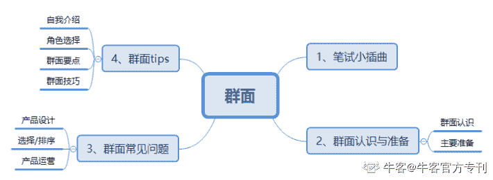

# 第三章 第 3 节 备考经验：【腾讯上岸还愿】产品/运营群面攻略汇总

> 原文：[`www.nowcoder.com/tutorial/10027/06fd06941fb048d2beaf41a2c4926212`](https://www.nowcoder.com/tutorial/10027/06fd06941fb048d2beaf41a2c4926212)

 #  备考经验：【腾讯上岸还愿】产品/运营群面攻略汇总

本节分享秋招过程中笔试和群面（主要是群面）相关的内容，希望对有需要的朋友有帮助，主要结构如下~

### 一、笔试小插曲

笔试和群面一样，是企业低成本快速刷人的有效方式之一，多数公司会根据笔试来筛人（少数不会，只是走形式）。所以笔试往往是决定能否进入面试的重要因素，我就是因为没有重视笔试，完全 0 准备佛系笔试，导致错过了非常多的面试机会（说多了都是泪）

 所以笔试方面我没什么经验（这也是为什么把笔试和群面放在一起写），就简单说几点吧：

**（****1****）有空多刷习题：**非技术的笔试多数会有行测题（选择题），这类可以通过刷题提升；

 **（2）做好笔试总结：**部分题目经常考类似的，比如猜数字、找规律等，这类可以做好总结、找到解题技巧。这方面和中小学时代做题（比如小学奥数）是有点像的，本学渣没什么心得，相信学霸们自然很快能形成自己的一套解题思路与技巧；

对于专业题目（有些公司的笔试是真的难，全都考岗位相关的，还都是大题），做好总结也有利于找到自己在专业领域的薄弱点、强化自己的专业知识、为后续面试做准备；

 **（3）合理调配时间：**虽说不少笔试题是可以通过刷题提升的，但很多与求职意向岗位无关的内容（如行测）要合理安排时间，避免因为这个占用太多自己准备岗位相关内容的时间，除非你觉得笔试很重要，比如笔试经常挂导致没有获得面试机会；

 **（****4****）重视笔试大题：**部分岗位的大题（主观题）有可能作为面试中类似的题目（包括群面&单面，主要看题目和岗位相关度），比如笔试中的产品设计/产品分析/竞品分析等，就算笔试时没有做好，过后也可以去交流、去思考这个问题应该怎样解决更好，不仅仅是有遇到原题的可能，更是通过这些真题去提升你的相关思维和认知，对后续面试也是有帮助的；

 **（5）不要放弃希望：**有时候虽然笔试挂了，但面试当天去到现场是可以直接霸面的，不需要看笔试成绩。这个仅针对部分公司的情况，也有些公司是强制必须参加笔试才给面试，所以多打听不同公司消息还是有帮助的。我曾经亲身经历有一家公司没网申、没笔试，去到现场直接霸面，并且在半天之内就面完了终面（群面、专业面、HR 面共 3 轮），听说笔试是 6 道大题、没有选择题，瞬间觉得自己霸面赚爆哈哈哈哈哈（不要问我是哪家公司哈哈哈哈哈）

### 二、群面认识与准备

**1、群面认识**

群面是大厂面试中刷人最多的环节，一般是无领导小组讨论，人数一般在 6-10 人不等（少数有 12、14 人的），针对某一问题，共同讨论并提出解决方案；也有将 10 个人分为 AB 两组，针对同一问题提出解决方案，两个组再互相提问、评价对方小组的方案等。

群面结果有的是“优胜”（如 10 个人只能进 2 个最优秀的），有的是“劣汰”（如 10 个人只 PASS 掉 2 个实在不行的），但多数是“优胜”，因为面试官只选最优秀的人进入下一轮面试，才能最大程度提高面试效率，这也体现了群面刷人的残酷性。所以，群面不通过，不一定是因为不优秀，也可能只是因为不突出，区别还是很大的，哈哈哈。

 **2、主要准备**

**（1）完善简历：**有些大厂看重学历，这个是自己现阶段无法改变的，很多时候一场群面里面我就是学历倒一倒二的、略显卑微；在学历比不过别人的情况下，只能通过自己的经历（实习/比赛/项目等）去丰富自己的简历，才能尽量争取进入群面（但不会成为群面能否通过的影响因素）；

**（2）丰富专业知识：**群面还是需要一些基础的专业知识和素养，配合理论更能体现自己的专业性，这个也是通过长期积累；

**（****3****）多看面经：**网上很多面经，不仅能了解群面的一般题目，也能学习别人的方案思路；

**（4）模拟群面：**和同学朋友组织模拟群面，提前适应、感受，同时也可以从面试官的角度去看待，从而知道群面中应该怎样、不应该怎样。

### 三、群面常见问题

    前面说到，因为不重视笔试，我错过了非常多的面试机会，整个校招我就只面了十几家，其中一些公司还是没有群面环节的，所以我总共经历的群面不到 10 场，经验也算不上丰富。产品/运营不同岗位是有可能一起群面的，这里重点分享几类最为常见的问题：

 **1、产品设计**

这类是我最擅长也最喜欢的群面题目。一般是针对某一现象/问题，设计一款产品来解决问题，如：

 **（1）面向痛点**

eg.运用互联网思维，解决城市中的流浪动物问题；

**（2）面向用户**

eg.为老年人设计一款智能手表，说说它要包含哪些核心功能；

**（3）面向产品**

eg.为 vivo 手机设计一个功能，保障它能够被广泛使用、快速传播；

**（4）面向情景**

eg.广场舞大妈们产生严重噪音污染，如何利用互联网为她们提供服务、同时解决其他用户的烦恼？

     还有很多其他问题，像：

eg.设计一款校园垂直社交产品；

eg.设计一款智能戒指；

eg.设计互联网在线寺庙；

eg.设计一款家用机器人；

eg.在微信内设计一个支付场景，使它能够快速传播；

eg.针对你认为校园生活中最大的一个痛点，设计一款 app 来解决该问题；

eg.……

    很多题目网上都能找到方案，建议有空多看看，这里就不多说了，毕竟题目是开放性的。主要说说一般在讨论方案时，主要思考哪些问题：

**· 产品定位：**这个产品是什么定位？它是为了解决什么问题？

**· 目标用户：**它主要是面向什么用户群体，给什么人用的？

**· 需求分析：**用户存在什么痛点没有被解决，用户的需求有哪些？我们为什么要做？

**· 应用场景：**用户在哪些场景下会有相关的需求，对应的应该怎么解决需求？

**· 产品介绍：**产品是什么形态，主要包括哪些功能？其中哪些功能是核心功能，哪些做出了特色化差异化，哪些有亮点？

**· 推广方案：**产品如何面向用户、面向市场推广？怎样让它快速传播？

多找几个题目，看看网上的方案，是不是发现很多都是有套逻辑清晰的框架（即便未必面面俱到）？哈哈哈

 **2、选择/排序**

    一般是给出几个选项，进行讨论，哪些淘汰，哪些保留，直接看例：

eg1.竞选村长问题：某村要选一个村长和一个副村长，现在有几个候选人：前任村长/退伍军人/致富能手/刚毕业的研究生/普通村民，说说应该选谁、怎么选；

eg2.现在要推出一个 app，主要有以下几个功能，但开发成本有限，第一个版本只能推出其中的几个，讨论一下要哪几个功能；

eg3.对于一个 app，在给出的 10 个功能中删除/增加 3 个，怎么选择；

eg4.计划在科技园里开一家奶茶店/书店/花店，应该开哪个，为什么，以及怎么运营？

 同上，针对具体题目的 idea，这里就不提了，网上有很多，可自助。这里分享几个要点：

**· 明确背景：**有些题目是不给背景的，比如 eg1，谁知道那个村子是贫穷的村子还是怎样的村子呢？对于不清晰的背景，可以在讨论过程中决定或假设（假设它是一个贫穷的村子，那么它就会有致富的需求）；对于清晰的背景，要能够提炼出来（比如题目说了 5 个候选人的优缺点）；

 **· 产品思维：**虽说不是产品设计/分析题，但很多框架是同用的，包括产品定位、目标用户、需求分析、场景等；这也能让面试官看出，你是有产品思维的；

比如，产品需求有基本型/期望型/魅力型/无差别/反向需求，在 eg2 中，考虑产品的第一个版本一定要解决的是基本型需求，期望型/魅力型等需求可以在后续版本迭代解决，那么就分析哪些需求是不可被代替的基本型需求，哪些是作为期望型/魅力型需求，哪些是无差别/反向需求，需求优先级就慢慢排出来了；

PS：如果不知道基本型/期望型需求这些概念，可以先补补产品基础知识；

**· 要素量化：**针对题目目标，设计一个客观、量化评价体系，给出几个重要指标，对每个对象进行分析，最后用量化的结果来辅助论证观点；

比如 eg1 中，要选出一个村长，那么村长需要哪些素质或能力？德高望重/协调能力/组织能力/人脉资源/发展思想等等各种有可能的指标，选出几个认为最重要的指标，它们分别占比多少，比如能力 1 占比 50%，能力 2 占比 30%，能力 3 占比 20%，再分析每个对象在这几种能力中分别有怎样的优势/劣势，进行量化，最后综合排序，这样就比较客观。

 **3、产品运营**

    这类我本人遇到的比较少，可能是因为我面的比较多是产品岗，但都是常见的运营题目：

eg1.无人岛的推广；

eg2.如何面向 60 岁老人群体推广无人机；

eg3.设计一款 UGC 视频节目；

eg4.给青春偶像剧设计一套微信互动方案；

 这类问题在同样明确背景、目标用户、应用场景等等基本问题的基础上，更多地要用运营角度去思考，比如用户运营、内容运营、活动运营、渠道运营，这些方面分别可以怎么做。因为我在运营方面经验不丰富，这里就不班门弄斧了。

群面的常见问题，网上还有很多很多，可以去百度、牛客、人人都是产品经理等各种渠道都找找，不仅看题目，更要看解决的思路、方案等。

### 四、群面 tips

好了拖了这么多废话终于要来写本文最重点的内容了……

 **1、自我介绍**

群面刚开始的自我介绍，一般人均 20-30 秒，一定少说废话，主要原因有二：

（1）大家都不认识，说多了别人也记不住，没有必要；

（2）占用后续讨论方案时间，这个很重要！

 建议说说以下几点就好：

**（1）基本信息：**名字/学校/应聘岗位；

**（2）自己的亮点：**实习/比赛/项目/创业经历等，说下自己有这段经历就可以了，不用说经历细节，比如“我大三时做产品项目，拿了全国一等奖”，而不是“我大三时做产品项目，拿了全国一等奖，那个项目叫做 xx，主要是一个 xx 产品，我在项目中主要负责 xx，后来把项目推向 xx，现在这个项目取得了 xx 的成果”要是每个人都这么说，得占用多少方案讨论时间呀？

**（3）自己的特点/能在群面中发挥的作用：**让队友了解自己的基本情况，为后续团队配合做铺垫。

**2****、角色选择**

大家都知道，群面一般有这几种角色：

**（1）leader：**领导小组角色，很多人认为做 leader 比较能突出自己的能力、能给面试官留下深刻印象，所以抢着做 leader，在此想提醒的几点：

①不要刻意抢 leader 角色，尤其比如 40 分钟讨论先花 10 分钟竞选 leader 是什么鬼？

②leader 这个角色是有可能在讨论过程中无形产生或改变的；

③如果做了 leader，要对产出负责，带领/引导队友共同探讨出方案，沟通协调很重要，如果没做好可能就是给自己挖坑以及负责背锅；

 **（2）timer：**主要负责时间管理。

①不管你要不要做 timer，哪怕已经有其他明确的人做 timer 了，你都打开手机计时，这样不仅有利于自己把握时间，面试官也会认为你有时间管理意识，还可以在 timer 没做好时进行挽救，打开手机计时这个小操作对自己也没什么损失吧？

②把握好时间，适当提醒，不是单纯提醒“还有 10 分钟”、“还有 5 分钟”之类，而是要提醒“还有 10 分钟，我们应该尽快讨论 xx 的问题/xx 的问题要定下来了/我建议接下来的 10 分钟我们应该 xxxx”，配合 leader 分配好用多少时间讨论多少内容，这个是很重要的；

**（3）reporter：**主要做方案汇报，这是我最喜欢也是最经常做的角色。

①做好记录，有利于你把控全局，清晰思考（即便你不是 reporter）；

②善于归纳总结：信息量大，哪些该讲、哪些不该讲、哪些多讲、哪些少讲；

③正式汇报前可以先在组内来一次汇报演示，因为讨论和汇报很多东西是不一样的，很多东西汇报出来不一定是讨论时候的样子，先来次演示可以尽快发现问题；

④汇报的时候最重要的一点：框架清晰！不要有什么说什么，比如你汇报一款产品，一定要讲它的定位、目标用户、核心功能等等；

⑤汇报时间宝贵，要详略得当，少说废话，突出重点；

 **其他提醒：**

**（1）角色不是最重要的：**以上，只是想表达一些注意点，但做什么角色不是关键，重点是有没有做好，以及在群面全程的作用与产出；

**（2）不要强制定位自己为某个角***>比如我一定要做 leader/我只适合做 timer/我应该做 reporter，你也不清楚队友整体的实力以及自己以哪种角色可以在这个团队中最大程度地做好配合，这些都是要在讨论过程中慢慢发现，而且是有可能在讨论过程中发生调整的；**

**（3）主动去担起团队的责任：**其实同一个人有可能同时担任 leader/timer/reporter 角色，主要还是看团队整体的具体发挥，所以自己要随时做好准备。

 **3、群面要点**

**（1）必须围绕主题**

跑题是一个大忌，比如我亲身经历的群面：

eg1.要求为 vivo 手机设计一个功能，队友提出设计一个文件管理功能，完全没有结合 vivo 手机的特色（比如女性用户多）展开设计；

eg2.用互联网思维解决城市中的流浪动物问题，队友提出做一个短视频社交 App，分享大家领养流浪动物的生活，但其实这个题目的核心需求在于如何解决流浪动物多的问题，比如去设计个领养功能还是怎样，这才是题目重点；

 针对两个小组给出不同方案、互相 QA 的群面，在 QA 过程也要围绕主题，不要讨论无关的内容；

eg3.对方队友针对我们小组提出的在产品上开放报名的功能，开始提问报名时 HTML 表单提交过程的一些复杂的 javaScript 前后端交互问题在技术方面应该如何解决（？？？）

 **（2）理性对待讨论**

群面过程肯定涉及不同 idea 之间的思想碰撞，最终必然有部分被舍弃或合并，PASS 要有合理的原因，要给出具有说服力的理由；

 **（3）保持专业视角**

既然面的是产品，很多时候都是能体现出产品能力的。对于讨论过程提出的 idea，要善于以专业视角去分析和表达，这样更能体现自己的专业性；如果队友说得 idea 有道理，但表述不是很专业，就可以换一种专业的角度表达出来，要知道表达也是一种实力的体现；

eg.现在短视频这么火，我们也可以在这个 App 上加个分享短视频的功能，用户会觉得比较有趣；

改：结合当下 5G 时代的到来、短视频的崛起以及发展趋势，我建议在产品上加入一个短视频分享功能，作为一个特色玩法吸引用户，进而促进 balabala；

 **（****4****）注重团队协作**

群面是整个校招面试最能直接体现团队协作能力的，这点在多数岗位的工作中都很重要，这里分享几点：

**①不要太强势：**不做 leader 也可以发挥协调作用，但不要太强势；

**②对队友友好：**对队友说得好的地方给予肯定、甚至赞扬；对说得不好的地方委婉提出，比较大家只是面试，不要因为争吵伤了和气（当然，理论上这种情况应该不多）；

**③不要抢功劳：**不要为了凸显自己，在群面中不断抢功劳、而不顾团队整体利益；

**④适当让步、不要过于固执：**不要为了坚持自己的观点而千方百计让别人的观点和自己的靠拢，如果实在无法与团队整体意见达成一致（哪怕他们的想法明显是错的），也不要强行去和整个团队做对，这样反而让人觉得团队合作能力不行；

这是为了讨论出一个大家一致接受的方案，而不是为了讨论出一个你自己觉得好的方案；如果方案真的有问题，面试官也能看得出来那不是你的问题；

 **（****5****）思路比结果更重要**

群面更看重的是一个讨论过程，而不单纯是最后给出的方案。面试官看重在群面过程中的表现，包括沟通协调、团队合作能力等，也很看重思考问题的方式，比如你是怎样一步步得出这个方案、这个过程遇到的思想碰撞你具体是怎样去解决的；

哪怕最后汇报的方案是错的，这都不是最重要的，何况方案出了问题不一定是你一个人的锅。

 **4、群面技巧**

**（1）积极主动投入**

①讨论过程中要积极主动发言，体现出主人翁责任意识；

②如果没有明确指明谁是 leader，你多说话多协调，并且不跑偏、让大家信服你，有可能就无形成为 leader；

③如果有自信做好 reporter，就去争取这个角色，不要错失机会；比如有一次群面，我觉得自己讨论过程表现平平无奇，实在没法让面试官记住我了，那么最后关头就要去争取 reporter 这个角色；

**注：**积极主动不是为了刻意突出自己！

 **（2）主动控制发言顺序**

    这个可以说是我在群面中很喜欢玩的一个伎俩哈哈哈哈哈哈

因为秋招的第一次群面做了第一个发言的人，没表现好，后面就坚决不做第一个发言的人（怕说错、也是想留多点时间围观以及给自己思考），并且自己主动控制发言顺序。那么我是怎么控制的呢？

 先注意几个关键信息：

①面试官有没有给每位同学安排一个序号；

②谁坐在哪里（固定位置）；

③谁最先做自我介绍（发言前做了自我介绍）；

④谁看完题目最先说话；

 接下来就是套用：

**如果要做第一个发言的人：**

“看题目的时间到了，我先来说说我的想法吧”

这种情况，作为 leader/timer 的人更有优势，或者自己主动抢；

 **如果不做第一个发言的人：**

①“要不我们按照（面试官）给的序号，从 1 号开始吧”

②“要不我们就从这位同学（最靠近面试官的/桌子最边缘的位置之类）开始吧”

③“要不我们就按照刚刚自我介绍的顺序，从 xx 同学开始”

④“既然这位同学已经说了，那我们就从他这里开始吧”

 刚好和上面的几个关键信息对应！而且有一个神奇的东西叫做顺时针和逆时针！

 **注意：**

①如果做第 1 个发言的人，就要尽量让自己说的话对后面发言的人有帮助，比如起到一个思考方向引导作用，或者给出一套基本框架、给出一些基本的正确的有用的 idea；如果说得好的话，很有可能成为这个方案成功的重要因素；

②如果不做第 1 个发言的人，就给自己争取更多吸收和思考的时间；可以看看前面的人的想法，他们的想法有什么值得发挥的、什么是有漏洞的，后面应该往哪个方向发展能够让自己说的话比较有价值，知道接下来哪些该说与不该说、哪些多说与少说。

 **（3）重视说话技巧**

①轮到自己发言，又实在想不到可以说的 idea，就讲一下自己的思路，比如应该先讨论什么，再讨论什么（尽管要讨论的这些东西，都暂时还没想到 idea）；

eg.我觉得我们应该先讨论一下目标用户（内心：目标用户是什么，其实我也不知道，等队友大佬补充），再想想他们有什么需求（内心：有什么需求，我也不知道，等队友大佬补充），有什么场景（内心：有什么场景，我也不知道，等队友大佬补充）

 ②再不行，就扯一下和题目本身无关，但是听上去很有道理的话！比如我群面说不出东西来的时候最喜欢说的两句话：

eg1.我认为，我们应该先想一下问题的本质是什么，而不是急于去给出解决方案（内心：问题的本质是什么，其实我也不知道）

eg2.我认为，我们汇报时应该有一套基础框架（内心：这套框架是什么，我也不知道，等 reporter 大佬来补充）

 这些是通用于任何群面题目的话，但是不一定每个人都会拿出来说。说出来了，别人都会认为是有道理的、内心印象会对你多一份认可（哪怕份量很小），并且面试官也会认为你思考问题的时候是有逻辑性的、考虑充分的，仔细想想是不是有点道理？

 **（****4****）善于纠错**

这个倒算不上什么技巧可言，但是是我认为我很多时候群面能通过的重要原因。

比如队友思路跑偏，带领其他队友一起去讨论一个错的方案，这种情况下，纠错就很重要了；有时候你不一定要给出决定性的 idea，但你要能够判断别人提出的 idea 哪些是好的，哪些不是，在队友提出明显错误的观点时，要能够及时纠正、避免团灭；

 **（5）适当补充**

前面 4（1）提到，因为觉得自己讨论过程一般，最后想去争取 reporter 角色，但如果 reporter 也没争取到，一般汇报完，其他队友是可以进行 30 秒/1 分钟补充的，也是表现自己的一个机会。在这种情况下，最重要的就是纠错和完善，千万不要“我突然还想到一个不错的 idea”，这不是补充哦，应该是在已汇报的方案基础上进行，而不是陷入了新 idea 的重新讨论。

 **（6）做好总结**

有时候觉得群面是玄学，有时候也觉得能进和不能进都有道理，如果可以的话，做好每次群面的总结，包括群面题目、思路、遇到的问题、队友值得学习的地方、以后应该注意的地方、自己能过的原因、不能过的原因等。