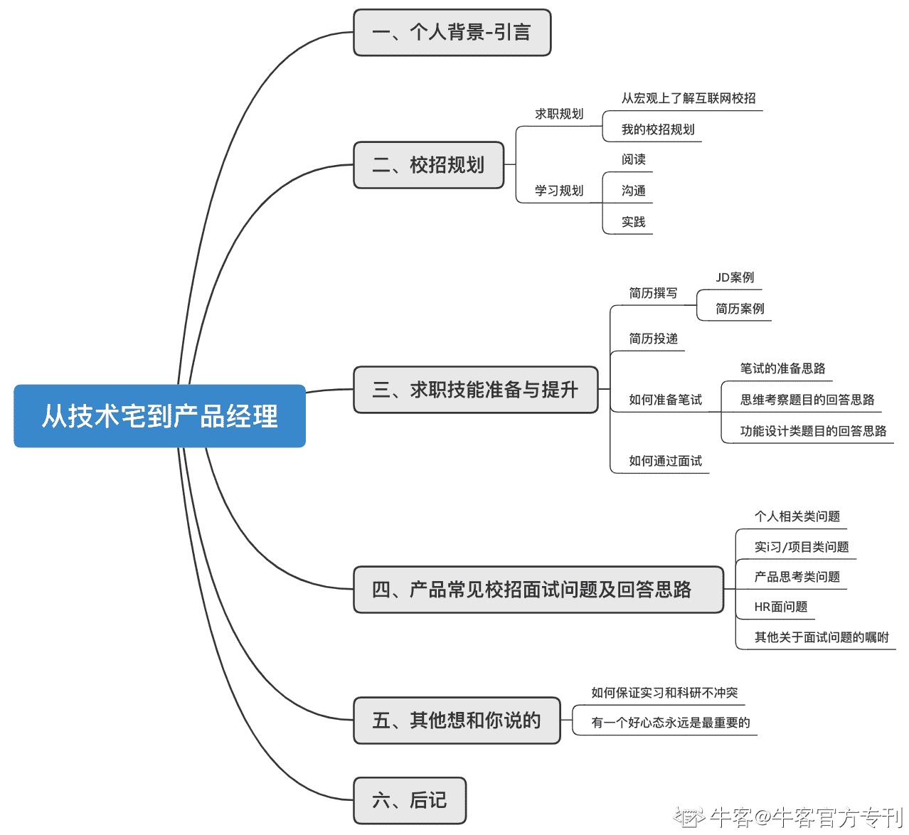

# 第一章 第 1 节 从技术宅到产品经理--我如何集齐了 BAT

> 原文：[`www.nowcoder.com/tutorial/10047/33bdd58f60d144f0b7fdedc698af192e`](https://www.nowcoder.com/tutorial/10047/33bdd58f60d144f0b7fdedc698af192e)

# 一、个人背景

“你不适合做产品经理，趁早放弃吧”。这是我 18 年冬天第一次在某大厂 PM 面试时，被面试官当场作出的评价。两年后的今天，我集齐了 BAT 的经历，校招的第一站选择了微信。我是 YUE 岳。今天想跟大家聊聊我这两年——一个曾经想做黑客的技术宅的产品经理转型路。先介绍我的情况吧：

> 985 本硕，计算机专业，21 届校招产品经理。 从 2018 年保研后决定技术转产品到 20 年 9 月结束校招，共有产品实习四段，经历了三家公司。第一段在一家行业独角兽，后面三段实习在字节跳动和阿里巴巴。 因为有阿里的实习转正，秋招没有海投，投递的公司有腾讯、字节、百度、京东、美团、网易，均为产品岗位。 其中网易因为面试时间冲突放弃了面试，和字节没有缘分，连续两个岗位在面试过程中被告知无 HC，其余均收到了 offer。 最后我选择的是微信。

从 18 年产品面试时被当场喷，到一只集齐了 BAT 经历的新鹅，这一路我走了两年。可能有的人会说，你的学校还可以，还是技术背景，难道不应该比一般人简单很多么？其实没有。在英雄不论出处的互联网行业，你想要什么，要比你现在拥有什么更重要。你现在开始的努力比你曾经获得的一切都重要。所以，今天我回过头来把这两年的收获讲给你听。本专刊篇幅比较长，但是对于屏幕前想做产品经理的你来说，希望你能认真读完，这里面有我这两年来的历程，有踩过的坑，有想跟你说的话。本文后续的结构如下：第二章是产品经理校招的基本情况和技能栈，第三章是产品经理求职过程中的准备技巧和经验谈，第四章是常见产品经理面试题目的整理和回答思路，第五章是其他我想要叮嘱你的话。