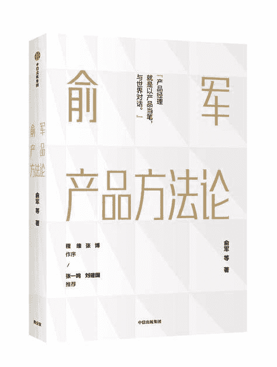
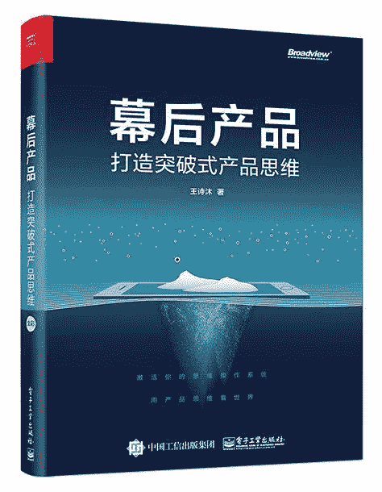
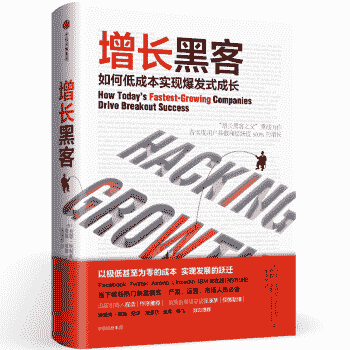
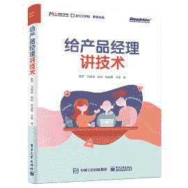
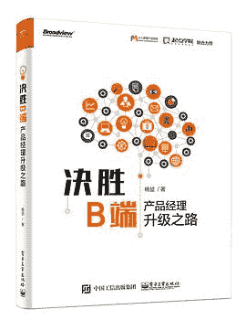

# 第二章 第 2 节 学习规划及资源推荐

> 原文：[`www.nowcoder.com/tutorial/10047/04ff6859a72e412bb0ebec54438ff28b`](https://www.nowcoder.com/tutorial/10047/04ff6859a72e412bb0ebec54438ff28b)

# 2 学习规划

对于一个想要从事产品工作的校招生来说，想要在秋招的过程中让自己占据足够多的优势，就要让自己在秋招之前积累更多的“势”，这个“势”就是你在产品经理这个岗位上的能力积累。这个过程离不开认知提升的三条路径，同样也是可以应用在产品经理能力提升上的三板斧：**阅读、沟通、实践**。下面详细介绍这三种方式。

## 2.1** 阅读**

阅读是最简单、成本最低的认知跃迁方式，我在这两年的时间里，一直在保持每天 0.5-1 小时的强制性阅读，阅读所带来的认知提升不是一朝一夕、看了几本书就可以做到。但当你坚持读到 100 小时的时候，你会发现你的脑海里会逐渐拥有自己知识体系，拥有表达的欲望，这个时候就可以开始尝试建立 input-->output 的闭环。当你建立了你自己的阅读-->写作的闭环后，你会发现你的思考会越来越深刻，也会逐渐形成你自己的独立思考方式。由于本专刊是写给产品同学看的，下面是我从我已经读完的书籍中挑选出来的，在产品经理领域我觉得还不错的书籍中，按照认知提升的过程给大家推荐的产品学习书籍：

1.  **产品经理入门系列书籍：**【限于从零认知的层面去初步了解，笔者挑选语言最友好的，不会产生任何不适的书籍】

*   《产品之光：从 0 到 1 教你做产品经理》kevin 【入门第一本书，本书适合没有任何经验的产品实习生来读，作为阅读其他书的跳板】

*   《产品经理从入门到精通》刘飞【入门第二本书】

*   《给产品经理讲技术》陈宇【了解做产品必要的一些技术内容，这本书如果非技术背景的同学读起来觉得困难不要紧，很多概念有个大概意识就好】

**    2\. 产品经理进阶书籍：** 【限于在有初步认知后详细学习细分垂类的产品现状，或者更底层更抽象的产品书籍】

*   《从点子到产品：产品经理的价值观与方法论》刘飞【第一本入门后进阶的产品经理工具书】

*   《产品之旅：产品经理的方法论与实战进阶》赖京露【入门后进阶的第二本产品经理工具书】

*   《增长黑客》肖恩·埃利斯【增长产品第一本书，用户增长产品经理的基础认知方法论】

*   《我在一线做用户增长：存量时代的用户运营之道》杨瀚清【国内的产品经理如何做增长】

*   《引爆用户增长》黄天文【了解增长产品经理工作内容的工具书】

*   《决胜 B 端：产品经理升级之路》杨堃【B 端产品的方法论】

*   《幕后产品：打造突破式产品思维》王诗沐【C 端产品的方法论】

*   《人工智能产品经理-AI 时代 PM 修炼手册》张竞宇【AIPM 的入门第一本书】

*   《当产品经理遇到人工智能》【很实在的通过案例去讲解 AI 产品，AIPM 的第二本书】

*   《电商产品经理宝典：电商后台系统产品逻辑全解析》刘志远【了解电商产品方法论】

*   《商业产品经理：腾讯教我的产品工作思维》何文彬【了解商业产品经理现状】

*   《运营之光：我的互联网运营方法论与自白》黄有璨【了解运营的工作】

*   《俞军产品方法论》俞军【更抽象的从底层去了解产品经理】

*   《产品经理面试攻略》蓝鲸部落【时间有点久远但是可以学习下一些问题回答的思路】

*   《重新理解创业》周航【对团队、产品思维有一定帮助】

下面是着重推荐的关于产品经理工作不同方向的五本书：

| 书名 | 具体内容 |
| 《俞军产品方法论》 |  
*   本书是一种更上层更抽象的视角去探讨产品经理的“道”。

*   本书着重介绍了产品经理应该掌握的三个模型：用户模型、交易模型和决策模型。

*   这本书的阅读建议放在有了实习经验或者大量阅读了产品经理工作内容的书之后再读。

 |
| 《幕后产品：打造突破式产品思维》 |  
*   本书是网易云音乐产品负责人王诗沐的非常诚恳的一本以网易云音乐为蓝本拆解的产品方法论。

*   着重推荐本书的第三章（需求分析方法论）、第五章（寻找产品定位）。

*   这本书结合了作者的工作实际来讲方法论，很接地气，推荐在阅读了入门级的书籍之后再来深入读这本书。

 |
| 《增长黑客》 |  
*   增长黑客是一个方向，更是一种思维方式。

*   这本书是一本增长黑客的底层模型的方法论，是目前关于增长黑客方向的最完整和最有影响力的体系最完整的书籍。

*   本书着重推荐第三章、第五-八章，这一部分是按照 AARRR 模型来拆开讲的，读完以后会建立起一个比较好的漏斗思维。

 |
| 《给产品经理讲技术》 |  
*   这本书是一本定位给非技术背景的同学阅读的技术入门书。

*   阅读这本书几乎不需要什么技术的背景，在阅读这本书的时候需要注意的是，不需要死磕书中的技术细节，了解大概的内容，有了一个概念即可。对于非技术背景的同学需要掌握的技术知识就是在技术同学提到一个概念时，你知道是什么即可。

 |
| 《决胜 B 端：产品经理升级之路》 |  
*   在了解了产品经理工作内容之后，有了一定的技术知识储备，想要了解 B 端产品经理的工作可以看这本书。

*   本书主要讲述 B 端产品设计和管理的方法论。

*   本书着重推荐阅读设计篇的 3-7 章，结合一个案例去讲解 B 端产品的设计，第一遍读起来可能会有些晦涩，但是例子非常的贴合实际。

 |

**   3.其他的可利用资源**虎嗅、36 氪、极客公园、人人都是产品经理公众号。以及下方我整理出来的可以用于查询产品或者行业、用户数据的网站资源。

*   **行业&产品报告：**

极光大数据： [`www.jiguang.cn/`](https://www.jiguang.cn/)艾瑞数据 ：[`data.iresearch.com.cn/`](http://data.iresearch.com.cn/)易观大数据 ： [`www.analysys.cn/`](https://www.analysys.cn/)Questmobile ： [`www.questmobile.com.cn/`](http://www.questmobile.com.cn/)艾媒网 ： [`www.iimedia.cn/`](http://www.iimedia.cn/)199it ： [`www.199it.com/`](http://www.199it.com/)互联网教育研究院 ： [`www.investedu.cn/`](http://www.investedu.cn/)36kr：[`36kr.com`](http://36kr.com/)虎嗅：[`www.huxiu.com/`](https://www.huxiu.com/)

*   **行业&产品数据：**

艾瑞数据 ：[`data.iresearch.com.cn/`](http://data.iresearch.com.cn/)易观智库： [`www.analysys.cn/`](http://www.analysys.cn/)TalkingData（移动观象台）： [`www.talkingdata.com/`](http://www.talkingdata.com/)腾讯大数据：[`bigdata.qq.com/`](http://bigdata.qq.com/)ASO100（七麦数据）：[`www.qimai.cn/`](https://www.qimai.cn/)App Annie ：[`www.appannie.com/cn/`](https://www.appannie.com/cn/)

*   **公司信息：**

天眼查 ：[`www.tianyancha.com/`](https://www.tianyancha.com/)IT 桔子 ：[`www.itjuzi.com/report`](https://www.itjuzi.com/report)

# 2 **沟通**

多和互联网的同行打交道。在一定程度上，可以通过一些社区、社群去加入一些圈子，多主动和过来人聊聊他们的准备方式、工作内容、以及一些想法等等。每个人都有自己的独特之处，而沟通是认知提升过程中相比阅读这种长耗时方法更快捷的方式。**在这个过程中怀着一颗利他的心去和小伙伴们交往，你会发现你收获的远远多于你付出的。**但在这个过程中要铭记的是，不要刻意去扩大圈子，也不必刻意混圈子。所有的社交本质都是基于你个人的价值。社交的初始和过程中最重要的都是要提升自己。不要在这个过程中本末倒置。如果觉得自己性格过于内向，或者不知道该怎么打开圈子，那就也不必刻意把时间花在这方面，在各种渠道听互联网大佬的视频或者音频的分享也是沟通的另一种方式，要学会合理选择最适合自己的方式，但是也要脸皮厚一点，毕竟只有你自己获得的，才是你的增量。在这个过程中，有一件很建议大家做的事情是，寻找一起参加校招的同类岗位的同学组成一个求职互助小组，一个人的力量是有限的，而且一个人也是有惰性的。可以在一个学校的同学中找到拥有共同目标的人，发挥团队力量，大家一起快速的建立对产品经理岗位的认知。在这个过程中可以一起做的事情包括：一起梳理经历、打磨简历、模拟面试、在面试后共同复盘分析。那么去哪里找这样的人呢？牛客、学校论坛、各种求职群都是很好的渠道，但是一定要筛选好一起同行的人，并且圈子不要超过十个人。

# 3 **实践**

纸上得来终觉浅，阅读和沟通是思维方式上的提升，除此之外，还要通过实践去验证你的方法论。这里的实践包括这样一个递进的关系。

### 

1.  **当你没有找到实习的时候：**

*   通过做项目的方式培养自己的产品 sense，相信每一个学校都有大量的科创机会，如果没有，也可以主动找同学或者志同道合的人一起做各种互联网的比赛。**把握好每一个可以以主人翁意识参与的项目，不是只有做了产品经理才能做产品经理能做的事情**。

那么如何在大学中找到自己的机会呢？首先，每个学校都有自己的分梯度的科研创新训练的机会，小到学校级的项目，大到国家级的科研创新计划，一般每个项目都是按年资助和启动，建议在尤其是本专刊的大一大二的读者，要多关注校内的科创机会，所谓科创，不一定非要是自己专业领域的事情，在你读书期间通过多观察生活获得的想法，都可以通过和其他学院同学组队的形式申报科创项目，不过既然你想做互联网相关的，那么申报的项目最好也是可以是一个以解决某种需求为痛点的互联网产品，但不一定非得是 APP。一般一个团队最开始 3-5 个人以内就可以组建了，如果你本身就是技术专业的，那么一个人就可以早早地开始尝试。这种学校或者国家自主的项目可以通过各种答辩日期推着你往前走，可以避免因为自身的惰性不了了之，当你开始了第一个项目之后，在做的过程中你会逐渐收获更多的想法，这个时候便可以申请国家级的科创计划或者参加国家级的比赛。记住，在大学里，怕自己无所事事浪费时间并不可怕，想要克服它，可以多收集校内的机会和国家级比赛的时间节点，让这些客观存在的事情鞭策你推着你走，你在这个过程中自然就会克服自己的惰性。

*   如果上述机会都没有，或者已经错过，大量的写产品体验报告、竞品分析报告是培养产品 sense 的另外一种很好的方式，当你写到第十篇的时候，你就会发现，有的功能就应该这么做，有的逻辑就应该这样写，而这种直观的体感，在一定程度上就是一种产品 sense。这件事最重要的就是坚持。以产品体验报告为例，产品体验报告的结构一般包括市场分析、用户分析、产品分析等，具体包含的内容如下表所示：

| 类别 | 内容 |
| 背景 | 体验的版本、时间、目的等 |
| 市场分析 | 政策环境、技术环境、社会环境、经济环境、市场规模等 |
| 用户分析 | 用户规模、用户画像、用户需求等 |
| 产品分析 | 产品简介、产品功能结构、用户功能流程、产品交互、运营节奏等 |

一般来说，产品体验报告可以选择比较热门的产品来分析，因为这样的产品会拥有比较成熟的产品方案以及成熟的行业数据和参考资料，我从牛客中大家发布的产品体验报告中选择了几个比较好的分享给大家作为参考：

| 名称 | 链接 |
| 京东健康体验报告 | [`blog.nowcoder.net/n/75e6adb7ee7a4402822334cceb9cc0cc`](https://blog.nowcoder.net/n/75e6adb7ee7a4402822334cceb9cc0cc) |
| 支付宝蚂蚁森林产品体验报告 | [`blog.nowcoder.net/n/3bc1448a32284711aa85c2b6a6228160`](https://blog.nowcoder.net/n/3bc1448a32284711aa85c2b6a6228160) |
| 百词斩 APP 产品体验分析:英语考试大杀器 | [`blog.nowcoder.net/n/c8d893b5f93142e6b0852f688b9ba392`](https://blog.nowcoder.net/n/c8d893b5f93142e6b0852f688b9ba392) |
| 抖音 APP 产品分析及抖音&快手竞品分析报告 | [`blog.nowcoder.net/n/975c1dade790460989305bbe59040ea2`](https://blog.nowcoder.net/n/975c1dade790460989305bbe59040ea2) |

###   2\. 当你拥有实习的时候：

*   在实习的过程中，把自己切实的当做在做的事情的第一责任人。每一份实习其实大概率都是面试造火箭，入职拧螺丝。理清楚你在做的业务是什么，上下游是什么，多跟 mentor 聊一聊，去学习业务视角看问题。哪怕是再水的一段经历，你都至少应该尝试着去搞清楚在做的整件事情的逻辑，这样至少也可以在简历中讲好一段故事。

*   如果觉得已经在这段实习中收获了想要得到的东西，或者已经可以讲好一段故事，或者你觉得当前的方向不是你喜欢的，那么该换下家就换下家。实习是工作前最好的试错时间，这段时间里，**一是要看自己究竟是否真的喜欢产品经理这个岗位，二是要看当前做的领域是否喜欢，三是接触更多的领域找到最想做的。**