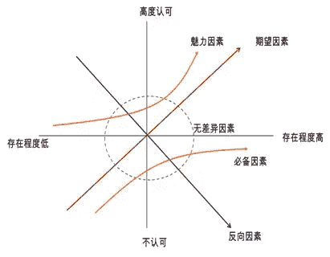

# 第三章 第 2 节 如何准备笔面试

> 原文：[`www.nowcoder.com/tutorial/10047/816128685ed849ea8737d4fe8aa2ae8b`](https://www.nowcoder.com/tutorial/10047/816128685ed849ea8737d4fe8aa2ae8b)

# 1\. 如何准备笔试？

笔试是产品经理岗位秋招中筛选的第一步，在秋招中大部分产品岗位都会有笔试。产品岗位的笔试题一般为行测题+主观题。一般产品岗位的主观题的类别包括但不限于：思维考查、解决方案提供、数据分析、功能对比、功能设计、功能分析等等。

## 1.1 行测题目的准备思路

行测题和公务员考试中的类似，基本就是一般的逻辑推理、语义理解、数据分析的题目。行测题目可以在牛客上刷几套行测题先了解一下是什么，如果在模拟的过程中发现自己遇到了比较大的困难，那么还是建议你多练习一下，如果模拟的过程和结果相对比较轻松那么就结合自身的实际情况安排适当练习，如果模拟的过程发现自己在行测过程中比较费力甚至有可能无法通过笔试，那么最好有针对性的进行行测题目的练习。关于行测的准备，在牛客中可以通过搜索“行测”去寻找行测题目的试卷和经验。推荐几个牛客中关于行测的总结：

*   行测题目准备 | 题型：[数字推理案例解析+技巧](https://blog.nowcoder.net/n/2be04b542c834577a1f75f2b58f050aa) 

*   行测题目准备 | 题型：[逻辑推理案例解析+技巧](https://blog.nowcoder.net/n/93729907aa6946cd9c4c45896fffae9c) 

*   [行测学习记录 ](https://blog.nowcoder.net/n/e831a187d6c74ad88b5b4616716d5b63)

除了行测题目之外，产品岗位的笔试主观题题目一般会有一些思维考查或者产品设计的题目，建议大家看牛客整理的[名企校招笔试真题精选·产品运营篇](https://www.nowcoder.com/contestRoom?mutiTagIds=891_892)，可以多整理里面每种题型的解题思路，或者去搜索回答的一些参考答案，孰能生巧，做十套卷子基本就可以有一个大概的意识了。下面我介绍下主观题目中常出现的思维考查和功能设计题目的回答思路。

## 1.2 思维考察题目的回答思路

举一个思维考查题目的案例，比如字节的经典题目：如何给盲人描述黄色。这道题目考查的是发散性思维和对于抽象事情的表达能力。对于这样的发散性的产品题目，拿到题目首先要明确问题想问的是什么，对方想获得的是什么？这个是回答问题前需要审好题目并且明确的。其次是明确用户是谁，用户分为哪几种？比如这里面就是用户是什么样的盲人？先天盲人还是后天盲人？不同用户的场景和需求会有差异。在拆分好用户后，需要明确需求和场景，在这道题目中就是，不同的用户在什么条件下想要找到黄色，他为什么需要知道黄色？此时便可以根据不同的用户去假设不同的场景，比如对于后天盲人的用户需要在十字路口过马路这样的场景下辨别黄色；对于先天盲人的用户想要了解黄色是一种什么颜色，和其他颜色有什么区别等。在确定了用户、场景、需求后，就可以根据每一种情况去提供各自的解决方案了。比如，对于用户：后天失去视觉的盲人，需求场景：在交通出行中十字路口过马路，需要辨别现在的信号灯是什么颜色，那么可以将视觉转换为听觉触觉等其他的感受，比如在亮灯的同时将不同的声音和颜色进行连接，那么黄色的声音就可以是某一种急促的声音，绿色是急促的声音，红色是舒缓的声音等，此时声音就被赋予了颜色的意义。再比如，对于用户：先天失去视觉的盲人，需求场景：想要了解黄色这个颜色与其他颜色的区别，那么就可以通过将不同颜色的视觉差异转换为其他可以获得的感受的差异，比如可以这样和对方说，黄色是秋天里风吹来的一望的麦田的感觉，是午后阳光洒在身上的温暖，白色是冬天下雪之后的宁静和肃杀，红色是夏日晚上篝火的热烈等等。

## 1.3 解决方案类题目的回答思路

解决方案类型的问题一般是提供一个场景，请你提供一种解决该场景下某种需求的方式。举一个解决方案类题目的案例，**比如：请根据高校食堂在午晚餐高峰期就餐等位困难问题，设计一种解决方案。**此类根据需求、问题进行功能设计的题目，可参考的回答思路是：对于哪些用户，在实际的场景中存在哪些待解决的问题，这些待解决问题的背后，用户的实际需求是什么，或者说问题的本质是什么，根据不同的场景和需求，提出对应的解决方案。在这道题目中，首先定位用户是高校的学生，问题是由于中午晚上下课时间统一，大量学生集中在同一时间出现在食堂，会导致供需关系出现供<需的情况，那么对于学生群体在学校食堂高峰期就餐难的问题：① 从供给侧出发，食堂可以通过线上线下联动的方式提高供给能力，比如线下在高峰时段增开窗口加派人手，线上提供提前预点餐服务，允许同学在下课前就提前点好餐并支持餐柜自取等；②从需求侧出发，可以通过激励活动引导同学使用预点餐提前点好餐到食堂自取打包带走，鼓励非上课同学错峰就餐，除此之外，也可以通过其他的游戏方式趣味化同学们等餐的过程等等。

## 1.4 估算类问题的回答思路

比如费米问题、产品思维的考查问题这种可能出现的随机性考查问题。对于这类问题，应对的最好方法就多去牛客的面经中寻找已经出现的问题，一定要多去总结归类，多看这些问题抽象出来的回答思路，在以后面试时候遇到了不会临阵慌乱了。比如费米问题的回答思路：① 明确问题和问题范围；② 建立公式；③ 拆解公式，将公式中的未知数拆解为更简单的方程。④ 复查公式的可行性。**举个栗子，比如上海市有多少出租车。**① 明确问题。是否包含网约车，是否只计算每天可以用于正常服务的出租车；② 建立公式。上海有多少辆出租车=每天上海有多少人乘坐出租车/每天每辆车服务的人数。③ 拆解公式。每天上海有多少人乘坐出租车 = 上海人数 * 乘坐出租车比例，乘坐出租车的比例可以直接估算也可以继续拆解；每天每辆车服务的人数 = (每车工作时长 - 空车时长) / 平均每次服务时长。④ 公式复查。当上面的公式拆解到最小的颗粒度之后，可以根据计算结果大致算一个数字出来看看是否合理，如果不合理，可以拆解公式。

## 1.5 产品/功能分析类题目

功能分析类的问题一般是针对某个 APP 的某个功能进行。我以一道常见的题目为例：**微信为什么不做已读不回？**这个问题首先要从微信收发消息的双发来根据场景判断需求。首先在微信熟人社交的场景下，和陌生人社交不同的是，发送方需求：想要知道对方是否已经看到信息；接收方需求：对自己的行为保密。一般来说，在社交过程中，要保护更敏感的人。消息的收发双方的关系是区分场景的关键，一般来说社交分为陌生人社交和熟人社交，陌生人社交主要在恋爱交友，这个时候发消息的人更敏感，基于双方本来就不认识的这种社交关系，接收方不用在意是否破坏人际关系。发消息的人根据对方的阅读状态就可以得出对方的态度，这种拒绝状态在陌生人社交中是一种普遍的用户已有心智。同样在以效率为导向的办公软件中，已读未读则是为了提升工作效率，所以也是最基本的功能。在熟人社交中，由于存在已有的关系，已读未读的状态会对熟人间的人际关系造成压力，所以更应该保护接收方的体验，故而不做已读未读。除此之外，也有对于一个 APP 做完整的分析的题目，比如“推荐一款你喜欢的 APP 并说明理由”，这种题目在面试中出现的频率更高，关于这种问题我会在[下一章](https://www.nowcoder.com/tutorial/10047/0422f236fa1741c482b2a45f44e4bae0)的面试问题中详细陈述。

## 1.6 需求排序类题目

需求排序类的题目一般是提供一个问题，然后给出这个问题的一些可解决方案或者涉及的因素，要求对选项进行排序并说明理由。这种问题的回答的思路是，首先要解决的问题是什么，需求是什么，解决的方式有哪些，根据已有条件分析权重，根据权重判断已有方案解决问题的能力。**我们以一道经典的 QQ 面试题为例：**第一版本的 QQ 在做功能规划时有这样一些需求，如果你是 QQ 的产品经理，你会选择哪三项功能作为第一版本 QQ 应该有的功能？可选的功能列表包括：QQ 表情、卡通头像、聊天记录管理器、传文件、很小的 EXE 文件、好友在线状态、视频聊天、多人聊天室、语音、反应速度快。我们首先来看要解决的问题是什么？这道题目中已有的信息是第一版本，那么 MVP 版本的原则就是率先满足用户需求中的必备因素，必备因素如果不具备会严重影响用户的使用体验。所以从 KANO 模型来看，基本型需求是优先需要满足的，其次是期望型需求，最后是兴奋型需求。具体的，基本型需求是具备此功能时用户满意度不会提升，但是不具备该功能，用户的满意度会严重下降；期望型需求是当满足该需求时用户满意度会提升，不满足该需求时用户满意度会降低；兴奋型需求是用户本身可能没有想到，你提供会大幅提升用户的满意度，但是不提供也不会影响用户体验。
那么对 MVP 版本的 QQ 来说，最主要的满足的功能当然还是以聊天为主，我们逐个划分提供的功能。**QQ 表情：**表情是一种高于文字本身维度的表达方式，可以提高用户聊天过程的体验，但是如果不提供，用户依然可以用文字聊天，而且对于第一个版本 QQ，用户本身还没有使用表情聊天的心智，所以不具备该功能，用户的满意度也不会下降，所以是兴奋型需求。**卡通头像：**头像是一种用户个性化表达自己的情绪出口。**聊天记录管理器：**聊天记录管理器是为了统一管理用户自己的聊天记录，如果不提供该功能，用户可从每个聊天对话框单独打开。提供了是为用户提供一个便捷的入口，不提供也不会很大的影响用户体验，所以是期望型需求。**传文件：**第一版的 QQ 定位是聊天工具，而传文件是日常生活中尤其是作为初版的聊天工具的期望型需求，传文件在职场社交中的使用频率远远大于日常的聊天社交中，所以是典型的兴奋型需求。**很小的 EXE 文件：**在第一版 QQ 的年代，网速带宽都较小，但是 QQ 本身作为一款社交聊天工具，本身大小就不会太大，所以没有必要在 MVO 版本花较多的资源做大小的优化，因为相比使用体验，可接受范围内的安装包的大小对于用户初版的影响很小，所以也是期望型需求。**好友在线状态：**好友的在线状态直接决定了用户可以和谁聊天，在以主打聊天的 MVP 版本上，好友在线状态可以更好的引导用户产生聊天行为。如果不提供该功能，用户的聊天将变成一种异步，并很有可能造成用户发出了消息但是很久没有人回复的情况，这种情况在 PC 聊天时代是非常影响用户体验的。所以是基本型需求。**视频聊天：**在第一版本的 QQ 中，受贷款网速以及用户心智的影响，文字聊天一定是第一优先级的，做好文字聊天之后并且在技术成熟时再做语音和视频聊天，而且此时不做视频聊天，用户也不会因为没有视频聊天就不使用 QQ。所以是兴奋型需求。**多人聊天室：**这个功能解决的问题就是当用户的好友数量较少时该去哪里获得好友，因为聊天工具的本质还是需要用户可以有人聊天，那么多人聊天室就是一个比较好的让用户获取聊天对象的渠道。如果没有这个功能，用户缺少渠道获得聊天的人，那就很难在产品中留存。所以是基本型需求。**语音聊天：**与视频聊天类似是兴奋型需求。**反应速度快：**用户在使用 QQ 的过程中，作为用户直观的用户体验一个是可以聊天的人多不多，一个是聊天过程流不流畅，如果用户使用的过程非常的卡顿，那么即便用户好友很多，也很难拥有比较好的聊天体验。所以是基本型需求。作为 MVP 版本的 QQ，让用户拥有聊天过程的良好体验永远是最重要的用户需求，这个良好的用户体验又可以拆分为拥有获取好友的渠道、有可以找到的聊天的人、流畅的聊天过程，那么其他的功能均为期望型或者兴奋型需求。

# 2\. 如何通过面试

产品面试的宗旨是通过几十分钟的时间向面试官展示自己与产品岗位的高匹配度。所以回答问题一定要围绕产品经理的技能栈、产品思维来说，然后要提前准备好自己的面试过程中的一些比较可以体现自己适合做产品能力的一些闪光点，比如逻辑性、深度思维、或者需求发现的能力，或者一些你比较熟悉的但是一般人不太了解的本质性的概念，这种能让面试官眼前一亮的东西就是你相比其他竞争者的有益的差异化。在面试前，要做的有两件事情：**一是拿着自己的简历模拟面试，****二是收集要面试的岗位的信息做针对性准备**。首先是第一点模拟面试，如果条件允许，最好是可以找到前辈给自己做模拟面试，然后根据前辈给的建议再做针对性的修改，如果条件不允许，那就打开摄像头，自己按照自己的模拟题目 list 从头到尾不看自己的解析过一遍，也可以尝试用牛客免费的[AI 模拟面试](https://www.nowcoder.com/interview/ai/index)功能，尤其是对于没有参加过面试体验的同学，可以借此提前感受正式面试的氛围，牛客中也有求职辅导可以 1[V1 简历指导和模拟面试+辅导](https://www.nowcoder.com/courses/cover/live/510)等，可以根据自己的实际情况选择。其次收集岗位的信息，在面试前一定要体验面试部门的产品，在这个过程中可以去人人都是产品经理或者虎嗅、36Kr、极客公园，以及搜索引擎百度谷歌去搜索一些分析的内容。一般来说，面试过程中很常见的会被问到你对面试的岗位的理解和对面试的产品的理解和改进意见。除此之外，可以在牛客或者搜索引擎搜索这个岗位的面经，如果有相同岗位的面经，一定要提前准备其中提到的问题。关于面试中经常会被问到的问题，在下一章节中我会详细说一说常见问题的回答思路。