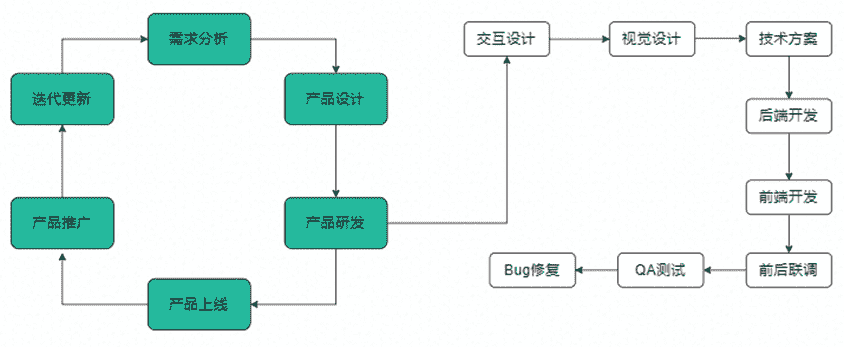
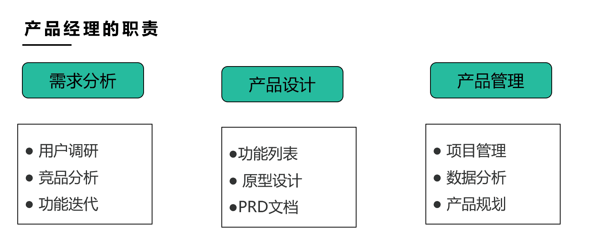
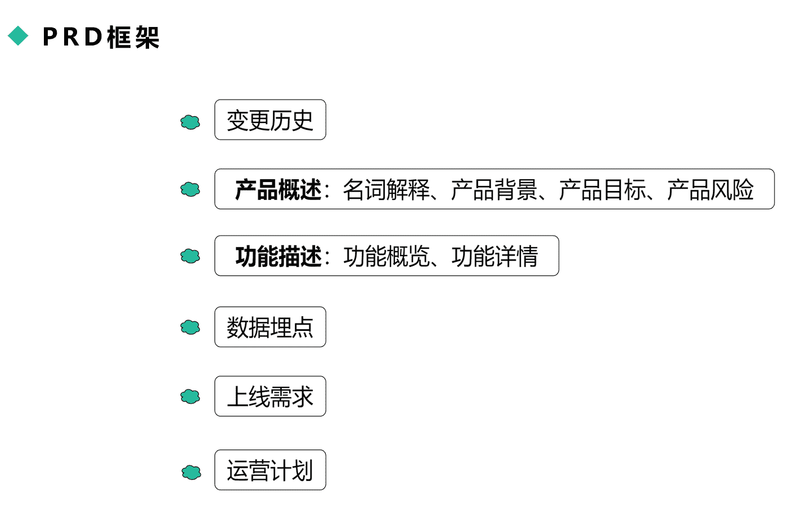
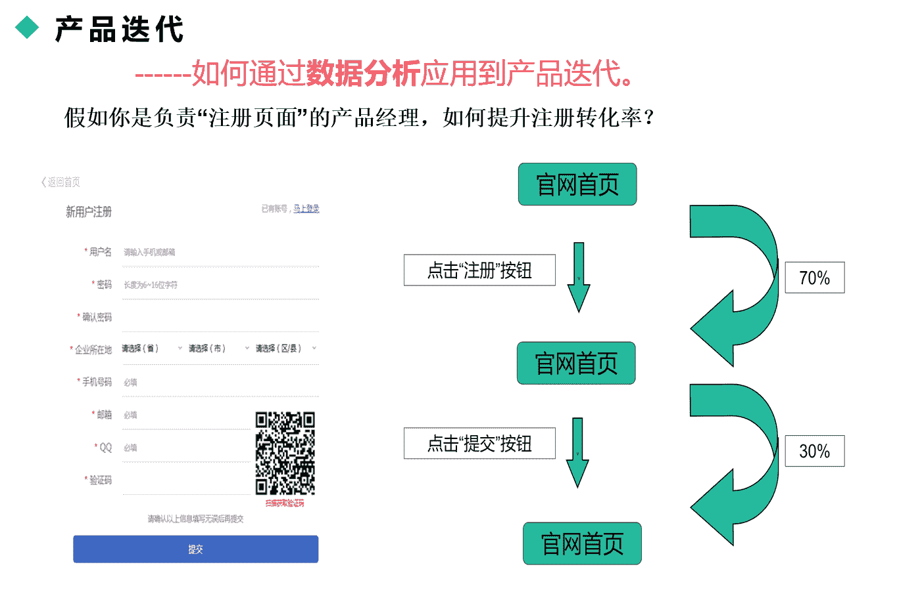
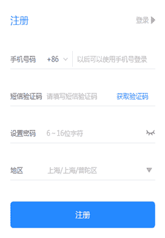
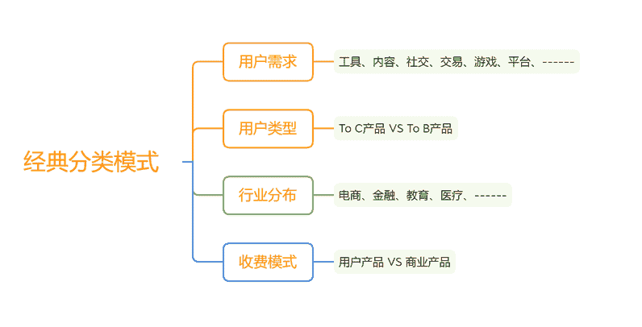
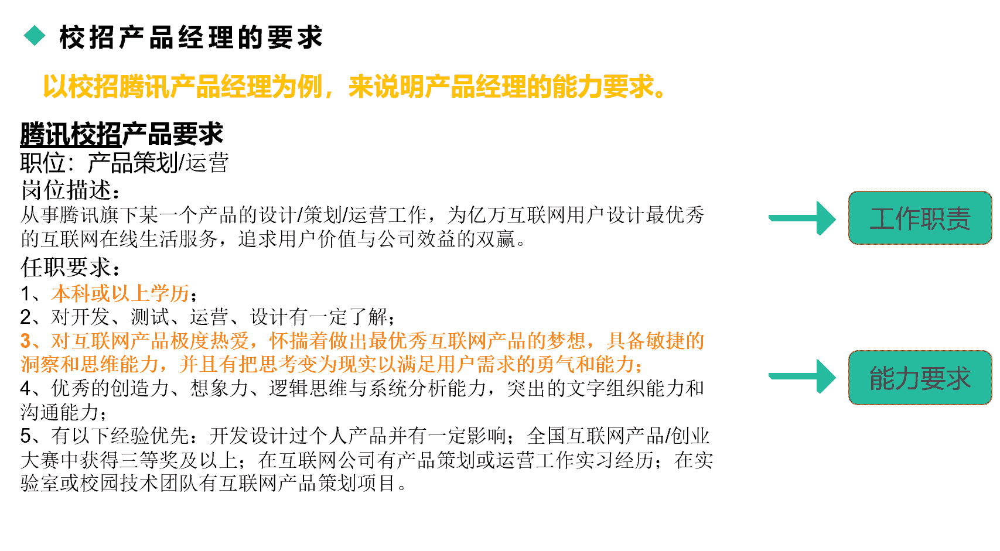
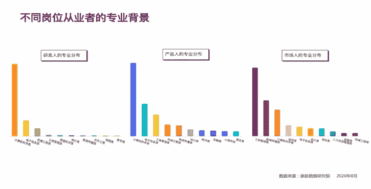
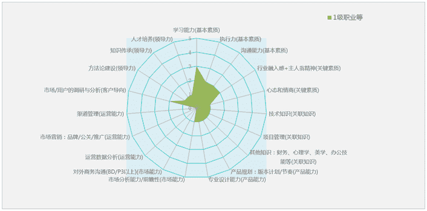
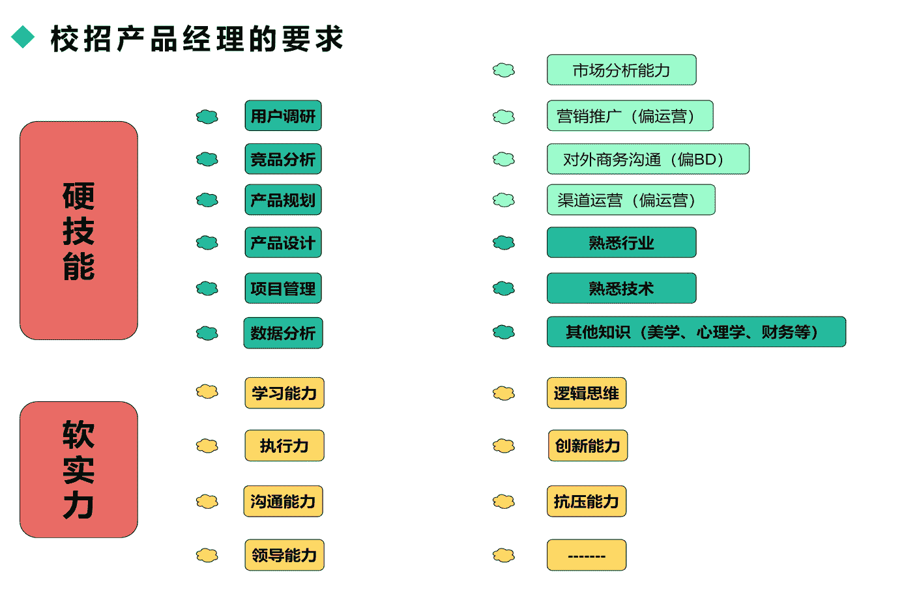

# 第一章 第 1 节 初识产品经理

> 原文：[`www.nowcoder.com/tutorial/10073/a1fc8a2e193341d4bf7ec128e49305db`](https://www.nowcoder.com/tutorial/10073/a1fc8a2e193341d4bf7ec128e49305db)

最近几年，互联网产品经理是校招热门岗位之一，从录取比例来说，可能从几十人甚至上千人录取一个产品经理，竞争相当激烈。产品经理热门的原因有以下两个点，一是因为产品岗位比较稀缺，公司校招 HC 并不多，二是因为产品经理有过度营销，整体吸引力大幅提升，加上外面宣导“低门槛、无专业要求”等，导致大量刚毕业的同学纷纷投递该岗位。

校招求职过程中，有部分同学对产品经理有一定误解，比如产品经理是 CEO 学前班、产品经理适合不想搞技术不想做销售的人、带着经理的 title 等，这些信息有部分合理，但并不是产品经理岗位的真正核心。

大学里面没有开设产品经理相关的课程，本文将跟大家介绍什么是互联网产品经理、产品经理的核心职责、校招产品经理要求、产品经理发展线路以及如何提升个人技能，通过这些介绍让大家更好地了解产品经理，以便后续更好地选择从事该岗位。

#  岗位介绍

## 1、产品的上线流程

介绍互联网产品经理前，先介绍下互联网产品的上线流程，即完整的产品，比如游戏类王者荣耀、工具类微信等产品，如何经历从无到有的过程，也会介绍产品经理在各个环节的作用，辅助大家更好了解产品经理在整个流程的作用与价值。下面是互联网产品上线流程：

### 1）需求分析

需求来自很多渠道，比如运营、产品、市场、竞对等，产品经理需要去分析需求的合理性。比如运营要根据市场情况、用户画像、产品阶段等策划某个营销活动，那需求可能涉及：某个时间点需要做哪种类型的活动，活动的人群是哪些，主要玩法是什么，预期的收益有哪些等。产品经理会对活动的需求做分析，看哪些需求靠谱，哪些需求可以放到后续再迭代优化。

### 2）产品设计

产品设计即将需求转化为产品方案的过程，比如活动的入口在哪里，用户看到的页面是什么形式，用户参与活动的方式是点击领取优惠券还是需要分享到朋友圈才能拿到优惠券等，预估的活动流量是多少等等。该环节是要需求转化成研发能理解的语言，一般就是“原型图+流程图+说明”，即所谓的 PRD（产品需求文档）。

### 3）产品研发

研发涉及到以下环节，一是跟交互设计师、视觉设计师沟通，确保能符合产品的流程，让用户体验足够顺畅，二是跟各类研发沟通，比如跟研发评审需求，而后服务端、前端（APP+小程序）编写代码，确保前后台链路一致，而测试则验收代码的有效性，看是否实现产品经理 PRD 文档所描述的功能，包括性能测试。

### 4）产品上线

上线环节即保障项目如期发布，产品经理参与验收工作，即体验上线的产品是否符合当初设计的产品方案。如果体验过程中发现严重 bug，需要研发上线前修复完毕，不能影响用户使用。

### 5）产品推广

该环节涉及到运营的推广动作，比如如何获取资源位，将产品的影响力放大，以便获取更多用户。此外，还涉及数据分析，该环节是通过埋点提取相关数据，来分析产品效果的好坏，以便看产品是否达到当时设定的目标。

### 6）产品迭代

根据上个版本遗留的需求、数据分析的建议、运营新的需求、个人的产品经验等汇总下个版本需要迭代的需求，重新开始进入到需求分析阶段。

## 2、什么是产品经理

按百度百科的定义“互联网产品经理是互联网公司中的一种职能，负责互联网产品的计划和推广，以及互联网产品生命周期的演化”，里面关键词是“一种职能”、“计划和推广”、“生命周期”。

一种职能是指产品经理是互联网领域的岗位之一，涉及沟通联动的部门非常多，比如有研发、设计、运营等部门。一种职能意味着如果大家校招时难以求职到产品经理，则可以考虑曲线救国，先进入到互联网行业其他岗位，拿到船票再说。比如可以先从技术、设计运营等岗位做起，而后通过公司的机会再转岗到产品经理。（PS：技术和设计转岗到产品经理的概率比较大）。

计划和推广则是产品经理的核心职责，简单来说，涵盖以下三个方面：需求分析、产品设计、产品管理。

需求的来源比较多元，产品经理要能够分析需求的有效性，一是能够需求面对哪些用户，解决用户什么问题，预计获得什么产出，二是能够评判需求的投入产出比。

需求分析往往是面试过程中最容易考察的核心能力，比如群面题目中的排序题“商城、刷脸解锁、控制电视、页面广告、公众号视频、减少内存 50%、减少电量 10%”，或是 1 对 1 面试中产品类相关问题如“聊你最喜欢的 APP”。

以微信视频号为例，跟面试官介绍该产品体验时可以这么来说：

微信视频号是我经常使用的产品，每天大概会花费半个小时到一个小时间刷微信视频号，主要看知识、音乐等方面的内容。我关注那些比较强 IP 属性领域的视频主，个人感受几点比较深：

1）微信视频号是微信内容的补充，原先微信通信方式仅有文本、图片到语音，现在通过视频大大丰富微信的信息传播，因为视频的趣味性更强，互动性更好；

2）微信视频号跟微信体系融合比较好，关注的视频号往往有直播、小店等，通过视频号给这些方式做导流和变现，而且不需要额外调整登录，操作体验比较顺畅；

3）微信视频号比较强的亮点是除开算法推荐你感兴趣的内容外，额外可以看到朋友点赞、评论、转发等，一是可以关心到朋友的个人偏好，好成为线下谈话的内容，二是通过这样的方式大大促进视频号的传播和互动性。

前面作为用户去看，可以跟面试官聊作为生产者如何去看，比如微信视频号更多强调一种生活方式，需要能人人参与，因为涉及到覆盖更多群体（不同城市、不同年龄等），使得制作门槛比较低，易于拍摄，不需要过度美化。

也可以关注到抖音、快手的差异性，跟面试官去聊三者的区别，比如产品体验、收入模式、内容区隔等。这些方式都是考察你体验产品时，如何理解用户，如何判别竞对的差异。

产品设计则是将需求转化为产品功能，推动产品上线的所涉及的事项。产品设计考察实践型能力，比如如何画原型图、流程图，写一份 PRD（产品需求文档），如何跟研发评审需求等。

产品设计涉及到各种工具型的使用，Axure RP（画原型图）\Visio（画流程图）\Xmind（画脑图），这些往往会出现在简历的技能描述，也是产品经理最为重要赖以生存的看家本领。

产品设计往往是通过面试一对一去聊，部分同学面试时会带作品集，比如竞品分析报告、产品分析报告等，对于中小互联网公司算是加分项（前提是高质量的作品）。

以 PRD 为例，跟大家简单介绍产品经理的看见家本领，也帮助大家了解产品经理最为重要的沟通方式之一。

### 1） 变更历史

变更历史是 PRD 版本维护的记录，重点是记录版本号、更改内容简述、更改时间点、更改人等信息。

### 2） 产品概述

产品概述主要描述产品的业务背景，重点是为何有该需求，针对什么样的场景来设计，预计带来什么样的收益。里面涉及的风险是描述产品上线后可能遇到的问题，比如新旧版本兼容、安全风控等，不过这些信息往往在产品设计时就会考虑，PRD 理应涉及到这些内容。

### 3） 功能描述

功能描述是产品的核心关键，就是记录用户的完整操作流程，比如用户从哪个入口进来，看到什么信息，这些信息的布局怎么展现，用户做什么操作，下一步去到什么页面。这些是正常流程的描述，遇到异常情况 PRD 也需要做说明，比如网络不好、用户误操作等。

### 4） 数据埋点

数据埋点是 PRD 经常被遗漏的环节，该模块是说明哪些用户操作要被记录，要记录到什么级别，各自的埋点字段是什么等，数据分析师通过这些埋点可以提取数据，对产品效果做跟踪。

### 5） 上线需求

上线需求即产品上线时需要做的准备，比如灰度测试，具体的上线方案是什么方式，命中哪些标签组用户，如果效果不好，下线方案是什么等。

### 6） 运营计划

运营计划则是运营针对产品的推广方案，比如有哪些资源可以推广产品，内容的产生怎么来，后续的大体推广节奏是什么样等，这些运营计划原则上在产品上线前就该准备好，该模块重要的是跟运营对齐各个节点及事项。

产品管理则是产品方案设计后的管理以及推动产品迭代优化的环节。一方面则会涉及到资源协调、产研沟通、产品验收等环节，需要比较强的综合管理能力，尤其是在项目出现异常时充当“救火队员”的角色，另一方面则是上线后的效果跟踪，通过数据分析产品是否达到预期，效果好的功能是在什么地方，效果不好下一步怎么迭代等。

介绍下数据分析，数据分析是产品经理最为重要的核心技能，在面试环节也会经常考察到，比如分析下百度搜索下降 20%的原因。如何通过数据分析应用到产品迭代，这边举一个案例。

通过数据埋点（以下数据均为模拟值），看到某官网访问用户量达到 300，而注册到提交信息（即注册成功）的用户数量少，仅有 63 个用户（假设每个用户价值 100 元），对外投放的广告效果很一般（广告投放链接落地页是官网，通过广告投放获得用户信息）。作为产品经理，往下细分拆解数据，发现用户从官网首页到注册页面转化率 70%，该注册率已经接近行业水平，而注册页面到注册成功页转化率仅仅达到 30%，远远低于行业值。

那作为产品经理，通过上面的维度，可以判断下一步优化的方向，即重点关注到注册页面到注册成功页面的转化效果，做以下产品优化：

### 1） 减少选项

对用户来说，只要能完成注册即可，注册需要填写内容一般是手机号（移动互联网时代，手机号是通用凭证）和密码。对公司业务来说，最为重要的是获得用户联系方式，其余信息根据业务需要再做选择，比如地区必填的原因是该业务是区域销售，需要将线索分配到各个地方，剩下的信息都可以不需要。

### 2） 完善操作

以手机号为例，一是手机号填写时系统自动验证，判断手机号的有效性，比如用户误填写 10 位数字的手机号，给予用户足够的提醒，二是通过技术方案提升验证码的发送速度，比如原先需要 10 秒到达，现在变成 3 秒内到达，减少用户等到时间。

### 3） 样式调整

上面的信息布局过多，对于用户的干扰度比较大，用户难以抓住核心信息，而且信息造成用户填写的心里负担，用户一看到这么多内容干脆放弃注册。此时，通过前面两个环节的优化，加上对旧样式的排布做下调整，方便用户快速抓住重点，而且对于文案也做调整，方便用户理解。

以下是优化后的样式，可以做下对比：

通过以上的产品改版，能够大大提升注册到成功的转化率，比如从原先仅有 30%提升到 60%（相比改版前提升 100%），对于大盘则每天可以新增 63 名注册成功用户，按前面提到的每个注册用户价值 100 元来算，则每天可以新增 6.3 万元的收入。

上面的案例很好解释数据分析在产品中的价值，即数据既是当前产品效果的验证，也是下一步迭代方向的前提。

生命周期是产品所处的发展阶段，跟人的成长线路类似，有初创期、发展期、成熟期、衰退期，不同阶段产品的价值点有所不同。

初创期验证产品模式的可行性，即用最小代价获得市场模式的验证，该模式下更偏产品探索。初创期的产品比如早期创业公司或者大公司的新业务部门，校招生加入初创期风险相对比较大，因为产品面临很多不确定性，会经常调整变更方向。

发展期和成熟期则是产品比较好的发展阶段，尤其是发展期，业务快速扩张，能够给予产品更多的发展机会，产品经理能够拿到更优秀的业绩。发展期如最近热门的社区团购业务，算是原先最后一公里生鲜业务的开拓，后续可逐步拓展到电商板块，这样的业务处于公司重点战略性投入资源抢跑的业务，但压力相对比较大。

衰退期即该产品的阶段已经进入末期，更多是维稳阶段，公司不会再投入资源来提升业务，产品的发展空间比较有限。对于衰退期的业务，新人尽量避免，因为产品经理需要实践性的项目，缺乏研发资源可能连续一两个月都没有产品上线，谈不上个人能力的积累。

## 3、产品经理的分类

互联网进入到下半场，从 C 端互联网进入到产业型互联网，即所谓的“互联网+”或“+互联网”模式，使得产品经理岗位比之前有所细分，出现新的产品经理岗位以适应这些变化。

先说下产品经理的经典分类模式

### 1）、按用户需求

不同用户需求产品的解决方案有所差异，一般常见的产品有“工具、内容、社交、游戏、平台”等。

工具比如墨迹天气、QQ 音乐等，重点解决用户某类领域方面的需求，比如查看天气预报、娱乐听歌等方式。

工具类产品相对用户规模基数比较大，但变现空间比较难，一般以广告模式、付费增值（会员型）来做变现。

内容则是头条、知乎等方式，更多是信息传播的方式，提供丰富型的内容满足用户知识型需求。

社交有陌陌、微信等，针对陌生人、熟悉人等方式的沟通方式，是比较好能具备网络规模效应的产品。

游戏如王者荣耀、和平精英等，游戏是相对独立的互联网产品，更注重 C 端体验及人性洞察，某种程度上游戏即人生的某种缩影。当然，游戏日赚斗金的赚钱能力是互联网行业最好的商业模式之一。

平台如淘宝、拼多多、美团、滴滴等涉及到电商和生活服务行业，往往是构建 C 端和 B 端角色来实现撮合交易，这些平台垄断性比较强，竞争壁垒比较高。这些能成型的平台、是互联网公司的头部企业，如果能进入到这些公司做产品经理，对于个人来说，是非常好的选择。

### 2）、用户类型

分为 C 端和 B 端产品经理，C 端产品经理指产品面向用户端，B 端产品经理指产品面向企业端。广义的 B 端产品包括平台型商家端产品，狭义的 B 端产品则是企业服务，即 IAAS（基础设施即服务）、PASS（平台即服务）、SAAS（软件即服务），下面的 B 端产品指企业服务。

C 端和 B 端产品有以下差异：

#### 2.1）用户群体差异

C 端产品面向是用户，比较容易冲动消费，决策成本低，而 B 端产品面向企业客户，往往是多个角色的综合行为，比如管理者、财务、运营、销售等，群体决策周期长，相对更加理性，比较难受价格、活动等方式刺激。

B 端产品角色更加多元，不同角色需要考虑的利益的有所差异，比如财务更关心结算的正确性和实时性，而运营则关心配置的效率及效果，收银员则关心收款的准确度等，这些角色需要通过不同权限配置以对应不同的产品功能。

#### 2.2）收费模式差异

C 端产品一般先免费，通过免费聚集用户扩大市场规模，而 B 端产品一开始就是收费，因为 B 端产品需要销售人员或代理商专门售卖，除开研发费用外，还涉及到营销费用、销售费用等。

如果 B 端产品一开始是免费，公司若缺乏资金来源，很容易入不敷出，最后只能关门大吉。此外，B 端产品的付费单价比较高，部分产品低则上千，高则上亿，尤其是顶级付费价格，因涉及到定制化开发，需要有专门产研团队支持企业需求。

#### 2.3）产品能力差异

C 端产品面对的用户需求会经常变化，需要有新的产品方案能够满足用户新的场景。而对于 B 端产品，企业用户的需求相对比较明确，产品需要能持续不断更新迭代产品，确保产品的方案能解决企业客户“提高效率、降低成本”的需求。做 B 端产品，更感觉是搭积木，一开始的框架已经确定，个人需要不断累积模块完善产品，夯实产品各方面的能力。

### 3）、行业类型

行业类型比较好理解，作为校招同学，可以选择跟自己履历或背景匹配的行业。有同学是医疗方面专业背景，则可以选择跟医疗相关的公司，比如阿里健康、微医网等，这些专业优势让你做产品经理时能够更加理解行业特征，更好地理解医生群体面临的痛点。

### 4）、收费模式

商业产品经理是产品经理中比较重要的岗位之一，尤其是对于平台型公司来说。商业产品经理核心职责是要求能更好地搭建商业产品体系以提升公司收入，并能确保广告主获得相应的效果，里面涉及到前台产品设计、竞价模型方案、后台投放系统、数据监控链路等。

商业产品经理也要求比较好的行业理解度，要能够比较好地分析行业的投入产出比，比如商家获得一个新交易客户的成本以及可能获得的利润情况，由此设计定价的区域及出价方式。

商业产品经理还要求比较强的数据分析能力，因为要经常估算各个链路的转化率情况，比如通过产品样式的设计或者算法推荐能力，提升广告投放的点击率等。

当然，产品经理也有新的细分岗位，包括但不限于以下：

1）策略产品：常见的场景有推荐策略（头条信息流、淘宝商品推荐）、风控安全等，要求有比较强的技术理解能力，有数据建模经验者则有加分。

2）中台产品：主要涉及公司多个业务基础能力的产品沉淀，比如淘宝的营销、交易、订单、支付等产品，这些产品算是公司的底层能力，需要支持各个新旧业务的发展。

3）IOT 产品：涉及到万物互联型的产品，比如智能家居、电动汽车等，这些领域软件和硬件结合，需要对硬件体系感兴趣，以及软硬兼容性有比较好的理解。

产品经理的细分领域非常多，校招时可以根据自己的兴趣、能力适当选择，根据面试时的不同阶段去选择。技术能力强的同学（如项目多、科研强），可以考虑偏技术型岗位的产品经理，比如 B 端产品、策略产品、云计算产品等，可以大大提升求职的成功率。

## 4、校招产品经理的要求

以校招腾讯产品经理为例，来说明产品经理的能力要求。

工作职责为涉及到公司多个业务线，相对来说职责比较通用，涵盖的内容不多，仅仅作为参考即可。而对于能力要求，分为三个维度

### 1）学历要求

本科学历是进入到各家互联网公司的门槛之一，尤其是重点高校毕业的学校在求职时更加有优势，最近今年海外留学的学生很多选择进入互联网行业，更加提高校招的学历硬性要求。

如果学校比较一般，需要有新的优势作为弥补，比如有比较好公司的实习经历、自己做过产品经历过 0 到 1 阶段。上次有同学求职暑期实习失利，但自己组团在学校做图书馆小程序，该小程序除有线上数据外，还获得微信官方设计奖项。这样的方式能很好打动面试官，最终该同学校招时逆袭拿到腾讯、京东等多家互联网公司的 offer。

学历要求背后还有专业要求，下图是不同岗位时的要求，重点可关注下产品经理职位。部分公司要求工科专业背景，原因是要比较强的逻辑思维，以及能更好地跟技术沟通。

### 2）专业要求

第 2 点和第 5 点是产品专业要求的体现。产品经理校招时比较看重实践性的产品经验，最优的方式是有互联网公司的实习经验，否则难以理解到产品从“设计、研发、上线、迭代”等完整流程。除此之外，专业要求就是能有设计产品的相关经验，无论产品是校内还是校外做的项目都可以。

### 3）素质要求

第 3 点和第 4 点是素质要求，考察的是你个人的发展潜力。素质一般是通过面试去了解，通过设置工作中的实际场景去考察你应对异常情况的处理，比如面试问题：如果研发不接你需求，你会怎么去处理。

上面是对外的招聘说明，腾讯内部对内也有各个职级岗位的要求，再以产品经理为例，下图是各个能力项的细分维度

下图是按能力项做下归类整理。

硬实力即产品的专业能力，对应上面第 2 点说的专业要求，该能力项是面试官重点关注的核心能力，面试官将会从你实习的项目、个人体验的产品、对行业的理解、对竞品优劣势等问题，来考察你对产品是否有自己的思考和判断，能不能通过数据佐证产品效果，能否提出新的产品方案改善产品等。

软实力即上面提到的第 3 点素质要求，更多是通用能力，即各个岗位都可能会被用户到的基础能力，这些软实力依旧是通过面试的沟通环节来考察。

本节内容就到这里，下一节我们学习产品经理和其他岗位的关系。