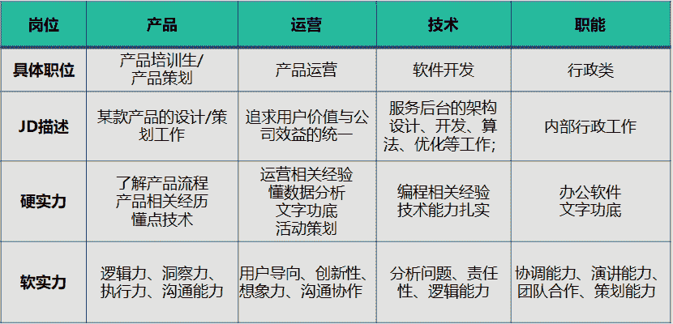

# 第一章 第 2 节 产品经理跟其他岗位关系

> 原文：[`www.nowcoder.com/tutorial/10073/787ae924f4c54ca383d678162c493917`](https://www.nowcoder.com/tutorial/10073/787ae924f4c54ca383d678162c493917)

# 1、互联网公司岗位构成

产品经理是互联网公司的职位之一，依旧存在大量大家可以选择的岗位，比如产品运营、项目经理等，以下以研发、运营、设计、职能来说明各个岗位的差异。

研发岗位偏实践型工作，更多体现在跟事物打交道，偏独立性解决问题，不会过多涉及沟通环节。此外，研发校招考察时要求比较明确，是骡是马拉出来遛一遛，面试官可以通过笔试、面试等方式考察你编程的能力、对技术的认知等要求。

# 2、产品和运营的差异

## 2.1 什么是运营

运营岗位跟产品经理可以说是相爱相杀，产品经理更多是定义产品，设计产品，则运营则是推广产品，通过产品扩大市场规模，提升公司收入。运营的种类根据产品不同，有明显的区隔，比如常见的有以下几种：

### 1）内容运营：

通过内容撬动大盘流量增长，涉及到如何通过激励规则鼓励创造者提供更多优质内容，比如内容审核规则怎么制定、如何维护好 KOL 关系、内容的主题如何设置等。

### 2）活动运营：

通过各种活动吸引用户关注到产品，促进产品的传播和收入提升。活动包括日常的节假日、大促营销活动，也包括各种活动工具的运营，比如优惠券、拼团、砍价等。这些活动工具除给内部运营人员使用外，需要对外推广到各类商户，让商户能够通过活动工具获得新的收益。

### 3）用户运营：

建立用户的增长体系，即拉新、召回、留存，比如通过什么渠道去拉新，每种渠道拉新效果怎么评估，新用户如何能够留存在平台上等。用户运营要求有比较强的同理心，能够熟悉用户的行为并针对性地做引导和干预用户。

### 4）类目运营：

对于交易型平台的产品来说，比如天猫，类目运营是最为重要的岗位之一。天猫的类目负责具体品类的发展方案，大的运营则是引导品类发展，建立品类规范，小的运营则是负责品类商家的流量分配及引导，鼓励商家能够持续成长

## 2.1 产品和运营有什么差异

产品运营跟产品经理虽然最后殊途同归，但早期时两者有明显差异：

### 1）周期差异

周期差异分为两个点：一是跟产品的生命周期阶段有关，比如初创期更偏产品能力，核心是验证模式的可行性，运营的作用并不大，更多是寻找种子用户或者做产品常态的推广业务，而衰退期产品的发展空间有限，靠着运营做留存和召回工作，更偏运营型方式。

二是跟价值长短有差异，运营因为面临业绩压力，需要短期能拿到效果，甚至会出现过于看重数据效果，忽略产品能力建设，而产品则更多着眼于未来，需要能够及时布局新趋势，能有效支持不同业务发展。

### 2）能力差异

以腾讯产品和运营能力模式为例，讲解下两者的能力要求差异

从上图发现早期时产品经理与运营差异并不大，比如校招时产品和运营可能是同时面试，面试官只是产品经理或运营经理交叉面试而已，而对于后期，产品经理和运营在能力明显各有侧重。运营更加关注于业务结果，如渠道推广、产品运营、对外合作等，产品则是侧重于产品规划、用户判断等。

### 3）福利待遇

运营的入行门槛相对产品更低点，低阶运营更偏执行性工作，导致入行时产品运营的薪水略微低于产品经理，比如低个 3K-5K 算是正常值。随着年限提升，尤其是到产品总监或者运营总监维度，薪水两边已经差异不明显，甚至从职场发展周期来看，运营的薪酬范围会远远超过产品。

当然，后面的产品运营就不再单纯负责单一模块，更多是业务的负责人，此也是产品经理在职场上发展的终局之一。

## 3、产品经理和各岗位关系

前面提到产品经理、产品运营、技术研发等职位，这些都是互联网常见的岗位分布情况，这些职位彼此是什么样的关系，或者有什么样的沟通配合，整理跟大家做下介绍各个职位的核心目标及在产品环节的作用。

产品经理在整个工作期间，最为经常配合的是三个部门，分别是运营、设计、研发。

### 1） 运营

前面提到运营的角色和分类，在多数公司，运营可以称之为“业务方”。运营是跟你提需求的核心角色，一方面运营对接外部渠道，比如商家、代理商、销售等，从这些角色获得行业的问题及痛点，以此跟你提出各种改进需求，另一方面运营承担公司收入，根据收入目标拆解业务的节奏及方案，有部分涉及到产品支持，也会跟产品经理提需求。

此外，产品完成后，运营会参与产品验收，核实当时的需求是否已经完整落地，也会根据产品功能，制定各种渠道推广方案，来扩大产品的覆盖率及提升大盘收入。这时运营的角色更多是帮助产品经理，完成该产品流量的持续提升和商业化变现收入。

### 2） 设计

设计分为交互设计和视觉设计，交互设计是将产品方案转化为低保真原型图的过程，能够非常清晰地看到用户的操作路径，比如用户从哪个入口进来，进入到的页面信息布局是什么形式，按钮的位置及摆放在什么节点，用户需要完成哪些操作，需要哪些提醒等。有部分公司没有交互设计师，则产品经理会承担交互设计工作，直接将原型图画好后给到视觉设计师。

视觉设计师则是交互样式的还原，比如整个页面设计是什么样色，按钮大小及色素、活动 banner 如何设计等，是产品上线后用户真正看到的样子。视觉稿除没有数据交互外，更偏静态样式。可以这么理解，交互设计是将产品方案变成不带颜色的黑白线框图，让用户一看就知晓怎么操作，而视觉设计则是将黑白图变成各种颜色搭配合理的彩色图，栩栩如生，让用户情不自禁多停留，甚至能很好唤起用户的情感。

### 3） 研发

研发的角色大家了解得比较多，角色相对比较清晰，在前面产品设计流程中也有介绍，这里就再过多说明。

上面提到的是工作链路上各个职位的配合，并未过多涉及到市场、渠道、销售、公关等部门，更高阶的产品经理需要协调这些业务方，因为产品是全局影响，需要协同相关部门更好地联动，以便实现公司的业务目标。

当然，产品经理最为密切配合的就是上面提到的研发、设计和运营岗位。本节内容讲解了产品经理和其他岗位的关系，让大家对产品经理有了一个大体的认知，下一节我们将讲解产品经理的发展路线。