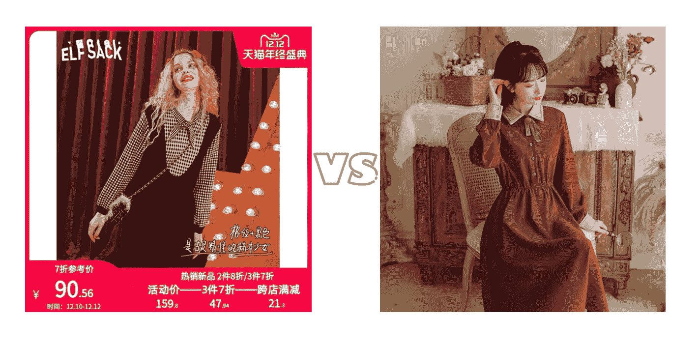

# 第一章 第 3 节 产品经理的发展线路及提升方法

> 原文：[`www.nowcoder.com/tutorial/10073/2aa5d2293e874fbd994e28a380bb9ce7`](https://www.nowcoder.com/tutorial/10073/2aa5d2293e874fbd994e28a380bb9ce7)

# 1、校招薪资待遇

产品经理的校招待遇是各位同学关心的话题之一，这里做下简单介绍：

## 1）薪水待遇

薪水待遇除开工资外，即正常每个月薪水*12 个月，更应关注年终奖，比如是 2 个月还是 6 个月，大概的覆盖范围是什么情况，这些是正常的年包薪资。此外，还有关注公司的五险一金，看公司是否足额缴纳，有部分公司会避税仅缴纳一部分五险一金。

## 2）公司差异

不同公司提供的产品经理范围还是有差异，但整体的幅度相对比较可控，除非你拿到该公司 SP、SSP 级别的 offer。既然公司薪水待遇差异不大，求职时更因关注公司品牌、业务发展、团队文化、主管匹配度等，这些反而是决定你未来发展的关键所在。

校招时，产品经理的工资范围都在公司的定的范围内，可以通过网络或熟人等方式了解到具体的工资情况。这些明面上可被打听到的消息，就不需要在面试的时候去问面试官，不但白白浪费跟面试官交流的机会，还会留下过于注重薪资待遇的负面印象。

# 2、产品经理的发展线路

产品经理常见的有三种线路，分别职级型、专家型、转岗型。职级型是主流的发展线路，即从“产品经理-资深产品-产品专家-产品总监”维度，专家型则是瞄准某个领域或某个核心模块，不断深挖构建产品的专业壁垒，转岗型则是往运营方向转型，从带产品转变成带业务。

## 1）职级型

先说职级型不同阶段时期产品经理要求的差异：

资深产品经理最为关键的三个能力是“需求分析、产品设计、数据分析”，需求分析就是要能准确地判断需求的合理性，能预估需求的影响范围以及带来的价值产出，并能根据投入产出比排列需求优先级。

产品设计则是前面提到的将需求转化为产品的过程，核心是能够通过产品解决用户或者业务的问题。数据分析是最后面的一步，通过数据挖掘产品的效果，并以此改进产品方案。数据分析是互联网产品经理最为重要的技能之一，需要通过比较好的项目来培养这方面的能力。

列举一个早期在天猫做过的案例，原先天猫从淘宝脱离出来时，用户对天猫的印象度不高，B2C 的品质感不强，尤其看到服饰图片各种牛皮癣型信息，极大降低用户对天猫的品牌好感度。

当时的方案是运营设立品类的图片标准，以便商家能发布符合图片要求的商品，且允许商家第二张图-第五张图展现营销信息，来提升转化率效果，仅仅规范首图即可。但实验下来效果不佳，因为各种配套措施没有成型，商家经常逃避监管。

作为该项目的产品经理，我更多思考的是如何降低业务影响的同时，能够辅助业务快速拿到结果，因为当时该事项已经进行两三个月，但效果始终一般，尤其是最为有效的方式就是运营手动下架商品，干预效果非常低下。

先期产品借助运营的手段，通过产品提升干预效率，即需要借助技术手段，能快速识别不符合规范要求的图片。该环节涉及到跨集团的沟通，因为当时的技术在一淘部门，作为产品经理，则是“晓之以理、动之以情、诱之以利”等方式，让对方能快速支撑该项目。此外，由于图片识别的准确率难以达到 100%，通过算法识别违规商品直接下架过于粗暴，极大可能会因为误杀造成商家反弹。

因此产品方案是通过建立运营后台，将排序在前面的违规商品展现给运营，由运营手动下架，通过这样的方式极大提升运营效率，原先需要一天处理的违规商品缩短到半个小时，且通过运营的大力宣导，项目大概进行一个月左右就拿到非常好的效果。

项目如果仅仅是这样的方式，那还不行，需要建立可持续的方式实现图片的品质化，通过事前和事后来保障项目效果。事前方案是既然算法能够识别违规图片，那商品发布时做算法校验，若商品是不符合要求则事先提醒商家，以免造成商家因商品下架导致的经济损失。

事后方案是对于已经发布被违规下降的图片，汇总商品的违规次数，以及店铺的违规次数，对部分商品及店铺，适当提高违规处罚门槛，对于这些重点商家做下更好的通知和触达。

通过这些方式，产品能够保障项目能持续取得效果，而不是昙花一现。

产品专家和产品总监的能力要求维度更高，可以分从事和人的角度来看。

从事的角度来说明，需求分析则变成业务洞察，即能更好地判断业务的发展情况，比如竞对的策略及方向，能够更好地根据市场需求及产品阶段规划产品的发展节奏。产品设计则更偏向于拿结果的能力，要协调各种资源，无论是研发资源还是资金预算，确保项目能够取得更好地突破，甚至在行业内达到领先位置。

从人的角度来看，该级别开始带领团队，一方面要输出个人的产品方法论，能够有效指导下属，帮助下属推进项目拿到好的产品效果，另一方面得开始建立产品梯度，能让老人带新人，形成比较好的产品发展矩阵。

当然，高职级开始做对外的招聘工作，能够开始独立选择适合公司文化、业务阶段、团队氛围等都匹配的候选人，持续提升团队的整体作战能力。

## 2）专业型

部分产品经理对于扩大产品团队，实现管理路径的跃迁线路不感兴趣，更关注于个人产品技能的提升，甚至是享受产品设计的流程。

专业型的产品经理可以固守于某个领域或者某类型岗位，但这些领域最好是社会持续发展或者说是一直有的行业，比如支付产品经理、物流产品经理等。支付是原先线下支付行业的线上化，只是采取的方式更加便捷，极大降低双边交易的成本，大大提升双边交易的效率。

以支付产品经理为例，介绍下该专业型的发展线路。支付产品经理最后的方式则是将该职位覆盖前后端领域都能涉及，比如账号体系、收银能力、清结算能力等。

账号体系是搭建用户或者商户的用户账号，能够更好管理这些用户的权益，比如账号、余额积分等。

收银能力则是用户端的收银台，即方便用户选择任意一种支付渠道，并实现快速交易，甚至做各种支付渠道的补贴活动。底层是各种渠道的对接，比如对接支付宝、微信支付、银联等，不同渠道接口能力有所差异，产品要考虑如何用统一的产品方案实现兼容等。

清结算是跟各个角色的对账体系，比如用户、商户、合作伙伴，结算分成体系如何设计，结算周期如何设置等，甚至发票能否支持在线化、智能化等。

专业型的产品经理职位壁垒相对比较高，但路径过于窄，可能会影响后面个人的发展选择，比如支付产品经理，很大概率只是在不同公司负责支付业务，比较难以转型到其他产品经理岗位。

## 3）转岗型

有部分产品经理会转岗到产品运营，负责业务的某个领域的运营职责。转岗的原因有时是因为个人更喜欢刺激性，追求更加显著且直接的业绩，因为运营对业务的收入负责，更偏前线型的业务部门，也有因为要掌控产品的发展线路，需要自己能更好地去推动业务发展等等。

前面提到产品和运营的差异，这里就不再过多介绍，但要说明的是，产品经理最后的发展线路是成为业务的负责人，因为唯有这样的方式才能拓宽你的职业周期，大大提升个人的天花板。

对于大家而言，能够在做产品经理的同时，更多接触业务，多体验运营的职责及能力要求，能为个人后续的发展积蓄一段经验。

# 3、产品经理的提升方法

产品经理的提升要多种方式，常见的有三个维度，分别是“实践、培训，交流”。

## （1）实践提升

产品经理更偏实践型职位，需要不断累积项目经验才能获得成长。最好的实践是动手去做项目，真正历经产品上线的完整流程，才能了解产品的职责及要求。

对于大家来说，能去一二线大厂实习是最好的方式，原因是因为中大厂的流程更加规范，体系更加成熟，非常有利于新人培养对产品的认知，此外中大厂是个人求职的品牌背书，有中大厂实习经验在校招时更加游刃有余。

如果不能一开始进入到中大厂实习，可以先考虑下去小公司，先积累产品经验，而后再逐步打怪升级，进入到目标的大公司。小公司对产品经理的门槛要求并不高，只要你有比较爱好的学历背景，个人比较好的综合能力即可。如果你能够带上部分作品也是好的证明方式，至少说明你入职后有直接上手的能力。

实习要能保障实习时间，一般实习两个月以上才算是正式实习，而非仅仅过去镀个金而已。

实习期间要能参与到需求的落地，无论需求是大还是小，理论上实习生更多是辅助产品经理跟进边缘性需求，一般都是从小的日常需求做起。针对这些日常需求，要理解产品设计的出发点，比如用户大体分布是什么情况，产品交互方案如何画，跟研发如何沟通产品价值，上后如何看数据效果，怎么来做后续的迭代优化等。

如果没有机会去实习，可以选择自己动手做些项目，比如跟学校的同学组队参与各个公司的产品设计大赛等。微信有小程序产品设计大赛，如果能够在里面获得比较好的名次，除项目能够带来直观的产品领悟外，更重要的是能够让你求职的时候要非常要的履历证明，面试时大大提高成功概率。

实践型提升除实习、项目外，可以自己独立负责产品分析，即自己动手去分析感兴趣的产品，比如意向公司的产品、互联网最近热门的产品。分析的维度涉及到用户画像、市场分析、产品功能、用户体验、商业收入、竞对差异等，通过这些维度的分析能培养你对产品的感觉，参考上面提到的微信视频号的案例。

## （2）培训提升

公司内和公司外针对不同职级、不同行业的产品经有很多相关的培训，可以选择参加一些个人比较感兴趣的培训。

如果是公司内部员工，最好多参与下这些讲座的分享和培训，因为面向内部人员，讲的内容更加切合实际，加上没有什么保密需要，讲师更容易分享项目的酸甜苦辣，里面很多是纯粹的干货。

若是外面培训型的收费课程，则建议慎重选择。产品经理的能力培养最重要还是靠实践，外面的课程更多是经验能力的分享，或多或少只能让你了解产品经理是做什么，有什么样的职责，产品的大体流程是什么样子等。

选择培训型课程，一方面关注的是师资，师资的强弱基本上绝对课程的好坏，选择那些产品经验相对丰富，课程评分比较高的师资，另一方面则是注重口碑，尤其是过往已经上过这些课程的同学，打听下对该课程各方面的评价，而不是仅仅听宣传。

## （3）交流提升

交流是产品经理提升能力比较核心的输入之一，简单的方式就是看书，通过书本去理解产品经理，去看不同产品之间的差异性。

书籍的选择标准可以参考如下：豆瓣评分 8.0 分及人数大于 100，即兼顾口碑又能避免被恶意刷单的书籍蒙蔽。国内的产品经理类的书籍，评分可以适当降低，比如 7.5 分左右即可，否则要求过高选择维度并不度。

还有是跟真正做过产品经理的人去交流。一方面可以看下对方怎么理解产品经理职位，平常的工作流程是什么样，有什么成长的心得与体会等，这些算是产品经理的职业调查，另一方面更多是在项目过程中与主管、所谓的牛人去交流，看对方如何评判你现在的产品，有什么策略能够优化迭代你的产品，如何去看到竞对差异性。

# 4、本文小结

以上就是本篇文章的内容，稍微做下总结。

### （1）选择中大厂公司的互联网产品经理

产品经理是互联网领域的热门岗位之一，要求比较强的专业力和软实力，大家选择时可以根据个人的履历与背景，选择产品经理对口的细分岗位，比如 B 端产品经理、商业产品经理等。此外，能够选择去一线城市的中大厂公司是比较好的选择，因为对个人的发展提升有明显的帮助作用。

### （2）三项核心技能

产品经理是公司业务能顺利发展的的重要桥梁，上承接公司及业务需求，下对接研发资源。对于产品经理而言，能否拿到非常要的项目结果，取决于“需求分析、产品设计、数据分析”三项技能的强弱。这三个维度前面环节已介绍过，是产品经理的看家本领，需要不断提升这些专业能力，没有最好只有更好。

### （3）多维度提升

提升个人能力最好的方式是实践，即最优的方式在公司实习，参与到“提出需求、需求分析、产品设计、研发上线、数据分析、产品迭代”完整流程，次之则是动手做过产品，经历过产品 0 到 1 的阶段。

另外产品经理可以跟各种不同的产品经理去聊，获取业界最新的信息，也能够不断丰富个人对产品的感悟。