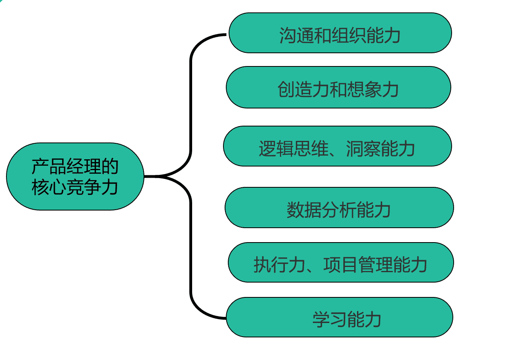

# 第二章 第 1 节 初识产品经理校招

> 原文：[`www.nowcoder.com/tutorial/10073/c4ad18b8a0ad43a58ea3b91b1f37d3fe`](https://www.nowcoder.com/tutorial/10073/c4ad18b8a0ad43a58ea3b91b1f37d3fe)

# 1、校招整体情况

校园招聘是不少公司特别是大公司比较习惯采用招聘员工的方式，而且也是每个应届毕业生找工作需要经历的必要环节。

相比于社招，校招的同学具有的优势是有更强的可塑性，通过每年持续的招聘，能够为团队补充新鲜血液，形成比较良好的人才阶梯，有利于保持公司和团队的活力。而且校招生更像是一张白纸，没有上一家公司的在工作方式、工作习惯等的烙印，比较容易融入新的环境也比较容易被培养。同时，校招生刚进入社会环境，往往有更加充沛的热情和干劲，对一切充满希望，这也是为什么公司每年都要给校招留出来名额的原因。

虽然现在的校招生在正式找工作之前都会主动去找几份实习来熟悉岗位并让自己的简历具有更加强的竞争力，但是相比于社招的员工，校招生的工作经验在面试官眼里还是相差很多的，所以，当公司在招聘应届生的时候，除了看对候选人本身的硬实力，即对应聘岗位基本的熟悉程度和理解，更加看重的是候选人本身的软实力，比如聪明程度、热情、逻辑能力和对未来发展的个人规划等。
校招整体分为春招和秋招。春招，一般包括了校招和实习，比如，2021 年的春招就是面向 21 届的春季校园招聘，和面向 22 届的暑期实习招聘，但是转正比例与岗位、部门情况有关。秋招就是当年的应届毕业生找工作的时期，往往流程比较短，面试通过之后往往不会要求先来实习才会发 offer，一般是直接发放正式 offer。
对于产品经理这个岗位来说，校招的流程不管是春招还是秋招，一般都是在公司官网的网申系统投递简历，通过简历筛选后会发邮件通知笔试。实习招聘一般是网上进行笔试，秋招的时候因为有些公司会去校园进行宣讲，而且会有大量的名额放出，因此部分公司会除了网上进行笔试的形式还会有选择在某个高校或某个酒店进行统一笔试。笔试一般分为行测和专业测试，行测就是类似公务员考试的行测题目，基本上都是选择题，同时也会考察专业题目，就是产品相关的选择题和大题。如果笔试通过，之后会以邮件的形式发出面试邀约。一般来说，笔试不是是否能进入到面试的关键因素，可能只是一个加分项，对于一些公司来说，简历才是能否进入到面试的关键因素。对于产品面试来说，面试一般分为以下几面：一面是群面，也就是无领导小组讨论：一般分为 30 秒自我介绍，然后用 35 分钟的时间讨论出来一个方案再进行汇报。这个过程是大家最害怕的过程，因为不可控因素太多，而且也是通过率最低的情况，往往是十进二甚至有可能团灭的情况；二面主要是主管面，主要根据简历问问题，会问一些实习、项目相关的细节；三面是总监面，主要考察对一些宏观问题的看法和一些战略性质的问题，同时也会看候选人的逻辑性和思考能力；最后一面是 hr 面，主要考察候选人的性格、稳定性、有没有大的问题之类的，hr 面一般来说比较容易通过，但是一些公司的 hr 面也会问到产品相关问题，同时也会挂人，比如阿里的 hr 面就很有挑战性，会有一些人挂在了 hr 面上，所以也不要掉以轻心。上面介绍了校招的整体情况，下面会详细介绍校招各个时间段的时间和形式。

# 2、各阶段时间与形式

## 2.1 总体概述

对于校招生来说，整个时间节点会分为日常实习，投暑期实习，暑期实习，秋招，补录等几个阶段。在暑期时期和秋招两个阶段又会分为提前批和正式批，接下来详细介绍每个阶段不同的时间、特点和形式。

一方面，对于应聘产品岗位来说，如果投递 BAT 这种大公司，一定要有一份大厂的日常实习或者校园的创业项目、比赛经历等，否则是很难在很多简历中被捞起来的。在捞校招生简历的时候，只看有没有大厂实习经历或者比赛项目创业经历，如果没有的话，几乎就不会发起面试。

另一方面，从准备的角度来说，尽早投入到春招的实习岗位中有助于积累面试经验，多积累才能在真正重要的面试中不至于怯场。很多学生对于自己的能力有或高或低的认识，但只有通过尽可能早的跟真正面试官的交流，你才能在第一时间发现自己的优势和不足，并留出尽可能富余的时间去改进。

## 2.2 日常实习

日常实习可以在大二或者研一就开始了，可以不用特别多，有一两份就可以。一方面可以积累产品相关的一些经验，另一方面这份实习也可以丰富简历，增加自己找暑期实习的筹码。日常实习往往公司要求不会太高，因为很缺人，而且希望能够尽快招到人增加人手，所以如果候选人时间较多，可以立刻入职，且面试不是特别差，一般就会通过日常实习的。日常实习往往不用笔试，直接在实习僧等网站上面会有很多 jd，直接投递即可，同时也会在各个有 hr 的社群充斥着各种 jd，找日常实习可以时刻注意着。

## 2.3 暑期实习

春招，一般包括了暑期实习和第二年的春季补录，比如 2021 年的春招就是面向 21 届的春季校园招聘，和面向 22 届的暑期实习招聘。我们首先介绍暑期实习。

暑期实习一般开始较早，3 月份往往各大公司就在官网上发布了暑期实习的通知，为什么很多人都想要投暑期实习试试呢？因为拿到实习 offer 是有转正机会的，这就相当于为秋招多了一份保底 offer，但是转正比例与岗位、部门情况有关。

拿腾讯来说，春招名额往往比较多，一个部门可能最多会有 3-6 个实习生，但是转正比例很低，甚至没有。但是对于阿里来说，实习生招聘要求和秋招一样，难度比较大，而且每个部门的实习生 hc 只有一两个，基本上就是按照校招生培养的，如果表现得没有太大的问题，就会给与转正机会。所以阿里暑期实习生的口碑在应届生中还是不错的，基本上大家拿到了阿里的暑期 offer 的都会选择去阿里实习，因为大概率可以拿到一个转正机会。

所以对于找到了暑期实习的同学，根据往年经验，存在两个不确定性：第一，转正机会的不确定，即便企业承诺给转正，也存在毁约的情况，如果在秋招后期才告知不能转正会很被动；第二，转正薪资可能比校招的薪资偏低，往往通过秋招进入公司的会给一些 sp 和 ssp 的 offer，校招往往是白菜价，求职岗位这在一些公司是确实存在的。对于比较有实力的同学，建议两手准备，即便在实习也尝试出去试试秋招，给自己更多的选择。最好的方式是在春招中拿到满意的实习 offer，然后做两手准备，一边等答辩转正一边准备秋招。

## 2.4 秋招

接下来介绍秋招。秋招秋招是规模最大的校园招聘，也是应届生求职的最佳上车机会，越早准备越有利。很多公司在 6-7 月就开始打开了秋招网申通道，在这个时候好多同学都在暑期实习中，所以绝大多数同学往往一边实习一边刷题准备秋招面试，压力也是最大的时候。

到了 8-9 月就是秋招网申高峰期了，从 8 月起，互联网、快消、四大等企业就正式进入网申阶段，不同行业和岗位的开始时间和截止时间还是有些不同，比如互联网行业开始的很早，如果招够了人，hc 没有了，就停止再继续面试了，但是银行等国企往往时间比较久，战线比较长，可能 9 月份 10 月份才刚开始面试，所以希望同学们一定要能够实时跟进，以免错过招聘时间。

对于一些公司，往往在 9-10 月会在学校召开各种宣讲会，宣讲会主要是介绍公司的一些情况，时间点，吸引大家进行投递，同时进行答疑，甚至直接进行笔试和线下面试，一条龙流程，所以一定要关注学校里面的就业求职通知，及时参加各种面试。

## 2.5 正式批提前批的区别

暑期实习和秋招都有提前批和正式批。

提前批一般要比正式批早一个月的时间，提前批往往会先筛选一些简历优秀和能力突出的人，这部分人往往不需要笔试，直接进行面试。这个批次面向的是那些简历很好的同学，比如你有一线互联网公司产品实习经历，或者你有突出结果的创业经历，这部分同学有更高的概率获得面试机会。提前批面试确实没有笔试，面试官会直接约视频或电话面试，但面试难度也是所有批次里面最高的。这是因为企业想提前筛选出一批能力最强的学生，提前抢占人才。提前批过程中，如果你发现你的知识和能力还有所欠缺，也可以在这个时间段进行补充，为后续秋招正式批做准备。

正式批的特点是招聘规模最大，竞争激烈。在提前批结束之后，正式批一般包括以下几个流程步骤：网申 -> 测评/笔试 -> 面试 ->发 Offer。正式批一般都需要正式走官网网申，因此同学们要及时关注各互联网公司的网申时间，准备投递简历。当招聘系统和 HR 对简历初筛后，校招同学会统一收到测评/笔试通知，但有些公司如百度会根据地区和网申时间分批次进行笔试。正式批和提前批不同，一般都需要参加笔试，有些公司会根据笔试成绩决定哪些人会进入到面试中。通过了笔试就会收到邮件进入面试环节，然后进行一系列的面试，通过之后就可以发放 offer。

## 2.6 补录

秋招之后会有少量公司有补录或者捡漏。春招补录一般从次年的 2 月份开始，是应届生的最后一次机会。大部分参加春招的应届生，分为两种情况：一种是错过秋招或者在秋招中没有拿到满意 Offer，另一种是考研失败准备找工作。春招的机会比秋招更少，一般只占到秋招招聘岗位的 30%左右。尤其是互联网大厂，补录的岗位比较少，反倒是是一些小而美的公司有较大的岗位缺口。春招的流程和秋招的正式批流程基本一致，会有网申->笔试->群面->业务面->HR 面等多个环节，这里就不再赘述了。互联网公司之所以存在补招，主要原因在于一些“Offer 收割机”虽然手拿多个 Offer，但实际上最后只会选择去一个公司。因此，由于部分互联网公司没有达到校招招聘指标，会选择继续招人。这个时候，如果有合适的机会，就应该抓住。因为很多优秀的同学已经签了三方，不会再和你竞争，这个时候的竞争激烈程度远小于正式批。但是企业并不会大规模宣传，需要小伙伴要注意关注这方面的信息。这里要说下一到求职季就会听见的高频词汇——“内推”。每年从提前批开始，互联网公司就会放出各种内推消息，通过公众号、网站、在职员工放出内推码，之前的内推含金量很高，直达面试官，也不需要笔试，但是近几年的内推码越来越水，基本上和其他人没有什么区别，只是可以找内部员工方便查下状态。最好的内推方式是找自己关系比较好的学长或者学姐，如果他们在的小组正好有缺人的地方，可以直接把简历交给主管，这样主管就会看见简历，避免出现简历太多没注意到的情况，如果简历可以就可以发起面试，节省很多流程。

# 3、产品岗校招现状

## 3.1 整体现状分析

产品经理作为一个历史相当悠久的岗位，历经星移斗转,走过了百年的历史。

在很多人的眼里，产品经理是一个高大上的职位，薪水多、发展好、前途一片光明。因为互联网相比于传统企业来说工资比较高，自然具有较大的吸引力。在互联网岗位中，技术岗位对本身的硬性专业技能要求较高，难度较大，相比技术岗来说，产品岗位的入门门槛就没有那么高，毕竟不需要懂复杂的计算机知识、会编程、会算法，也不需要是计算机科班出身，由于这些优点和普适性，毫无疑问产品经理的岗位竞争就会异常激烈，尤其是非计算机专业的同学很多都会来尝试这个岗位。来自艾瑞咨询的报告数据显示，2018 年至 2019 年，互联网产品经理的职位期望值从 12.2%增加到了 39.4%，成为互联网期望职位中提升最高的一个职位。

同时，随着互联网公司的不断壮大，业务的不断发展，产品经理的领域也越发细分。之前产品经理岗位只是单纯的一个岗位，但是现在又分为很多类型：

### 3.1.1 按照服务对象划分

产品经理作为服务于“产品”的专业人员，从用户类型来分，可以简单分为：

#### 2B 产品经理：

服务于特定商业领域或企业用户，比如各类云服务平台（阿里云、腾讯云、百度云等）、各大数据服务公司（同盾、百融等）。2B 产品经理的工作核心是帮助企业将业务抽象化，提高标准化程度或提升业务效率，因此往往更注重逻辑思维能力和全局观念，而且对于所供职的特定行业也有一定程度的专业能力要求。

#### 2C 产品经理：

面向于个人用户，这是市面上需求最广最为常见的产品经理类别，我们每天都在使用这一类产品经理的产品。2C 产品经理由于面向群众，因此更加注重用户体验和用户需求的挖掘和满足。

### 3.1.2 按照工作内容划分

产品经理按照所负责的不同工作职责，又可以分为：

#### 1.用户产品经理：

也叫用户体验产品经理、交互产品经理，是主要直接面对用户、实现业务的产品经理。

#### 2\. 商业产品经理：

围绕最大化程度实现产品的盈利点，挖掘商业潜能，最大化实现产品价值、为企业实现更大利润的产品经理。

#### 3\. 策略产品经理：

策略产品负责研究和制定公司的业务策略、战略布局，调整产品策略和业务方向，比如快手和抖音的视频展示方式、淘宝的商品上架布局策略等。

#### 4\. 数据产品经理：

随着数据驱动业务的理念越来越深入人心，数据产品需要负责从数据纬度出发分析业务，搭建业务框架，用数据的手段提升整体业务水平，为其他团队提供数据支撑等。在有的公司，也管这一岗位叫数据工程师。

#### 5\. AI 产品经理：

负责 AI 相关项目产品的规划、设计。

#### 6\. 平台产品经理：

平台产品经理是一个类管理岗的职位，主要从整个全局架构角度出发，高度抽象业务现象、提炼业务本质，从功能、平台、机制三维度综合搭建整个平台服务，为公司整体提供服务。

### 3.1.3 按照行业划分

从不同行业领域出发来区分产品经理的类别：

1\. 电商产品经理：比如淘宝、拼多多、京东等的产品；

2\. 社交产品经理：比如微信、陌陌、SOUL 等的产品；

3\. 教育产品经理：比如作业邦、51Talk 等的产品；

4\. 金融产品经理：比如微粒贷、蚂蚁金服、分期乐等的产品；

5 工具类产品经理：比如百度地图、美图秀秀、黄油相机的产品；

以腾讯为例，2019 年腾讯对产品经理岗位进行了调整，整个产品线分为了：**产品策划、产品运营和行业应用。**

产品策划：类似于以前的产品经理定位，主要是 C 端产品，对产品功能进行策划；

产品运营：主要是 C 端，培育产品成长；

行业应用：TO B 方向，基于垂直行业需求，如游戏云、电商广告等，制定垂直行业的互联网解决方案。

这里重点说下行业应用，这也是新开辟的一个岗位，需要产品经理了解你所服务的垂直行业，它的商业模式，它的互联网需求是什么。然后结合公司的互联网资源，制定垂直的解决方案。针对部分大客户，甚至还需要 case by case 的制定专属解决方案。这里无疑提高了对产品经理的要求。需求仍在，且要求更专业：用于分析各方诉求，协调各方资源以制定更加精准的行业解决方案。

# 4、产品招聘人数分析

互联网大厂对于非技术类岗位选人的主要标准是靠谱、灵活以及情商高。但是在短短半个小时的面试中，很难在短时间完全考察出候选人的这些特征，大多时候是看面试沟通中的感觉是否舒服，再结合候选人过往是否有相关的经验来综合判断。

因此在校招过程中，面试官需要集中面对数量远高于日常招聘的求职者，标准会更加苛刻，一般会把求职者的学历和过往的工作经历当成重要的参考，也就是说，筛选简历的时候首先看学校和专业，比如 985 和 211 高校的学生会有更多机会，学历要硕士以上等等，同时，如果此时有大厂实习经历的同学会优先面试。

即使如此，最终提交简历的毕业生数量依然相当大。一位在腾讯负责校招的 HR 透露，去年腾讯校招接收了几十万份简历，但最终发的 offer 只有 3000 多，录取率不超 10%。

腾讯的录取率已经在向公务员和大型央企靠近。有媒体统计，近 10 年国家公务员考试的平均录取率在 2%左右，中石化、中石油等大型央企的录取率在 4%左右。这意味着，校招笔试的首要目的不是考察求职者的专业能力，笔试中的大部分题目和工作并没有相关性，而是用一套标准且简单易行的方式筛人。

一方面，每年应届毕业生的规模仍然要增长 20~40 万人。今年，受疫情的影响，很多海外留学生毕业之后放弃在海外发展的机会，纷纷选择回国，求职毕业生的规模进一步提升。

根据数据显示，今年秋招，留学生的求职规模翻倍，2020 届留学生是留学生活跃求职的主要群体。活跃求职的留学生中，拥有硕士及以上学历的比例高达 65%，且相当比例就读于海外名校，加剧了应届生整体求职竞争的激烈程度。

在一些大厂招聘中，腾讯披露了招聘总人数计划，3000-3500 人，分为技术、产品、设计、市场和职能五大类，技术类岗位占比最高，达到 65%。上一年腾讯的校招人数是 3100 人，今年有望增加。同时，公司下面的招聘人数又根据具体不同部门人数划分，对于一些公司，可能每个部门的招聘人数最多会有 3-4 个，阿里每个部门只有一个校招生 hc 甚至没有。对于一些刚成立的创业部门，急需人手开辟业务，这种情况下可能 hc 会多一些，可以到 5 个以上，但是整体产品招聘人数还是非常少且竞争激烈的。

下面介绍校招生投递人数和投录比等数据。

## 4.1 投递人数分析

从上面的数据可以看出产品岗位的招聘人数，同学们最关心的肯定还有投录比。因为如果投录比越低，就代表这个岗位投递的人数越多，但是真正的 hc 很少，竞争也就更为激烈。

下面是一些数据：

腾讯的产培生项目，是所有产品经理岗位中竞争最为激烈的，每年全球进行招聘，收到简历上万份，但是最终只录取 30-50 人；

网易前两年的产培生项目，一星期就收到 4000+份简历，报录比达到 400:1。

对于阿里来说，我去年所在的部门，收到了校招生简历几百份，但是最终录取的 hc 只有两个，也是“百里挑一”的程度。

今年，情况尤其惨烈，拿 2021 年国家公务员最热报考岗位是 2774:1 做对比，但是某公司非技术岗的报录比达到 3000:1。

所以从这些数据可以看出，产品经理岗位的内卷程度已经达到了白热化阶段。

## 4.2 求职竞争力分析

面对着上面这些触目惊心的数字，相信大家应该都感受到了很大的压力，那么同学们也要表现出来自己的求职竞争力才能够在众多的求职竞争者中脱颖而出。

产品经理的核心竞争力，在不同阶段有不同体现，而且也由不同的技能线。对于进行校招求职的初级产品来说，主要有以下几个方面：

#### 沟通和组织能力：

好的沟通能力和组织能力是要真正调动一切资源（比如开发资源和测试资源）、实现自己的目的。同时，在过程中出现的任何可能会阻碍开发进程的事情都要维护协作，协调流程，让开发快速高效的完成开发，让产品稳定地迭代，这才是真正的产品经理的价值；

#### 创造力和想象力：

创造力是评估一个人是否适合做产品经理的重要标志，它需要同学们具有改革、批判、颠覆的精神。产品经理往往作为产品的创造者，需要极强的好奇心、想象力和创造力，让一款产品完成从无到有，再从有到优的演变。同时，要在现有的不合理的产品逻辑中勇于改变。

#### 逻辑思维：

作为产品经理，在整个分析推理过程中，需要很强的逻辑思维能力基础。在思考需求并输出 prd 时，能够条理清晰地将需求背景、产品思路、设计细节表达完整，具有强大的逻辑思维能力是这个的基础。

#### 洞察能力：

洞察力，就是透过表面现象判断问题背后本质的能力。通常，产品经理作为产品发起者，需要对周围事物变化保持很高的敏感度，根据变化推测出对应市场趋势，通过产品去迎合市场需求。对于产品经理而言，洞察力则是发现用户需求的能力，看到别人看不到的问题。

#### 数据分析能力：

一名合格的产品经理，需要对数据十分敏感，掌握数据分析技能，用数据说话。在设计一款产品前，产品经理要有意识进行数据埋点，积累产品数据，并在数据沉淀 > 数据分析 > 产品优化的循环中持续锻炼数据分析能力。善于从大量数据中挖掘出有用的信息，来指导和改善产品升级工作，让产品更靠谱。

#### 执行力：

产品经理除了具备较强的想象力和创造力之外，更重要的是能让想法落地，能将想法经过调研和论证转化为产品方案并推进上线。以及工作中领导交给的任务能够迅速确定目标，排除困难去解决。做到凡事有交代，件件有着落，事事有回应。

#### 项目管理能力：

项目管理是产品经理日常工作中经常要负责的一部分工作。产品经理需要有基本的制定项目计划的能力，也要进行进度跟踪：需要时刻掌握项目进展和动态解决问题和异常情况，提高团队积极性和效率。

#### 学习能力：

产品是一个日新月异的过程，也是一个需要时刻保持敏感度汲取新知的过程，因此需要时刻清楚自己哪里不足，知道向谁学习。

很多人会问，我知道了要有这些能力，那我应该做些什么呢。我建议大家采用“GROW”模型去思考。该模型是在《高绩效教练》这本书中被提出的，一般用于能力辅导。但我们可以用该模型去决定，在能力这件事上，可以去做些什么。

G：goal，代表目标。你想去的岗位，他们想要招一个什么样的人，这个人需要具备什么样的条件，这些，在岗位描述中其实都有体现。

R：reality，代表现状。你自己具备的能力如何，你的能力跟现在的岗位是否匹配。

O：option，代表选择。基于上面的分析，你还有哪些选择，比如你想去的岗位是 ABC，那经过分析之后，你自己希望最大的岗位是哪个，也就可以知道了。

W：where，代表路径。有了选择，接下来就得知道该怎么做了。是积累还是针对性押宝，其实都是你的路径的一部分。

这一节讲述了产品岗位的校招盛况，竞争激烈的情况下，只能是千军过独木，那么下一节将会教大家应该则么去备战产品产品经理校招。