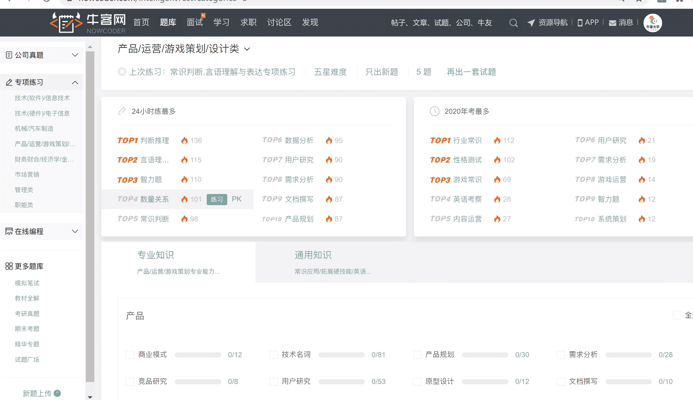

# 第二章 第 2 节 如何备战产品校招

> 原文：[`www.nowcoder.com/tutorial/10073/703e0bb7bf7944b0963be6d0828d80da`](https://www.nowcoder.com/tutorial/10073/703e0bb7bf7944b0963be6d0828d80da)

# 1、整体备战校招攻略

接下来我们从面试前、面试中、面试后来整体讲下备战校招的攻略：

## 1.1 面试前——给自己信心

### 1\. 准备一些常见的问题

什么是常见的问题，就是大多数面试官会问的，能预见的，比如：

自我介绍：自我介绍一定不要按照简历走，要简短精炼有重点，不要背简历的内容。

最满意的一个产品/项目：要容易理解、体现你的价值和效果数据。

你的优点和不足：自己提炼。不足最好是不会影响工作和协作，可以和成长有关。

你的性格：自己提炼。性格都有硬币的两面，往好的方面引导。

你的职业规划：分成一三五年计划。可以从行业选择、个人成长等方面开展。

### 2\. 了解下这家公司的情况

了解这家公司的公司情况、运营情况、产品情况，也去体验体验他们的产品，对于不好的和好的方面，都有初步认识。

### 3\. 整理好心态，不要想着一定要拿下

当你拼命想得到某个结果时，心态会失衡，行为会失真。找工作是 60%的实力+40%的运气，是你表现出的能力、态度和这个岗位匹配，面试官觉得你就是他找的人。找工作非常看候选人和面试官的眼缘，不是一次就能找到匹配的岗位和人。所以找认识的人直接推到他的部门是一个捷径，对方知道你的具体情况，匹配成功率也高很多。有时候，反而是你觉得可能很难进的、最没有希望的岗位，因为心态放松、没有思想包袱反而容易成功。所以平常心对待面试，不要先想结果的事情，做好自己可控范围内的事情。

## 1.2 面试中——换角度思考

### 1\. 回答面试官的问题前，可以想想对方是想了解什么？

对于常规问题，你可以按照你的准备去表述。对于一些非常规问题，你可以想想，对方问这个问题的目的，是想了解你什么。是想听到哪个角度的回答，反映出你的哪些产品思维。比如对方问你“如果你手机里只能装 3 个 APP，你会选择哪 3 个？”这个问题答案是开放性的，你需要从产品功能、个人喜好、产品的独特点等几个方面有理有据的回答。对于一些非常规问题，最好和对方说，给我 1-2 分钟的时间思考。相比于脱口而出没有逻辑的回答，面试官更喜欢听富有逻辑性、有理有据的回答。

### 2\. 你有什么问题问我的？该如何回答？

这个环节一定不要说没有什么问题，面试官看的是候选人问问题的能力和思考的深度，这也是侧面表现自己的一个机会。分享一个思路：

对于业务负责人面试，可以问问岗位更细节的情况、团队情况、业务发展阶段、想找什么样的人、对员工有什么期待等。对于更高层的面试，可以问问公司的核心能力、未来计划、价值观等。问题一定要注重于工作本身、团队本身、成长本身；避免问福利、问规章制度、是否加班等。

### 3\. 宏微观思维

在回答问题时，表述一定要有逻辑，很多问题可以用宏观、微观两个角度去表述。首先可以概括说下结论，从大方向、大背景开始，然后分条介绍落地的东西和细节。宏观角度，是拔高思维看问题的角度，体现你的认知水平；微观角度是体现你真正懂业务、懂产品、做过这个项目的角度。不要浮在上面，落不下来；也不要一直阐述细节，没有拔高提炼。

## 1.3 面试后——复盘总结

### 1\. 面试结束后花点时间回顾复盘

复盘是非常重要的成长方法之一，复盘可以在失败中总结教训，在成功中总结经验，并进一步强化为通用化知识的过程。如果面试不好，不要沮丧，更应该想想哪些问题是没有思考好、回答好的。并且记录下来可以回答更好的答案，加入经验库，以后肯定可以用得上。如果面试感觉不错，也要记录哪些问题的答案是可以沉淀下来的或可进一步补充的，沉淀到自己的经验库。每个工作中的人，都是需要有一个面试问题库的。随着时间而不断完善，这是你找工作的有力武器，也是你成长的见证。

### 2\. 调整心态，不要等面试结果，投入到下一家公司面试的准备中去

自己觉得面试的时候发挥很好结果却没有录用的情况很多，面试是一个双向选择的过程。面试官因为什么情况没有录用你，原因很多，甚至可能匪夷所思，但是他也不会告诉你。对于候选人来说，不要等结果，投入到接下来的面试工作和准备中。候选人只能改变过程，不能改变结果。如果过了，不悲不喜；如果没有消息，不卑不亢。往往找工作的过程，就是认知成长最快的过程。

下面讲述在各个阶段如何进行备战。

# 2、各阶段备战攻略

下面讲解各个阶段的备战攻略，分为求职前的准备——产品技能学习+项目实习+简历，然后是获取招聘信息，笔试，面试几个方面。

## 2.1 求职前的准备

### 2.1.1 产品技能学习

前面提到，如果已经决定好要求职产品经理这个岗位，至少应该提前一年就开始着手准备，首先应该培养自己的软实力，大致可以从以下几个方面入手：

#### （1）阅读一些产品类相关内容

这里推荐几本产品经理有关的入门书籍：《幕后产品》、《俞军：产品方法论》、《社会心理学》、《学会提问》、《影响力》、《激荡三十年》；同时，也需要关注一些时事动向，比如可以关注一下知乎产品经理的话题，人人都是产品经理上面的一些分析文章，虎嗅、36Kr 上最新的业界消息，提前熟悉牛客网上面的笔试面试题型，还有一些高质量的公众号等。

通过以上可以日积月累地培养产品思维、互联网思维，让自己在潜移默化中形成产品思考。同时，最好可以用笔记本或者在线文档把自己觉得有用的知识记录下来，这样以后进行复习的时候只需要看自己记过的笔记即可。

#### （2）学习产品经理相关工具

产品经理必备的基础能力就是画原型和写 prd。画原型工具 Axure 是必须掌握的，同时也推荐墨刀，比较好上手，前期如果不会使用的话可以去网上搜索一些视频教程。同时，也需要掌握数据分析工具，最简单的可以先用 Excel 入手；同时产品经理也需要进行汇报，ppt 也要学会进行使用。同时，产品经理经常需要梳理思路，最直观的形式就是脑图，推荐 Visio 和 XMind。

#### （3）多体验产品，思考产品

产品经理一定要保持自己的好奇心和思考能力，因此需要多体验各种不同类型的 APP，这个是非常有用的，因为面试的时候面试官也会让你介绍自己喜欢的一款 APP，平时如果可以积累自然面试的时候不慌不忙。

在体验产品的过程中，可以用 XMind 画出功能结构图，同时可以尝试写下产品体验报告以及竞品分析报告，并且可以提炼出来一些可以优化的点，这些都是面试的时候需要用到的。

### 2.1.2 项目实习

前面提到，互联网大厂在捞简历的过程中优先看重的就是学校和实习经历，因此最好的方式就是提前找份日常实习，并尽可能多地参加一些项目和比赛。项目和实习是把前面学到的产品经理相关知识用于实践，因为只有我们在真正的工作环境中才能真正明白产品经理的工作范围以及工作流程，不至于纸上谈兵。同时，提前进行产品实习也可以检验自己是否适合做产品经理，并且培养自己的产品经理能力体系。

如果学校允许，在大二大三或者研一的时候就可以进行日常实习，提前积累自己的实习经历。或者利用暑假和寒假的时间，尽可能地有两个月以上的日常实习才能初步进入到产品的工作。

如果实在没有实习条件，那就需要多参加一些项目经历或者比赛经历，比如和学校的小伙伴一起做一个创业项目，或者自己运营一个公众号，甚至去参加一些创青春、互联网+、微信小程序大赛等，这些在面试的时候是很加分的，因为在面试官看来你有很好的执行力和想法。

### 2.1.3 简历

简历是非常重要的，因为它决定了你是否可以进入到面试阶段和面试官对你的第一印象。简历的撰写要紧扣简历的目的，既要保证简明，同时必须扼要，所以我们要谨慎地选择简历所包含的内容，保证我们写在简历上的内容都是有意义的，能帮助阅读简历的人了解我们，帮助证明我们能够胜任产品经理这一岗位。在整个撰写过程中，我们要时时问自己三个问题，一是“我的表达是否清晰准确”，二是“我写这个是想传达什么讯息，是否与产品经理岗位相关”，三是“浏览简历的人看到这部分可能产生什么想法，可能会问我什么问题”。

在排版上面，简历内容不要太挤，也不要满篇加粗，建议彩打，随身携带几份备用。简历需要多次迭代，根据不同公司、不同岗位进行迭代。我当时身边找到好工作同学的简历甚至迭代了二十多次。

### 2.1.4  获取招聘信息

前面提到过，获取招聘信息是非常重要的。最常见的渠道是去目标公司的官网信息和招聘公众号官网寻找，这上面的信息也永远是最准确和及时的。同时也推荐一些校招聚合信息网站：牛客网这类网站会及时更新各大公司的网申信息、宣讲会信息和网申时间提醒等。牛客网还会提供一些笔试刷题和面试讨论的功能。同时也要很好地利用自己的社交资源：比如学长学姐，QQ 群/微信群等，也可以让他们直接帮忙内推和请教一些面试经验。此外还可以和身边的同学一起建立微信群或 QQ 群共享求职信息，分享求职经验。

宣讲会也是一个很好的机会，一些不太出名的小公司很大程度就靠宣讲会来展示自己，简历投递和笔试也通常都是在宣讲会之后立即进行。

在获取招聘信息的时候，可以用在线文档的方式把整个校招过程都记录下来，包括求职历程、笔试情况和面试情况，其中求职历程又包括：每日记录、计划日程、待投、不投和各家状态。这样可以方便自己清晰地找到各个内容。

## 2.2  笔试

线上投递简历之后在通过筛选的就会收到测评/笔试通知了，一般公司都是海笔，也就是每个人都可以收到笔试通知，只有一部分公司筛选一部分简历之后然后通知部分候选人进行笔试。有的公司如百度会根据地区和网申时间分批次进行笔试，有的公司是统一时间进行笔试，因此需要时刻关注官网。线下笔试一般是宣讲会结束后立即开始。也有一些公司的产品经理没有笔试，比如链家以及一些传统 IT 行业。

笔试题型主要分为以下几种：能力测试+性格测试+专业笔试。其中题型有客观题和主观题；

其中，能力测试主要分为逻辑推理、图形推理、数字推理、资料分析、言语理解；

准备能力测试时，建议大家利用[牛客的题库](https://www.nowcoder.com/intelligentTest?categories=3)进行刷题，基本涵盖所有的互联网公司真题，以及还可以分题型训练。

 很多时候互联网公司的能力测试题和公务员考试很像，而刷题的目的一方面是熟悉笔试内容，另一方面是通过答案分析来倒推每种体型一般的考察套路。

性格测试主要是考察心理，对于华为、阿里等公司非常看重这一项，甚至如果分数不达标会影响后面的面试。

性格测试中，最大的坑之一是前后的矛盾，很多题目在一次考试中会重复出现，如果你在答题时是为了打造某个人设，那么在长时间的答题之后可能就会在第二次答相同题目时选择不一样的答案。个人的建议是在大的方面依据自己的实际情况去选择，在原则类的问题上避开明显的坑选项。

专业笔试一般为互联网行业热点事件、目标公司业务产品、同类竞品研究相关垂直细分领域，在客观题和主观题均会出现，主观题偏多。

专业笔试题的答案往往是一段比较完整的观点，因此准备阶段可以多看成型的文章。例如在牛客网就可以看到往届的专业笔试题参考答案。

很多时候我们对于一个笔试时会感到陌生，不知道该怎么回答，这时候个人建议时无论你的答案是多还是少，都尽量用一个逻辑框架去组织，不要像头脑风暴一样说的很零散。你的原则应该是：即使只说一点，也应该把这一点说清楚。

## 2.3 面试

笔试筛选后，就会进入到面试环节。一般会有群、专业面、hr 面。

### 2.3.1 群面

群面专业面 Boss（总监）面 HR 面群面即无领导小组讨论，其场景往往是有一个固定的命题，大家需要在特定的时间内协作讨论，给出一个解决方案，讨论时间在半小时左右，面试官在旁边观察并记录面试结果。

群面考察个人的领导力、团队协作力、解决问题的能力，要求每个人既要竞争，也要合作，既要保证团队最终可以输出一个较好的答案，并且在这个过程中要充分展示自己的优势。

群面的角色一般有领导者、记录员、计时员、最终发言陈述答案的人和普通成员，每个人对于团队来说都很重要，都有机会最终突破群面关。

群面筛选的比例很大，往往是 10%左右的通过率，因此每年群面也是很多应届生最害怕的一个环节。

### 2.3.2 专业面

专业面一般就是你入职后的直属 Leader 面试你，由于面试官之后会直接带你，所以对你的能力考查会更谨慎，希望更全面的了解你。而 Boss 面，更加注重个人潜力。作为产品经理，逻辑思维能力、学习能力、沟通能力等素质都非常重要，这些也是这一轮面试官考察的核心要点。

#### 1、竞品/产品分析

建议准备 2 个产品提前进行分析。一个是你非常熟悉的产品及其竞品，一个是你即将面试的公司的产品及其竞品。选好目标分析对象后，深挖它的核心功能点和与竞品相比的优势、劣势，并准备好针对劣势应该如何改进的方针。

一般面试官会问两款产品的不同、为什么会存在不同、两个产品之间的区别等等。这种问题可以考察你对产品的敏锐度，以及总结能力。比如对比京东和淘宝的首页。

这类问题要求不能只能简单的抓住表象，更需要有优秀的总结能力，而且能够从产品设计的目标、场景出发去做总结和归纳。

#### 2\. 产品设计

一般面试官会问设定一个产品设计目标来进行产品设计。考察点是你能否从分析出发逐步推进产品的设计，以及是否有一定的产品原型能力。

#### 3.产品基础知识

会结合你的实际项目和实习经历，考察你对需求收集、优先级判断、项目管理、数据分析、团队合作、资源协调、用户反馈处理等的结果。

#### 4\. 产品热情和个人规划

面试官会询问常规的职业规划、为什么要做产品经理、自己为了这个岗位作了什么、平时如何学习等等都可以作为此类问题，考察候选人对自己本身职业的思考等。

### 2.3.3 HR 面

HR 面考察的是你和企业价值观是否匹配，以及你的性格是否适合融入团队等。

价值观：这一点我理解为，HR 会判断你是否诚实、正直、自知、宜人性、求职动机等等内容，比如可能会问你有几个舍友，分别在找什么工作，来看你和舍友的关系从而判断你的宜人性怎么样；让你谈谈你的优缺点，来判断你的自知；

稳定性：这一点是预判你跳槽的可能性，比如你老家哪里的？为什么来北京工作？家里人怎么看？有男女朋友吗？他们在哪里？你的职业规划？等等这类问题，你要很直接的表达，你喜欢这个城市、父母支持，恋人也在或者说你没有恋人，你整个职业都会围绕产品经理展开。

虽然网上很多人说，到了 HR 面就比较稳当了，但在我跟很 HR 沟通之后，我发现现在对 HR 的要求是要逐渐懂业务，因此在 HR 面的环节也可能有对专业能力的考察，大家到了这个环节，也要重视对关于专业上的知识储备。