# 第三章 第 2 节 围绕简历去做的准备

> 原文：[`www.nowcoder.com/tutorial/10073/d271c1434eff4540b3ea0b084909636a`](https://www.nowcoder.com/tutorial/10073/d271c1434eff4540b3ea0b084909636a)

# 1 概述

大家都是准备求职产品经理岗位的同学，肯定知道，一款互联网产品开发到上线整体流程总结来说，无外乎就是分析需求、设计功能、实现功能这个流程。

比如我在生活中发现某一群体在某个场景下存在某一个痛点，那么我就要考虑，能不能通过产品或者功能来解决这个痛点呢？这时，我就要针对这部分人群的这个痛点去进一步的分析他们的需求，他们具体是想要解决什么问题。明确了需求之后，我们就进一步针对这部分群体的需求去设计功能来解决他们的问题，最后，通过代码实现功能。

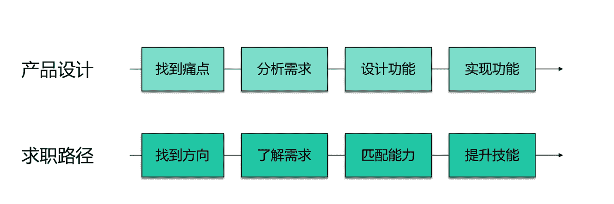

那么对应到我们求职，其实是同样的道理。

第一步，明确自己的目标，去分析对方的需求，我的目标行业他们需要什么样的人才，我的目标公司他们想要什么样的求职者，我目标求职的岗位他需要哪些能力项？

第二步，根据对方的需求，来匹配自己目前的能力项。要做到知己知彼。然后你匹配之后发现，有些是匹配的，但是有些是自己欠缺的。这时，你就要去针对性的准备了。在自己满足的领域保证自己的优势，在自己不满足的领域，要去迅速的补齐。

现在，针对我们的求职，现在是否比较清晰呢？简单来说就是分析需求、匹配能力、提升技能这几三点。那么，我们每一个步骤具体该怎么做呢？我们分别来论述。

# 2、了解对方的需求

### 第一，看行业的发展，看目前整体的发展方向怎么样的。

按照他的发展方向，他未来的一些人才需求是什么样的？

了解一下大方向的发展趋势，过去有很多同学，入职一些公司都是边缘岗位，后来因为整个行业动向的改变，公司业务中心也发生了调整，突然就从边缘岗位变成核心岗位了。

### 第二，看行业中的玩家都有哪些？你准备求职的公司在行业中的排名怎么样？

如果是头部公司，他们可能更需要一些创新业务的岗位，或者具备一些创新能力的人才。如果是中部企业，那他们未来更多的动作可能是对标头部公司的动作，头部公司已有的业务或者岗位也有可能是中部公司未来准备规划的业务或者岗位。

又或者，有一些中部企业，觉得跟头部企业直接竞争比较困难，他准备走差异化竞争的路线，那这个时候，你就要去深入了解一下行业中的运转逻辑，你求职的公司，未来可能有哪些差异化竞争的机会。这些都可能是公司招聘储备人才的方向。

我们拿在线教育领域来举例，我们看一下，在线教育行业，他目前的发展方向是怎么样的？

这张图是我在艾瑞咨询的一些行业报告里找到的，大家也可以去找一些自己感兴趣的报告去看。

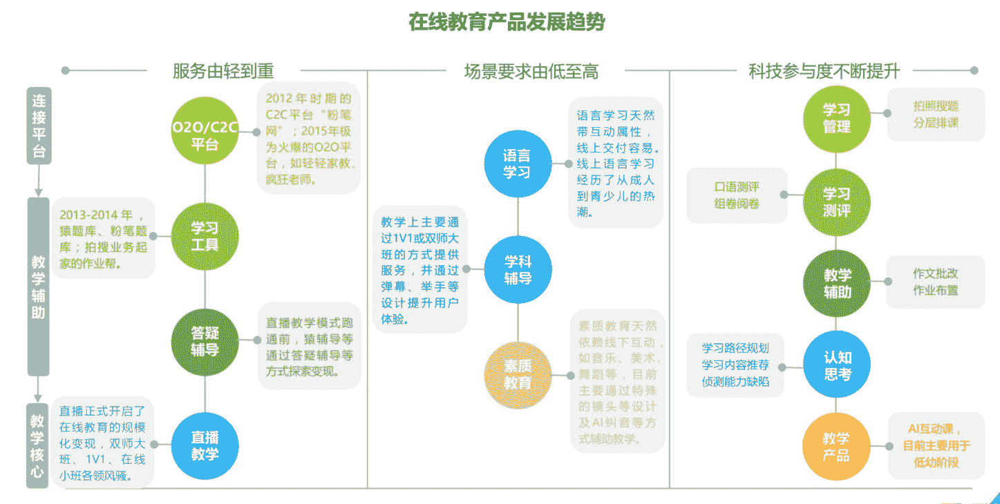

我们看看目前在线教育行业的发展情况，整体的发展方向以及人才需求。

比如在行业早期，行业内的普遍需求是将教育场景线上化，比较典型的就是直播课和录播课。这个时候对人才的需求就是了解在线学习场景，了解视频播放产品和直播型产品。

行业中期，随着业务形态的发展，大班课、双师教学等形式出现，云端教室类型的产品比较热门，对产品经理的要求，是如何增强在线教学场景的互动性。

再到目前，教育行业普遍都在朝着 OMO 方向发展，那是不是要提前了解一下什么是 OMO 呢?这类业务模型对于产品功能的要求又是什么呢？

我们再来看看在线教育行业里面主要的玩家类型，以及每个类型下的头部公司。了解一个领域，就去了解他们中做的最好的那个玩家，一定是最快的学习方法。

我们再看这张图，我们看到传统的线下教育机构比如新东方、好未来，他们在目前在线教育快速发展的环境下，需要去保持他们的头部优势，保持竞争力。他们通过业务扩张和升级、打通产业链，通过自建和投资并购的方式入局在线教育；

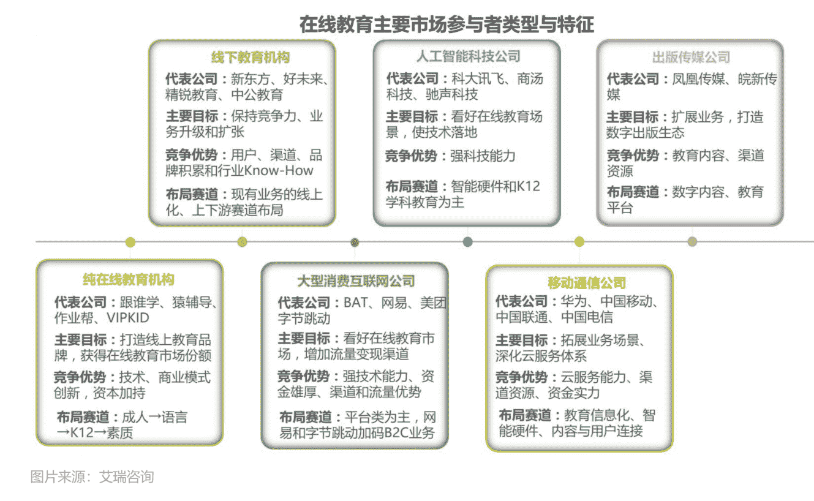

另外纯在线教育企业也不断涌现，比如猿辅导、作业帮等，都在各个细分领域全面开花；BAT、字节跳动等消费互联网公司看好在线教育行业，依托流量和资金优势进入市场；此外，移动通信公司、人工智能科技公司等也借助自身的渠道、流量、科技等优势切入不同领域。

随着一个领域的火热，很多领域的公司可能都会从各个角度来进入这个行业，每个类型的参与者，由于自身的优势不同，角度不同，肯定会围绕着在线教育产生非常多的业务模式，不同的业务模式对我们我们产品经理来说，就是要设计出不同形态的产品来满足业务需求。窥一斑而知全貌，我们一定要做到认知全面。不要说我提到在线教育，大家都知道是网课，头部企业有猿辅导、作业帮。其他的就不清楚了。

最后，看完行业、了解玩家类型之后，你就要看看你所求职的企业在整个行业里面的地位是如何的，他的未来发展方向可能有哪些，这个才是真正会影响到你未来职业发展的事情。

我们通过这种图就能非常清晰的看到，围绕着在线教育行业，从校内到校外，toC 或者 toB，再或者教育赛道不同的领域，基本上都给你列举了相关领域的头部企业，是比上一张更为细致的图，通过这张图基本上都够判断你求职的企业所在的位置，以及对方主要的竞争对手。可以帮助你，更好的去判断，你所求职的企业在行业中的大概的位置。

这是一张产业地图，跟前面两张图都是在艾瑞咨询的报告中截取下来的。网络上有很多类似的分析报告，大多数都是免费的，大家有时间的话也去下载一些看一看。

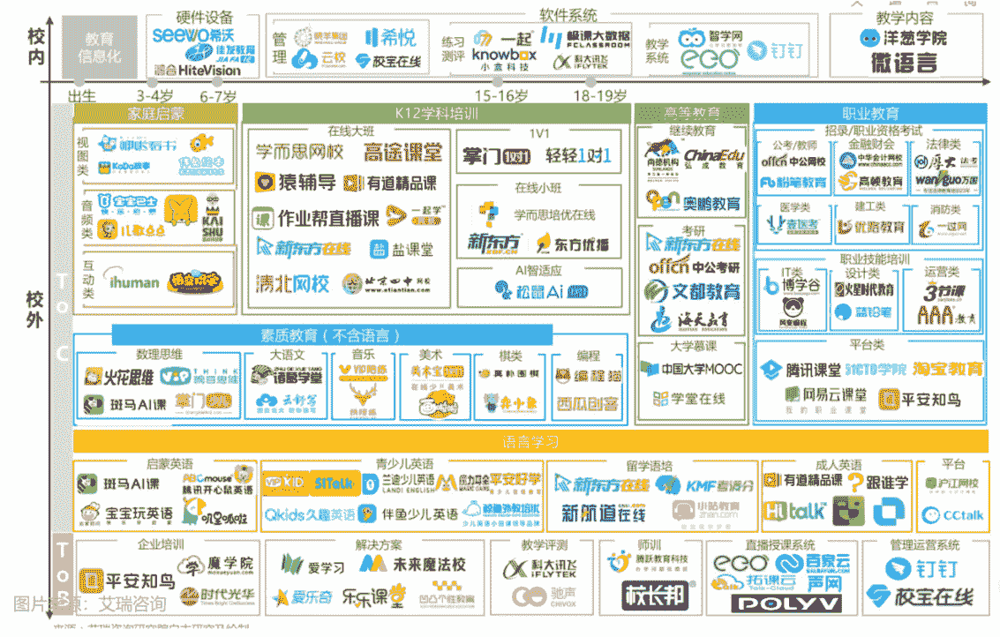

我们通过行业公司宏观的角度分析完人才需求之后，我们再来看看具体的岗位需求。了解岗位需求，这里交给大家一个非常好用的方法，就是去拆解目前求职的岗位 JD。

如何去拆解呢？聊这个话题之前，我们先要明确一下，为什么要去做岗位拆解？ 我觉得一个很重要的点是可以帮助我们快速的了解目标公司岗位职责。很多同学在求职的时候，都会出现一个问题，就是对岗位的不了解，假设真的在面试中，面试官问你“对我们公司有什么了解？”你回答不上来，或者说的很浅显，都是大众知道的一些事情。其实这个是个比较致命的问题啊，对于面试官来讲，你对人家的公司岗位是做什么的都不知道，你怎么证明你是真心的去求职呢？所以通过岗位 JD 来了解对方公司乃至行业的情况是一个很好的切入点。

上文也跟大家提到了，我们求职的过程跟产品设计的过程是类似的。岗位拆解，其实就是一个需求挖掘和分析的过程。我们要首先了解清楚对方的需求，才能做针对性的准备。针对对方真正的一个招聘需求，我们要去尽可能能的去匹配自己的能力项。不足的地方我们也要想办法去弥补。 

那么，我们具体要怎么做岗位拆解呢？我就以增长产品经理这个岗位为例，来带着大家，实际的去拆解一下  。

首先第一步，我们在做岗位拆解之前，要先了解一下，你所求职的岗位在市场的定位是什么样的？（其实就是前面了解公司的过程）

#### 我们拿增长产品经理为例，来看下。

根据公司规模的不同，增长产品经理的职责是不同的。

一般来说，大中型公司会设有独立的增长团队，他们独立于业务之外，不对具体的业务指标负责，主要职责是发现业务的问题，并通过试验的方式找到解决方案。

而中小型公司，增长产品经理的主要职责是以“增长”为目的的功能设计，负责一些与增长相关的功能，例如说签到、分享等功能。例如通过数据分析来确定用户的“关键行为指标”，所谓关键行为指标是指用户发生了这一个行为，对其他行为也会有影响的指标，例如增加签到功能，那么对应的产品日活会提高。

当然，市场上的对增长产品经理的划分也没有这么绝对，只能说这是一个相对普遍的现象。那我们具体来带大家看看，市场对增长产品经理的要求有哪些，不同的企业对增长产品经理的需求有什么不同？

有两份岗位 JD，一个是喜马拉雅（大中型），一个是好食期（中小型）。

先来看喜马拉雅：岗位职责有哪些？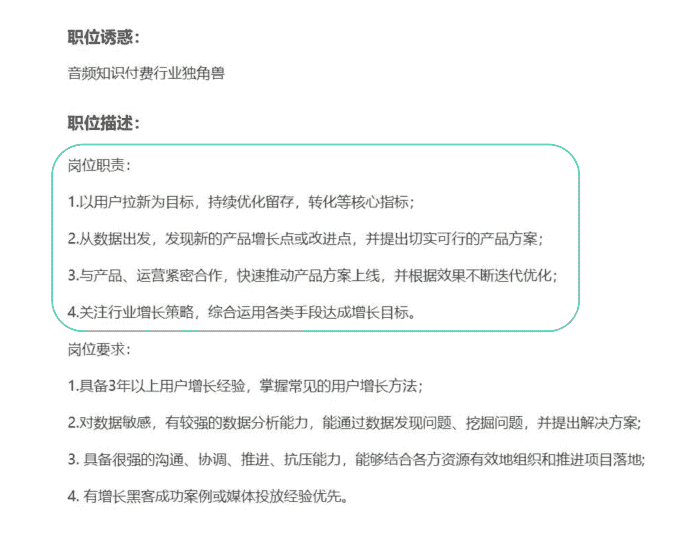

**以用户拉新为目标，持续优化留存、转化等核心指标**

该岗位的核心工作指标就是拉新、留存和转化。相对于普通产品经理的日活、月活，注册等产品指标，更偏向于对业务指标负责。

**从数据出发，发现新的产品增长点或者改进点，并提出切实可行的产品方案**

数据出发：基本的数据分析思维要有，要将你的产品感转化为数据感（我觉得用户会喜欢->通过数据发现用户并不喜欢）

新的产品增长点：可能说明目前产品增长缓慢或者已经停滞，原来的产品增长策略已经达到饱和。需要你创新思考新的策略而不是执行老的方案。（做思考者而不是执行者）

切实可行的方案：思考的策略要能够落地，对产品要切实可行。没有太多的机会给你去试验，更希望你能够直接上手，落地效果好。

**与产品、运营紧密结合，快速推动产品方案上线，并根据效果不断迭代优化**

与产品、运营紧密结合：这一点重点注意，这个就像我们上面提到的，大中型公司，增长产品相对于独立于产品团队之外，重点是挖掘产品的增长点，而基础的产品设计工作都是交给产品经理来的。

但是除了基础产品设计工作之外，如何去协调开发资源，控制版本进度，配合运营投放推广等其他产品经理的工作，还是需要你亲自跟进的。

**关注行业增长策略，综合运用各种手段达成增长目标**

增长是更新换代非常快的一个岗位，当一个增长手段成为行业标配，让用户习以为常的时候。带来的增长效果就微乎其微了（比如说签到）。这个时候就需要你去多关注行业中有没有新的增长手段，或者其他行业里有没有可以借鉴或进一步创新的增长手段。再看看岗位要求是什么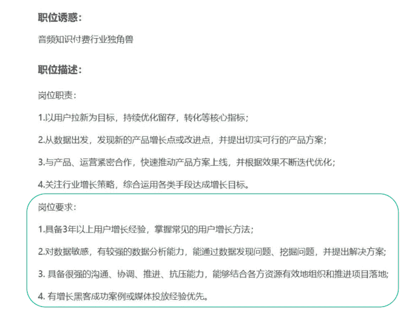

**具备三年以上的用户增长经验，掌握常见的用户增长方法**

三年经验，这个是硬性要求，如果你经验不够，可以找一些 1-3 年要求的。这一点选择自己合适的就可以。

掌握常见的增长方法，也是硬要求，你要做增长但是不懂增长方法基本是没戏的

比如 AARRR 漏斗模型你要知道吧（获客、激活、留存、推荐、变现）

常见的用户激活方法你要知道吧（社交体系、用户激励体系、积分体系、个性化设置等）

用户留存怎么优化：优化产品长期价值还是    提升产品短期价值？

等等很多增长的手段，不说样样精通，你至少都要了解，然后有一两个能得出手的就行

**对数据敏感，有较强的数据分析能力，能够通过数据发现问题，分析问题，并提出解决方案**

这个是增长产品经理的基本能力，主要工作就是通过数据发现问题分析问题解决问题

如何制定北极星指标，如何搭建增长模型，通过增长模型挖掘产品增长的方向，这些都需要数据分析的。

**具备很强的沟通、协调、推进、抗压能力，能够结合各方资源有效地组织和推进项目落地**

沟通，协调，推进项目落地这些，就属于软实力的内容了，这些只要你面试当时表现的还可以就没啥问题了。

不过这里有一个隐藏的点要说明一下。就像刚才提到的，大公司的增长产品一般是独立于业务之外的，所以很多工作都需要跨部门去协调落地的。所以如果你是那种非常内向的，不太善于和人打交道的性格，那也要多考虑考虑。

**有增长黑客成功案例或媒体投放经验优先**

这一点就是考察你的项目能力了，对于过往的产品经验，有没有可以拿得出手的项目？就像这个 JD 的要求，三年工作经验，如果还没有能够拿得出手的项目经历，那么是比较难让企业认可你的。

他还提到了媒体投放的经验，这点就是偏新用户引流的工作。如何制定投放策略，分析投放效果，提升投放转化率，虽然有点偏运营的工作，但是也是增长产品经理应该了解的。然后我们再来看看好食期：岗位职责有哪些？
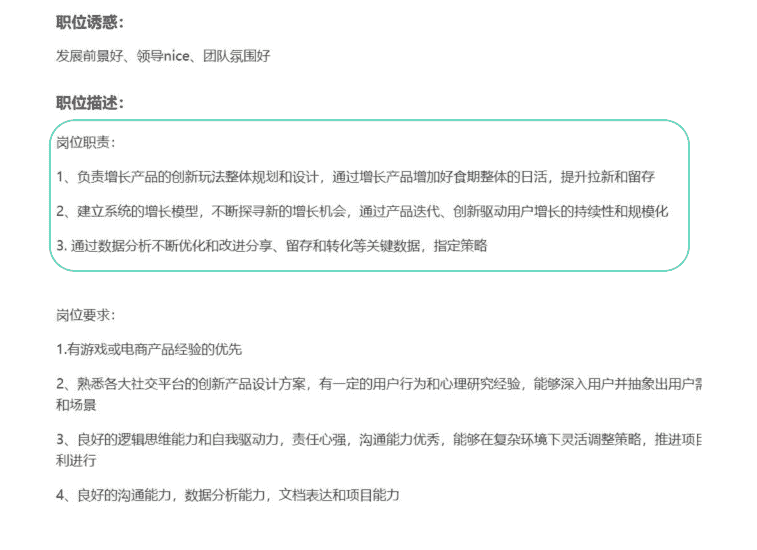

**负责增长产品的创新玩法的整体规划，增加好食期整体日活，提升拉新和留存**

负责增长的整体规划，提升日活、拉新和留存。从他的描述中我们可以看出，中小型公司的增长产品经理的要求是要更高一些的，需要你从产品的整体规划来看产品的增长策略。负责的指标也是以日活为核心，不止是能增长，你还要兼顾用户体验，基础产品经理的工作你也要涉及到。

**建立系统的增长模型，不断寻找新的增长机会，通过产品迭代，创新驱动用户增长的持续性和规模化**

建立系统的增长模型，说明什么，这个公司还没有系统的增长模型在运行，之前只是在做一些单点的增长动作，不成体系。所以就导致他们之前的增长动作很容易达到饱和状态，然后就需要向他说的这样，不断的寻找新的增长机会。当然他自己也意识到了这个问题，所以他的诉求就是希望能够持续性和规模化的驱动用户增长。

而这也是该岗位的核心工作，不是做点单的增长工作，而是系统化的搭建增长体系。相对于大中型公司，显然这样 JD 对求职人才的要求更高了一些。

**通过数据分析不断优化和改进分享、留存、转化等关键数据，制定策略**

数据分析，这个是增长产品经理的基本能力，这里就不再重复了。

再看看岗位要求是什么
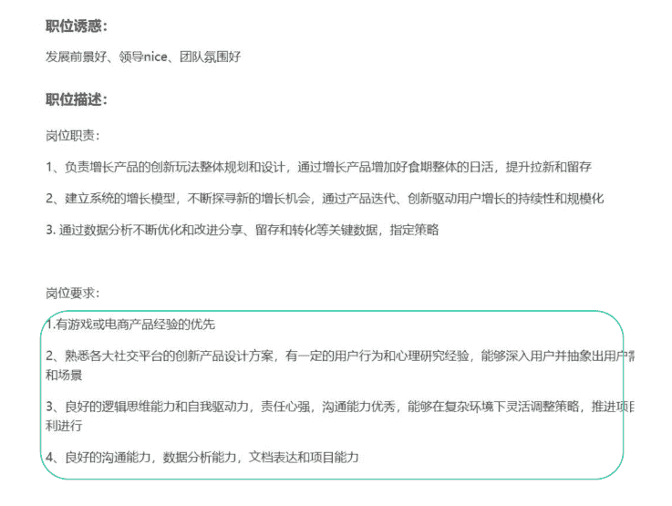 

**有游戏和电商产品经验的优先**

对行业和业务经验背景的要求，这个因公司而异。岗位要求放在第一条，说明这个公司很重视这个因素。所以如果你有相关的经验，可以好好把握。

再多说一句，游戏和电商还有社交这几个产品场景中，是目前运用增长策略最多的产品。如果你想要快速了解一些市场上常见的增长策略，可以有针对性的多体验体验。

**熟悉各大社交平台的创新产品设计方案，有一定的用户行为和心里研究经验，能够深入用户并抽象出用户需求和场景**

上一条提到社交产品运用增长策略比较多，这里就要求你熟悉了。最后一句，能够深入用户并抽象出用户需求场景。这是产品经理最基础的能力要求，无论在哪里都是核心能力。咱们的课程和作业中也多次提到和训练，如果觉得自己还不是很精通，注意这里是精通，那就赶紧再去复习一下。

**良好的逻辑思维能力和自我驱动力，责任心强，沟通能力优秀，能够在复杂环境下灵活调整策略，推进项目顺利进行**

这一条也跟上一个 JD 差不多，都是对软实力的要求，逻辑思维，沟通，协调，项目推进等。这些还是多注意面试的表现。

**良好的沟通能力，数据分析能力，文档表达和项目能力**

沟通，这里又重复了一遍，说明企业对这一点是也很在意。然后数据分析，文档表达，项目推进等，大家对增长产品经理的能力项要求都是非常类似的。所以这些也要关注到，不要觉得我硬实力够好这些就无所谓。增长产品经理更多的是团队作战，如果公司觉得你不能很好的进行团队合作，你的单兵作战能力再强，那也不是优先考虑的对象。

通过上面的 JD 拆解呢，我们可以发现：

处于不同阶段的公司，增长产品经理的职责和地位是有些差别的，但是他们之间还是有很多的共同点。

区别于目前常见的功能产品经理，在大公司中，增长产品经理不对某一个特定产品功能负责，而是专注于改进特定的业务指标。这个业务指标可以在产品生命周期的任何阶段，比如拉新、激活、留存、变现、推荐等整个漏斗。而在中小型公司中，除了上面这些工作，也需要你同步的去对具体的产品功能负责。

不同的组织架构对于增长产品经理而言，在工作开展方面有各自的优劣势。但无论公司是怎样的，市场对增长产品经理的要求都是一致的。

硬技能方面：产品设计、数据分析、增长设计、项目管理等

软技能方面：沟通协调、数据思维、分析问题、总结复盘等

这些呢，就是你求职过程中应该重点去关注的事情！

当我们了解完行业公司和岗位，最后，我们要针对具体的产品看看，分析产品目前的情况如何，对我们求职有什么影响。怎么去分析呢？

我们要去看一下产品的生存状况怎么样，未来的发展方向有哪些可能性？是处在一个上升期，还是处在平稳发展的状态，还是已经有下滑趋势或者有商业困境，变现比较难。不同时期的产品可能对你未来的工作方向的侧重点有所不同。

处在上升期的产品，更多的是去关注获客、留存，提升用户体验等角度。处在成熟期的产品，可能你在设计功能的时候要更多的去关注功能所能带来的商业价值。

比如这个案例，我虚构了一个类似猫眼、淘票票之类的在线购票产品。他整体的业务逻辑就如图所示，是一家以影视资讯分享为核心业务，以电影票和影视周边商品出售为主营业务的，影视内容和商品输出平台。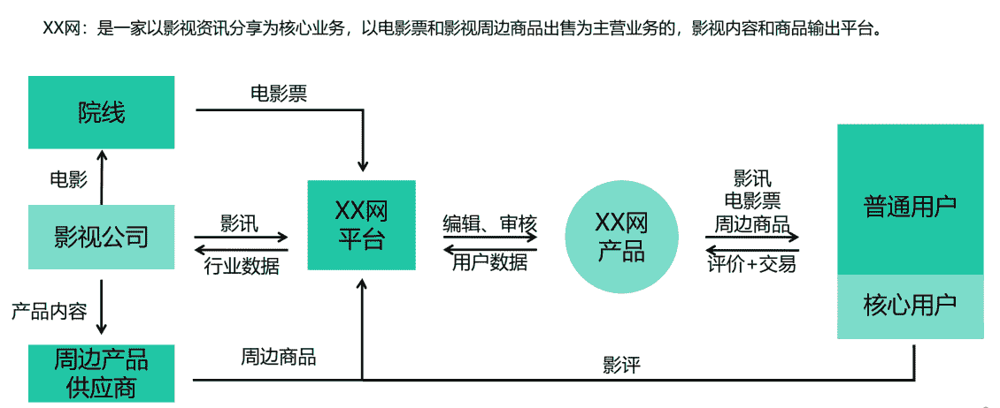

围绕着这张图去分析，这款产品它的整个业务逻辑，每个参与到业务中的角色，他们的核心诉求是什么？他们之间是如何传递信息的等等一些列的问题。通过了解产品的核心业务逻辑去了解产品目前的发展状况。

同样，我们可以通过去梳理产品的功能架构，来具体了解产品的功能结构，以及这些功能背后满足用户的需求和场景。

也可以去梳理产品整个生命周期中，版本迭代的情况，了解他在不同时间阶段，所关注的重点都有哪些，以及为什么。

通过各个维度，各个角度去拆解一款产品，了解他的过去，现在的状况以及未来可能的方向，对于你了解这个公司，这个岗位都会有更深入的理解。

具体怎么拆解产品，其实我们训练营的内容中都会详细的提到，这里我就不过多阐述了。

# 3、匹配自己的能力项

我们通过去分析招聘方的需求，我们可以得到求职的岗位的一些能力要求，那么紧接着还会有些同学有疑问，这么多能力项，我现在时间比较紧张，怎么去有针对性的关注重点呢？或者说，怎么排列优先级呢？还有的同学说，自己之前没有接触过相关的内容，拆解岗位感觉比较乱，不成体系怎么办？

这里，我用一个产品经理的能力模型帮大家具体的来梳理一下，产品经理系统的能力体系，以及对于我们目前新手阶段，我们该怎么去有选择性的去重点关注。这个模型大家在网上也能搜得到，我就是在网上下载的，现在以腾讯产品经理能力模型来举例。

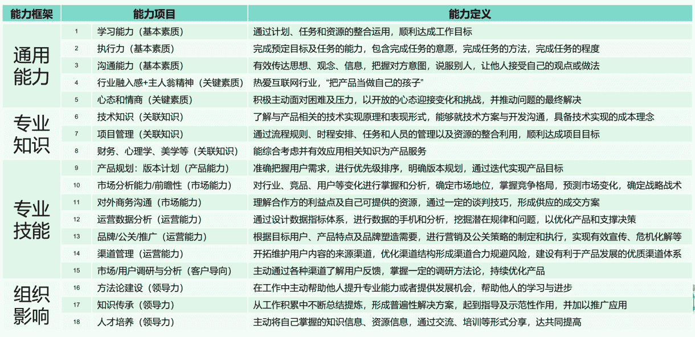

腾讯的产品经理能力框架里面就把产品经理的能力分成四个方面。

### 第一个是通用能力

即你在任何的公司、任何的岗位你都应该具备的能力，比如说学习能力、执行力、沟通能力等等，你这个缺了在任何一家公司都是不可以的，所以这是最基本的要求。 ### 第二个是专业知识

做产品经理需要了解哪些专业知识，比如说你要懂点技术，你要学会做项目管理，学会自己的时间分配，学会质量把控，学会合理的去规避那些因为人力等等原因造成的各种项目进展的风险。 

其他知识方面还有财务、心理学、美学、办公技能等等，也都是一些相关的要求，所以这个叫专业知识的部分。他需要你去了解去理解，但是未必要求你在这方面一定要具备很专业的能力，因为往往这些方面都有你相关的同事会跟你去搭档，他们帮你做这方面的弥补。

### 第三个是专业技能

专业技能这个其实就是我们常说的产品经理需要具备的一些能力，这里面主要有一些产品规划、市场分析、数据分析、市场、用户等方面技能。这方面都是需要产品经理本身要掌握的一些基础的职业技能。

### 第四个是组织影响力

这需要大家能够学会怎么去学习，学会带人，学会沉淀，学会去做领导力的培养，学会进行知识和人才的传承和培养。所以这一块会要求比较高一些，我们作为新手或者初期的产品同学来讲，可以先不用太关注这块，但是如果你要往上发展的更好的话，也希望大家在这一块有意识的去做一些积累。 

如何匹配？很简单，就是我们每一块去拿着自己的实际情况去做一项一项的对比。

比如通用能力方面，我如果要做产品经理的话，我的学习能力要求很强，每一天都要学习更多新鲜的知识，那么在这方面，我是有优势可以展现出来，还是说这块是我当前不足的地方需要去弥补。

当然其他的执行力、沟通力、融入感、心态情商等等，这都是你自己需要去努力的地方。具体怎么提升这里就不提了，这个就是你日常的积累，养成良好的工作习惯，有坚韧的毅力，对行业充满了感情，充满了热情，然后能够很好地去投入，所以这是一个基本的要求。

那么专业知识方面其实是可以结合你过去的经历来看一看自己是否跟这些有关系，比如说我是计算机专业背景的，我之前在学校里做过项目管理的，我之前兼职做过设计的，我之前有做用户调研的经验的，或者我学习的其他专业：财务、行政管理、人力管理等等，它总会在这些方面有一些匹配。 

你需要做一件事情就是去做能力的迁移，这个迁移是蛮重要的。我有个好朋友，本身是学心理学专业的。但是当年在学校学习不是太好，毕业求职的时候一直很不顺利。结果巧的是当时某个互联网大厂招聘产品经理写心理学专业优先，我那个朋友，抱着死马当活马医的态度去试了试，结果真的成功了。要知道在同届入职的人里面，他的学历是最低的。所以，某些时候，专业能力带来的加分效应还是很明显的，也希望大家能够有意识的去锻炼和培养，这些方面是可以通过实践、思考、总结、跟别人去交流等等这些方式来得到和锻炼的。

还有专业技能方面，这是产品经理的专业技能，也是产品岗位最基本的能力。考核一个产品经理是否合格往往也是主要看这些方面。这方面就不多说了，百度一下就会有很多的学习方法。

接下来我们来看一下，我匹配完了之后是这样子的。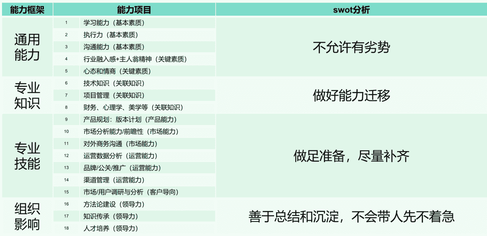

第一个通用能力方面，不允许大家有劣势。这方面的能力，希望你能够很好的去锻炼自己，如果一个产品经理在这几个方面都做得不够好的话，我觉得就算你真的去做产品经理，也不会走的特别长久的。 

尤其你也知道现在的团队里面，比如说你会面临有 60 后的老板，70 后的老板，80 后的领导。我们这个课程的受众应该普遍都是 00 后，可能还有些 98、99 年等 90 年代最后几年出生的同学。你们要看看自己是否和他们有代沟，和不同年龄段的同学交流是需要不同的方法的，要你有很好的心态，很好的情商。

同时，产品经理这个岗位，是一个贯穿产品设计全流程的岗位，前期从业务方搜集需求，到跟同事沟通需求，到跟进设计、开发、上线，以及之后和运营同事制定运营策略等等，需要打交道的人是非常多的。那如果你是一个比较内向的人，是一个跟别人说话都会脸红的同学的话，这个肯定是不行的。

那么专业知识方面，我刚才说做能力迁移，这个已经应该能理解了。

专业技能方面做足准备，尽量补齐，补齐的方式有很多，至于怎么做，希望你们能好好的思考一下。最后也希望大家能够早一点去总结和沉淀。

# 4、针对性的去做准备

最后一步：当我们了解了对方的需求，梳理完所需要的能力项之后，我该如何具体的去针对性的去提升和准备呢，或者说，我怎么把这些能力、经验在简历里面体现出来呢。

其实，我在过去辅导了很多同学去求职，我也大概总结了一些。其实大家求职通过率低的原因普遍就是两个原因：能力不足和经验不够。所以，针对这两个方面，我们该怎么去做些准备？

经验不够对于校招的同学是普遍存在的问题。换个角度来讲，正因为是普遍存在的问题，所以，企业方对你的经验要求不是非常严格，更多的是考察你的综合能力。不过，反过来看，在普遍大多数人没有经验的基础上，如果你有相关经验的话，反而效果会出乎意料的好，相对于其他人的竞争力也是非常大的。所以，校招的同学，具体怎么去积累自己的经验？

排在第一选项的一定是：实习！为什么实习如此重要？给大家介绍几个真实情况

    第一，校招中筛选简历，其中一个最重要的标准就是实习经历。就以目前互联网行业产品经理岗位校招情况来看，相关经验一定是因影响你求职成功率的最重要的一个因素。

    第二，在校招普遍的群体面试中，实习中的积累的方法论和处理问题的思路能够让你瞬间脱颖而出

    第三，专业面试中，实习中积累的项目经历、学习到的方法论知识点，都是面试官重点考察的地方

    第四，HR 面试中，能够展示出你对互联网行业的热爱与热情，以及能够立刻上手工作 

所以说，在产品经理校招求职中，最有效、最直接的方法就是积累实习和实践经验！

**那有的同学说，我没有时间去实习怎么办？**这里呢，还有一个方法交给大家：

你在学校里，去尝试做一些互联网相关的项目。

比如每个学校都会有一些创新创业的项目申请名额，门槛也不是很高，一般你有个比较靠谱的想法都能够申请，然后用学校给的项目资金开展实践你的想法，这也是一个非常好的实践的经历。同样的你也可以去参加一些创新创业的比赛，比如挑战杯、创青春、各种创赛等等，都可以为你的实践经历加分。

一个好的项目完全可以起到跟实习同样的效果，甚至更好的效果。

**那还有同学说，我现在已经大四/研二了，来不及去准备实习或者搞项目了怎么办？**

也有办法，既然你准备入行互联网行业，那么肯定了解了很多互联网行业的信息了。很多关于产品、运营的相关社区、平台等都会有很多人分享自己的文章和看法。你可以按照同样的方式或者逻辑，自己去尝试调研一些产品，自己去尝试写一些产品的调研分析报告，试着谈谈自己的想法。

内容沉淀在公开平台或者自己的文档里都可以。这样也是一个去锻炼以及积累自己分析拆解产品能力的方式。 

对于校招的同学来说，你要相信，企业对你们的的普遍期待不会有太大的差距。所以，在求职过程中，你只要比别人多做出这么一些准备，成功率就会大大提高。

以上这些，是站在弥补相关经验的角度上。其实，通过上面这些手段也都是提升个人产品能力的渠道，实践是最好的老师。

当然对于我们目前的同学来说，只实践是远远不够的，还需要同步到去学习一些理论知识，把基础知识打牢才能更好的去实践。

**理论知识怎么学？**有几个渠道：

### 社区社群媒体：

现在互联网上，存在着大量的学习、交流的社区和平台，比如人人都是产品经理、比如牛客网、比如 36 氪等等。这些平台都会有一些产品经理的圈子和论坛。经常去泡一泡，看看一些有经验的大佬写的文章，也都是会有收获的。同时也可以加一些产品经理的交流社群，多跟人家请教学习，产品经理从业者普遍都是比较喜欢分享的人群。说不定你还可以通过社群积累一些关系和人脉。万一哪个产品经理需要招个小朋友，又恰好想到了你，这不机会就来了嘛！

### 原型绘制工具：

第二，对于产品经理基础的工具技能一定要掌握扎实，比如说原型绘制，你就需要掌握的工具就是 axure 或者墨刀。墨刀上手比较快一点，界面操作也比较简单。axure 功能更为丰富一点，也更专业，熟练掌握之后，一些其他到图也能够轻松绘制。

关于原型绘制呢，网络上也有很多免费的课程，大家可以去搜索学习一下。不过，这里给些个人建议，对于初级产品经理来说，对于原型绘制的要求没有非常高，如果你的时间实在是比较紧张的话，可以先不着急系统的去学习。

交给大家一个快速上手的方法，就是去网上找一些原型模板，自己去模仿操作一些，一个下午基本上就能够上手了。

### 产品经理基本工具：

另外，除了原型绘制，还有一些产品经理的基本工作工具，比如需求文档、流程图、逻辑图等，这些基本工具基础，大家也要同步的去打好基础。

最后，如果你自己实在觉得自己学习起来比较费劲，总是找不到正确的学习方法。那么也建议大家去网上找一些相关的课程去系统的学习一下吧。系统的学习永远是效率最高的成长方法。市场上各类产品经理课程也比较多样，能够满足大部分人的学习需求了。