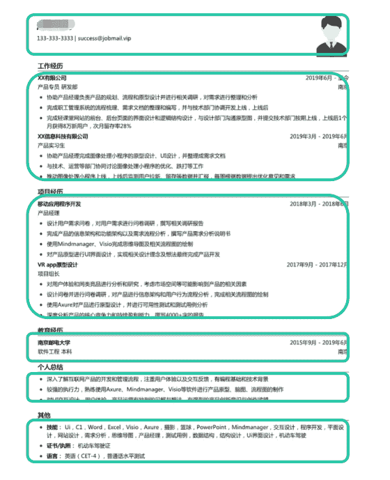
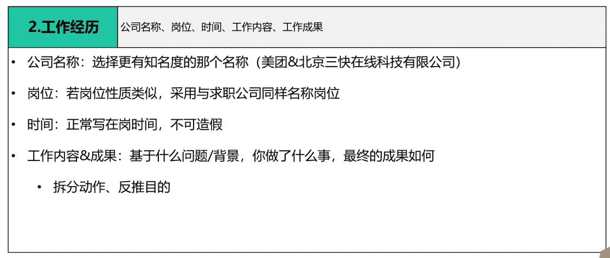
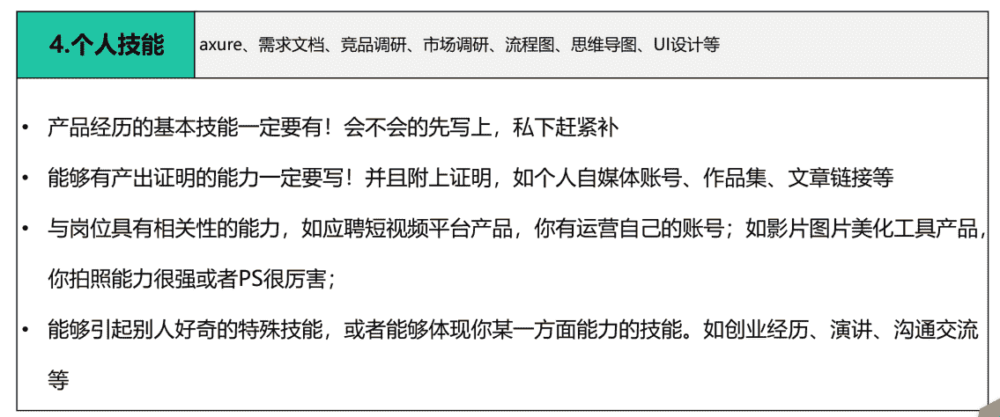
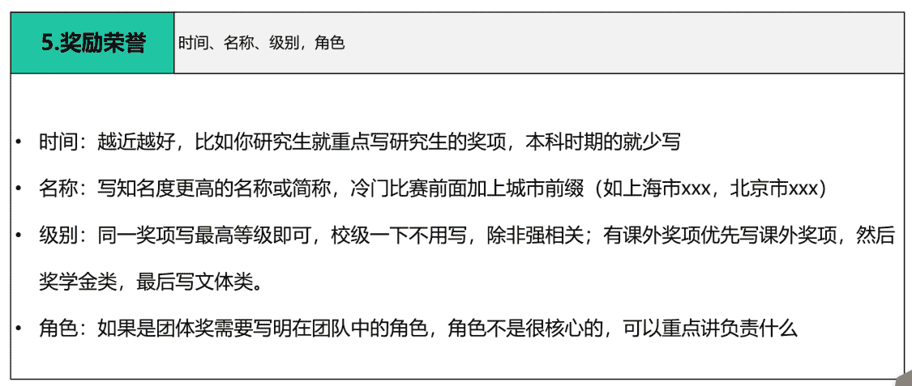
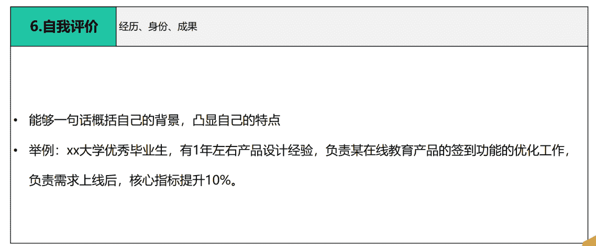
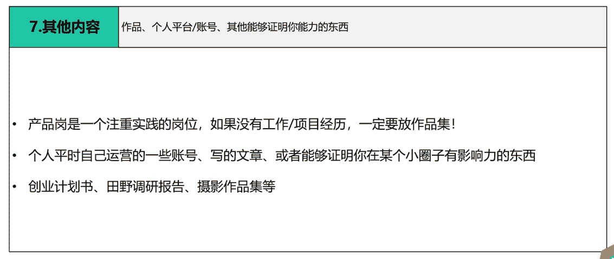
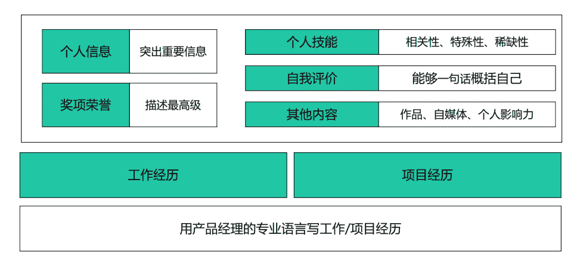

# 第三章 第 3 节 手把手教你写一份实用产品经理简历

> 原文：[`www.nowcoder.com/tutorial/10073/7af144f69abe4b30acb338e8eee6de95`](https://www.nowcoder.com/tutorial/10073/7af144f69abe4b30acb338e8eee6de95)

好的，经过我们前面一系列的准备工作之后呢，我们终于来到具体的实战环节，如何撰写简历！

# 1、简历的形式

你知道简历的呈现形式都有哪些吗？

虽然简历的内容是一模一样的，但是简历的形式，在不同的场景下，也会有不同的呈现形式。

常见的简历形式，我大概列举了四类：系统在线版、附件文档版、在线文档版、特殊作品版。

## 1.1 系统在线版：

这个就是我们常见的，需要我们手动输入某些系统内的简历。比如说各个公司官网的招聘系统/网申系统，还有各个招聘平台的在线简历等等。

这类简历的特点，就是格式标准、模块统一，方便招聘方进行筛选及内部传递。对我们来说，填写完一份之后，可以同时投递多家或者多个岗位，投递效率非常高。

同样缺点也非常明显，标准化的格式就会掩盖掉自己的特色，很容易被一些条件因素筛选掉。

## 1.2 附件文档版

即我们常见的 PDF 或者 word 的版本，附件文档版建议大家无论如何都要准备一份。在附件简历里，是可以完全随着自己的心意去创作的，可以不受限于标准的简历格式。比如说作品集、链接或者其他想要呈现的东西，都是可以通过这个实现的。

目前来说，有些招聘网站是同时支持在线和附件两类简历上传的，比如 boss 和拉勾，而像企业的网申系统，现在很少有附件简历的入口，即使有，也是需要你同步上传一份在线简历的。

所以，这里给大家一个建议。尽量把附件简历做好，能发附件简历的场景，尽量发附件简历

## 1.3 在线文档版

通常是求职者通过腾讯文档、石墨文档等在线文档的形式来撰写简历，然后发送链接给到招聘方。这个一般场景是你和招聘方需要有直接的联系渠道，比如说微信，不然这个场景是比较鸡肋的，不建议大家选择。

## 1.4 特殊作品版

可能大家不太能理解，什么是特殊作品版。给大家举个例子：比如说你应聘产品经理岗位，你用 axure 做一个动态简历原型，可以从侧面体现出你的原型绘制水平。当然，这里肯定是要求你技术比较好啊，如果你原型绘制的比较烂，那你还是老老实实的的写附件简历吧。再比如有个同学求职设计师的岗位，他就用 PS 或者 AI 做了一份简历，这都是不错的。就像我，当年求职的时候，做了一份在线 H5 的简历，从初面到终面，每一个面试官都会感叹一下挺有趣的，并且还会问我是如何做的。留下了比较不错的印象。

不过，这种形式的简历跟在线文档差不多，都是在线展示的形式，比较依赖线上的直接沟通渠道，所以使用的场景不是很多。不过，对于特殊版本的简历，是可以做个链接放在附件文档简历里面的。

这里，就可以看出来附件简历的强大，任何你想表现的内容，做成在线的形式，直接附在文档内就可以了。所以，我们接下来讲简历的撰写，主要就是以附件文档版为例子了。

# 2、模板的选择

既然谈到附件文档简历，那么我们就要知道，产品经理的简历的整体形式，以及简历的主要内容。

关于附件简历，大家肯定见过各种各样的模板，没有非常特殊的要求，大家选择自己喜欢的就可以。给大家一个小建议呢，就是不要太过花哨，简洁明了是最好的。

这张简历，我是从某个在线简历网站上找到的，产品经理简历模板，包括一些个人信息、工作经历。对于我们来说最重要的就是实习经历，其次是项目经历、学历背景、个人总结和其他。该有的信息基本上都包含了，在我看来已经不错了。

但是，也会有些同学会有疑问，产品经历的简历，内容就只有这么多嘛？每个模块的重要程度是怎么样的呢？具体该怎么写呢？

不要着急，接下来，就针对产品经理简历的每个模块给大家做个详细的讲解。

# 3、简历内容填充

## 3.1 个人信息

首先第一个模块，就是个人信息。主要就是指姓名、电话、邮箱、学校、学历、专业等这些信息。

对于个人信息，你要知道，面试官想要通过你的个人信息了解什么以及做什么？

比如说，姓名、电话、邮箱，这些信息是为了认识你和联系你，以及后续邀请你面试或者发放 offer，给你发邮件，这些必须要包含的因素。还真见过很多同学不放邮箱的，有些 HR 人美心善，主动给你打个电话要，有些就懒得跟你要了。

然后学校、学历和专业。这点特殊说明一下，如果你是比较知名的学校、或者学历比较不错，再或者是对方要求的对口专业，这几种情况，把个人信息写在简历最上方的位置，重点突出。那如果不是，就把个人信息放在项目经历后面，弱化因为背景不强对你的影响。就像上面我们看到的这个简历模板。大家可以返回去再看看。

个人信息中的这六个内容基本上就是招聘方会特别关注的，其他的一些信息，其实都是可以不需要的。比如之前看到很多同学喜欢把自己的主修课程放在个人信息中，这里我说明一下，完全没有必要。我们放主修课程的主要原因无非就是让对方知道，我们有一些专业相关的能力，这里去体现你的专业相关性的思路是对的，但是，不需要通过主修课程来体现。

一般来说，对于专业相关性有要求的岗位或公司，他们设置的限制不会是你学过什么课程，而是直接限制你所学的专业。不知道大家能不能理解，举个例子：比如某个公司招聘，要求必须是计算机专业的，那么如果你是经济学专业，但是公共课学过 C 语言或者其他编程语言，这是压根没有任何作用的。企业方限制的是你的专业而不是你有没有学过哪个课程，这一点大家一定要明确。所以回到简历上，主修课程这类内容是完全没有必要的。

还有一类信息，有些同学会写上自己的专业排名或者绩点。这个也跟大家明确一下，绩点也是没有必要写的，不同学校对绩点的标准是不一样的，有些学校满绩点是 4，有些学校是 5。招聘方是没法拿你和其他学校的同学做横向对比的。不过，不写绩点可以写排名，排名是前 5%之前的可以写，超过 5%的话就没有什么意义了。排名有两类，绩点排名和综合排名，综合排名就是指加上一些活动分啊、比赛分之类的。就一个原则，哪个排名靠前写哪个。

除此之外，其他的信息比如性别、籍贯啥的都没有必要写，除非非常非常特殊的情况，比如某个岗位有性别要求，或者某个非一线城市的岗位所在的城市恰好是你老家，这种可以体现稳定性的信息，可以在简历中写一下。其它情况，就真的没有必要了。

## 1.2 工作经历

工作经历或者对于我们校招的同学来说就是实习经历，这块比较简单，就是四个因素。公司名称、岗位、时间和工作内容，工作内容里面包括内容和成果。核心就是告诉招聘方，你在哪个公司什么时间担任什么岗位，干了什么事，以及结果如何。

**这里有几个点需要特别注意的：**

*   首先是公司名称：这个一定不要傻傻的写你签订实习合同的公司名称，而是选择该公司在市场上更有知名度的名称或者代称。跟大家讲个故事，之前我的团队要招聘一个产品经历，然后我拿到简历一看北京三快在线科技有限公司，这家其实就是美团的公司名称。但是我当一时没反应过来，还以为是某个小创业公司。因为平时我们为了交流方便，都是美团美团的称呼，用得着公司正式名称的机会其实不多，除非是跟这家公司签合同之类的场合才会关注。

这种情况经常出现的，比如我跟大家讲几个名称，大家看看自己是否知道是哪家公司？比如：

上海寻梦信息技术有限公司

上海钧正网络科技有限公司

北京微梦创科网络技术有限公司

这几个公司，大家都知道是哪个吗？

所以，如果你过去实习的公司是一个比较知名的公司，尽量的去写更具有知名度的名称或者在公司名称后面加个括号标注一下。不然，就可能会造成像我一样的乌龙事件。

*   第二点，是岗位名称。不同的公司对同一个岗位的叫法可能不一样，这个是比较常见的问题。比如说产品经理在某些公司可能叫做产品策划，有些公司叫做需求分析师；也有些公司在招一些初级岗位的时候，不会分的很细，统一叫产品运营，但是其实你也做产品经理的工作。各种各样的情况。

这种情况下，你需要自己判断，如果岗位的性质差不多是一致的，可以去简历上标注一下，比如在岗位后面加个括号写上与求职公司岗位相同的岗位名称。

有些同学就问了，为什么要一定这么写，是不是有些投机取巧的感觉？这一点，其实在前面讲解简历的筛选的时候就跟大家说过，校招的简历，大概率不会被仔细看的，如果你没有突出关键词吸引眼球，那么大概率就被略过了。这还是人工，如果遇到系统筛选，那他怎么筛选？机器是不可能理解你的内容表达的意思的，他只能去根据关键词筛选，有就通过，没有就不通过。就是这么简单。所以，这一点大家一定要注意，能用通用名称的就用通用名称，能用专业名词的一定用专业名称。

这里说的是岗位，到后面的工作内容更应该注意这个问题。

*   第三点，就是工作时间。就正常写你在岗时间就好了。不要去造假，这个是诚信问题，被发现了对你的影响肯定是弊大于利的。

*   最后就是工作内容和成果：这个标准很简单，就是讲明白你基于什么问题或者背景，然后做了什么事，最终的成果是怎么样的就好了。可能有些同学又出现问题了，我按照这个框架可能写不出来？因为我过去工作没有去想过背景什么的，也没有去解决什么问题，就是单纯的执行领导布置的任务，这个怎么办呢？

那这样，交给大家一个方法。其实就是拆分动作反推目的。这个怎么理解呢，给大家举个例子：

比如有个同学，他在某个公司做新媒体的实习生。他的日常工作就是每天发一篇公众号推文，就这么简单。那对于这位同学这个情况那我们该怎么在简历上呈现呢？

这个时候，我们就要先去拆分他的工作内容。公众号发文也不是说发就发的，总会有一些准备工作。我们要看，围绕公众号发文这项工作，他都做了哪些？

**我能想到的第一个就是选题，你总得有个主题不是吗？那这个主题该如何去选择呢？**

第一是否要考虑到这个账号下的一些用户的属性？要考虑目前用户群体对你主题的接受程度，才能提高阅读量。

第二是否要去参考一些热点的话题？怎么去找热点话题呢？可以通过一些第三方的统计平台，也可以通过竞争对手的公众号去找一些热点话题。

并且，通过竞争对手的公众号找话题是不是也需要分析竞品账号的数据。看一看竞品发哪些内容阅读量高，哪些内容点赞量高，这些都是需要做数据分析的。

**这是选题的角度，选完主题就是写内容。内容方面从内容框架、到语言逻辑、再到分段规则都需要去考虑。你的内容是三行一段还是五行一段都是会影响到用户的阅读体验的。**

所以，刚才讲到所有的东西，其实都是我们基于最初的一个动作来一步一步的拆分的，这就是我们讲的拆分动作。

然后还有一步反推目的，这个怎么理解呢？同样的，你反问自己，刚才我们费了这么大的功夫去研究选题是为了什么？更好的标题可能更容易吸引用户点击，更能提高我们的阅读量，这就是我们研究选题的目的。

这就是**拆分动作和反推目的**，通过这样拆解梳理完之后，你写的工作内容就会更容易让面试官接受。

## 1.3 项目经历

项目经历跟实习经历撰写的逻辑是类似的，主要也是分为项目背景、担任的角色，还有具体的项目工作内容和成果，这几项组成

我们分别来看一下：

首先项目背景这里需要特别说明一下，因为我们很多同学在学校可能都做过各种各样的项目，有些是比赛、有些是学业要求，也有些是老师安排的，各种原因都有。那么，需要大家去明确一个观点，就是将“被动变为主动”。什么意思呢？就是说你做这个项目是为了解决某个问题的，是有主观目的的。而不是说是你接到某某任务，或者说学校强制安排等等。

**为什么要这么写呢？**

*   第一，你首先要表现出你去主动挖掘问题解决问题的能力。其实面试官对于你的项目做的怎么样，或者成果怎么样，关注的不是很多的，除非是非常相关的项目，不然他们重点关注的是你在做这个项目过程中处理问题的思虑和方法。这些能力放在任何一个工作岗位都是通用的并且非常重要的能力。
*   第二，你在以这个逻辑去写的时候，同时也是帮你去梳理认知这个项目的过程，将你过去所做的一些工作去赋予目的和意义。事出有因，事毕有果就是这个道理。跟前面工作内容的撰写是一样的道理。
*   第三，是你在项目中的角色，就一个原则，如果你是核心团队成员，那你就写上，如果不是，那就没必要写，写好你自己的内容更重要一点，让面试官的重点都关注内容就好了。
*   第四，是内容成果，这个跟工作经历类似，基于什么问题或者背景，做了什么事，最终的成果如何。这里再特别说一下，对于有些没有成果或者成果比较难体现的项目，可以根据你的简历篇幅，适当写一些收获或者感悟也是可以的。当然，这是基于你简历确实没有什么内容可以写了，如果还有的写，就不要写这些比较虚的东西。

## 1.4 个人技能

个人技能主要包含了哪些内容呢？比如说我们经常常见的原型绘制、需求文档、竞品调研，流程思维导 UI 设计等等，这是产品经理岗位重点关注的内容。另外还有一些通用的像 office 这类通用能力。关于个人能力的撰写，这里有几个特别的点跟大家重点介绍一下。

首先，产品经理的基本技能是一定要有的，就是我们刚才说到的原型绘制和需求文档、竞品调研，市场调研，这些能力都是产品经理的一些基本技能。如果这些东西你不会，那是肯定 100%找不到产品经理的工作的，所以这一块一定要去写上，一定要学会。

那有些同学说可能之前没有接触过怎么办？这边就告诉你们，会不会的先不管一定要先写上！

为什么要先写上？因为你面试的时候大概率不会现场给你考察这些技能的能力，所以你先写上然后去投递简历，然后同时赶紧去补充这些能力。那么一般情况下呢，只要你在正式入职之前，把这些能力至少基本上能学会，那应该是来得及的。

第二，能够有产出证明的能力一定要写。这个怎么理解呢？就比如说我们刚才提到的需求文档，如果你觉得自己写文档的能力比较强，或者之前也写过类似的文档，那你完全可以把你写过的这些需求文档的链接，如果有敏感的成分你就进行脱敏，然后把它做成一个在线的链接附在简历上对吧？这难道不好吗？

或者你比较擅长竞品调研，那也可以把做过的一些调研报告放上去。擅长画原型，就把原型链接放上去。或者说你之前自己做过一些自媒体的账号，或者说你有一些其他发布过的文章都可以放上去，对这些都是能够证明你相关能力的证明，这些一定要附上的。

第三，是与岗位具有相关性的能力，比如说你去应聘短视频平台的一个产品岗，这个时候如果你有运营自己的账号的话，这个就是非常好的切入点，一定要把自己的账号写上去。

假如你去应聘的那种图片美化工具的产品比如说**相机，这个时候如果有很强的拍照能力，或者说有很强的 ps 的一些能力，这些都是非常具有相关性的能力，也是比较让企业方认可的能力，这些能力的展示对你是比较有优势的。

最后，可能有些同学说上面的几项我可能都不是很擅长怎么办？

那你思考一下你有没有能够引起别人好奇的一些特殊的技能，或者说能够体现你某一方面的一些技能。比如说在学校里有过创业经历？打过创业比赛，写过创业计划书，也可以展示到附件不是吗？在学校里有参加过演讲比赛，这也是你的特殊能力。你可能沟通交流能力比较好，这些都是你的特殊能力，也是可以写上去的。

## 1.5 奖励荣誉

接下来是奖项和荣誉，这一项就比较简单，大概写一下你获奖的时间、奖项的名称、级别，以及担任了什么角色就 OK 了。

首先，时间，有个原则就是越接近越好，比如说你现在是研究生，那些重点写研究生的奖项，本科时期的就少写，那你如果研究生实在是没有，那就再写本科时期的。

奖项的名称这个跟我们之前写工作经历类似，就是写你知名度更高的名称或者简称。还有就是如果我们有一些冷门的比赛，那我们在比赛名称前面尽量加上一些城市的前缀。比如说上海市某某比赛，那北京市某某比赛，加上城市的前缀会显得你这个比赛含金量高一点。

其次，级别，同一个奖项，我们只写最高等级的就可以了，校级比赛以下的内容也不用写了

因为校级比赛在你的求职中其实起到的作用并不是很大，而且没人去关注校级以下的这种奖项。除非这个奖项是非常强相关的可以写上。

另外，所有的奖项中，对于产品经理这个角色，课外奖项高于奖学金，奖学金高于文体类奖项。

最后，是你在这个奖项中担任的角色。有些同学的奖项是团体奖，那你就要在奖项中写出来你在团队中担任的角色。还是同样道理，如果你是什么队长副队长之类的核心角色，你就写上；如果你的角色不是非常核心的，就不要写，就重点讲一讲你主要负责什么就好啦。

## 1.6 自我评价

其实也是非常简单的，写一写自己的经历、身份、曾获得过的一些成果，总结一下就 OK 啦。前面的内容我们也提到，一份好的简历标准就是能够一句话概括你自己的背景，凸显出你的特点。可以 给大家举个例子，比如说，“某某大学优秀毕业生，有一年左右的产品设计经验，负责某在线教育产品的一个签到功能的优化工作，负责的需求上线后核心的指标提升了 10%。”这么一句话大概也就 20 左右个字，把你过去的一些荣誉、经验、成果等全部都包含了，这就是一个非常好的一个自我评价，简洁明了能够让人一眼就能记住你。

## 1.7 其他内容

最后一个模块我通称为其他内容，其他内容主要有哪些呢？主要是前面我们提到的，如果你有一些个人的作品，个人的一些自媒体的平台，或者账号，或者说有其他能够证明你能力的东西，我们统一都放在这里。

第一，其实产品岗是一个非常注重实践的岗位，如果你过去没有相关工作或者项目的经历，那你就一定要附作品集，作品集是非常非常重要的。

第二，就是你个人平时运营的一些账号，写的文章，或者能够证明你在某个小圈子里有影响力的东西。为什么说某个小圈子？这里要特别强调一下，我说的这个小圈子，其实不一定是跟产品相关的小圈子，有可能是一些其他领域的，但是能够证明你有影响力的圈子。比如说你个人比较喜欢美食，平时自己会做一个美食博主，分享一些关于美食的一些视频，或者是文章等等，在某个平台积累到了十几万的一个粉丝体量，这就是一个非常能够证明你的能力，证明你个人影响力的一个渠道或者圈子。

第三，还有我们刚才提到了一些，比如说你在过去有过一些创业的经验，写过创业计划书；或者你在过去做过一些社会调研田野调研，写过一些调研报告；再或者你对摄影感兴趣，过去有一些成套的摄影集；或者对拍视频感兴趣，有做过一些视频账号等等之类的。这些都是完全可以的，都是能够证明你某些特殊能力的，这些都可以统称作品集，把它们放在简历里面是完全可以的。

以上其实就是把简历的每一个模块都拆开了、揉碎了，每一个模块都需要注意的问题。

最后，我们写出一份完整的简历还是要把几个模块组合到一起的。这就涉及到一个问题，也就是说我们前面的 7 个模块，在我们简历中，它们的重要程度是怎么样的？

大家看这张图，我们只看有颜色的部分，有颜色的部分，其实就是代表了我们每个模块在简历中的一个重要程度。

很容易能够看出来，我们工作经历和项目经历在简历中的一个重要程度是最高的，所以他也是最大的，这里也给大家的一个提示，工作经历或者项目经历一定要用产品经理的专业语言来写，这一点在后面详细的论述。

其次，比工作经历和项目经历重要程度弱一点，就是个人信息跟你的奖项荣誉。个人信息突出重要的信息就可以了，奖项荣誉去描述你的最高级的奖项就 OK。

最后是个人技能、自我评价和其他内容，这些只要按照我们刚才的一个格式去填写就 OK 了。

回到刚才跟大家特别说明的工作经历和项目经历的内容怎么写，尤其是跟产品无关的经历。

这里，大家需要调整思维：

**思考一下，你过去的经历对你目前成为产品经历有什么帮助，有哪些能力是可以复用的？还有一个角度是，你目前学习完产品经理的课程后，站在产品经理的角度，你是怎么看过去的工作的。**思维是很重要的，举个例子，就像我们刚才提到的，岗位 JD 拆解，就是一个需求分析的过程。撰写简历就是根据需求设计产品的过程。这样大家是不是比较好理解了。这里的需求分析、产品设计等内容，你完全可以套用到自己过去的经历中。

经过上面的例子大家应该能感觉到，放在简历上的内容，其实就是一次把你过去经历的专业术语转换成产品经理专业术语的过程。

可以思考下面这份简历描述，是论述的过去的工作内容。乍一看好像跟产品经理一点关系都没有。

那么，经过我们刚才提到的思维转化，我们再看一下

大家看看修改后的简历，我圈出来的一些重点内容都是和产品经理的能力项匹配的。比如需求挖掘，需求分析，竞品调研，而且还有一些数据量化。

这不是造假，这些所有的内容和数据都是他的真实工作内容，只是用来产品经理的专业术语来表述出来。大家觉得前后这两份简历，哪一份更能吸引到面试官呢？

这显而易见。

这就是我们刚才提到的，站在产品经理的角度，如何看你过去的工作？这一点，大家一定要多思考思考。

当我们通过上面的方法写完一份简历之后，我们就可以整体的再来思考一下，看一看从整体和细节的角度上，是否需要再优化一下。

这里，给大家列了一个自检清单，如果你的简历能够满足下面三个条件，我认为应该是一份比较合格的简历了。

这三个点分别是：

*   第一，扬长避短，突出优势，规避劣势
*   第二，表达清晰，能够简洁准确的表达出你想要呈现的内容
*   第三，排版美观，方便其他人阅读

如何通过这三个条件自检，分别跟大家说明一下

#### 如何扬长避短呢？有三个需要注意的点：

第一，千万不要暴露自己的缺点。之前就遇到不少同学，就喜欢在简历上提一下自己的缺点，好像觉得把自己的缺点写上去就显的自己比较诚恳，能够让面试官另眼相看似的。真的完全不会，这不是诚实，这是真傻！咱们同学真的不要感这种傻事，太丢人了。

第二，是一个非常常见的情况。改简历是一件非常消耗精力的事情，有些同学呢，他就是偷懒，想着写一份通用性的简历，同时给多个企业投递。有效率吗？确实有效率，确实提升了自己投递的效率，但是成功的效率并不高。我们前面，花了这么大的功夫去拆解岗位 JD，就是为了针对性的准备，单点突破，而不是为了广撒网。并且，这个问题，随着你经验越多，越要重视。简历上不是写的越多就越好，要只写跟岗位相关的内容，不相关的不要写。不相关的内容越多，越说明你在过去的工作业务中不专业。

第三，前面提到了不要写缺点，有的同学就会问，那是不是要写优点？这里写优点是没问题的，但是要注意一点，不要给自己挖坑。每一条优点一定要有事实论证。不要只是你说你有这个优点，但是你没有办法证明·，那这个优点还不如不写。这里多说一句，不要给自己挖坑，但是可以合理的给面试官挖坑，至于怎么挖，我们后面解释。

#### 我们再来看看第二个点：表达清晰

这点比较好理解，简单说，就是简历上的文字描述要尽可能得简洁清晰明了，能够一句话说明白的事，不要画蛇添足地解释，少说废话。

另外，不要用口语，你写的时候很方，但是别人看起来很累，而且非常不正式。

还有重要的一点是能用数据表达的就别用形容词。有些同学在写自己的工作成果和项目成果的时候，就特别喜欢用形容词。比如，独立完成某某功能，上线效果很棒，反馈很好，用户很喜欢。这些词真的没啥意义。换个说法不是更好吗？比如，独立完成某某功能，上线后用户注册提升 30%，客诉减少 20%等等。

能用数据就用数据，摆出数据人家自然能知道你做的好，还能体现出你的数据思维。

最后，语言表达上要有策略。这一点怎么理解呢？就是刚才提到的，给面试官挖坑。

当你描述一个事情时候，能够做到让人清楚但不了解的程度。要能让面试官相信你做的事情同时又好奇你做的事情，面试官好奇了，他就会想要了解，想要了解就会约你面试。这就跟爱情一样，你想要吸引对方的注意，首先要引起对方的好奇。

至于怎么去描述，因项目而异。不同的事情有不同的表述形式。这一点大家多练习写一写，写完之后给到其他人看看，能否明白你写的是什么，是否能够产生的疑问想要问你，能达到这种程度就可以啦。

#### 最后就是简历排版的问题，尽量简洁。做到正常水平就是最好的。

一些重要的内容，比如你做的动作、数据等可以重点标注或者加粗一下。

排版上一些基本注意事项，一些细节上的东西要注意。比如对齐、字体、间距、大小、分布等等。细节还是很重要的。

排版还有问题？推荐大家看一本书《写给大家看到设计书》通俗易懂，一看就会。

# 4、简历投递

关于简历投递，是相对比较简单的，大家其实按照校招的时间进度，看好每个公司校招的时间进行投递就 ok 啦。

那这里，想跟大家聊一下我在过去辅导同学求职的过程中，非常常见的三个问题，也是简历投递的三个原则。

## 4.1 投递简历三个原则

### 原则一：简历准备好之后再投递，避免多次调整

有些同学投递简历很有意思，他的简历命名 1.0、2.0、3.0 等等，反正好多好多版本。然后面试了几家觉得简历有问题再修改。修改完再投递，投递完再修改。反反复复好多次。到最后，你去面试的时候都不记得面试官手里是哪一版的简历了。

万一你在改简历的过程中改的一些原则性的问题或者数据方面的问题，一旦面试说的跟简历对不上的话那就尴尬了。

### 原则二：集中投递，避免零散

*   集中面试，保持高质量的面试状态

*   offer 到手时间集中，便于选择

### 原则三：能投递附件简历的，尽量投递附件简历

这就是我们刚才在简历的形式里面重点提到的这里，再重复一下，就是说附件简历是能够加上其他的一些内容和作品的，这一点一定要利用好。

## 4.2 投递中可能遇到的问题

### 第一：投递了没有反馈

我们去看看到底是什么原因？投递简历的时间是否问题？投递的简历过少？（不要觉得一天投递 8 份 10 份就算多，一天至少投递 50 家企业，才会有更多反馈）是否期望薪资写的过高？简历不符合逻辑？岗位定位有问题？工作内容不完善？项目没写明白？反复投递没有反馈一定要去梳理原因。

那还有另外一种情况咱们小伙伴不敢去投递简历，担心自己准备的不充分就浪费了面试机会，但又从另一方面抱怨自己没有面试机会？那怎么叫准备的比较充足呢？闭门造车吗？如果不去了解行情了解企业会问哪些问题，虽然会失败，但是通过前几次的失败，咱们总结经验才能更好的应对下面的面试，所以需要同学们还是要多投简历。

### 第二个问题，有面试但是怎么都过不了

自己先思考到底是因为哪个环节出现了问题，人事的面试过不了呢还是业务方的面试过不了？这个时候大家可以在面试过程中进行录音，面试结束后再去听一听复盘一下，没有回答上来的问题去百度搜一搜。

另外，最好的准备就是实践。鼓励大家多找一些公司，比如一些小公司，或者你不感兴趣的，或者哪些你就算拿到 offer 也不会去的那种，去练练手。一方面积累积累面试经验，另一方面，也能了解一下现在市场行情是怎么样的，自己也根据市场随时调整。

### 第三，拿到 offer 还要不要继续投递？

现在已经到了春招的时间了，有些同学可能在秋招的时候已经拿到 offer 了，那现在还要不要再投呢？或者，在春招的时候，拿到 offer 之后，还要不要继续？

这个问题呢，我的原则是：不要浪费自己任何选择性。你的选择性越多，才能够给自己争取来更大的利益。

不要说拿到 offer，即使是签订三方或者签订了劳动合同，如果遇到了更好的，对你未来职业发展影响很大的机会，那也要果断一些。大不了就是跟公司好好沟通，赔付违约金。

# 5、结束语

最后，想和大家分享一些求职的心态。

    一方面，我们经常容易高估自己。很多时候，其实不是简历的问题，而是能力的问题。我们以为自己能触及的岗位，也许需要在知识、技能、才干上积累更多的资本。如果我们能够冷静下来，从自己擅长的事情出发、从自己能提供的价值切入，或许就拥有了更加匹配的选择。

    另一方面，无论你是“骑驴找马”，还是“待业在家”，或多或少都要面对自我的怀疑和他人的拒绝。但能否拿到 offer 其实受到太多的因素影响，大可不必妄自菲薄。保持规律的作息、健康的身体和积极的心态，才是求职路上我们最好的帮手。

    希望大家通过这门简历章，能够更好的认识自己，了解自己，能够帮助大家在职场中找到适合自己的位置，发挥出自己的长处，收获更加长远的生涯成功，加油！