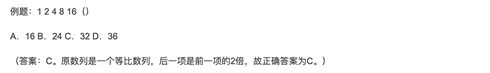
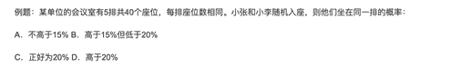
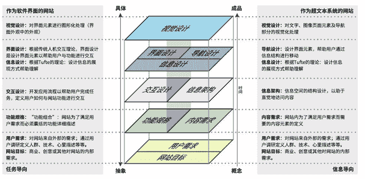

# 第四章 第 1 节 产品笔试准备概述

> 原文：[`www.nowcoder.com/tutorial/10073/6b244a08474248388464d4ad5d0a27bc`](https://www.nowcoder.com/tutorial/10073/6b244a08474248388464d4ad5d0a27bc)

产品岗位的面试流程，随着互联网增长的红利逐渐见顶，表现出越来越流程化，专业化的趋势。五年前的产品面试，是凭借着一腔热血，一份大学期间项目的思考，一份对产品经理的憧憬，便能够敲开互联网大厂面试的大门，获得跟面试官交流的机会。到了三年前 2018 年，大家已经开始被群面折磨，不少优秀的应届生因为诸多原因在一场面试中无法脱颖而出，而被迫要远走多个城市罢面的例子比比皆是。到了 2020 年，对校招生的笔试题更是到了考察行业知识，诸如热门综艺主编的名字的地步。可以预见，作为标准化、流程化的笔试，会越来越多的应用在校招生的考察中，来应对日益增长的求职人数与日益减少的岗位需求筛选。产品笔试题按照二元分法就是主观题跟客观题，客观题以行测题型为主，逐渐融入行业常识与产品设计题来考察应届生的逻辑能力与行业融入度。主观题则是在宝洁八大问的基础上，考察校招生的逻辑表达能力，驱动力和是否聪明。

# 1、产品岗客观题讲解：

行政职业能力测验，参考 2020 年美团校招，共 40 道题，考试时间 100 分钟，平均 2.5 分钟一道题。测验主要包括常识判断（题目数量占比 5%以下）、言语理解与表达（题量占比 30%左右）、数量关系（题量占比 30%）、判断推理和资料分析（数量占比 30%）等部分。**常识判断：**占比少，容易得分，考察的点从生活常识到行业常识。需要掌握一些常见 的互联网术语跟词汇，来应对部分试题将这常识题替换成互联网行业领域的常识。**言语理解与表达：**在官方解释中，主要测查报考者运用语言文字进行思考和交流、迅速准确地理解和把握文字材料内涵的能力。并将这种把握文字材料的能力细化为以下几个判断依据：

*   正确理解阅读材料中指定词语、语句的含义；
*   概括归纳阅读材料的中心、主旨；
*   判断新组成的语句与阅读材料原意是否一致；
*   根据上下文内容合理推断阅读材料中的隐含信息；

从产品经理的切身体会来说，这样的能力可以说很基础却又很实用。产品跟运营是需要具备文档化的思维，即阅读文档，生产文档，维护文档，从规范的流程中释放生产力。而不管是阅读、生产文档还是日常的沟通中，明确词语定义，沟通者的意图都是需求推动中必不可少的能力，也即沟通能力的基础。数量关系主要测查报考者理解、把握事物间量化关系和解决数量关系问题的能力，主要涉及数据关系的分析、推理、判断、运算等。常用题型有数字推理和数学运算两种。数量的掌握数量关系的推断能判断一个人是否具备合格的数据分析能力，在互联网工作中，如何用数据证明工作效果，如何衡量各项活动的投入产出比，跟数据打交道都是必不可少的。**数字推理：**每道题给出一个数列，但其中缺少一项，要求报考者仔细观察这个数列各数字之间的关系，找出其中的排列规律，然后从四个供选择的答案中选出最合适、最合理的一个来填补空缺项，使之符合原数列的排列规律。如下图：
对应在日常的工作中，就是每天观测数据，发现异常的能力。数据是否有异常的判断标准，是数据的规律是否被打破，那识别数据的规律，并预测近期的数据波动便是一个互联网的能力。比如按照上周 GMV 的环比，本周五环比应该为 200W，如果达不到了，我们便需要找数据异常的原因。**数学运算：**每道题给出一个算术式子或者表达数量关系的一段文字，要求报考者熟练运用加、减、乘、除等基本运算法则，并利用其他基本数学知识计算或推出结果。如下图：对应在日常的工作中，在制定需求策略之前，分人群，分类目，分商品，查看商品、人群的数据表现，能够让我们对策略的产生效果做出~~预~~测，避免对线上产生不利影响。**判断推理跟资料分析**类似于将言语判断跟数据分析综合起来，在一大段材料中，设定五个客观题，考察的是能否在限定时间内高效的阅读以及准确的计算，我认为要练好这部分的题目，首先需要将前两部分的基础打牢，再找部分真题限时训练，就能够达到不错的训练效果。对于客观题的训练方法，结合之前自己的经验以及身边面霸的经验：一个高质量的训练题库（最好是试卷，考点与视频配套的题库，比如牛客网的真题题库，大家可以好好利用刷题）、一本行测解题方法较为全面的辅导书（多去书店翻翻看看，在网上找几本目标的书，到书店实际考察）。而平时训练跟实际做题的时候的技巧则跟高考类似，都是要在有限时间内尽量获得高分，这里的有效时间不是一句废话，实测在笔试中，完成全部题目所需时间是略显不足的，因此时间跟精力的分配是隐含的考点。

*   承认自己的不足，不会的题马上跳过，清空自己的思维，即不要被题目浪费 太多时间，也不要因为题目做不出而影响做题心态。
*   制定每个部分的训练准确率目标，不达标坚决不进入下一个环节的训练。
*   专项强度各个击破训练，在了解各题型分类的基础上，要集中时间突破某个题型， 训练一开始不要将各类题型掺杂的训练。集中的训练有助于整理题型、解题思路，形成更 深刻的记忆。

# 2、产品岗主观题讲解

在笔试试卷中，行测题、行业相关题等客观题基本上都可以靠刷题，多了解行业热点来解决。而企业为了真实全面的考察应聘者，综合评估其岗位专业能力、问题定位能力、组织表达逻辑等，会在笔试题型中设置若干主观问答题，是笔试中甄选考生的重要一环！笔试主观题基本分为**估算类、需求分析类、活动推广类、产品分析类**这四大类题型。估算类题目本质是费米估算的题目，是将宏大的命题转化了多个指标，通过常识化的指标估计，抵消不同指标之间的误差。常见的估算类：（网易）估计今年通过网络参加考研培训的人数？将目标求解拆分为以下的公式之后，对拆解后的指标做预估。参加网上培训的人数=参加培训的人数-参加线下培训的人数 1\. 参加培训人数=考研总人数*考研培训报名率 2\. 参加线下培训人数=考研培训机构数量*平均招生规模 a) 平均每年招生规模=教师数*生师比/平均报名学科数需求分析以及活动推广算是最中规中矩的互联网笔试题。其中的思路，产品跟运营大致是通用的。从需求的定位出发，制定需求的目标，需求达成路径，监控活动过程中的各项数据指标，控制活动排期、进行项目管理。算是一个小型功能与活动的完整生命流程。如果是活动的解决方方案，则进一步侧重于活动预热；活动推广渠道盘点；根据活动预算确定推广策略；活动渠道排期。常见的具体问题有：需求分析类：（腾讯）给 60 岁的老人推广无人机。活动推广类：（京东）设计 618 活动推广方案。产品分析类题目考察的则是交互设计的五层模型。考察面试者是否能根据五层模型将同行业的不同产品进行对比，在跳脱出用户的视角，观察跟总结产品的异同点。常见问题：（字节跳动）分析你最喜欢的一个 APP ，思考它成功的因素有哪些，和竞品相比，有哪些优势和劣势。