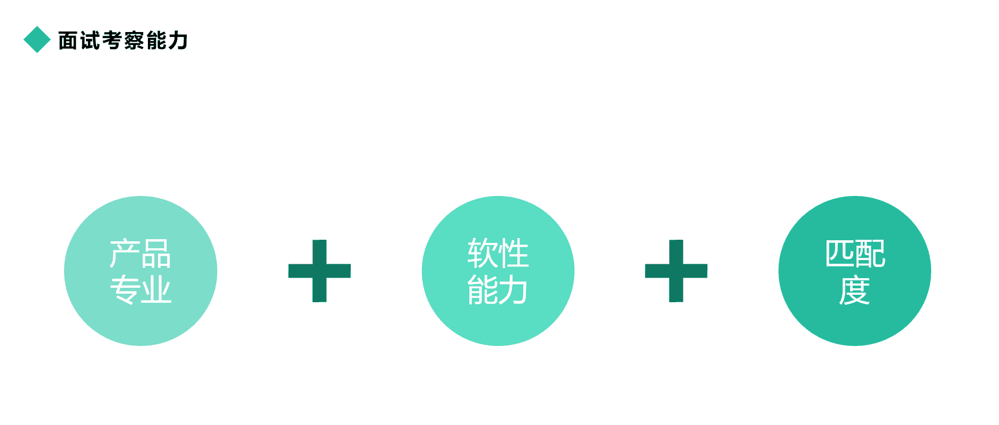
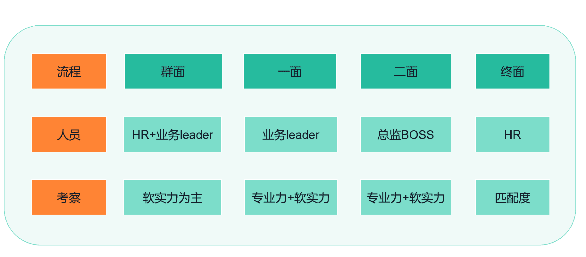
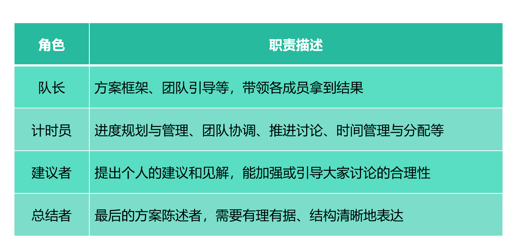

# 第五章 第 1 节 校招面试概览及群面准备

> 原文：[`www.nowcoder.com/tutorial/10073/8438decfc61f4d0b88b453189260d6aa`](https://www.nowcoder.com/tutorial/10073/8438decfc61f4d0b88b453189260d6aa)

有位即将毕业的同学找我咨询，说现在怎么做准备才能在校招时成功应聘互联网产品经理。当时该同学再过 5 个月马上毕业，但简历“没有实习、没有项目、没有社团”，咨询过程中发现对求职面试的环节不够清楚。面对这样的情况，作为被咨询者感到非常可惜，因为现阶段难以通过有效的方式立马让该同学扭转乾坤。求职面试更希望大家能提前准备，做到有的放矢，而不是等快毕业时在来临时抱佛脚。种一棵树最好的时间是十年前，其次是现在。

另外产品经理是介于技术和运营的中间，上能传达公司业务，下能设计产品，在外人听起来，产品经理是让人非常兴奋的职业。这样的职位每年都吸引大量新人不断入行，导致竞争门槛逐步提升，不仅要有好的学历背景，还需要好的实习经验。即使拥有这些优质履历，但如果面试过程中不熟悉应聘环节，适当地掌握面试技巧，也容易跟意向公司无缘。

作为即将求职的校招生，需要能提前准备求职面试，根据产品经理的职位特征匹配个人相关的履历与背景，并在面试过程中灵活应变。

在这节课将会跟大家介绍如何准备产品经理面试，内容包括面试考察的能力、面试的流程、群面各种事项及技巧、单面常见类型及题目等，希望通过这些内容让大家知道面试各个环节的考察的重点，避免踩到面试官的坑里面。

# 1、面试考察什么能力

 产品经理因为没有明确的考察方式，只能通过笔试和面试去聊，尤其面试更偏是主观型谈话，不一定有标准答案。面试过程中，面试官需要通过你的沟通表达来考察三方面的能力：

 ## 1）产品专业

产品专业是指作为产品经理理应具备的知识和技能，这些是你日后做产品经理的看家本领。知识是对互联网领域及产品经理岗位的理解，比如什么是产品经理最重要的三个能力，怎么评价商品详情页的停留时长等。技能则是能拥有实际或者潜在能做产品经理的能力，比如用户思维、需求分析、产品设计、项目管理、数据分析等，若有实际累积的产品经验，则更能证明拥有部分相关的能力或储备。

## 2）软性能力

软性能力是更偏通用型素质，即不同岗位都可以胜任的能力，比如沟通表达、同理心、组织协调、抗压能力等。这些能力的考核通过列举具体的案例来说明，比如面试官问日常生活中，你喜欢跟什么样的同学合作，遇到不喜欢的同学发生冲突怎么处理，或者置身于工作中的场景，比如跟研发 leader 需求不一致时，怎么说服研发承接需求。软性能力的考核并没有标准答案，能够自圆其说就行。

## 3)匹配度

匹配度指跟公司、职位、团队的匹配度，里面涉及到个人工作的稳定性、工作选择的价值观等因素。匹配度往往是最后一轮业务面试官和 HR 面试官比较关注的因素，因为面试官要确定如果给你发校招 offer，你是否有足够的意愿度接受 offer，而且你的个人是否能够很好地与团队匹配，而不是游离在团队外部。匹配度是候选人比较容易松懈的地方，你以为面试官跟在闲聊，但实际上面试官希望让你放松，这样他更能倾听到你的真实想法，比如你对公司的看法、对职位的期待、追求的价值点等.

# 2、面试的流程

下图是多数公司的面试流程，不同公司有所差异，比如美团去年开始有群面流程，而之前是没有群面。大家投递简历后，一定要能够清楚知道公司的面试流程。面试流程可以通过校园招聘官网、牛客网等查询相关信息，也可以跟往届的师兄师姐做咨询。

  这里介绍下不同节点的面试情况：

## 1）群面

群面是大家谈虎色变的环节，因为群面的死伤率过大，一般 10 个人只能进 2 个左右，甚至可能存在整个小组面试不好导致小组全灭。群面重点考察软性能力，尤其是团队配合、沟通表达、逻辑思维等因素。

## 2）一面

一面的面试官往往是你的主管，或者跟主管平级的其他部门的 leader。作为该环节面试官，重点关注产品专业力，面试时会经常性地做产品深挖，比如产品的背景是什么，跟竞对有什么差异，做了哪些行动，有什么效果，怎么量化这些下效果，你在产品中的角色是什么，有什么个人的沉淀等。

## 3）二面

二面的面试官跟一面类似，除关注产品专业力外，更关注你个人发展的潜力。专业力是是看你有没有足够的产品感，比如能站在用户角度考虑，区分用户在不同场景下需求是有差异的情况等。软性能力是在看你是否足够聪明，个人的综合能力是否比较强，是否能很好引导他人。

## 4）HR 面

进入到 HR 面至少证明你的产品专业力没有问题，符合公司的基本门槛。多数 HR 不太懂产品经理，更多是从“人”去看你的面试表现。HR 比较关心你跟公司的匹配度，比如你的性格是否符合公司的企业文化、你的价值观跟公司的匹配度如何等，包括你对未来的期许与规划公司是否能提供等。

HR 面试环节千万不能大意，不要以为进入到该环节就能够拿到 offer。上次有同学进入到 HR 后，聊到后续个人规范，说想在公司积累经验后在出国留学，直接被 HR 毙掉，因为你的规划就是来公司积累产品经验，而不是来好好工作，仅仅是来过渡。

# 3、群面环节如何准备

群面是产品经理面试的重要环节，有部分大厂比如腾讯、阿里、美团等都有群面流程，该环节的刷人比例极高，每轮能通过面试的人数多数是 1 个或 2 个。那如何更好地准备群面，从以下三个方面介绍：

## 3.1 群面的价值

为何有群面环节，原因如下：

### 1）真实场景的提前演练

群面是产品经理经常面对的业务场景，比如产品经理需要跟各个业务沟通需求，组织不同运营提产品需求，评估需求的优先级，或者产品经理跟研发、测试评估产品需求，如何面对研发的挑战，保障项目如期推进等。这些场景都需要产品经理能够协调各方需求，在求同存异地基础上达成会议目标，推进业务能顺利落地。

既然后面要面对这样的真实场景，那提前让准产品经理的同学们在面试中去表现，充分考察大家是否具备应对这些场景的能力，比如沟通表达、团队协作、目标意识、项目管理等。

### 2）降低公司的面试成本

大厂的产品经理录取比较低，投递简历的同学人数众多，且可能教育背景、产品经验等都比较不错，那如何通过面试快速筛选出适合公司的产品经理，并且需要低成本地筛选候选人，群面则是最好的方式之一。

一方面群面参加人数比较多，一个小时即可完成对 10 人左右的小组评估，选择进入一面的人选，公司的时间成本比较低，另一方面因为群面是真实场景演练，更能提前展示候选人的产品能力，筛选的准确性有比较好的提升。

## 3.2 群面的流程

群面环节一般有以下 5 个流程，作为候选人可以在群面前提前准备：

### 1)等待与签到

同一小组的候选人会在会议室前签到，等着进入群面的通知，这时你可以观察身边的同学，熟悉下同学的情况，比如主动认识坐在你身边的同学，看看对方名字是什么，来自什么学校，有什么背景等。一方面能通过提前认识，让你在群面的过程中减少紧张感，另一方面若后续遇到冲突或者需要支持的地方，熟悉的同学支持你的概率能大大提升。

### 2)面试官介绍

进入到群面环节，首先开始的是面试官的介绍，即等同学都坐下后，面试官介绍题目的情况和群面的规则，比如题目的背景资料、讨论的步骤、讨论的要求、需要完成的任务、具体时间和注意事项等。这时你要能听清楚题目内容及规则事项，如果有问题可以举手示意，面试官同意后再提出问题。

另外面试官自我介绍时，可以记录下面试官的大体情况，因为他可能就是你一面的面试官，也可观察下周边同学的情况，熟悉下整体的座位安排，尤其是你比较熟悉同学的位置情况等。

### 3)自我介绍

每个同学都需要做下自我介绍，注意自我介绍的时间是涵盖在群面的时间内，因此自我介绍适当简短点，控制在 60 秒内。自我介绍大体说清楚个人信息、实习经历（简略说在哪几家公司实习）、个人擅长能力（能力跟后续你要争取的角色有关）等。

此外，关注下其他人的自我介绍，看哪些同学可能成为你队友，哪些同学实力强劲，适合担任队长等。你在群面后续的讨论环节中，若能够称呼对方姓名，是非常好的加分项。

### 4)群面讨论

群面讨论是小组同学自由表达观点的环节，该环节是最为重要的环节，面试官会重点关注各个同学在该环节的表现。面试官要通过这些讨论过程，看到哪个同学具备产品经理的软性能力或素质，比如团队协作、结构化思维、逻辑能力、产品感觉、商业知识、沟通能力、项目推进等等。

群面讨论的考察重点是要突出个人在团队中的作用，协助团队完成既定的目标，而不是过多争取个人的表现。群面题目目标的准确与否并不是那么关键，核心是达成一致意见，在有限的时间内拿出一个适合的方案即可，并且该方案能自圆其说，有理有据。

### 5)总结结束

群面讨论一般是 40 分钟左右，等讨论接近尾声，则小组会选出某个代表来陈述小组观点。这个代表是总结者的角色，核心就是简明扼要地提炼你们组的内容，充分且清晰地跟面试官表达所在组的结果。面试官如果有兴趣，他会继续追问，如果没有兴趣则群面就结束。结束后，面试官会收回案例及发放的白纸，而大家则是收拾下东西出去外面等候通知。

## 3、群面的角色

群面环节一般有以下四个角色，分布是：队长、计时员、建议者和总结者，这些角色的职责描述如下：

### 1)队长

队长的角色类似于工作中的产品经理。产品经理就是刚才提到的各种会议的发起人，他的目标是集合所有成员的力量，去解决一个核心的问题或拿到一个好的结果。这要求队长能左右整个讨论形势，做比较好的局面控制，比如根据每个人的特点或者角色去分配任务、引导各个角色贡献自己的知识、推进会议朝着目标前进等。

这样的角色是高风险高收益，因为表现的机会比较多，容易得到面试官的关注，但前提是能够带领成员拿到好的结果。如果你所在的小组表现差，那作为队长是第一责任位，极可能是被淘汰，甚至导致整个团队被团灭。

### 2)计时员

在工作中类似于项目经理，核心就是控制节奏和项目安排，告诉每个人什么时间点该做什么事情，如果资源不够的情况下，协调大家通过优先级的取舍或者争取额外人员来保障项目如期上线。

计时员是团队中非常重要的一员，目标就是要保障讨论能顺利的完成，拿到好的落地结果。除开引导各个成员充分讨论外，让每个人的机会尽可能均等并贡献每个人的力量，也需要适时地当下坏人，在团队偏离方向时，及时踩刹车，引导大家走上正确的道路。

举一个计时员开篇案例，比如：我们要讨论的题目是：……，整个时间预计 50 分钟，我们在正式讨论前，可以将时间这么来划分：首先大家用 5 分钟时间先独立思考，记下个人的要点，待会每个人独立阐述下个人的观点，预计 10 分钟，接着用 25 分钟做下讨论，形成完整的方案。最后 5 分钟时间选择总结发言的同学，也一起整理下总结的思路和发言的要点。整个环节我们预留 5 分钟时间，保障各个环节能顺利落地，这样的时间安排，大家有么有问题？

### 3)建议者

建议者在群面的角色过程中，纯粹就是提供个人的思考，间接帮助大家完善方案，并不直接领导团队。作为建议者，你要能听清每个人说的观点，揣摩背后的意义，然后能提出自己的要点。

表达个人要点时，你的观点要逻辑清晰，跟讨论的主题方向一致，而不是随机发散。这样的建议大概率会被小组所认可、采纳，是非常能够加分的亮点，容易被面试官所记住，大大提高你个人通过群面的概率。

另外建议者要学会争取同盟者，让团队往正确的方向去走。比如可以总结下别人的观点，再引出自己的意见，一方面是能够表达出对前面同学的尊重，体现个人的团队精神，二来可以获得更多的支持，强化个人的影响力。

### 4)总结者

总结者在工作过程当中，类似于最后整理并发会议纪要的人，核心作用汇总各方观点，有条理的表达给面试官。总结者在群面中需要清晰明了地做好记录，即记录每个成员发表的观点或者核心要点，不需要面面俱到，一字不落。

而后根据会议的进程，适时地做归类整理，并且提炼出核心的要点。最后陈述时，总结者要能非常好地让面试官了解到你们团队的结论，能够看到具体的落地方案，而不是仅仅记录每个人的说话要点，做机械性地重复观点而已。

假设你来做总结陈述时，可以按着这样的顺序来走：

**1）跟面试官问好，并简单复述题目，告诉面试官大体的结论；****2）简明扼要地表达团队汇总的观点，尤其是偏核心的论据或者讨论过程的要点，便于面试官听得清晰且方便其做记录；****3）一句话总结核心的思路或者方案，感谢面试官及各个成员。**

群面的角色选择，可以根据个人的性格特质或者经验履历选择，比如你个人洞察力比较强，适合在关键时刻提出建议，引导大家朝着合适的方向去讨论，那建议者的角色可能适合你。如果你有比较强的控场能力，产品经验的累积在小组里面排名靠前，那承担队长的职责会更加合适。

无论选择哪种角色，最重要的是在群面过程中能表现自己的同时，兼顾团队其他同学，引领大家完成群面的目标。

# 4、群面的案例

以产品设计为例，介绍从各个不同角度去回答群面的问题。假设群面的题目是设计一款儿童电话手表，包括但不限于电话手表的功能及推广方案。

## 1）目标用户

儿童电话手表的目标用户分为儿童及家长，儿童是真正的用户，是产品购买后的直接使用者，而家长则是付费客户，是属于掏钱的用户。那关注的场景及功能就会有明显差异，儿童就是好玩及讲究互动性，家长则是关注安全、性价比等。

## 2) 产品功能

产品功能则根据用户不同而有所差异，先说儿童，作为产品的直接使用者，儿童比较关心核心功能的使用，比如通信型功能（电话/语音/视频）、软件的丰富度（娱乐化）、交好友的便捷度（社交化）等，甚至对于用户来说，不同颜色外观，与各种 IP 结合如迪士尼等都是非常强的功能卖点。

而对于家长，更加关注安全性及便捷性，安全性如定位、报警等功能，需要实时在手机查看儿童的位置，也会关注电话手表自身的完整性，如防水防摔功能。便捷性则是因为要充电、换卡等需求，需要能够非常方便家装去做这些动作。

## 3) 定价策略

针对不同用户或者场景，可以提供差异化的定价策略，提升儿童电话手表的覆盖度及获得更多的收入。比如提供简单版本，无娱乐化功能，在硬件参数上适当简化，类似于 iPhone SE、iPhone、iPhone Pro 的版本差异，一方面能够覆盖到更多对价格敏感的用户，有助于打开更加广阔的市场，比如三四线城市，另一方面能有效覆盖部分低龄儿童，比如 3 岁-6 岁小孩，因为这样的功能安全性更高，容易打动这些家长。

## 4) 推广方案

推广方案可分为线下或者线上两种方式去做推广。线下即通过门店方式，由家长到店体验后购买，因为手表的定价价格并不低，甚至可能与手机持平，且涉及到儿童的使用体验，家长一般需要看到实物后才会下单。线下除门店外，可以关注到儿童及家长经常到的周边区域，比如与各种儿童玩具店合作、母婴乐园等，通过这些渠道做售卖，也可以给这些渠道适当提成。

线上的方式则可以针对儿童经常看的网站或者内容做推广，如可以跟部分热门动漫合作，植入相应的广告，或者跟教育网站合作，完成流量的推广覆盖。线上因为比较好监控数据，可以引流到线上电商网站如淘宝、京东等直接购买，看整体的 ROI 情况，也可以引流到线下门店，不过线下的数据链路难以监控，难以评估投入产出比。

## 5) 口碑传播

口碑传播的点在于产品的体验及价格最够有优势，能够吸引到目标用户。因为儿童及家长天然自带传播场景，比如某个小朋友看到某个品牌的电话手表，其他小朋友可能引发购买，这样的场景需要产品经理设计相关的功能，比如交友仅限制在同一品牌的电话手表，引发购买行为，且能够提升电话手表的竞争壁垒。

此外，可以赠送相关的周边商品，比如购买提供一键式购电话卡方便用户自行操作，也可以赠送学习或者玩具周边，打动家长，让家长感觉物有所值。此外，需要比较到位的售后服务，这样能够及时解决用户遇到的问题，如换电话手表或者维修电话手表。

以上的回答更多是从不同角度去考虑，面试的时候可以根据情况适当做增删等，只要能突出你对产品有足够多的思考即可，并不追求标准的答案。