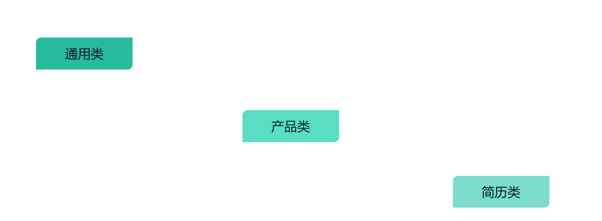
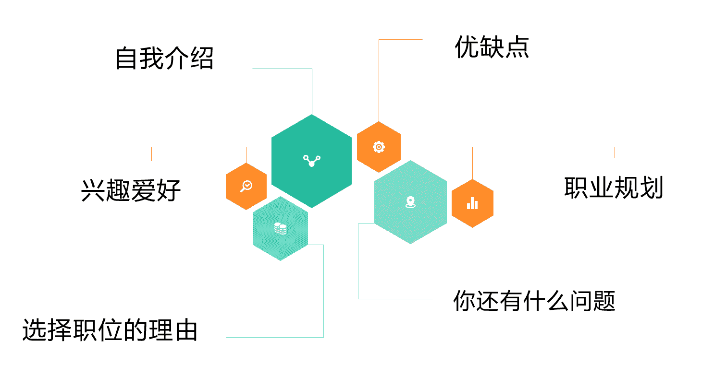

# 第五章 第 2 节 单面环节如何准备

> 原文：[`www.nowcoder.com/tutorial/10073/48889ad089ee465d83e16682d8c58ed1`](https://www.nowcoder.com/tutorial/10073/48889ad089ee465d83e16682d8c58ed1)

单面包括，业务型面试即是一面和二面，也包括 HR 面试，重点考察产品专业力和软性能力，一般有以下几类问题：

# 1、通用类

通用类问题是无论哪个公司，无论哪个面试环节都可能被问到的问题，比如自我介绍、优缺点、兴趣爱好、职业规划、选择职位的理由等。这些问题可以提前准备，需要大家能够根据场景准备不同的版本，以便能匹配不同公司或者面试官。

## 1） 自我介绍

自我介绍是必答题，作为每轮面试的开场环节，是面试官了解你的窗口。有时面试官来不及看简历，你自己主动做下自我介绍，一方面让面试官感受到你的积极主动，缓解面试官因为没有看简历的尴尬场景，另一方面让面试官能够对你有所了解，大体知道“你是谁，从哪里来，准备到哪里去”。

自我介绍一般含有以下信息：“个人信息+实习/项目等业绩+对公司或职位兴趣度”三部分组成，这些信息适当根据面试的情况做增减。对于单面一般在 1 分钟-3 分钟左右，有的面试官喜欢让面试者 1min 以内说完，有些面试官则会给到 3 分钟的时间，但不管时长，这些最基本的模块都是要包含进去，只是侧重点不同，好让面试官对你有基本的判断和认识。

举一个我的例子：我是 XX 大学 XX 专业的研究生。之前在美团点评实习，做过类目优化项目，改版后转化率提升 20%，后面去京东也实习过，负责 XX 项目，数据表现是 XX，也取得比较好的业绩，简历上有详细的介绍。

做完两份产品经理实习后，我发现非常喜欢做产品经理，一来比较喜欢站在用户角度来考虑产品的迭代优化，通过数据方式来验证效果，看到自己的产品能够被用户使用，我非常有成就感，二来产品经理需要比较强的执行力、沟通力、逻辑思维等，这块自己比较有优势，从实习和社团等经历中可以看到。

今天来应聘我们腾讯的产品经理职位。腾讯是互联网产品经理的黄埔军校，有着非常好的产品氛围，希望在这边能够贡献自己的一份热血，也跟随公司一同成长。以上就是我的自我介绍，很高兴能有机会跟面试官您交流。

## 2） 优缺点

优缺点考察你能否正确认识自己，如何面对个人优劣势等。优点相对而言比较好回答，而缺点就不那么好处理。一方面聊缺点看起来更像压力型面试，因为多数人不太会在公众场合谈个人缺点，另一方面不知道回答什么样的缺点既好跟面试官交差，又能不碰触到公司或职位硬伤。

一般回答该问题，可以简单直接说明自己的优点或缺点，而后列举具体的案例来说明。以缺点为例，跟大家说下如何回答该问题。

比如你可以跟面试官回答：我个人的缺点是文案能力不强，比较难想到比较好的文案说明。记得在学校期间曾邀请上届刚毕业拿过 BAT 等产品经理 offer 的师兄来分享求职经验，当时海报上仅仅写“某某师兄分享产品求职经验”，但后面跟活动策划的同学聊后，改成“如何拿到 BAT 等 10 个校招产品经理 offer“，整个学校公众号海报阅读量提升 30%+。

文案能力是产品经理重要的能力之一，能通过文案更好地传达产品的设计理念及操作方法。文案的能力我认为是可以培养，我已经在看 XX 文案撰写技巧书籍，在弥补这方面能力的不足，形成一篇 1000 字+的阅读感想发布在自己的公众号。我在实际的产品设计过程中，后续会重点关注下竞品的文案描述，将这些文案作为自己设计产品的思考和补充。

文案能力对产品经理来说是锦上添花，而不是雪中送炭的必要技能，因为公司有时运营或者客服部门提供相关的文案说明。文案自己尝试学习与修炼，并不是特别难以学习的技能。在上面的回答中，让面试官觉得你能看清自己现在的问题，并且已经采取措施来弥补，那能证明你能理性评价自己并且积极主动改善自己。

回答缺点时不要将优点讲成缺点，比如有同学说自己的缺点是追求完美，这样的缺点某种程度上反而是做产品经理的优点，面试官会怀疑你是不是故意这么说，是不是你没法评判个人的优劣势。此外，回答缺点时不要列举跟职位或者公司硬伤的缺点，比如产品经理的职位要求注重细节，但你回答问题时说自己最大的缺点就是马马虎虎，不注重细节。这样的回答让面试官对你是否胜任产品经理的素质有所怀疑，可能因为这样的回答让你无法进入下一轮面试。

## 3）兴趣爱好

兴趣爱好是二面面试官或者 HR 面问的比较多的问题，一面面试官更集中在产品专业力上，有时会附带问下该问题。兴趣爱好是面试官了解你个人工作外的时间安排，能让面试官更好地了解你方方面面。当然，最重要的是后面的追问，比如你的兴趣爱好怎么培养，对你的工作或生活有什么帮助等。

回答该问题，可以有以下的思路：

一是跟公司或职位比较匹配的兴趣爱好，比如你应聘某教育公司的产品经理，你个人的兴趣爱好是教书育人，希望能够将自己的经验带给他人，且你能够列举案例，如你大学期间有支教经历或者课外有家教经验等。类似这样的兴趣爱好容易跟公司职位匹配，是比较好的加分选项，但记得要能有明确案例或者数据，能够打动面试官而不是你随口一说。

二是跟生活相关比较正向的兴趣爱好，比如喜欢长跑。作为候选人跟面试官介绍个人的跑步经历，最长的跑步公里数及时长，如果能有参加类似马拉松的经验则是最好。这样的兴趣爱好证明你是积极向上、能够持续坚持的同学，那对于应聘也是非常好的亮点。

回答该问题时，不要说没有兴趣爱好或者比较一般的兴趣爱好，比如就看电影、听音乐、玩游戏等。生活是工作的另一方面，面试官想看你丰富多彩的一面，尤其是面对自己喜欢的事情的那种激情感，而不是感受到你是比较单调无聊的同学。

## 4）职业规划

面试官问职业规划在于想看你的个人目标是否足够清晰，对个人的发展线路有什么期待，在来看公司提供的职位、发展等能否符合你的预期。所有问题的出发点在于面试，通过面试考察个人的能力，而不是去过多探究你个人梦想及隐私，所以尽量真实反馈在未来的规划。

你可以这么来回答上面的问题：

如果有幸能加入我们公司，未来 3 年内我会专注于产品专业力的提升。因为您看我过往的经历，产品经验除了两段实习经历外，并没有其他相关的产品经历，个人没有什么好的积累。我希望能在我们公司，参与到更多日常需求及重点项目的产品工作，通过这些产品让自己的能力有明显的提升，成为一个优秀的产品经理。

此外，因为面试官您及同事经验比较丰富，希望能够在这样的团队里面多学习下相关的产品及职场能力，包括沟通表达、组织协调、项目管理等，因为产品能力是需要靠大家平常的沟通及碰撞，才能有更好的提升。

长期来看，个人非常喜欢做产品经理，因为如果做出来的产品能够让用户使用并且得到用户的认同，这些用户可能就是你的亲戚、同学、朋友等，拥有这样的经历是非常高成就感的事情。我会持续在产品经理上继续累积个人的能力，成为产品综合能力更强的产品经理，希望能独立负责核心项目的规划、设计、落地工作。

上面的回答将“短期+长期”结合在一起，短期考虑的是个人能力的提升，让面试官感受到你是脚踏实地、定位清晰的同学，长期考虑的是个人对产品的热爱，希望能能持续深耕。这些回答能够比较靠谱，让面试官感受目标清晰且有落地规划即可，但前提还是要跟公司及岗位做绑定。

另外回答该问题时，部分同学可能过于强调外面因素，比如说 2 年内个人薪资待遇要涨幅 50%，3 年内职位要达到产品专家等，这些是职场非常重要的因素，但对于前期工作来说，更应该让面试官感受到你对内的关注点，比如个人能力的提升与积累。因为如果你非常关注薪水待遇，假设校招时你拿到更高薪水的 offer，是不是可能就不会选择这家公司，这样的方式肯定让面试官感受不好。

## 5） 选择职位的理由

选择职位的理由问题比如：你为什么想做产品经理，该问题考察你对产品经理的理解以及你选择职位的动机。部分同学回答时过于强调个人主观因素，比如个人不想做技术，个人喜欢做产品等，这些因素是回答的维度，但最好的方式是通过案例来说明。

你可以这么来回答：

我在 XX 公司有实习经历，尤其做 XX 项目时，需要针对用户去分析，看下用户真实的需求是什么，通过跟用户的访谈及调研，发现用户的需求是 XX。当然，结合埋点数据，对用户的转化漏斗做跟踪，分析到在 XX 环节用户跳失率比较高，于是针对该环节做以下优化：减少用户认证流程，剔除掉实名认证，并重新布局页面交互，使得转化率提升 20%+，用户的满意度从 4.3 提升到 4.7 分，取得非常好的效果。通过做这样的项目，让我感受到做产品能够取得非常好的效果，投入产出比极高，而且能非常方便用户去使用我们的产品，个人成就感非常不错。

另外正如简历所写，我在学校期间参与过多场校级活动，也参与过 XX 科研项目，在个人的沟通表达、逻辑思维等方面还是有一定积累，这些能力跟产品经理比较匹配。

上面的回答通过自己过往的履历与背景，强调个人参与过产品的设计经历，非常享受产品经理的工作，愿意在产品经理长期从事该职位。此外，通过其他的实践活动，表达个人有产品经理所具备的软性能力，能较好匹配产品经理的素质要求。

类似的回答大家可以根据个人的经历做适当调整，但原则是通过案例或数据来客观证明你选择产品经理是深思熟虑的结果，而不是主观的一时冲动。

## 6）你还有什么问题

面试快结束时，面试官一般会礼貌性地提问，你还有什么问题。一方面告知你面试已告于段落，即将结束，算是对时间点的提醒，另一方面面试官想看看你后续还有什么需要了解，可以再跟你沟通了解下。该问题是最后跟面试官沟通交流的机会，作为候选人好好把握下，好的问题也是非常好打动面试官的点。

你可以问以下问题：

### 

*   个人感兴趣的问题

跟产品经理相关，涉及到产品经理工作的真实场景，可以这么来问：产品经理会经常面对不同业务，比如 C 端产品重视体验，B 端产品重视效率，怎么来平衡两边的差异。通过这样的问题表达对产品经理的兴趣度，希望面试官能解答此方面的问题，提升个人对产品经理的理解度。

### 

*   跟业务相关的问题

面试前需要提前了解公司所在的业务情况，或者面试中能了解或者倾听到面试官所负责的业务，如果刚好你对这些业务或产品比较了解，那可以跟面试官交流你的想法。

比如假设面试官是滴滴打车的产品经理，可以问：现在打车市场竞争比较激烈，曹操专车、首汽专场等瞄准对品质比较高的用户，而携程也在商务场景做打专车，滴滴会针对这些用户或场景做独立产品吗？这样的问题让面试官知道你对业务比较了解，能有自己的想法和判断。

提问也有其他容易陷入坑的地方：

### 

*   不要提跟薪水、福利、假期等问题

这些问题的确很重要，每个人都会关心，但如果没有拿到 offer，对你来说是无所谓的信息。即使拿到 offer，这些信息公司都有标准的答案，可以通过其他方式打听到，而不是直接问面试官。此外，这样的问题会让面试官留下你过于看重外在的物质因素。

### 

*   不要提战略性问题

比如公司未来 3 年的规划是什么样子。除非你的面试官是 CXO 级别，否则这么大的问题，面试官很难回答你。对于公司的规划并不是每个经理都足够熟悉，而且即使知道也没有必要面试时跟你过多透露，毕竟还有保密要求。

### 

*   显而易见的问题

比如产品经理的工作职责是什么或者公司主要有哪些产品。职位相关的问题你面试前就应该有所了解，你对产品经理的工作内容、能力要求等要足够清晰，否则你应聘该职位的动机就值得怀疑。此外，对于公司的产品、业务类型等也要提前准备或了解，要不然会让面试官感觉你对公司没有意向。

# 2、产品类问题

产品类的题目一般是考察你对产品的理解，如果有实习项目，则重点会关注实习项目对应的产品，如果没有，则会通过问题方式引导你对某个产品或者行业发表个人看法。

先说实习项目，面试前务必要非常清楚产品的前因后果，比如该产品的需求来自哪里，你怎么分析需求的价值和投入成本，该需求的设计方案是否符合预期，跟竞品的差异在什么地方，具体的效果指标是什么，有什么成功或失败的经验等。这些维度面试前需要提前准备，以便应对面试官各种提问及挑战。

再说提问对某个产品的看法，举例来说，面试官询问你最近喜欢用什么产品，那你说最近使用美团单车比较多，场景是最后一公里的出行。那面试官则会追问，你使用单车有什么不好的体验，作为产品经理会怎么去优化。

那你可以说：有时骑车关锁时，发现车辆锁已经关锁，但订单没有结束，一直在持续扣费，体验非常不好。看能否通过拿到车辆信息，比如该车辆是否经常被用户举报，或者拿到该车辆的移动轨迹，自动结束订单。如果事后产生扣费，能否允许用户申报以便返还被额外收取的费用，或者留客服电话方便用户处理。

面试官会继续追问，怎么来评判效果。你可以回答说：正常关锁的订单率、用户的满意度，正常关锁订单率可定义为正常关锁且未举报的用户订单量/大盘订单量，理论上如果系统能够明确锁已关上，那应该就是自然关锁。而用户满意度可以通过用户的调研问卷来收集，前后做对比。

回答产品类的点在于尽量选取平常比较熟悉且事先有准备的产品。产品一方面是相对比较普及或热门的产品，如抖音、快手、小鹅通等，如果这些产品跟面试官所在的业务相关则是最好的产品。另一方面是面试官所在公司或者部门的产品，如果不清楚部门的产品，则关注公司比较核心的产品，比如面试腾讯，可选择微信、腾讯视频等。

事先准备就是要提前思考要产品要点，比如产品的用户画像，什么场景或者什么情况下用户有需求，现在的产品方案满足得怎么样，需要哪些功能点优化，怎么去评估这些效果等，这些问题跟实习项目被问到的问题类似。另外优化的功能点并不需要特变多，每个产品准备两三个优化点即可，不需要面面俱到，而且这些优化点不用大，小功能也可以。

# 3、简历类问题

简历类问题指简历里面所有可能被问到的问题，包括个人信息、教育背景、科研项目、社团时间、荣誉证书、个人技能等，所以你需要对自己简历的内容足够熟悉，且要学会适当准备相关的回答要点。

比如假设你计算机毕业，科研项目能力足够强，那面试官会询问你为何选择产品经理职位，而不是去做技术岗，因为技术岗的薪水更高，跟专业更匹配。

面对这样的问题，可以提前思考回到要点，提前准备好相关说明，要点跟为何选择产品经理职位类似。

再比如面试官询问你如何证明你个人有比较好的领导能力。你可以列举社团实践类的活动，比如活动涉及到多方配合、预算资源不够、时间紧任务重等，你如何领导大家短时间内达成共识，推进活动方案的落地，最后渠道什么样的效果。4、本文总结
产品经理职位虽然看起来是没有专业、没有额外门槛要求的职位，但实际面试中考察的内容颇为全面，最重要的是考察三个核心能力，产品专业力、软性能力、匹配度。

产品专业力就是产品经理的核心技能，如需求分析、产品设计、项目跟进、数据效果等，如果没有产品相关的实习或项目经历，则会重点关注你对产品的思考，即所谓的产品感。软性能力是通用素质，比如沟通表达、组织能力、领导力、逻辑思维等，这些更多通过案例场景去考察，比如跟研发 leader 冲突时你怎么处理。匹配度则重点关注你跟公司、职位、团队等的适合度，看公司或职位是否符合你的预期，假设给你发 offer，你个人 offer 接受的意愿度如何及未来三年的稳定性如何。

面试流程则是群面、一面&二面、HR 面，群面重点考察你的软性能力，辅助部分产品感，面试官通常是 HR 和一面面试官。一面&二面都是业务型面试，关注产品专业力和软性能力，尤其二面面试官非常看重软性能力，因为代表你未来发展的潜力。HR 面则关注匹配度，看公司对你个人的吸引力以及你的求职动机是否符合公司要求。面试前务必要查下各家公司的不同流程，以便做到有的放矢。

具体到面试环节，除关注礼仪举止外，重点还是过程中所展现的个人能力。群面要关注到个人的性格及能力特质，选择跟自己匹配的角色，而后在表达过程中要言简意赅，有条理并清晰地表达个人观点，促进团队更好地完成任务。单面则分为通用类、产品类、简历类，各自的问题需要能清楚知道面试官提问的要点，合理地展现个人在产品上的专业能力以及比较强的通用素质。群面和单面都要提前准备，并记得最好的提升方式就是实践面试，通过面试去提升自己的内容及表达。