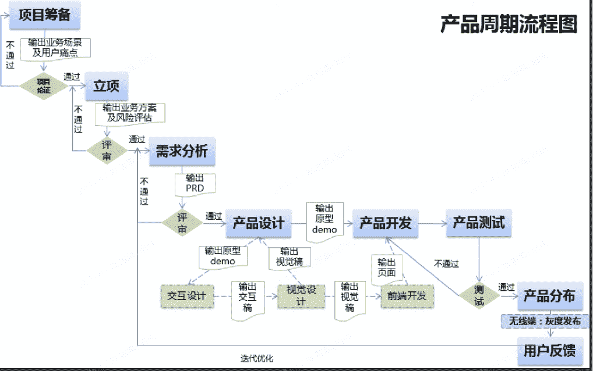

# 第五章 第 3 节 产品专业面试题目讲解——岗位理解问题

> 原文：[`www.nowcoder.com/tutorial/10073/e27d5ec6b4e44aaca62487d0a7db91af`](https://www.nowcoder.com/tutorial/10073/e27d5ec6b4e44aaca62487d0a7db91af)

## 1、你对产品岗是如何理解的？什么是产品经理？形容一下产品经理？

### 题目分析

面试官在面试的时候，一般都会先从候选人的简历出发，深挖简历的实习经历和项目经历，然后会问一些日常中的产品方面的问题，随后就会是一些开放题。开放题一般没有固定的答案，主要是考察候选人对产品的理解程度以及思维方式。而在这些开放性题目中，问到概率最大的就是“你对产品岗是如何理解的”此类问题。这类问题可以考察到候选人是否真正理解产品岗位的重要性和意义，同时也考察了候选人是否能够很细粒度的了解到产品的职责，如果回答的不好会被面试官认为想法十分天马行空，因此此类问题一定要回答得有理有据。

首先带领大家一起了解一下产品经理岗位的起源和发展。产品岗这个词最早的出现是由 P&G 宝洁公司所发明的产品经理（Product Manager），简称 PM。设置这个岗位是因为当时宝洁公司希望可以由一个人负责一整个品牌。随着岗位的发展以及行业的变化，对于目前的各个公司的产品经理来说，他们是为了解决用户的某类问题而生的，是一个集功能和服务的集成体，也可以说是一个位于满足用户体验、商业演化以及科学技术创新中间交互的岗位。这也从侧面说明了对于产品相关的岗位，你的工作内容一定是围绕着上述三个方面来开展进行的。每当产生新的、更细分的用户需求，以及更先进的技术时，需要一个专门的角色来将这些因素结合来明确需求、推进进程并完成目标。

### 解题思路

首先需要明确的一点是，产品经理并不等同于产品所有者，并不意味着产品经理想怎么做就能按照自身的意愿来做。大多数的时候，产品经理行驶的是执行权，即在产品生命周期各个阶段，协调不同部门、资源等去完成某一个阶段的工作任务，需要从前期的用户调研，中期产品设计开发，到后期产品上线测试等都需要参与其中。

对于不同类型的产品和不同阶段的产品，产品经理在里面所承担的工作侧重点也不同。

例如：在产品早期，需要快速搭建产品核心功能，找到核心用户群，以及快速验证产品模式和市场的反馈；而到了产品的成熟期，面对数量众多的用户，需要想办法提升用户体验，大量提升产品的细节。

### 回答案例

概括来说，产品经理是一个能敏锐地察觉市场缺口，挖掘用户需求，提出需求并将需求落实到产品方案，找到用户体验与商业目标的平衡点，跟进产品方案至产品开发成型上线的过程的人。

产品经理的主要工作职责如下：

用户调研、市场分析、竞品分析、产品定位、产品规划、产品功能设计、产品文档输出、需求评审、研发测试、组织协调、项目管理、运营规划、市场推广、数据分析等。  ## 2、产品经理的成长分为哪几个阶段？

从对岗位所需的职责难度以及工作年限的逐渐增长来看，产品经理主要分为以下三个阶段：产品助理、产品经理和产品总监。每个阶段可能侧重的工作能力和个人素质也有所不同。

需要注意的是，虽然产品经理分为这几个阶段，但是产品岗所需的能力是包含的关系，即越高级别的产品岗，不但会初阶产品岗能力，同时也需要具备目前阶段所需能力，即是点、线、面的进阶。

### 产品助理

对于应届生刚开始找实习或者第一份产品工作来说，产品助理岗是绝大部分人最先接触的产品岗，也是过渡到产品经理层级前的一步。产品助理这个岗位对于不同公司可能有不同的称谓，有些公司是没有产品助理这个岗位的，比如阿里，腾讯等大厂，但是对于一些公司，比如携程，美团等一开始发的岗位 offer 就是产品助理。

在产品助理这个阶段的产品岗，首先会接触一些产品功能的需求，并不会直接负责整条产品功能线，大部分还是以熟悉产品业务，和公司产品运转流程为主，以及简单一些功能的处理等。

对于这个岗位的候选人来说，首先需要具备一定的逻辑能力。产品岗是一个非常讲究逻辑的岗位，因为需要了解清楚里面所有的流程和逻辑，弄清业务形态，对于很多产品而言，不论是产品功能多么多样，产品模块多么复杂，跳转关系多么变化，产品岗一定要梳理清楚其中的流程。

同时，需要必备的能力是数据分析能力。因此产品经理的一切决策设计以及行动准则都是以数据为主。数据分析能力对于一名产品从业者而言，是所有工作的底层基础。从产品刚开始上线观察数据，到后面的根据数据调整产品决策，数据分析包含的内容是必不可少的。

而数据分析能力也不仅仅只是分析，而是从数据采集、数据清洗、统计分析、数据应用等一系列整体行为。

另外，文档能力也是作为产品新人需要花时间来培养的一种能力，比如需要写 prd，mrd，汇报 ppt 等文档。对于产品岗来说，需要充分理解用户产品需求，并将用户的需求转化为产品式的语言，最后以文档的形式让开发理解，因为开发在进行需求开发的时候会严格按照 prd 进行开发，如果 prd 晦涩难懂，无形中会增加很多开发和产品沟通的时间和成本。

产品岗位也需要画原型能力。与写开发文档类似，画产品原型也是必不可少的一个能力，原型是将一个需求在产品上一些流程和逻辑用直观的页面去呈现。同时，画原型的另一个好处是产品在画原型的过程中会仔细思考整个产品的表达和流程，会完善很多细节的地方。越来越多的工具可以协助制作原型图，其次公司的 UE 和 UI 岗会根据你的原型和场景的展示进行设计，对产品新人来说只要原型能让其他协助岗位看懂即可，高保真的工作还是交给专业的设计。

### 产品经理

当产品助理拥有一定的产品经验，慢慢地从负责某个具体的小需求逐渐转变为负责整体模块，整条业务线的产品经理，产品经理所需的能力也由简单的点，转变为线。

所以对有一定工作年限和工作经验的产品岗，所需的能力也需有所升级，首先在这个阶段产品经理需要具备一定的项目沟通能力。沟通能力是为了让更多的合作方明白产品经理为什么要这么做这个需求，缩短沟通成本。同时在项目跟进过程中，如何将需求顺利通过评审，用户的需求是否是真正的产品需求是否应该进入排期，面对着很多需求的时候如何确定优先级，开发在过程中遇到了问题是否会有需求延期的风险等，这些都是需要由产品经理去沟通协调的。

另外一个需要升级的能力是多线程能力。与负责一个点的产品助理岗不同，产品经理级别一般需要负责整块的业务，同时对接多个需求，跟进多个项目。可以说产品经理是多个部门岗位的收口人，比如要收口风控部门，规则部门，开发部门等。拥有很好的多线程工作能力以及协调能力，可以保证自己的工作不被打乱，同时有序的推进本该完成的项目。

对于产品经理岗来说，最重要的能力非决策能力莫属。在实际的工作中，产品经理的责任范围非常大，经常会让产品经理来拍板是否需要做某个需求，产品的方向应该往哪边延伸。对于一些刚入职场的新人，有的时候决策不出这些需求是否需要做，以及优先级是什么。但是对于有经验的产品经理来说，要通过自己的经验，对于业务和竞品的分析，通过各类数据的调研反馈等获得决策信息，从而决定某个需求的优先级。

产品经理好的决策可以让产品获得收益，错误的决策甚至直接会断送掉公司整体业务线。

### 产品总监

当由点到线，再由线到面之后，所需的岗位能力将会完全升级。对于产品总监级别来说，应该是集所有能力为大成的，因为这个职位的产品就不是简单的做需求，推动功能上线了，更多的是带领一个团队，让整个团队稳步前进。达到这个职级大概需要 5-10 年，因此就不额外展开了，下面简要说一下这些能力。

对于总监级别的产品岗，需要深度的行业研究能力、构建商业模型能力、极强的数据分析能力、创新及超强的整合能力、还需要一定的管理队伍能力。

由上可知，求职产品岗位，需要在不同的阶段，不断强化本阶段所需的工作能力，这样才能更好的做好本职工作，更快的提升自己，在未来的职业道路发展的更好。 ## 3、为什么想做产品经理？为什么适合做产品经理？

### 题目分析

面试的时候问到开放题经常会问到这个问题“你为什么想做产品经理”？美团的 VP 王慧文曾经一针见血的回答过这个问题：应届生产品经理当中只有不到 10%是真正热爱产品的，而剩下的 90%产品经理中，计算机专业是不能写代码或对写代码失去兴趣的，非计算机专业则是进不了四大投行但是还没对人生失去信心的。

面试官通过这个问题可以考察到候选人的几个方面：

1、对产品经理这个岗位的理解

2、对自己的认识和未来职业的规划

3、思维的逻辑性和系统性

很多同学在回答这个问题的时候会回答不到核心点上，或者说回答的缺乏系统性，甚至说出让面试官一听就很反感的回答。比如：

第一个：我认为产品经理可以实现很多丰富、复杂的产品功能，而这些产品会被很多人使用。其中含有很多的技术含量，我个人偏好做一些有技术含量的事情。

第二个：产品经理是一个很有创意和创新的工作，通过这种创意、创新的方式能够让生活变得更加美好，我期望自己也能设计一款产品，给更多的人带来一些美好。

那么分析一下以上两个回答为什么会有问题？

针对第一个回答，这个对产品经理工作的理解产生了一些偏差，产品经理虽然和技术打交道比较多，但真正有技术含量的事情，其实是技术同学来实现的。所以，产品经理的核心价值并不是技术。

第二个回答，切中了一个关键点，产品经理是一个充满创意和创新的工作。但缺乏系统性，思考的深度和广度不够丰富。

除了以上两个答案，甚至有的则是直接回答说：“产品经理工资比较高，所以我想选择产品经理”。有的则说：“我是学计算机的，但是我写不了代码/我不喜欢写代码/我画不了图，所以我只能来做产品经理了。”这样回答会给面试官一种产品经理是个没有门槛的岗位，同时，如果你说你不喜欢写代码，那如果以后做了产品经理之后会不会也不喜欢做产品了，因此这样的回答会在面试官的心中大打折扣；甚至有的回答：“做技术比较累，而产品经理只需要指挥人干活就行了”，这种回答不仅体现了你的懒，而且体现了你的无知。

对于我们每个人来说，在面试官问我们这个问题之前，我们应该首先问自己这个问题：我为什么想做产品经理？我们选择任何一个岗位，绝对不能仅仅把它当成一种谋生的手段，否则我们做起来会很痛苦。不如问下自己这几个问题：“这个岗位是我所喜欢的吗？这个岗位未来 5-10 年的发展如何？我做这个岗位的优势有哪些？我希望自己的工作环境是什么样子，是自己一个人安安静静的完成任务，还是喜欢与人打交道？”，我们只有经过这种理性的思考，才能最终选对适合我们的职业，经过这种深思熟虑之后，我们才能在自己所选择的岗位上面走的更远。

### 回答思路

上面讲了此类问题的题目分析，下面讲一下回答这个问题的思路，分为以下几个方面：

提出自己心目中产品经理的标准，然后讲述自己贴合这个标准，最后可以讲述自己的加分项以及认为产品经理可以带给自己的未来发展是什么。

1、提出标准

示例回答：我认为一个合格的产品经理需要具备四种最重要的能力：控制力、影响力、创新力和痴情力。控制力是指对产品核心需求的把控能力和对自我的把控，影响力是指沟通、协调、决策和执行的能力，创新力是要能想敢想，痴情力是指对产品经理这个职业的热爱和坚持学习的能力。”同时可以附加上认可这个行业或者岗位的未来发展。

2、贴合标准

结合以往工作经历、具体的事例、学生活动等自己的经历，利用 STAR 即情境（situation）、任务（task）、行动（action）和结果（result）四个维度简要回答自己做过的事情来证明自己贴合以上标准具有这种能力。情境，是事例发生的背景、环境；任务，是在一定情境下所要达到的目标；行动，是为达到目标所采取的具体方法、行为；结果，包括积极的和消极的结果。事例一定要短小精悍、突出重点、契合问题。

也可以加入个人兴趣，比如自己平时喜欢互联网，喜欢了解各种互联网产品，看他们解决了什么问题、定位是什么，为什么设计这样的产品功能。如果能自己做出一款改变一些人的产品，一定会很有成就感。

同时也可以说自己为了做产品经理岗位，做了哪些准备工作。如果你有实习经历，可以说：“为了让自己更了解产品经理的工作，锻炼自己相关能力，我在校期间，就去 XX 公司实习，在 XX 公司实习期间，我做了 XXX 事情，这些事情都极大的锻炼了我的能力，让我更好的适应产品经理这个岗位。”如果没有实习，你可以说做的项目，也了解到你的能力。如果上面都没有，你就说自己看了那些方面的产品书籍，自学了那些相关技能，注意，如果问你读了那些书，你要能说出来，否则很容易被面试官看出来作假。

3、加分项

除此之外，还有其他一些可以显示你适合做产品经理的加分项。比如有一定的技术基础，可以跟程序员良好沟通；比如有一定的设计功底，鉴别得出丑与不丑；再比如做过曾经做过运营等等。

4、未来发展

产品经理能够提升一个人的综合能力，其中不仅仅包括行业理解力、产品设计能力、需求分析等专业能力，还包括沟通能力、学习能力、执行能力、日常管理能力、领导力等通用能力，可以极大的促进自己各方面的学习与成长。我希望未来自己通过产品经理的锻炼，综合能力有更好的提升。

以上回答在全面性上面能够让面试官感受到候选人对产品经理这个岗位的理解有一定的深度，对自己的兴趣、能力、未来的发展规划也比较清晰。

### 建议

1.  兴趣

当介绍自己的兴趣广泛，具有好奇心时，可以说我平时喜欢关注各种互联网动态，喜欢体验各种 APP，并在玩的时候，喜欢问自己一些问题，比如这个产品给哪些人用？解决用户的什么需求？为什么要这样设计等。

但是在这么介绍的时候，一定要提前准备好面试官的追问，否则他一追问你体验了那些 APP，说不出来就比较尴尬。而且记得不要说很大众的 APP，比如微信、淘宝、微博等，因为面试官会觉得你对产品没有很浓厚的兴趣和好奇心，最好说一下小众的而且做的比较不错的，最好面试官没听过，这样你说的内容对错，面试官无法得知，面试官只能从你说的结构来看你这个人说话有没有条理，只有这样说对你才是有利的。这样的小众 APP 自己可以私下整理有备无患。

2、性格

我认为我的性格活泼开朗，具有较强的亲和力，而且我喜欢与人打交道，比较擅长沟通，而产品经理就是这样一个需要打交道的职位，比较符合我的性格。

3、专业

我的专业是工业设计/计算机专业，这有助于我和设计/研发同学更好的沟通，遇到问题的时候，我更能站在他们的角度思考问题。（当然，学什么专业不要紧，尽量往产品经理上靠拢。比如你是学习心理学，那可以说产品是满足用户需求的，因此自己更懂用户心理。当然，如果你的专业实在和产品经理搭不上边，这一条也不用生搬硬套）

## 4、想做什么方向的产品经理呢&你知道产品经理分为哪几种吗？

### 题目分析

前面的介绍中我们提到产品岗是依据公司的战略对产品的全生命周期负责的一个岗位。那么对于不同的产品周期和产品类型，产品从业人员的工作职责是有所差异的，但产品岗主要在做的工作，一定与产品本身属性相挂钩。

面试官问这种问题主要是考察候选人对产品经理细致岗位的划分和了解程度。

### 回答思路

#### （1）按用户类型分类

2B（toB-to Business）产品主要服务的人群是在商业或企业范围内有特殊角色，比如各类云服务平台（阿里云、腾讯云、百度云等）、各大数据服务公司（同盾、百融等）。2B 产品经理的工作核心是帮助企业将业务抽象化，提高标准化程度或提升业务效率，因此往往更注重逻辑思维能力和全局观念，而且对于所供职的特定行业也有一定程度的专业能力要求。2B 的产品经理一般要求有缜密的逻辑思维和比较高的业务理解能力。因为这类产品经理一般都是对已有的业务或生态进行优化，系统化，如何理解到公司战略或业务需求，分析并转化成最优的 IT 解决方案，显得尤其重要。由于产品的特性，这类产品经理一般对产品 UI，运营方面的要求不会很高。和传统软件行业里的需求分析师多少有些类似。

2C（toC-to Customer）产品主要服务的人群是在日常生活中不同的角色。特点是要主动发现用户需求，定义用户价值，满足或解决用户日常生活中的痛点。2C 的产品经理一般要求挖掘用户的需求，而且要想如何让产品解决到用户需求同时进行市场化，在市场化和用户利益之间有一个平衡点。需要懂一点运营基础知识和数据分析能力，通过产品在运营过程中接收到的用户反馈和数据分析中得到的结果，不断优化迭代产品。日常生活的用户判断是否喜欢产品的时间越来越短，如何在 3 分钟让用户迅速知道你的产品是什么，且愿意用下去,界面设计和用户体验也是此类产品经理的必修课，因此比较注重用户体验和用户需求的挖掘和满足

#### （2）按行业分类

主要根据所在行业划分，比较热门的主要有电商产品经理、在线教育产品经理、在线旅游产品经理、社交产品经理、O2O 产品经理、互联网金融产品经理、视频产品经理、阅读产品经理、支付产品经理、搜索产品经理等。

做好产品经理需要对所在行业有着深刻的认识以及相关专业知识，这样才能设计出更加贴近用户需求，符合市场规律的产品。不同行业的产品经理可能也会遇到隔行如隔山的现象，所以产品经理应该有个自己的能力圈，形成职业壁垒和个人竞争优势。

#### （3）按项目分类

（1）前端型产品经理

负责用户可见/可操作/能感知功能的产品。前端产品由于直面用户，更加注重对于用户本身需求的满足，这点和 2C 产品经理定义下的要求很类似。前端产品经理往往更注重 UI 设计的美观程度和便捷程度、用户的留存度和活跃度等，也需要相当的数据敏锐度能力。

（2）商业型产品经理

围绕最大化程度实现产品的盈利点，挖掘商业潜能，最大化实现产品价值、为企业实现更大利润的产品经理。也可以说是转化流量带来盈利。互联网常见的商业模式—广告、游戏、电商、增值服务、直播秀场等。当产品的用户量达到一定的数量级，在用户群体做出差异化，达到盈利的目的。

（3）后台型产品经理

负责用户不可见/不可直接操作/功能不能直观感知的产品，比如很多关键的后台支持系统，例如账号系统、支付系统、A/B 测试系统、广告推送系统、内部流量结算系统、ERP 类系统、电商供应链系统等等，都是由后台产品经理来设计的，往往更需要逻辑思维和架构能力。

（4）数据型产品经理

数据产品需要负责从数据纬度出发分析业务，搭建业务框架，用数据的手段提升整体业务水平，为其他团队提供数据支撑等。在有的公司，也管这一岗位叫数据工程师。

（5）平台型产品经理

主要从整个全局架构角度出发，高度抽象业务现象、提炼业务本质，从功能、平台、机制三维度综合搭建整个平台服务，为公司整体提供服务。比如说千牛是平台型产品，联系不同插件的提供方和用户；淘宝本身也是一个平台，联系买家和卖家。

（6）业务型产品经理

平时接触最多的产品经理，负责支付宝，贴吧，单独的 APP，或者单一业务以及对整个业务线的理解，对于需求的把控。

（7）策略型产品经理

策略产品负责研究和制定公司的业务策略、战略布局，调整产品策略和业务方向，比如快手和抖音的视频展示方式、淘宝的商品上架布局策略等。

（8）AI 型产品经理

AI 产品经理是随着人工智能火起来后，近些年兴起的热门岗位。与传统产品经理相同的地方在于都要面向用户需求，目的都是解决特定场景下的某些问题，都需要具体而微地科学设计产品形态。

最大的不同在于 AI 产品经理除了通用的「产品能力」外，往往需要 AI 的技术背景，以及对 AI 行业的深刻认识，比如熟悉 AI 应用方向，了解 AI 行业热点产品等。AI 产品经理除了要掌握通用的产品技能，需要具有更强的专业性、广博性和条理性；AI 技术作为一种新的生产力，处理了过往技术无法处理的复杂的非结构化数据。

## 你认为产品可以主要分为哪几类？

#### 工具类产品

工具类的产品可以给用户带来方便和帮助，从而达到相应的目的。

例如有道词典帮助用户背单词、美图秀秀帮助用户美化照片、天气软件告知用户天气情况、计算器软件帮助用户完成运算等都属于工具类产品。

而工具类产品更加关注用户使用体验、效率、覆盖面等指标，大部分的工具类产品都属于用完即走，对于产品人员基本的逻辑就是：用户有一个需求---使用工具---达成离开，对于产品的职责更多集中在如何保持产品增长，促进产品优化方面，用户主要和工具产品，人和物之间产生关联。

#### 内容类产品

用户使用内容类产品的原因很简单：获取快速、独特、高质量的内容。

常见的内容类产品例如：各类新闻平台（网易新闻等）、内容社区（知乎、虎扑等）、公众号等都属于内容类产品。用户主要通过主动（搜索、订阅等）或者被动（推送、推荐等）获取内容资讯。

内容类产品岗除去对数据的关注外，还需要对内容的展示、话题、内容匹配度等相关情况有所了解掌握。产品经理和运营搭建内容模块，让用户在产品获取他们感兴趣的内容，从而提高用户活跃、留存、在线时长等各项指标。

#### 社交类产品

对于用户而言，使用社交类产品是为了获取和其它用户的互动，常见的社交类产品分为两类：熟人社交以及陌生人社交。

熟人社交产品：微信、QQ 等软件，陌生人社交产品：婚恋、交友、直播等软件

社交类产品需要深刻理解用户，甚至自己就需要是产品的忠实用户。社交类产品的主体是用户与用户通过产品产生关联，产生互动，依据彼此的吸引留在产品中。

## 5、你觉得产品经理应该具备什么品质？

## 题目分析

产品经理应该具备什么样的能力，这是一道很经典的面试题，面试官通过这个考察候选人对产品经理具备的能力项目是否熟悉，同时也会和候选人本身进行匹配，是几乎都会考察到的问题。回答这个问题的时候，可以先把最重要的放在前面，然后可以根据不同行业再进行细分。

## 回答思路

（1）执行力：无论是上司安排的工作，还是执行自己制定的规划，需要高效快速地执行。

（2）学习能力：产品经理是一个日新月异不断变化的岗位，需要不断学习新的知识，更需要不断挖空自己，不断求知，向书本学习，向用户学习，向同事学习等等，并在工作中不断思考和总结。

（3）逻辑思考能力：产品岗是一个非常讲究逻辑的岗位，因为需要了解清楚里面所有的流程和逻辑，弄清业务形态，对于很多产品而言，不论是产品功能多么多样，产品模块多么复杂，跳转关系多么变化，产品岗一定要梳理清楚其中的流程。

（4）沟通表达能力：产品经理需要通过高效的语言，对内向团队成员沟通需求、设计思路，对外介绍清楚自己的产品理念、市场价值。因此在讲解产品方案或者介绍具体细节的设计时，都需要具备很好的口才，能够将信息直接传达下去，让听众能够高效而又无障碍的总结到你的意思。

（5）文档撰写能力：产品经理的输出内容，其中非常重要的一项就是产品需求文档（ PRD ），因此要具备输出文档的能力，包括对专业词汇的理解和使用，言简意赅的表达清楚每一个场景、功能描述以及对应的开发需求等。撰写产品需求文档是通过写作的方式表达专业技能，一方面需要日积月累的练习提升自己的文字功底。

（6）数据分析能力：善于利用数据分析方法和工具，察觉数据体现的问题，并且将产品不断进行迭代和优化。

（7）商业能力：对市场缺口的敏锐把控，从战略上定位产品，并将 产品进行变现，为公司谋福利。

（8）运营能力：收集和分析渠道，策划营销事件或活动，洽谈商务合作等尽一切所能将产品（9）时间管理能力：当多个业务线并行时，需要灵活利用时间，安排事情的优先级。

## 6、产品经理相关的工作流程？

（1）提出产品概念：

从已有的产品出发，从身边的概念出发，或者预见用户未来的需求；

（2）对产品概念进行筛选：

要明确以下几个问题：

a、具体到人的真实目标用户是谁；

b、解决的核心需求是什么；

c、是否有合理的商业模式；

d、行业壁垒；

然后针对以上的判断和分析提炼出用户真正的需求。

（3）需求的采集和分析：

定性和定量地对用户需求进行采集：问卷调查，用户访谈，数据分析，可用性测试。目的就是为了采集用户最真实的需求。遇到的最大问题就是需求的覆盖度和真实性的问题，注意问卷的覆盖度。

采集完需求之后，就可以对需求进行整理。所谓的整理，就是选出最终需要解决的需求，并且写成清晰文档的形式。

通过性价比对需求进行筛选，所谓性价比就是从用户价值和企业的商业价值相结合去考虑，然后考虑成本。并且对需求进行粒度的划分，并使用业务逻辑图对需求进行精准描述。

还需要进行内部需求的采集，比如以后后续分析产品的数据埋点的需求等等。

（4）需求转换为对应的功能实现：

将分析出来的产品需求转化为开发理解的产品化需求，并使用 PRD 产品需求文档对功能细化，同时画出产品原型图理清楚逻辑。

（5）跟进项目的进度：

与测试和开发进行及时有效的沟通，并对功能开发结果进行验收。

（6）灰度上线：

对灰度上线结果进行分析，得到结果，逐步进行全量上线。上线之后需要进行数据分析。数据分析是为了检测产品的实际效果，为提供日后产品功能升级提供依据，为 kpi 的预测提供依据，同时更方便查找问题的所在。

（7）制定迭代计划：

项目上线之后不是结束了，仍然需要后续的不断迭代。整个过程中都需要进行竞品分析：需要及时的一手的资料；

方法：网上查，访问相关人员，专业的数据网站，用户访谈。

## 7、产品经理的需求来源有哪些？

这个问题考察候选人对产品经理工作流程的理解，一般在实际工作中产品经理的需求有 4 大来源，分别是：

产品需求：产品经理通过数据分析、用户调研、竞品分析等方法验证通过的需求；

运营等业务部门提交的需求：比如以京东为例，服饰业务部/生鲜业务部/家电事业部的运营、采销等人员出于提升业务指标的角度会提出各种需求；

老板的需求：领导从外部合作的角度或者产品战略的角度也会给手下的产品经理提一些需求；

Bug 修复等：在工作中修复 BUG 是一件比较常见的事情，影响面大的 BUG 会走紧急修复流程，不太严重的 BUG 会走迭代排期。