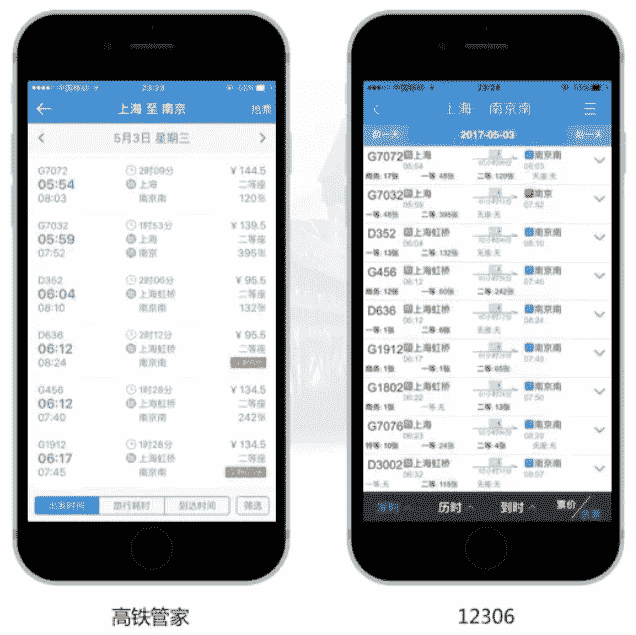

# 第五章 第 4 节 产品专业面试题目讲解——竞品分析类题目

> 原文：[`www.nowcoder.com/tutorial/10073/b1b11b831ae94cd5a26bf26d6fc699b4`](https://www.nowcoder.com/tutorial/10073/b1b11b831ae94cd5a26bf26d6fc699b4)

竞品分析，顾名思义，竞品分析就是是对现有或者潜在的竞争对手的产品进行比较分析。在面试的时候，面试官经常会问到如何做竞品分析、竞品分析的主要步骤、主要方法、收集竞品信息的渠道、竞品分析了哪些产品、你为什么选择这些产品作为竞品、是什么得到的结论是什么，是如何运用到自己的工作中的，竞品分析的时候需要注意等问题。

对于日常产品工作中，进行竞品分析主要有以下原因：

#### 1、 当竞争对手出现新的功能

当竞争对手上了一个新功能，这时我们要马上研究竞争对手的新功能，研究它背后的目的和价值，最终是看能不能借鉴这个功能背后的原理，要不要借鉴这个背后的原理。经过分析之后，还需要产出一份竞品分析报告给领导或 boss 做决策用，这是我们会做竞品分析的一种情况。

#### 2、 改版现有功能，参考别人怎么做

当我们自己的产品某些功能需要进行迭代和优化的时候，往往这个时候不知道怎么做是正确的或者没有头绪和灵感，那么这个时候通常的做法就是去参考下在类似的功能上竞品是如何做的，在面对多个竞品的时候这时候我们要研究哪个竞品做的更加优秀，怎么在本产品的基础上借鉴这个竞品的功能。因为这样做的好处是可以缩短产品设计的流程，在巨人的肩膀上看世界可以看得更远。同时还可以通过分析竞品及时调整产品/运营策略，有助于发现新的增长点。

#### 3、 提升产品感

在准备面试的过程中，尤其是在对于一些没有产品 sense 的同学，很多时候都会去主动分析一些产品的功能点，来提升自己的产品感，这个时候需要去思考别人为什么这样做这个功能，以及这个功能会产生的数据上的和用户体验上的效果。自己分析完之后和别人的分析做对比，看一下哪些地方自己没有想到或者思考得不够深入，从而提升自己的分析能力和判断能力，让自己以后思考产品的时候深度更加深入、维度更加全面。

在进行多次的竞品分析之后，我们可以收获以下内容：

（1）了解自己与竞品的区别、差距，自身优势与劣势，产品的市场份额及竞争力，有助于及时调整产品/运营策略；

（2）了解客户评价，反馈，进一步了解用户需求，引导产品及服务改良或创新；

（3）关注竞品的最新动向，有助于发现新的增长点，有助于及时调整产品/运营策略。我们讲用真题来对面试中经常遇到的竞品分析类问题进行解读。

## 1、如何做竞品分析？

在拿到一个问题的时候，我们首先要对一个问题进行分析，分析问题背后的考察要点

### 问题分析

面试官在面试的时候经常会让候选人对两个产品进行对比分析，尤其是一个垂直领域的几款不同的产品，最常见的比如抖音和快手，微信和 QQ 等相似 APP 的区别与联系。

这样的问题一方面可以考察候选人对行业的洞察、对公司和产品的了解、对同类竞品的熟悉，另一方面还同时考察了其对相关的垂直细分领域知识的了解程度。接下来讲一下进行竞品分析的主要流程和解题思路。

### 解题思路

进行竞品分析的总体流程为：

*   明确分析目的

*   寻找竞品，选择竞品

*   定义分析维度

*   竞品数据收集

*   分析总结

明确了以上流程，通常从以下几个方面分析：

1.  确定竞品（产品咨询收集、选择服务/目标用户相同或类似的产品）；

2.  体验环境；

3.  行业现状与趋势（历史变化、发展趋势）、市场数据（市场容量、竞争格局、市场占有率分布）；

4.  竞争对手的产品定位与发展策略；

5.  产品定位、目标用户（扮演用户、选择研究对象）；

6.  核心功能；

7.  界面交互设计；

8.  运营推广策略；

9.  商业模式；

10.  结论和产出；

## 2、如何选择竞品？你为什么选择这个产品作为竞品呢？

竞品的选择非常重要，如果找错竞品，可能不但不利于自己产品功能的迭代优化，还可能会扰乱自己的大方向，所以竞品的选择一定要慎重。那么该如何寻找竞品呢？应该注意以下几点：

#### 1、选择核心服务/产品和目标用户基本相同的产品

即提供的核心服务、公司的产品、市场目标方向、用户群体等与自己的产品定位基本一致的产品，这个可以说是同类竞品了。找到直接竞品是我们做竞品分析最常见的方法，一般通过比对能直接看出我们的优劣势，方便我们找准产品定位和运营方向。下面列出一些比较常见的同类竞品，可以在面试的时候说出以下竞品：

短视频领域主要有：抖音、快手、火山小视频、微视(腾讯系)、梨视频(新闻资讯短视频)、多闪(头条系)；

直播领域主要有：YY(上 YY，一起玩)、虎牙、斗鱼、一直播、NOW 直播(腾讯系)、花椒直播、映客直播(主打高颜值)；

vog 领域主要有一闪、 VUE Vlog；

陌生人社交主要有微博、绿洲、陌陌、探探、脉脉(也是职场社交)、soul；

内容资讯类主要要今日头条、趣头条、豆瓣、知乎、得到、36 氪、简书、知识星球、片刻、网易新闻、腾讯新闻；

出行服务类有滴滴出行、嘀嗒岀行、曹操岀行、易到、美团打车；

社区资讯类有虎扑、懂球帝、知乎、豆瓣；

电商平台类主要有淘宝、天猫、京东、拼多多、唯品会(品牌特卖)、聚美优品。

但是做竞品分析如果只关注直接竞品，很容易局限思想，难有突破和创新。

#### 2、目标用户相同，但满足的用户需求不同，不会形成竞争关系

对于这类产品，通常会进行不同行业之间的合作，不过也可以通过分析他们的产品和运营策略，从中获得参考和借鉴。

比如电商 APP 经常会与游戏行业相结合，最常见的是拼多多，因为用游戏可以让电商用户对该 APP 形成粘性和依赖，不容易流失。

#### 3、目标用户不太相同，但某些产品流程和服务流程比较相近的产品

对于这类产品在业务流程、交互细节等层面进行研究，可能会在产品功能等设计上产生一些灵感。比如美团外卖的产品经理，完全有可能在“花点时间”的产品设计上找到灵感。

#### 4、核心用户群高度重合，但暂时不提供我们的核心功能和服务，但通过后期的产品迭代可能会升级的产品

比如在音乐市场上有一款产品是“柚子练琴”，它是一款通过线上乐器视频陪练的 APP，但是世面上有一款产品也是做乐器陪练的，但上课方式是语音，那么它就有可能在后期的产品迭代中加上视频上课的功能。

同时，竞品不局限于以上，也可以有以下分类：

直接竞品 – 产品功能相似，目标人群重合，解决方案与技术无明显差异。

重要竞品 – 做得比我们好的竞品

核心竞品 – 做得比我们好，并且非常有竞争力的竞品

间接竞品 – 产品功能形态和解决方案不同，但用户群高度重合，解决的用户需求相同，目前不构成直接的利益竞争，但未来有很大的竞争风险。

一般竞品 – 不如我的竞品

在确定分级关系之后，在竞品分析过程中，你就需要决定在核心竞品，重要竞品，一般竞品中，对哪些模块需要花多大力度去研究和分析。一般而言需要分析的是主要是重点竞品和核心竞品。

## 3、竞品分析的几种方法？

SWOT 分析法 – 针对索要分析的竞品，从“优势、劣势、机会、威胁”四个维度进行比较和梳理；

YES/NO 法 – 适用于功能层面，将功能点全盘列出，具有该功能点的产品标记为 yes，没有的标记 no，通过对比可以清晰的了解竞品间功能点的差异；

评分法 – 这个方法在用户研究中常会用到，通常适用于定量研究的问券调查中，即给出 1-5 分的区间，根据产品中的某一个方面或某点进行打分；

分析描述法 – 指将不同的产品特性以比较的形式描述出来；

比较法 – 是与竞品做横向比较，帮助深入了解竞品，并通过分析找出优势、劣势。

矩阵分析法 – 矩阵分析法也叫四象限分析法，以矩阵的方式分析自己的产品与选出的竞品之间的定位、特色或优势。

## 4、竞品分析的主要方面有哪些？

分析维度有以下几点：

*   首先进行行业分析，分析市场占比、历史变化、发展趋势、市场容量、竞争格局、市场占有率分布；

*   竞争对手的产品定位、发展策略、核心需求、想让用户从中得到什么；

*   核心功能，以及流程结构，用户如何到达某个页面，到达某个页面之后应该去哪；

*   界面交互设计，即产品在交互和视觉上的体验差异、页面布局、按钮表格文本区域等的位置；

*   运营推广策略；

*   分析商业模式，盈利模式和盈利情况，运营资金投入；

*   结论和产出；

## 5、收集竞品信息的渠道？

1.  公司季报、年报、公司数据披露，招聘信息

2.  公司官网（版本更新、人才招聘、最近新闻等）

3.  产品论坛（用户反馈、客服回复等）

4.  艾瑞、易观国际、艾瑞咨询，易观智库，企鹅智酷等数据网站的行业分析报告等

5.  媒体咨询：行业媒体的新闻论坛或分析文章等

6.  从对方公司、相关渠道、市场、运营等部门获得对方内部的信息等

7.  亲身体验：作为用户使用对方产品，进行客服或技术咨询等，获取想了解的信息（特别是产品实现规则等方向）

8.  寻找对方产品用户（核心用户、普通用户等）进行访谈等

9.  百度指数、alexa.com、Google adplanner 等

10.  数据平台：CNNIC，DCCI 互联网数据中心 ，百度指数，七麦数据，App Annie 等

那么针对不容维度收集竞品信息的渠道有哪些呢？

1、行业现状和市场格局

关于行业的分析报告和市场格局等信息，在艾瑞咨询、易观、DCCI 互联网数据中心、行业年鉴等，都有很多可参考的数据和信息。

2、产品的版本迭代情况

产品的版本迭代在安卓应用市场或者 APP Store 中就可以查询到，这里面还可以查到很多功能的介绍。

3、产品的运营事件和运营信息

这个信息一般可以在微信公众号、微博、知乎、网页新闻等页面也可以查到，不过对于很多产品来说，初期的运营事件或信息一般很难查到。这里可以告诉大家一个方法，先在易观上查出它的用户数规模，然后找几个显著的用户增长点，根据这个点逆向思维去找它的运营事件，是一条捷径。

4、产品的业务流程梳理

这个需要自己亲身去操作和实践，才能了解竞品的整个业务是如何运转的，比如画出产品功能结构图等。

## 6、怎么利用收集的资料多维度的 x 去分析竞品？

我们在进行竞品分析的时候，会提前收集大量的资料，不管是自己体验，还是阅读一些网站的报告，那么面对错综复杂的资料我们如何多维度的分析竞品呢？面试官也会问此类问题从而考察我们整合信息的能力以及是否可以全面地进行竞品分析。

主要从以下几个维度去进行竞品的分析：

1、对比产品的数据和市场认可度

了解竞品间产品和市场方面的数据对比，通过数据对竞品有个大概的认识。数据主要是市场份额占有比例、下载量对比，榜单排名对比，评分对比；活跃人数，启动次数对比；曝光次数，百度搜索指数对比；上市时间，融资情况对比等。通过数据对比，找到两个产品之间的差距，明确差距之后，就需要找应对方法和解决办法，应该在哪方面提高，应该在哪方面加大力度等。

以下列出集中获得数据的方法：

1） 友盟指数：研究手机设备排行、用户社交分享行为、移动推广效果等。

2） 易观千帆：领域排行、月度 TOP 排行、增幅排行榜等多项排行，支持查看 App 趋势图及多项指标。

3） 艾瑞咨询：用户行为分析。

2、对比产品的目标人群定位和使用场景的差别

产品定位，简单来说就是这个产品能给哪些用户 带来什么样的需求满足。所以，我们一方面要对我们的用户进行分析：包括用户年龄段、收入情况、受教育程度、分布城市、消费特点等，总结出用户特性，此处最好可以用图表或者表格表现。

另一方面是分析满足了什么需求：针对这方面，可以设置用户使用场景。

3、对比特色功能

对比特色功能就是对比双方的产品在功能设计上偏重哪个方向，其实也就是该竞品是凭借何种核心功能立足的，用户为什么会喜欢这个产品，对这个产品形成粘性，这个产品的价值是什么，可借用性强不强等。这个过程不是全部肯定竞品，全部否定自己的过程，而是择优而用。

4、对比运营策略和运营方向

运营策略其实就是竞品的推广方向和用户获取方法，分析他们各个产品阶段怎么去做运营， 怎么做推广，怎么做矩阵等等，学习它、优化它。

5、对比产品的版本迭代和演化路径

竞品分析过程中同时也需要梳理竞品的版本迭代和演化路径，主要是找出它的关键时间节点、版本更新情况和当时的运营手段，同时每次版本迭代时各类应用商城也会有记录版本更新了什么内容，可以通过这个看出产品经理最看重的迭代是什么功能。除此之外，最重要的是预测他们未来的发展方向并且及时调整自己的产品发展方向。

## 7、竞品分析中功能点的竞品分析和整个产品的竞品分析的相同点和不同点？

相同点：

*   目的性明确

*   注重底层业务逻辑流程

*   重点分析用户需求如何被满足

不同点：

功能点调研：（1）重业务流程 （2）交互设计 （3）突出亮点

产品调研：（1）重功能迭代过程 （2）重产品结构 （3）运营逻辑

当我们做竞品分析的时候首先目的要明确，是重点做的功能点竞品分析还是整个产品的竞品分析，如果每个点都有的竞品分析报告容易指向不明确，而且观看者很难抓住重点，因此需要对不同类的竞品分析报告抓住重点。

## 8、你竞品分析得到的结论是什么呢？

竞品分析的时候，面试官其实最看重的就是在研究竞争对手时，得到了什么有用的结论，这个结论是能够让产品不断进行优化和迭代的，只有这样面试官才会觉得是有效的思考。要从以下几点进行分析：

1.  要不要借鉴竞品的功能：

那么首先要分析竞品的这个功能和自己产品的用户群体是否一致，在这个功能上数据的表现如何？如果竞品的用户和自身的产品的用户不一致，数据表现再好也不能盲目借鉴这个功能，需要对该部分用户进行灰度测试，观察这部分用户在该数据上面的表现，如果一致再进行放量。如果用户群一致，但是竞品的数据表现很差，比如播放量、点赞、评论用的人都很少，那么别人走过的坑我们就不要去走了，还是放弃掉这个功能。

1.  借鉴竞品的功能是否有技术门槛？

有的时候我们看见竞品优秀的产品功能时，也要思考自己的团队有没有相应的优秀的技术，如果没有对应的技术，比如推荐算法，图像识别算法，那么产品功能也只能借鉴皮毛，最后达成的效果肯定还是不太一致的，这个提前要有心理预期。

## 9、竞品分析了哪些产品，各自的优缺点是什么？

在做竞品分析时，如果被问到分析了哪些竞品，各自的优缺点是什么，对于笔试和面试的侧重点是不一样的。

笔试场景更侧重“全”，展现你思考的广度。因为笔试中你一般有较充足的时间去整理你的思路，而且你和考官直接是异步交流——你先写下来，他再看。因此你需要提升表达内容的质量，考虑的更多，然后精心组织每个答案。

面试场景更侧重“深”，展示你思考的深度。在面试场景中，你和面试官之间是同步交流，你一边说他一边听，因此能够在短时间内抓住对方的注意力，且让对方记住你的若干论点是最关键的。这时候如果追求全，很容易导致面试官记不住你到底讲了什么。因此，在某一个点上做更深的思考，力求让面试官记住你最想表达也思考最多的点，往往会有更好的效果。

因此在面试的时候需要找出两者产品在核心功能上的优缺点，让面试官觉得这个缺点确实有损用户体验或者有损商业价值，如果能找到这种地方的缺点，才能让面试官觉得候选人的想法很有说服力同时也是一个真正认真思考过产品的人。

## 10、你竞品分析中，你觉得有哪个产品的哪个模块做的比较好？

这里可以用 12306 和高铁管家举一个回答样例：

用户体验五要素是进行竞品分析一个比较重要的方法。那么框架层指的是该产品界面的设计，需要阐述其页面布局是否合理，其中包括：界面设计、导航设计、信息设计，而这三点都离不开页面的布局，因为合理的页面布局可以帮助用户快速浏览信息并准确的找到需要的信息。

对于移动端的应用，要么是帮助用户节省时间，要么是帮助用户消磨时间。对于线上购票的 app 自然是帮助用户节省时间的，它首先解决了线下排队的问题，节省了排队时间与取票时间，那么在乘客进行网络购票时这些应用也需要为用户提供良好的购票体验。

可以试着想一下自己的购票核心决策点：无非是时间、票价的对比，因为在前置的页面早已将起始站选择好。

高铁管家：

由上至下以第一列为例，我可以看到的元素是：

车次及车次号、出发时间、到站时间

而其中时间被用蓝色加粗放大的设计突出出来，让我在由上至下快速浏览时能够很清晰的对比出这些车次在“时间”上的的差别。

上图是为了满足不同用户需求，底部三个与“时间”相关的筛选按钮选中后将突出显示对应的时间字段方便用户快速浏览，那么高铁管家对于这三个功能的设置就分别对应了三种不同的用户场景。

在席位展示上，高铁管家优先选择展示二等座余票与价格，对于我来说已经能够满足我的需求，但对于其他需求的用户，他们可能需要点击进入下一张页面才能看到其他席位的信息，而

12306 则是将车次的元素尽可能多的展现在了列表中，但是它的排列却使人觉得页面有些杂乱无章，摸不清重点。

这样的对比并不是为了去说哪个做的好哪个做的不好，而是在同类型产品分析与对比中帮你总结出更多的用户场景，锻炼你对与信息的展示、优先级排列的技能。

需要注意的是，列表页只是一个示例，我们做页面设计时不光光是通过文字组合排列、颜色大小的变化突出去传递信息，banner 的使用、图标的使用也是有效传达信息的一种必要手段。

## 11、竞品分析时需要注意的地方？

在做竞品分析之前，首先需要明确做竞品分析报告的目的、报告给谁看、输出什么观点这几个很重要的前提。

第一个需要明确的这份报告的目的是什么？是在产品的日常积累，熟悉多种多样的产品，还是在日常的工作中有一个功能点需要改善却想不到很好的解决办法打算研究一下竞争对手是如何做的，为优化迭代自己的产品寻找灵感，或者在面试的时候当面试官让分析两款竞品的时候有所准备，这几种情况都体现了具备竞品分析的能力是多么重要。

第二个是这份报告要确定输出给谁看。是面试的时候给考官看来加强自己有所准备的印象，还是自己作为产品经理在分析产品的时候便于整理思路的文档，还是内部沟通和跨部门沟通或者进行汇报的材料，或者是给领导决策产品走向路径的的时候请求支持的素材，还是给产品团队内部小伙伴，比如开发同学和测试同学。针对上面不同的受众在竞品分析报告的输出上面应当有不同的侧重。

第三点是这份报告应该明确输出什么观点和内容，这一点应当结合前两点来决定。即这份报告所做的背景和目的是什么，给受众是谁，通过这份报告我们要向他们传达什么内容。因此确定好前两个问题才能够很好地解决这个问题。需要注意的是报告一定要有相应的结论，也就是要有自己的结论和观点输出，没有结论的报告只叫展示，并不能叫“分析报告”，而且你要汇报的对象也是十分看重你研究竞品之后所得出的结论，这也会成为他做出决策的依据。

很多同学在做竞品分析时容易犯一些错误，这些错误在面试官眼里很可能显得不够专业或者想当然，面试的印象分就会大打折扣。

1、确保数据来源的真实性和有效性

报告中的数据从哪里来，什么时间发布的，都要进行备注说明。

2、对比时有截图作参照

保证报告中的对比有理有据，清晰可读。

3、做的是竞品“分析”，而不是竞品“抄袭“

重点是分析产品，理解为什么其他竞争对手要那样做。分析自己的资源，能力是否能够做一样的或更好的选择，而不是一股脑的把各个产品对比后，选择出自己认为还不错的功能，组装成一个 APP。

4、选择合适的竞品，明白为什么选择竞品

选择的竞品可能是因为业务上有重叠，服务上相似，功能上雷同，千万不要看到竞品就开始拆解功能直接分析，在竞品分析的过程中要知其然，知其所以然。

5、重要的是分析出结果，而不是罗列数据

单纯的对比功能，罗列数据是没有任何意义的，需要透过现象看本质，每个功能的背后涉及一系列的技术与服务，通过对比分析，得出结论，然后总结适合自己的发展路线

6、评判过于主观

我们可能在生活中经常会只凭个人喜恶，可能有些做竞品分析的人员会把“这个颜色我不喜欢”“这个 APP 我常用很顺手，所以喜欢更多些”诸如此类列入评判因素，这是非常不恰当的。竞品分析应当是一份有理有据的报告，有自己的背景、目的、结构、输出，而不是纯粹依赖于个人喜好。

需要注意的是，竞品分析报告既然是报告，就会有结论，就是有主观成分的。所以以上是指不要加入太强烈个人偏好，不要以个人喜恶来占主要因素去判断一个产品的好坏。

7、缺失场景代入和全局视角

在做竞品分析时，应当更多地站在产品整体的角度，甚至该产品目标用户群、目标市场、商业模式等各要素的角度来统一的开待这个产品，从而判断此产品的功能是否恰当。举个例子，A 产品和 B 产品同样具有一个功能，虽属同类产品，但可能 A 的某一功能点在 B 产品上并不适用，但我们不能就此认为 A 产品不应当具备此功能点。相反，我们需要通篇考虑 A 产品的目标用户、目标市场、商业模式等要素后，再评判 A 是否需要具备该功能点，不应当站在 B 的角度去评判 A。在做竞品分析时，需要有整体眼光，尽可能地考虑深层次的逻辑关系，这样才能更好地贴近产品间实质性的关联和差别。

8、没有更新至最新版本

这一点看似好像无关紧要，其实非常重要。我们都清楚产品的迭代是非常快速的，尤其是移动端的 APP。所以如果需要进行竞品分析的话，需要保证是在现有的版本之下进行比照。一是因为拿 A 产品最新版本 2.0 和 B 产品历史版本 1.0 做比较本身就不具备意义；二是竞品分析人员可能在分析过程中发现、梳理、总结出一些问题、特点、结论，然而在下一版本中很可能已经不复存在了，同样不具备意义。当然，如果要对比版本演化的话可以加入历史版本比较。

竞品分析是产品人常用的方式方法之一，分析也依据需求的不同适用于产品不同的阶段，在分析过程中了解如何分析、为谁分析、得出什么结论和成果是重中之重。

## 12、今年短视频领域大爆发，请分析下抖音和快手的区别？

产品定位

抖音：产品 slogan：记录美好生活

产品定位：专注年轻人音乐短视频社区平台，以潮流音乐、舞蹈、表演等内容形式，搭配超多原创特效、滤镜、场景切换等，帮用户打造刷爆朋友圈的模型短视频

快手：

产品 slogan：记录世界记录你

产品定位：用于用户记录和分享生产、生活的平台，记录和分享大家真实生活的平台，在这里发现真实有趣的世界。

从两产品 slogan 与定位即可发现其产品内容上的侧重点不同，抖音的目的在于打造明星单品，引起病毒式传播，而快手的目的是给予每个人记录与展示自我的平台，打造平民爆品。由于这种不同，进而影响其用户属性和市场表现的差异。

用户人群对比

从艾瑞咨询的数据分析可得，从用户性别上来看，抖音与快手并无本质区别，男女性别使用比例均接近 1:1，抖音用户女性用户较男性多 5.66%，快手男性用户较女性多 8.56%；从使用人群占比上来看，抖音与快手使用年龄 35 岁以下占比较多，均达到了 80%以上；从使用区域占比来看，抖音的用户主要分布在广东、江苏、浙江这样的沿海地带，快手的主要用户群体除了广东、江苏以外，还有很大一部分位于山东、河北河南等内陆地区，所以“北快手，南抖音”的说法不无道理。

造成以上分布原因有以下几种：

（1）平台定位不同

抖音定位于一二线城市的年轻人，引入明星、网红进驻平台，自然会吸引追星的年轻女性，快手定位于一线到五六线的用户，着力于为每个普通人提供社交平台，中国男性人口偏多就反映在用户性别比例上。

（2）社交方式差异

35 岁以下的年轻群体是 UGC 的主要生产者，经历了互联网社交平台发展的全过程，从人人网、QQ 空间到朋友圈，完美过渡到短视频平台。每个人都是内容创作者和内容消费者，这些用户创作更多的优质内容有足够多的消费者来观看，获得了内容消费者的点赞与平台的奖励，以此创作更多优质内容，而优质内容是内容消费者更愿意停留的核心，如此形成相对良性的循环。

（3）区域发展差异

沿海地带经济较为发达，吸引大量年轻人前往发展，与抖音的定位相符，快手的用户市场较抖音下沉，加上两个平台的布局倾斜，造成了用户地域分布的差异。

产品功能

（1）沉浸式与瀑布流

抖音的沉浸式体验与快手的瀑布流展示是短视频平台两大标志性的展示方式，两种截然不同的风格对内容生产者，内容消费者，以及平台提出了不同的要求

内容生产的差异

抖音的沉浸式体验对内容质量有了的更高的要求，大量优质的内容和内容特色是吸引用户的关键，生产者需要花费时间在内容设计与视频玩法上，为用户创造新奇的体验；快手的瀑布流展示可以同时展示多个内容类型，此时内容的封面尤为重要，生产者需要花费更多的时间在封面设计上，以博取流量

内容消费的差异

沉浸式体验的单一下滑操作会缩短返回时间，所以这种方式会使用户粘性更强，特殊用户体验更佳，但用户容错率较低；瀑布流给予用户选择的权利，内容类型繁多造成用户类型更广，用户容错率更高，但过长的返回时间可能会造成用户粘性不足的现象。

平台算法的要求

沉浸式对平台算法的精度要求更高，依据单个视频的停留时间，同类型视频的观看次数等给予推荐，用户使用时间越长，算法越精准，但会造成内容同质化严重。瀑布流给予用户更广阔的选择，平台依据用户选择判断用户兴趣进行内容推荐，但需求判断上没有抖音那么准确，且容易错过优质内容。

（2） UGC 与 PGC

快手依靠 UGC 培养了大批 KOL，且接地气的形象使用户粘性极强，这也是快手依靠直播变现赚取大量资本的原因。但抖音依靠引入 PGC 的优质内容吸引其它平台消费者入驻，同时积极发展核心 UGC，双管齐下，很快便抢夺短视频的大片市场份额。

内容的差异性

UGC 内容不确定性大，普通 UGC 内容只在固定的社区内传播，优质 UGC 内容往往是独特风格、团队协作、平台推广等众多因素造成；而 PGC 内容本身在其他平台获得一定影响力，可快速导入平台。

流量的差异性

UGC 的流量需要用户生产者自身的创新与平台的曝光扶持，且经营时间较长，但形成流量后用户粘性高；优质 PGC 自带流量，只需平台进行曝光，经营时间较短，且可快速打响品牌效应，帮助平台成长。

收益的差异性

UGC 的高粘性造成收益转换率高，平台通过 KOL 为代表的直播变现，电商变现等方式，赚取大量资金；PGC 的高流量促使平台通过流量曝光即广告导流，贩卖分发流量等方式赚取收益。

（3）中心化与去中心化

平台标签的差异

抖音初始的 slogan“让崇拜从这里开始！-专注新生代的音乐短视频社区”就注定它会大量倾斜流量给 KOL 头部用户，同时加上人工强势介入运营流量池，逐渐营造出相对“潮、酷、城会玩”的平台标签；快手使用的平均推荐流量，让每个人拍的短视频作品都更可能被看见，因此用户群体创作的视频内容相对更接地气，正如它的 slogan“记录世界记录你”，也因此被贴上了“low”的标签。

用户粘性的差异

快手凭借更低门槛的用户参与感获得成功的自然用户增长。用户可以在个人主页建群与粉丝们互动沟通，此以社区信任关系为驱动的快手粉丝的忠诚度、粘性及留存率都相对更高，这也快手的变现收益比抖音更大的原因。抖音凭借

用户体验的差异

抖音平台流量倾斜的 KOL 用户粉丝粘性较弱，因此以“中心化”流量分发为驱动的抖音需要配合强运营重拳出击，产品功能上从前期开始就注重短视频的更多玩法，挖掘了各式话题及挑战活动，拉动用户活跃性，着力提升用户体验。

商业化

抖音：媒体平台，收入主要靠广告，80%收入来自广告，媒体模式收益的天花板更高，注定其市值空间高于快手；

快手：偏社交属性，收入主要靠直播，60%收入来自直播分成，其次是广告