# 第三章 第 1 节 需求分析

> 原文：[`www.nowcoder.com/tutorial/10036/983d9908a0404a23976e4d056a76b5f9`](https://www.nowcoder.com/tutorial/10036/983d9908a0404a23976e4d056a76b5f9)

# 产品基础技能之需求分析

需求之于产品，就如同小溪之于大海，它组成产品，决定产品最终的核心属性。需求的评估、筛选、管理决定了一款产品的功能能否为用户提供合理、准确、优质的服务，故而需求分析在产品经理日常工作中至关重要。

从一个需求产生到最终进入版本规划，要经历多层筛选和评估：

**1、****需求收集**：倾听用户的声音，关注数据反馈，收集用户需求；

**2、****需求筛选**：抓住需求本质，将“用户需求”转化为“产品需求”；

所谓用户需求，关注的是用户遇到了什么问题，希望能解决成什么效果；而产品需求，则是针对用户需求所产生的一个解决问题的思路和产品策略。我们通常会先将收集来的需求进行基本的价值判断，剔除其中明显不合理的需求，再通过场景分析找到剩余需求的需求本质，将用户场景描述转化为产品实现方案；

**3、****需求拆解**：细化产品方案，将“产品需求”转化为“功能性需求”；

通常我们会采用“用户流程”方式进行前端页面场景分析以及“数据流程”方式进行数据流转分析，以此来对需求进行合理的拆解，并填写在功能列表中；

**4、****需求优先级排序**：确定需求性价比，将“功能性需求”转化为“版本需求”

我们要将拆解好的需求进行产出价值和投入成本的评估，最终根据这两个值的除数得到每个需求的性价比，按照性价比由大到小将需求进行排序，再根据版本规划将需求置于各个版本中去。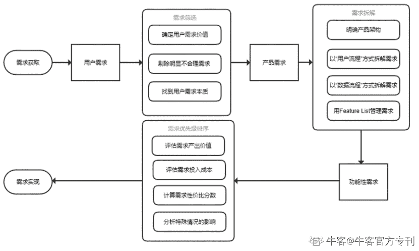                                                                                     需求分析流程图

以上就是产品工作中需求分析的一般流程，接下来我们对每个流程进行具体的分析。

### 1.需求筛选：“用户需求”转化为“产品需求”

对于产品经理而言，需求总是易得的。用户研究报告、市场分析数据、老板意见反馈都会成为一款产品的需求来源，但这些需求真的都是用户心中真正想要的东西吗？我们应该按照大家提出的所有需求去设计我们的产品吗？显然不是，如果我们真的这样做，产品就会成为一个四不像的庞然大物。当产品经理接收到需求，第一步就是要对需求进行价值初判，剔除那些明显不合理的需求。不合理的需求通常有以下几种情况：

#### （1） 产出很小、无法实现或者是投入极高的需求

网上流传很广的程序员和产品经理打起来的新闻，就是因为产品经理提了一个产出小，而且难以实现的需求：希望手机主题颜色可以根据手机壳颜色自动调整。很明显，手机壳属于硬件设备，无软件嵌入是难以读取其颜色的，故而想要根据手机壳颜色进行手机主题颜色匹配实现难度很大，同时除去新鲜感，这个需求对用户产生的实际价值很小，故而可以确定为明显的不合理需求。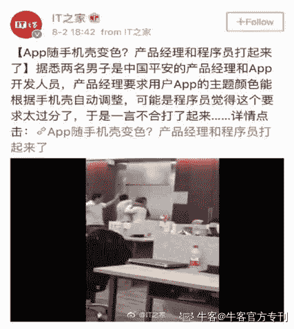 

#### （2） 和产品定位明显不匹配的需求

例如用户想要支付宝中有看视频的功能，就是和产品定位明显不匹配的需求。视频播放对于用户是有价值的，但由于支付宝的产品定位是支付工具，需求筛选必须要以产品定位为核心，否则就会伤害产品原有用户的体验，并且使得产品定位不清，用户粘性降低。 

#### （3） 和产品现有功能产生矛盾的需求

例如若 QQ 的用户提出希望可以看到哪些人是“隐身”状态，那这就是个不合理的需求。之所以设计“隐身”功能就是为了满足用户在线上但不想被人知道的心态，若增加了“查看隐身状态”这一需求那原有线上功能就形同虚设，两者是矛盾的，无法同时存在。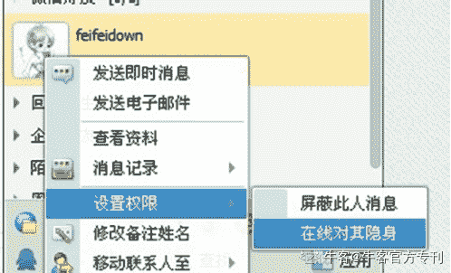 当剔除明显不合理需求后，我们需要对剩下的需求进行进一步的分析，找到用户需求的本质。不同的人对于产品会有不同的需求，这些需求都是用户的声音，是有价值的，我们要倾听，但不可以完全按照用户要求去做，我们需要的，是通过用户需求分析找到用户的核心诉求，满足用户内心深处真正的渴望。例如，当一位用户和你说他需要一个包子，你决不能仅仅为其提供一个包子，你需要找到他要包子的核心原因——饥饿，并在此基础上为其提供丰盛的美味佳肴。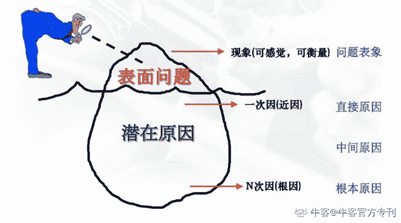

对一个需求进行评估，可以按照下面的路径进行思考：

第一：你是否准确的理解了用户需求？（用户真的是需要一个包子吗？）

第二：用户产生需求的场景是什么？（用户提出这个要求的时间和场景是？）

第三：需求产生的场景是否具有普遍、高频的特征？（是不是很多人都想要包子？）

第四：用户提出这个需求的核心诉求是什么？（是因为饥饿吗？）

第五：针对这个核心诉求，这个需求有其他的实现方案吗？（除了包子，馒头、鱼肉是不是也可以满足他？）

按照上述步骤，我们就能更容易发现用户需求的本质，并提取出更多有价值的信息点，这里举一个工作中的实例来进行分析。 

在我从事“视频社区”业务期间，用户曾通过用户反馈系统给我们提建议，希望我们支持用户删除他自己创作的视频下的评论，在收到这个反馈之后，我及时的联系到了这位用户，并对其需求进行了分析：

第一：通过电话回访，我确认了用户是需要一个能够对自己创作的视频下的评论进行管理（主要是删除）的功能

第二：经过场景还原，我得知之所以有这个需求，是因为用户自己的视频在社区中遭到了恶意辱骂

第三：经调研得知，社区中确实普遍存在未触及敏感词，但对于作者不太友好的评论，并且有许多作者选择了删除创作视频的方式来缓解其带来的不适情绪

第四：进一步思考发现，用户的核心诉求是创作后能得到正向反馈并能处于一个和谐的创作环境中

第五：针对用户核心诉求，除了支持用户对其创作视频的评论管理，平台对于优质评论的筛选、不良言论的处罚也非常重要。

基于此，我搭建了一套平台的用户信用评级体系，当用户有创作、积极互动、举报不良言论等正向行为时，给予其信用分奖励，当用户有恶意中伤他人，违反社区规范等行为时扣除其信用分，以此来规范用户行为，解决用户的核心诉求。

从上面的例子可以看出，虽然用户只提出了一个视频作品评论管理的功能，但是我们能通过对需求的深入分析发现更多的有用的信息点，将“用户需求”转化为“产品需求”。若当我们接收到这个需求时只是简单的实现而不进行进一步思考，用户的痛点没被解决和满足，后期当用户在互动过程中有了不好的体验，仍然会影响用户对产品的感知，降低用户忠诚度。

当我们对需求进行筛选，确定了需求实现的价值后，我们就要将需求进行拆解，将产品需求转化为技术可以理解的功能性需求。

### 2.需求拆解：“产品需求”转化为“功能性需求”

每款产品都会有其自身的战略定位与产品架构，好的产品架构是一座结构清晰的大型城堡，城堡中有许多的套间，我们称之为“一级模块”，套间内常常包含许多的小房间，我们称之为“二级模块”，住在这些小房间内的需求我们称之为“特性”，每个特性都有独属于自身的属性，例如“需求描述”、“类别”、“优先级”、“产品人员”、“需求地址”等，在这个大型城堡内，每个需求都应该有房可住，不至于流离失所。

需求拆解就是为需求在产品架构的大型城堡内寻找对应房间的过程，具体来讲就是结合产品的战略定位和已有的产品架构将“产品需求”通过思考模块归属、细节设计来转化为技术可实现的“功能性需求”。

通常，我们可以通过 xmind 等软件来整理产品的基本架构，明确产品的基本模块，下面以 B 站移动端产品架构为例来讲述产品拆解模块的逻辑。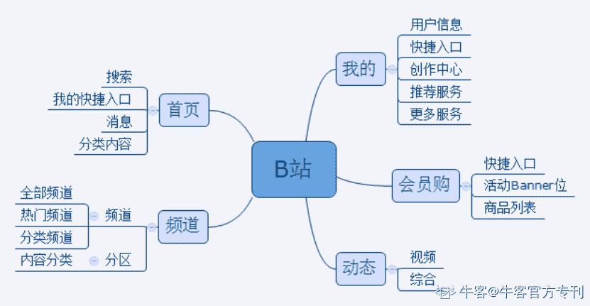 

上图可以看出，B 站 APP 主要分为 5 大模块，分别为“我的”、”会员购”、“动态”、“频道”、“首页”，这 5 大模块又可以细分为下一级的小模块，小模块中会包含许多的功能点，这些功能点就是由需求拆解并最终实现的。

为了让大家更好的理解产品架构以及需求拆解方法，这里以“B 站的个人主页中的【编辑资料】功能” 为例来进行讲述。 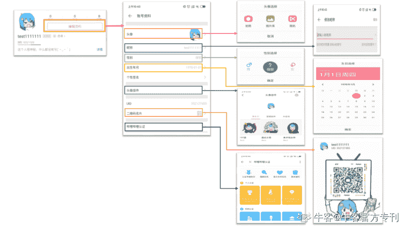

从上面的交互设计图（交互设计图：描述对象之间的关系以及对象之间的信息传递的图）中可以看出，编辑资料页面的上级页面为【我的页面】，其页面中承载的主要是用户信息的编辑与显示，于是我们可以确定这个需求对应的一级模块为“我的”，二级模块为“用户信息”。

在明确所属模块之后我们需要对需求进行详细的拆解。在实际的产品工作中，需求拆解可以从两条路径进行思考：一个是“用户流程”，就是指一个用户在体验这个需求的路径中会遇到的功能点，另一个是“数据流程”，指的是从技术的角度而言，数据流通的整条流程涉及的实现要点。

通过这两种路径分析方法，我们可以对【B 站编辑资料】需求进行以下拆解：

#### 1) 用户流程

以“用户流程”方式来拆解需求，最重要的是对用户操作路径的穷尽，从用户编辑资料的各种场景来对需求进行拆解。 

如上图所示，当用户点击【编辑资料】按钮进入【编辑资料】页面，用户可能是要对自己的头像、昵称、性别、出生年月、个性签名、头像挂件进行编辑，也可能会有复制自己的用户 ID 以及保存自己的二维码进行传播的需要，除此之外，产品经理希望用户能进行 BILIBILI 认证以提高用户粘性。

根据以上场景分析我们可以得知，产品在功能上需要支持按钮的跳转，编辑页面的前端设计，资料对应项的更改和保存，文案的复制、二维码的自动生成以及认证页面的跳转。

对比可以发现，我们拆解后的前端场景和之前所绘制的交互设计图是完全对应的，用户流程的场景的构建有助于提升我们对需求前端设计的感知，使得需求更加可视化，让产品在前端设计与交互上没有遗漏、清晰明了，这是“用户流程”路径分析的价值。

#### 2) 数据流程

单单从用户场景和流程拆解需求是不够的，有许多的功能的实现还需要后台技术进行数据库的开发以及运营后台的搭建，【数据库】指的是“按照数据结构来组织、存储和管理数据的仓库”，用以管理如用户信息等产品数据，【运营后台】则指的是公司的运营同事对例如页面中要显示的“头像挂件”等产品相关的要素进行管理和操作的平台，没有运营平台，就无法开展运营活动。通过对数据流程进行梳理，了解数据的流转，我们能够考虑到一个需求前后端的完整形态，不会遗漏后端技术人员所需要开发的后台相关功能，故而从“数据流程”角度来拆解需求也非常重要。

以“数据流程”来拆解需求，最重要的是关注数据的流转，并依此构建技术功能点。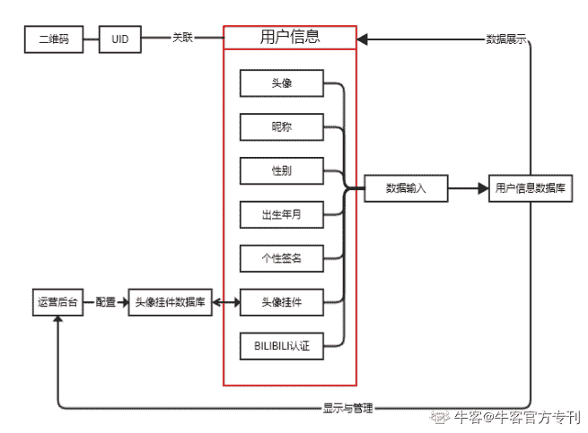 

如上图所示，本需求的核心数据是用户信息。首先，用户资料数据库中应包含 UID（用户编码）、二维码与用户信息的关联关系，用以查询；其次，用户资料需要支持输入、存储以及运营管理；最后，用户信息中的【头像挂件数据】属于运营数据，需要运营在运营后台进行配置。

根据以上分析我们可以得知，从信息流转的角度来说，后端技术需要提供数据输入、数据显示的接口供前端调用，这样前端才能正确显示每一个用户的头像、昵称等信息；后端技术还需要构建运营后台用户信息的管理，用户信息的管理有助于产品经理了解用户情况更好的进行需求规划，同时也能够防范风险，若有用户刷单或黑产，可以及时进行封禁操作；最重要是，后端技术还需要开发运营后台用于头像挂件的配置，包括头像挂件的样式、名称以及购买所需要的数额等，这样前端才能够正确显示头像挂件页面和用户购买的头像挂件。

数据流程的探究和分析有助于我们了解产品的信息架构，构建最基础的技术逻辑，防止进行需求拆解时仅仅考虑前端页面设计的情况。

进行需求拆解时，最重要的两点，一点是横向上尽量的全，不要漏掉技术点，导致形成链路断节，另一点是纵向尽量的深入和清晰，避免描述不清影响实现的情况。结合以上两个方法进行分析，能够做到前后端设计上没有遗漏，完整详细。

在进行需求拆解分析后，我们可以用 Feature List 来进行需求的管理。Feature List 又称之为功能列表，格式一般为 excel，其中包含“一级模块”、“二级模块”、“特性”“需求描述”、“类别”、“优先级”、“产品人员”等列字段，能够清晰的显现需求拆解的结果。

举例来说，上面所说的【B 站编辑资料】需求的 Feature List 如下表所示，需求从属于一级模块“我的”，二级模块为“用户信息”，其中包含了“编辑资料页面设计与跳转”、“头像挂件页面设计”、“支持复制 UID”、“支持生成二维码并保存”、“头像挂件运营后台设计”、“用户信息运营后台管理”六大特性，特性中又有详细的需求描述，具体参见下表：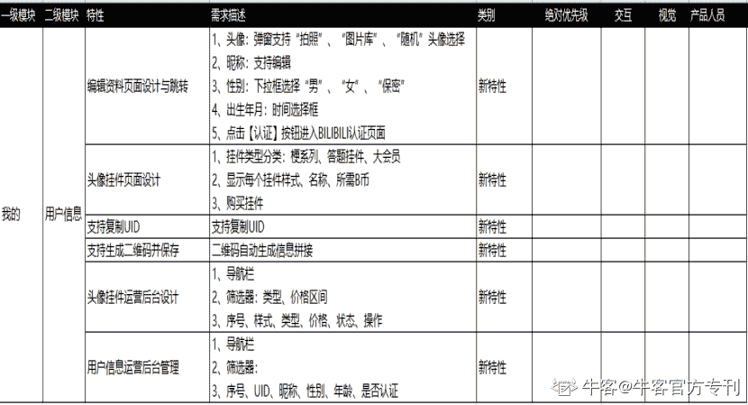 

总的来说，需求拆解的一般过程为：1、分析产品架构，明确基本模块；2、通过“用户流程”、“数据流程”对需求进行路径分析，拆解功能点；3、思考功能点所属模块，用 Feature List 来承载拆解结果。通过以上流程，能够把抽象的产品需求拆解为技术可实现的具体功能点，方便下一步转化为版本需求。

### 3.需求优先级排序：“功能性需求”转化为“版本需求”

虽然将产品需求拆解成了功能性需求，但实际工作中的开发资源总是有限的，常常会遇到需求积压、无法全部实现的情况，故而能够对需求的价值以及成本进行评估，进而确认需求的实现顺序非常重要。合理的需求优先级排序以及版本需求决策能够提高公司资源的利用效率，将需求价值最大化。

通常我们采用比较“性价比”的方式来评估需求，即通过对需求的产出价值以及投入成本进行评估得出需求的性价比分数，然后按照最终的性价比得分由大到小来对需求进行排序。

#### 1) 需求产出价值

首先我们需要对需求产出价值进行评估，产出价值方面我们一般从两个维度进行考虑，一个是需求的用户价值，也就是这个需求为用户提供的显性、情绪价值，另一方面是对公司或者是合作伙伴的商业价值，也就是能为公司带来多少收益，这里的收益不仅仅指真实的金钱收益，也包括社会声誉、企业形象等隐性收益。

针对用户价值，我们通常采用卡诺模型（KANO 模型）来进行评估。KANO 模型是东京理工大学教授狩野纪昭(Noriaki Kano)发明的对用户需求分类和优先排序的工具，核心理念是从用户对于需求的满意程度出发，来分析需求价值和用户满意之间的非线性关系。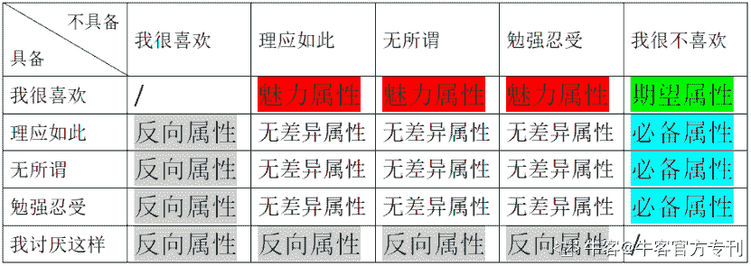 

KANO 模型将产品和服务的质量特性分为以下五种类型：魅力属性、期望属性、必备属性、无差异属性、反向属性。下面具体对这五种类型进行解释：

(一) 魅力属性

魅力属性是指超出用户期望之外的，会给用户带来兴奋感的属性：若服务中不包含该属性，用户的满意感不会因此降低，但若提供了该属性，用户的满意感会有明显提升。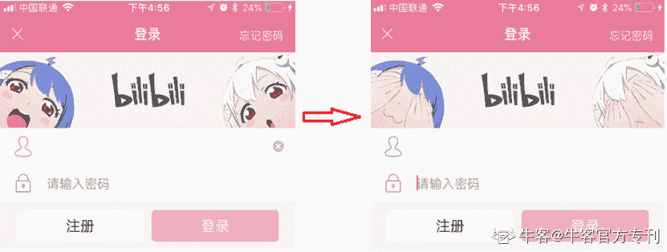 

这在产品中一般是用户难以自我察觉到的惊喜需求，例如 B 站移动端的密码输入框背景采用“蒙眼”设计来表明密码的私密性，非常可爱和亲民。虽然有无此设计并不影响用户登录行为顺畅度，但有此输入框后会降低对输入内容成本的感知，提高用户的情绪价值。

(二) 期望属性

期望属性是指那些是否存在会对用户满意感有明显影响的属性：若提供该属性，用户满意感会有提升，若不提供该属性，用户满意感会降低。 

这通常指的是用户有所期望的产品需求，例如播放产品中的播放顺畅度，若在播放中不卡顿，体验流畅用户的满意感就会上升，否则就会下降。

(三) 必备属性

必备属性是指用户心中产品应包含的基本属性：当产品包含此属性时，用户满意度不会提升，但若不包含此属性，用户满意度会大幅降低。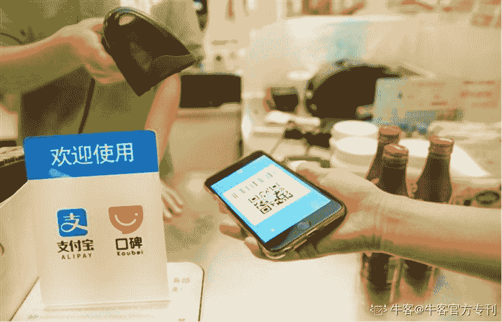 

互联网产品中的必备属性通常为用户的基础、高频需求，例如微信的聊天功能、支付宝的支付功能等，当产品无法满足用户这些需求，用户的满意感会大幅下降甚至放弃产品。

(四) 无差异属性

无差异属性指的是对用户体验感无明显影响的属性：无论提供或不提供此属性，用户满意度都不会有改变。

   这在产品中通常是某些重要需求的前置需求或者从战略规划角度来说产品希望用户使用的需求，例如 B 站编辑资料中的【认证 BILIBILI】功能，对于大多数用户来说就是无差异需求，有或者没有并不影响用户编辑资料的满意度，但由于认证用户更加方便平台管理和激励，故而对于产品而言，仍然是有价值的。

(五) 反向属性反向属性通常指的是会对用户满意度造成逆向影响的属性：不提供需求不会对用户满意造成影响，若提供该需求，反倒会使得用户的满意度降低。 

在产品中，商业性广告就属于反向需求，用户并不希望在使用产品的过程中接收广告信息，在一定程度上会伤害用户体验，但由于产品商业化或者是战略规划的必要性，产品中还是会包含一些反向属性功能。

单纯从用户价值出发，需求价值的排序如下：必备属性>期望属性>魅力属性>无差异属性>反向属性，越靠前的需求价值越大，但具体的数据还需要产品靠感觉和用户调研去判断和分析。

针对商业价值，一般会从两个角度分析，一个是可量化的商业收入，另一个是抽象的社会声誉与企业形象。

具体来讲，商业收入是指通过经验推算需求能够带来的预期收益，例如广告收入、商品售卖收入；社会声誉与企业形象主要是指需求带来的品牌形象的增值，品牌形象的增值能够增加用户对产品的忠诚度，进而转化为商业收入。

例如蚂蚁森林，作为一个公益项目，蚂蚁森林的价值不仅仅是用户活跃，更重要的是它有助于支付宝这一品牌的增值，能够侧面提升用户对于支付宝的信任度以及粘性，进而为支付宝创造更多的商业收入。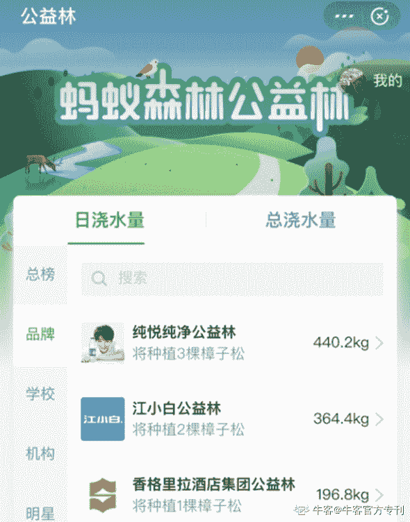 

综上所述，我们能够通过对用户价值和商业价值的分析得出每个需求的综合产出价值分数，这能够帮我们更加客观合理的评估需求价值。

#### 2) 需求投入成本

想要计算性价比分数，除了需求的产出价值，我们还需要了解每个需求的投入成本。对于需求投入成本，我们通常谈的最多也最为明显的需求成本是“技术人力”，通常包括设计、开发、测试三大模块。

在项目周期以及人员配置稳定的情况下，每个版本的可用工时是恒定的，是可用天数和可用人数的积，例如：

假设一个版本设计人员可用时间为 3 天，前后端开发人员可用时间各为 8 天，测试人员可用时间为 5 天，同时人员配置为设计师 1 人，前端开发 2 人，后端开发 2 人，测试 1 人，那么在此版本内可用工时为设计工时 3 人天（3 天*1 人），前端开发工时 16 人天（8 天*2 人），后端开发工时 16 人天（8 天*2 人），测试工时 5 人天（5 天*1 人）。

通常在每个版本需求提交后，技术会对需求进行估时，以量化每个需求需要投入的技术人力成本。

除了“技术人力”外，许多需求还包含了需求上线后运营人力的投入。具体来讲，“评论功能”和“点赞功能”的后期所需运营人力就是十分不同的，评论功能上线后必然要运营去维护，按照一定的标准对评论管理、筛选、删除，点赞功能则无需运营人力投入，故而在进行需求成本评估时，上线后的维护人力也需要考虑。

除了上述两个“人力成本”外，公司还需要考虑实际付出的资源，例如是否需要配置硬件以及会增加多少带宽费用等。 

综上所述，我们通常会从技术投入人力、后期维护人力以及公司实际资源投入三个角度来衡量每个需求的所需成本，得到最终的需求成本分数，至于每个维度的权重则根据不同公司的发展侧重点不同以及产品本身的特性来决定。

当了解了每个需求收入分数与成本分数后，我们需要将两者相除，得到最终的性价比分数，然后按照性价比分数来将需求进行排序，并按照工时限制确定最终的进入版本的需求。

当然，在实际的工作中偶尔会出现上述方式无法涵盖的情况，我们要根据具体的场景进行分析。这里，我们就将一些常见的情况进行讨论：

(一) 前置性需求

有些需求虽然性价比不高，但它是实现一些重要需求的前提，例如想要做个性化推荐就必须要先对用户行为进行分析，得出用户喜好和兴趣。得到用户喜好和兴趣本身是没有价值的，但对采集的信息进行使用，对其推荐个性化的内容能提高用户活跃，增强用户粘性，个性化推荐有价值，使得前置需求【采集用户喜好信息】也变得非常重要，需要优先实现。

(二) 版本周期的限制

在很多时候，若按照优先级排序，排入的最后一个需求的所需工时无法刚好匹配版本可用工时，有较大溢出。这时候可能就需要查看 Feature List 下有没有稍低优先级但工时更为接近的需求，在这个版本中实现，更高优先级的需求可作为待选需求在下个版本再进行评估。

(三) 需求来源特殊性

在日常工作中，需求的来源有时并不是按照常规流程产生的，而是由线上产生的问题转化而成的。例如当线上功能中出现了重大的体验漏洞时，即使该功能的优先级低于功能列表中需求的优先级，也需要优先解决，因为线上已经有用户正在使用的功能其用户体验感是更为显性的。

结合需求优先级排序和各种异常情况，我们可以确认最终在此周期内进入版本的需求，这些需求会经过设计、开发、测试最终和用户见面，实现最初我们选择它的需求价值。

### 4.总结

对于产品经理而言，需求是日常工作中接触最多，也是最为重要的部分，若无法合理的进行需求评估和需求决策，最终形成的产品就会不如人意，所以在日常的工作中，要采用科学的方法和敏锐的产品感觉做出合理、准确的抉择。

好的产品经理就该心中有丘壑，眼里存山河，永远知道自己的目标在哪，并且知道如何搭着需求的小船到达。

最后给大家留个作业：如果你是微信的产品经理，收集到了“对自己收藏内容进行分类”这个需求，你该如何进行需求分析？