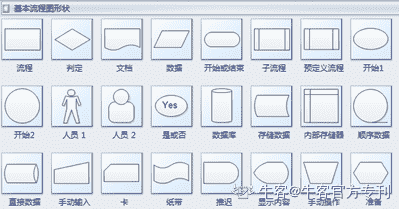

# 第五章 第 1 节 流程梳理

> 原文：[`www.nowcoder.com/tutorial/10036/38a7bdbd98e34e93854714b0f9e8e739`](https://www.nowcoder.com/tutorial/10036/38a7bdbd98e34e93854714b0f9e8e739)

# 一、什么叫流程

流程这个词，大家应该都不陌生，其实我们在生活中的方方面面都会接触到流程。

最常见的，我们去医院就医：

1)   首先需要在线上预约挂号，包括输入就诊人信息，选择就医医院、科室和时间

2)   在规定时间到达医院后，出示绿色健康码

3)   通过人工窗口或者自助机器现场取号，等待叫号

4)   到号后就诊，医生填写病历，开具处方单

5)   最后根据医生开具的处方单，先付费后取药

这是一个非常基础的就医流程，根据这个流程指引，我们就能够完成自主就医了。

引申到互联网，在规划一个产品时，我们往往会用到各种各样的流程图，目的是为了说明在业务流程中，每个角色分别遵从什么样的路径、执行什么样的流程、触发什么样的机制、达成什么样的结果。

常见的流程图主要包括：

### ***1、*** ***业务流程图***

业务流程图一般适用于前期项目梳理和产品规划。在项目启动阶段，产品经理就需要做到对业务涉及的各个模块心中有数，在和模块中的各个角色对接时，可以以业务流程图为出发点，讲清楚你的业务所涉及到的大致流程、模块和产品功能，也可以让对方了解到他们的部分在整个项目中所处的位置。

### ***2、*** ***页面流程图***

页面流程图是对于业务流程更具象化的表现形式，比业务流程图的颗粒度更细。它主要关注于页面内和页面之间的交互，能够直观地呈现每个页面涉及到的产品功能，以及每个功能点的跳转路径。页面流程图既能够帮助产品经理梳理用户路径，排查流程的不合理之处，也能够帮助开发工程师评估工作量，避免功能点和跳转链路的遗漏。

### ***3、*** ***功能流程图***

功能流程聚焦于某些具体的、较为复杂的产品功能。当涉及到逻辑判断时，往往会用到功能流程图，能够一目了然地梳理清楚同一个功能不同步骤之间的逻辑关系。

基于不同的流程图，我们可以非常清楚地进行需求梳理、架构设计、产品规划、开发落地。

# 二、流程分析

我们把就医流程拆分一下，可以抽象出这样几个要素：

1)   面向对象。一般为流程设计者（医院管理者），以及功能参与者（患者、医生、药房）。

2)   操作项。流程中每个角色（患者），遵循了什么样的路径（线上 APP），进行了什么样的操作（预约挂号）。

3)   信息的流向。流程中的信息是如何交互的，先后顺序是怎么样的（患者输入就诊人信息、选择就医医院、科室和时间→医院返回预约结果；医生开具处方→药房根据处方配药）。

一般而言，在梳理业务流程的时候，都无法绕开这几个关键要素。简单的流程一般角色和路径都较为单一，复杂的流程则往往面临着多个角色间比较复杂的信息交互。需要注意的是，无论流程如何复杂，路径和结果一般都是标准化、可控的。

顺着这个就医流程，我们可以再深入思考一下：

### ***1******、假如没有流程会怎么样？***

我们回想一下以前是怎么看病的：因为没有预约流程，病人在同一个时间段内蜂拥挤进同一个医院，去的晚的，运气好能赶在医生下班前看上病，运气不好的，就只能改日再来了。因为没有指引流程，咨询窗口人满为患，患者不知道医院什么时候人少，哪个科室空余多，医院也不知道患者什么时候来，很难进行合理的人员调度和资源分配。

而有了规范的就医流程后，患者时间更灵活，减少了往返奔波；医院可以控制预约人数，医院的工作效率也提高了；同时也大大减少了患者的集聚，有效减少了交叉感染。这就是流程的价值：通过标准化的路径，减少沟通成本，优化资源分配，提升整体效率。

### ***2******、如果有人不知道流程的话会怎么样？***

在有流程设计的前提下，也存在用户不清楚流程的情况。

还是以就医为例，疫情期间，很多医院实行全预约制，如果有病人没有按流程操作第一步，进行线上预约挂号，那么就会白跑一趟；就算是非疫情期间，也很有可能面临着去了医院，号源都已释放完毕，挂不上当日号的情况。因此，对于用户而言，了解流程往往能够事半功倍。

### ***3******、按流程进行就万无一失了吗？***

很多时候，路径不是单一的，而是多线程的、复杂的。例如线上预约，患者预约以后频繁取消怎么办？黄牛大量囤号转手怎么办？这些都是我们在梳理业务的时候需要去思考的问题。
流程并非万能，但在设计的时候，应该尽量多地去考虑每一条路径的可行性、异常情况。通过这样的梳理，我们也理解了流程对于业务、用户的价值。以及在设计流程的时候需要关注的一些点。

# 三、业务流程设计

### ***1******、抽象业务场景，搭建流程框架***

在进行业务流程设计前，我们首先需要了解业务场景。举个例子，假设我们想要规划一个互联网医院，我们可以这样描述业务场景：患者首先得在线下医院看过病，才能在互联网医院看病——即互联网医院一般接待慢病、常见病的复诊患者；患者提供个人信息后，医生通过图文、视频方式作出诊断和建议。

把这个业务场景抽象出来，就形成了业务流程：

1)   判断患者是否为初诊患者

2)   患者选择疾病种类，匹配对应医生

3)   患者提供疾病信息，预约医生图文或电话问诊并支付相应费用

4)   问诊后提供相应的治疗方案，例如药物治疗或医院复查

5)   根据治疗方案提供后续配套服务，如线下医院预约、药物配送到家

6)   完成服务，患者评价

 
需要注意的是，抽象业务流程看似简单，实则需要对业务场景有非常清楚的了解。对于产品功能模块也有了很明确的方向，如果你还处于一直未解的状态，建议还是先把业务了解清楚，而不是着急画流程图。

### ***2、*** ***拆分流程要素，填充流程细节***

我们再来回顾一下流程图的三要素：

1)   面向对象，即流程设计者和功能参与者。

还是以就医流程为例，我们可以看到，功能参与者主要包括患者、医生、药房。

2)   操作项，即流程中每个角色进行的操作行为。

每个角色的操作项是不同的，例如患者要做的是提供就医信息、选择疾病、提供具体信息、付费等，而医生则需要根据患者提供的信息进行诊断和相应的治疗，因此，我们需要针对不同的角色，规划不同的操作项。

3)   信息的流向，具体表现为流程中的信息是如何交互的，顺序如何。

有个非常实用的方法可以用于分析信息的交互。在画流程图的时候，可以多问问自己，针对某个操作项，角色输入的是什么信息，由谁输出了什么结果？比如，在付费取药这一过程中，用户接收到的是费用清单和药品清单，需要进行确认和付费，然后流程就结束了吗？没有，因为用户还需要填写收货地址，接收药品。

同时，我们不仅要关注信息的交互，还要关注交互的次序。例如，在医生诊断开方后，药房就可以直接配药了吗？显然是不可以的。因为这时候用户还没有确认是否要付费取药。

通过这样的提问回答，我们可以梳理清楚信息的流向和顺序，尽量避免流程的阻滞和遗漏。

### ***3、关注异常流程，合并优化流程***

最后，我们再多走一步，思考以下几个问题：

1)   每个角色的目的都达到了吗？

在以上流程中，我们可以看到，病人实现了快捷就医，医生实现了线上问诊，药房完成了配药，证明这一流程是可行的。

2)   每个行为都是为目的服务的吗？没有这一行为还能达到目的吗？

这一个问题是为了进行流程的简化。试想一下，如果药房不接受药方，还能配药吗？答案显然是不能的，那当前的操作项则是必须的。

3)   有哪些异常情况，出现异常情况了怎么处理？

例如，患者在选择疾病种类的时候，没有找到自身的疾病种类怎么办？系统是不是应该设置一个反馈，告知该疾病不属于互联网医院的服务范围。

又或者，患者在付费前，对于药方不满意怎么办？或者患者虽然对药方比较满意，但不想在互联网医院购药怎么办？这个时候是不是可以让患者作出一个反馈，互联网医院再基于反馈去提供相应的服务。

### ***4、小结***

在梳理业务流程的过程中，可以按以下的顺序：

1)   充分了解你的业务，把你能够想到的所有角色和功能点都列出来。

2)   进行要素的拆分，着重关注业务角色、操作项和信息的流向。

3)   梳理出关键的路径，谁在什么场景下进行了什么操作，这些操作的先后顺序是什么样的，每个操作的结果是什么，当前的操作项是不是最优解。

4)   关注异常流程。每个操作过程中会不会出现什么异常情况，出现异常了应该怎么处理？

在这样的过程中，逐层分解、递进深入，你就慢慢地能够理清楚业务流程了。

# 四、流程绘制方法

### ***1\.*** ***常用流程符号和软件***

事实上，业内已经有一套通用的流程符号，可以帮助我们画一张更为标准和规范的流程图。大家不用刻意去记，在 office 办公软件内，一般都有流程符号以及相应的释义。
（来自亿图图示）常用的软件主要包括 Process on、亿图图示、Visio 等，同时 PPT 也可以画流程图。

### ***2\.*** ***流程图类型***

流程图类型主要包括单通道流程图、泳道图、页面流程图等。

单通道流程图一般用于看用户信息的流向，往往路径单一、简洁直观：

泳道图则常用于复杂的信息交互：

页面流程图一般用于规定页面的交互方向。它对开发工程师比较友好，方便评估工作量。在画页面流程图的时候，着重需要体现以下几个要素：

1）  页面名称。页面名称是开发工程师和用户区分不同页面的重要标记。

2）  页面层级关系。可以通过小标题的设置，区分清楚页面间的层级关系，整个产品层级不宜过多，重要的功能不宜隐藏在比较深的层级。

3）  页面内展示性元素。可以简单用色块示意。

4）  页面内的功能按钮。功能按钮一般由用户触发，点击后会链接至下一个动作，否则就会造成流程的阻滞。

5）  页面交互。包括页面内的交互和页面间的交互。

在实际操作的过程中，大家可以尝试多种类型的流程图，试着总结不同类型流程图的要素以及应用场景，逐渐形成自己的流程图绘制方法。