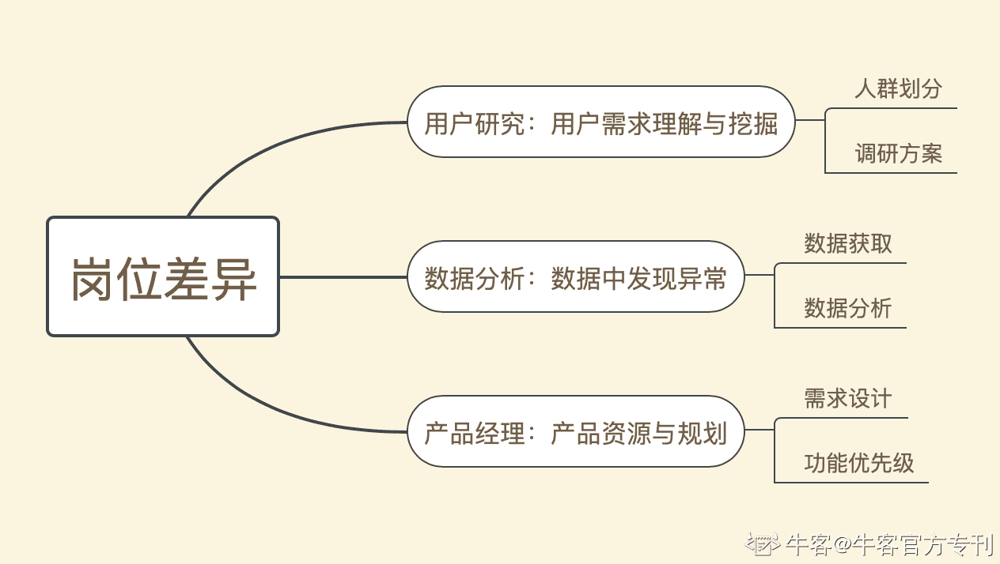

# 第六章 第 1 节 本章概述

> 原文：[`www.nowcoder.com/tutorial/10036/dc2f3a92248a4ccd8182b2311018782e`](https://www.nowcoder.com/tutorial/10036/dc2f3a92248a4ccd8182b2311018782e)

在开始定义用户研究的范围之前，需要区分数据分析、用户研究以及产品经理这三个岗位。在目前的头部的互联网公司中，这三个岗位实际上是已经分化出来的了。概括的讲一下，数据分析是根据数据从整体用户中找到异常的部分，但实际的解决方案跟手段其实是依赖用户调研提供给内部团队的用户理解，而产品经理可能在初期都会接触，但高级产品经理或者策略型的产品经理还是要从产品发展规划出发，为数据分析、用户调研提供方向，对这两个岗位提供的结果进行分析，产出需求跟优先级。

本文的行文重点，会将目光聚集在头部的互联网企业中，产品经理如何利用用户研究的结果，或者说需要掌握哪一些的用户研究的入门基础，但是产品经理并不会越界去做专业度很高的用户研究。因此本文注重解答以下问题：

*   ## [用户研究跟产品经理的关系？用户研究会有哪些的方式？](https://www.nowcoder.com/tutorial/10036/bee7ff193e70439eb0b30dc1072fe5dd)

*   ## [在不同阶段，用户研究关注的重点是什么？](https://www.nowcoder.com/tutorial/10036/c81bb590c6d142f9aaa68a409f474146)

*   ## [在头部的公司里面，日常的数据分析跟用户调研的结合-用户画像是怎么应用的。](https://www.nowcoder.com/tutorial/10036/444ebf35522b4c1f95ae58892eaef3dc)