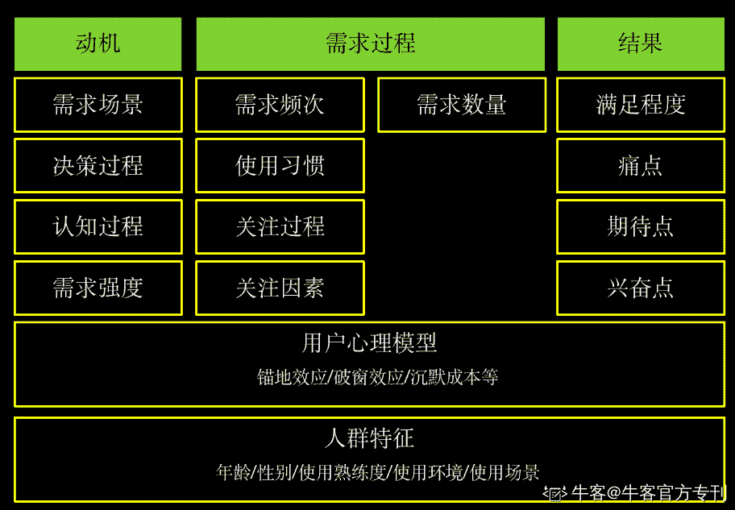

# 第六章 第 2 节 产研团队的分工与配合

> 原文：[`www.nowcoder.com/tutorial/10036/bee7ff193e70439eb0b30dc1072fe5dd`](https://www.nowcoder.com/tutorial/10036/bee7ff193e70439eb0b30dc1072fe5dd)

# 一、产品经理与数据分析

在产品立项或者回顾产品功能收益的时候，如果能够从数据的角度来衡量功能，对 kpi 的增长是一件非常幸福的事情，因为你对公司做出的贡献是可以量化的。对于初中级的产品经理来说，获取用户数据，站在用户角度说话，是职场上为公司产生价值的重要方式。但是对于一些 B 端产品以及在行业处于领导地位的产品更多是从顶层考虑企业价值，没办法直接衡量业务对公司成长的帮助。产品本身的数据抓取，例如产品团队通过埋点、可视化看板等方式看数据，知道每天的 UV，PV，用户主要的行为漏斗，成交订单量，店铺流量的转化情况，这些都是为了改进产品而收集的。（这里都是从电商角度出发描述的数据指标，实际上对于不同内容产品、社交产品、社区产品的指标会有差异）但数据只能告诉我们事物的外延，即“发生了什么事情”；它不能告诉我们事物的内涵，即“为什么发生”。从数据图表中，我们可以看到一系列的“相关性”，但是无法从中推出“因果关系”。例如产品团队可以通过数据知道只有 1%的用户使用了新上线的某功能，但是只从数据上看不出为什么。作为产品经理必须有对业务、用户、流程的深度理解跟体验，才能对数据的异常作出解释，才能对值得改进的异常制定策略。数据是将可以规模化统计的指标呈现给你，是一种高效的筛选方式，但是如何判断筛选出的是金子还是石头要依赖业务理解能力。

# 二、产品经理与用户调研

跟数据分析相比，用户调研，其实是要挖掘用户本身没有办法被数据量化的事情，在系统之外的一些行为数据。当然，数据分析跟用户调研的目的其实都是一样的，他们都是为了找出业务的异常点，挖掘业务的增长方向，或者发觉用户对于竞品的依赖心智。用户研究从一手的用户数据上判断产品是否符合用户需求，对后台数据做成一个补充。个人认为，用户调研跟数据分析的界限是会随着技术的变化而改变的，随着技术对个人信息采集越来越全面，越来越精确，越多的用户调研他就会偏向于用户分析。比如说在 PC 互联网时代，收集用户的性别信息，或者说地域分布，需要通过用户调研的方式。但是在移动互联网时代，个人与设备的绑定关系越来越强，就已经支持通过数据分析来去进行精细化运营。但不论用户研究的方式如何变化，产品用研团队需要了解的因素其实变化不大。需要了解用户特征、需求动机、认知过程、使用习惯等因素：    1、用户特征：用户是谁，在哪里，有多少；用户的背景信息，如年龄、职业、喜好、地区等
    2、需求动机：动机如何被触发，解决动机的首选方案是什么，方案之间选择考虑哪些因素。
    3、行为习惯：用户如何与产品发展交互、操作轨迹、使用习惯等
    4、需求目标：用户最终的目的，最终想获得什么，满足用户需求已有的过程中存在什么痛点，还有什么附加需求没有被满足？

# 三、古今调研方式集锦

从 WEB 产品到移动端产品，从互联网上半场再到互联网下半场，不仅对产品经理的要求千变万化，对应的调研能力也日新月异。比如说用户画像，在五年前，他更多地是停留在用户研究阶段，对于典型用户的提取以及讲解功能时，辅助于产研团队提升对需求的理解，保持内部目标的一致性。但现在头部公司的数据建设已经能够清晰的定义出某一用户画像，包括其人群分布跟数量了，也已经是策略产品经理跟运营人员需要熟练使用的分析手段。
大多数产品经理已经不属于功能型产品经理，即负责单独一个流程、一个功能的开发，而是在上百万，上千万体量的 APP 中，对分发的策略进行优化，提升整体效率。在策略化，数字化产品功能的背后，能够支持产品通过数据了解大盘，精确下钻的调研方式成为主流。
以下罗列一些目前策略产品经理常用的用户调研手段。可能在以前并不是产品经理惯用的一个手段，或者并不被认为是用户研究，但我认为他们本身是策略产品经理了解用户需要掌握的能力跟知识。

|  
### 调研方法-移动互联网版本

 |  
### 方法定义

 |  
### 优缺点

 |  
### 适用情况

 |
|  
数据分析，Data Analysis                  

 |  
通过环比、基比、同比等对比方式找出异常的数据对象。

 |  
**优点：**样本量很大，数据真实；

**缺点：**看不到真人，不知道为什么；

 |  
日常监控，异常问题定位，业务增长点发掘

 |
|  
AB 测试

 |  
对不同用户显示不同版本内容

 |  
**优点：**成本比较低，实验周期短；

**缺点：**只能选出相对好，而不是绝对好的方案；

 |  
相似功能的线上校验，算法、策略的发布调整

 |
|  
用户画像

 |  
通过各种树状的标签属性描述用户特征

 |  
**优点：**理解成本低、复用性高；

**缺点：**生产难度高；

 |  
定义使用人群的主要特征跟人群范围，按照标签制定策略

 |
|  
用户访谈

 |  
邀请典型用户进行一对一访谈

 |  
**优点：**找熟人进行初步、简单的调研以支持方案设计；

**缺点：**样量少，对主持人要求也很高；

 |  
想法验证

 |

 还有一些从 PC 互联网流传下来的原版版本的调研方式，这里仅供参考，调研方式的具体定义这里就不再赘述了，从《星月神话》到《人人都是产品经理》等各种入门书籍应该都有对这些方式进行介绍，但现在在产品的日常使用中却越来越少。

|  
### 调研方法-远古版本

 |  
### 方法定义

 |  
### 优缺点

 |  
### 适用情况

 |
|  
焦点小组

   |  
由一个经过训练的主持人以一种半结构的形式与一个小组的被调查者交谈

 |  
**优点：**高效定性的收集用户反馈；

**缺点：**对主持人的主持能力和数据分析能力要求较高；

 |  
常用于产品需求探索和产品发布后的迭代

 |
|  
卡片分类法

 |  
选择一系列主题，让用户将主题分类，并确定用户的分类标准

 |  
**优点：**低成本收集用户对信息框架的分类和概念理解；

**缺点：**样本量少，要和其他方法结合；

 |  
交互设计中的框架设计

 |
|  
问卷法

 |  
问卷是指为统计和调查所用的、以设问的方式表述问题的表格

 |  
**优点：**低成本找到海量用户；

**缺点：**问题难度较高，偏差会导致错误数据；

 |  
用户访谈后有了初步结论，需要数据辅助验证新功能的可行性

 |
|  
可用性测试                            

 |  
让一群具有代表性的用户对产品进行典型操作，同时观察员和开发人员在一旁观察，聆听，做记录

 | **优点：**细致的观察用户，可以问原因；**缺点：**用户受控环境下和真实有差距，样本少； | -- |
|  
专家评估或启发式评估

 |  
以专家为索取未来信息的对象，组织各领域的专家运用专业方面的知识和经验，通过直观的归纳，对预测对象过去和现在的状况、发展变化过程进行综合分析

 |  
**优点：**效率与质量都是最高；

**缺点：**专家都比较悲观，有可能抑制创新；

 |  
如产品创新比赛，产品战略咨询其实都是这种调研方式的体现

 |
|  
眼动试验

 |  
通过视线追踪技术，监测用户在看特定目标时的眼睛运动和注视方向，并进行相关分析的过程

 |  
**优点：**直观反馈用户焦点；

**缺点:** 无法区分用户在手机屏幕的视线移动；

 |  
PC 网站改版

 |