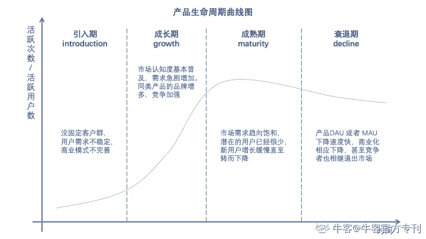
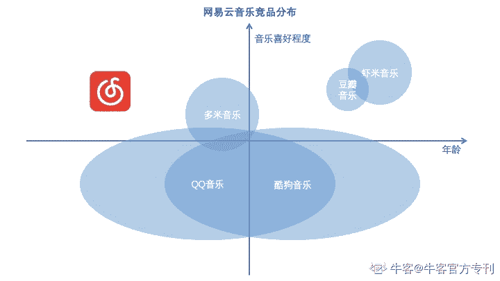

# 第六章 第 3 节 用研与产品周期

> 原文：[`www.nowcoder.com/tutorial/10036/c81bb590c6d142f9aaa68a409f474146`](https://www.nowcoder.com/tutorial/10036/c81bb590c6d142f9aaa68a409f474146)

除了了解用户调研与其他职能的划分与交界之外，知道在不同情况下调研的侧重点或者应用手段也是非常重要的。当我们在求职面试的时候，面试官提问，我们如何应用用户分析来确定问题的时候，如果我们能够提出按照产品的生命周期来分类讨论，这就是一个很好的加分项。

# 一、产品生命周期

## 1.1 引入期

在引入阶段，市场可能已经有其他同领域的先行者（比如京东对淘宝，微信对米聊）；也有可能，产品本身充当破局者，用互联网方式颠覆原有领域玩家（比如京东对国美）。如果说做产品像打仗，那战场就是用户的心智，但用户是难以定义的，用户心智是不好衡量的。如果在引入阶段，产品经理找到了长期有价值且还未被竞品获取的用户，那么就相当于诸葛亮定汉中，自然能为产品的后续发展提供足够坚定的根据地。引入阶段核心问题有：

*   有哪几类用户群？

*   这些用户群的特点是什么？用户群数量大致是多少？

*   竞争对手们覆盖了哪些用户群？

哪个细分领域是市场空白？哪个细分领域又是长期目标的必争之地？产品从起步到成熟的竞争策略是什么？先做哪个用户群，再做哪个用户群？

## 1.2 成长期：

市场已经被炒热，产品概念的市场认知度已经基本普及，市场需求急剧增加并节节攀升。同时市场上同类产品的品牌增多，竞争加强，用户开始对此类产品的品牌指向性增强，对产品的需求由基本需求派生特殊需求，有了情感跟品牌诉求。此阶段的用户调研就围绕产品的品牌去揣摩用户的心理预期、提供超预期的服务，从而引爆用户口碑。口碑会引发传播，而大量的传播会成倍地加强口碑。那么如何能引起用户传播呢？下面总结了常见的三个思路。

*   感同身受。有共鸣，用户就有了传播的动机。《逃离北上广》、加油打工人，即是此道，通过对流行文化的解构，帮用户以戏谑或轻松的方式表达平常无法表达的心情。

*   打开眼界。人都有好奇心，未知而有趣的东西容易引发传播。知乎的问答、网易云音乐的年度歌单等都能让用户满足求知欲。一方面用户为了展示自己，会主动宣传，另外一方面看到转发的用户也会基于求知欲进入到产品。

*   展示自己。这点即前面所谈到的用户心理——爱表现，同样不做赘述。这是很常见的现象，有时候分享内容到朋友圈

## 1.3 成熟期

市场需求趋向饱和，潜在的用户已经很少，新用户增长缓慢直至转而下降，标志着产品进入了成熟期。在这一阶段，竞争逐渐加剧，产品获取到的新用户降低，获取新客费用增加，企业开始考虑商业化。比如现在打开网易云音乐跟 QQ 音乐，很难说出他们在功能列表上有什么不同，都包含了歌单、个性化推荐，直播，视频等模块。本质上这个阶段已经不是通过新功能获取新用户了，而是追求老用户的一站式服务。明确成熟期的产品要达到什么目标：

*   对内而言：就是要延长成熟期的时间，延缓进入衰落期的时间，并尽可能进行微创新，争取发现新的增长点；

*   对外而言：建立并深挖自己产品的护城河，增大竞争对手的超车成本；

## 1.4 衰退期：

衰退期的特征是市场开始萎缩，同类产品逐步被淘汰的时期。其主要特点是：用户需求与注意力转移，产品 DAU 或者 MAU 下降速度快，商业化相应下降，甚至竞争者也相继退出市场。在这一阶段随着产品策略的不同，用户调研的重点也随之改变。不过在衰退阶段，企业压减支出，对于产品的用户研究的支持会减弱。

*   集中策略。即把资源集中使用在最有利的用户群体、最有效的投放渠道和最易销售的商品品种、款式上。概言之，用户调研的重点在于用户群体的对比，识别产品用户群中最核心用户群，围绕这部分人提供洞察。

*   放弃战略。如果企业决定停止经营衰退期的产品，应在立即停产还是逐步停产问题上慎重决策，并应处理好善后事宜，使企业有秩序地转向新产品经营。那对于新旧产品的用户群体共同点，以及转移方式便是调研重点。

# 二、网易云音乐的人群划分

受限于笔者自身的工作经历，并没有完整生命周期的产品调研可以分享，但最经典的案例我觉得还是网易云在引入期的用户调研方法。网易云的成绩有目共睹，而这跟产品早期的发展重点跟产品路径息息相关、网易云在引入期通过用户调研立项并找到第一个雪球，直至今日站稳脚跟，跟阿里系、腾讯系三足鼎立。引入期的用户调研重点在于用户群的划分。划分用户群直接产生的作用就是能更好地理解产品的目标用户和市场竞争情况，俞军老师的一个经典方法论，新方案的使用收益减去旧方案替换成本等于迁移所带来收益。若替换成本无限大，或者使用收益过于小，都会导致迁移对用户是负收益。引入期的特点是产品资源不足，在模式没有验证的时候，从内部或者外部拿到的资源都会相对比较少。如果把做产品比做搭积木，那划分用户群来确定核心用户群，就是找到那块被使用次数最多的积木。网易云音乐在启动之初，通过身边音乐用户的访谈，将划分用户的因子分为两类：基本的人口属性（如年龄、性别、教育程度、职业等）和垂直领域属性（在音乐方面就是音乐喜好程度）。

> “音乐喜好程度决定了用户看待音乐的态度。有人将音乐看作职业，有人将音乐看作最大的爱好，有人将音乐看作消遣，有人将音乐看作背景音乐。不同的态度决定了用户在已有音乐产品上不同的使用行为——发现音乐的方式、听音乐的方式、分享音乐的方式、为音乐付费的方式都会有所不同。同样，也决定了不同的用户最终选择使用哪个音乐产品。-《幕后产品》”

用一个二维坐标系划分用户群，使用两个因子年龄和音乐喜好程度，将用户分为以下群体：

1.  学生中的意见领袖：年龄小，爱好深。他们兴趣爱好广泛，有很强的表达欲

2.  普通学生：年龄小，爱好一般。音乐口味刚形成，喜欢年轻人中流行的音乐

3.  意见领袖：年龄大，爱好深。多存在于一二线城市的高收入人群中

4.  行业从业者：年龄大，爱好服务于工作。歌手、词曲作者，也包括乐评人、电台 DJ 等

5.  大众用户：年龄适中，爱好一般。音乐口味普通并且已经形成，对新的音乐风格不感兴趣

6.  行业精英：年龄大，爱好深。占据金字塔顶端的人，在音乐行业中拥有巨大的号召力

根据这两个因子与竞品对比，就可以根据对市面上其他产品的调研寻找优势机会。通过对比网易云音乐在音乐市场上的竞争对手，就能看清楚市场的竞争状况。

1.  QQ 音乐、酷狗音乐、酷我音乐、天天动听：拥有很坚实的市场基础，产品知名度很高。围绕大众用户群来做的。

2.  虾米音乐：产品定位于高端用户，音乐内容由用户上传，曲库相当完整、丰富。其用户群年龄相对豆瓣音乐要大一些，在当时它是一个小众音乐圈子。

3.  豆瓣音乐：小清新，其用户群没有虾米音乐那么高端，同时年龄也相对小一些。它也是一个小众音乐圈子。

那么在以上的洞察基础上，网易云音乐选择了群体基数足够大、且音乐品味逐渐养成过程中的大学生群体、细分行业 kol、行业从业者这三个群体以及小众音乐内容（如二次元、电音、ACG 内容），前者的表达欲适于产品传播，后两者可以贡献更多的小众音乐内容，促进小众音乐喜爱者的活跃和留存，形成良性循环，进而建设音乐细分领域内的产品护城河。围绕这个群体打造歌单（移动端体验）+个性化推荐（音乐品味养成）+社区（青年用户归属）等产品特点。