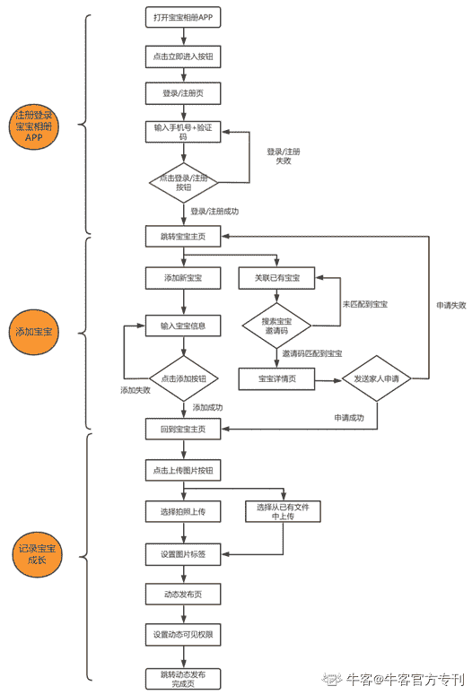

# 第七章 第 1 节 PRD 撰写

> 原文：[`www.nowcoder.com/tutorial/10036/4ef47e87e17f48638482a30d7449f03b`](https://www.nowcoder.com/tutorial/10036/4ef47e87e17f48638482a30d7449f03b)

# 一、什么是产品需求文档？

在互联网产品的开发上线流程中，PM 撰写产品需求文档（Product Requirement Document，PRD）是必不可少的一环，撰写产品需求文档是为了和团队各角色沟通清楚需求背景，需开发上线的功能点，以及评估产品成功的指标等。

PRD 是与团队成员进行信息传递和沟通的工具，也是开发和测试过程中的唯一依据。因此，产品需求文档的表达是否清晰，逻辑是否有条理，是否能让工程师、设计师等角色一读就能明白产品的核心设计思路和细节要点等尤为重要。产品需求文档的写作水平是 PM 综合能力的体现。

# 二、产品需求文档的分类

PM 在日常工作中，常遇到以下两种产品需求文档的撰写：

1.      新产品的需求文档，例如：公司计划新开发一款宝宝相册 APP，需撰写宝宝相册产品的需求文档，这类需求文档通常涉及的产品模块较多，包含完整的产品功能流程。

功能需求文档，通常包括对已有产品功能的迭代，或者新增全新的功能。例如上述宝宝相册 APP 新增“做任务赚积分”功能。

# 三、产品需求文档的写作工具

PRD 的常用写作工具主要包括 Word 文档、PPT、产品原型工具、思维导图工具和在线协作工具。不同公司不同团队，写作 PRD 的工具不同。现在很多公司直接用产品原型工具（Axure、Sketch 等）进行 PRD 创作，产品功能逻辑直接在原型中以批注的形式展现。思维导图工具如 Xmind，也是很好的沉淀 PRD 信息的工具。另外，大公司内部一般会有统一的在线协作文档平台，便于多个 PM 同时进行需求文档的创作；或者可使用石墨文档、印象笔记等在线协作工具。

# 四、产品需求文档的结构和内容

产品需求文档一般包含四个部分：项目背景、需求收益、需求详述和统计需求，下面将为大家进行详细介绍：

**1****、项目背景：**

背景部分需要阐述清楚：为什么要做，需要解决什么问题。得出结论的过程和依据需清晰地体现在文档上，包括使用了哪些数据来支撑，是否有做调研和产品问题分析。

l  为什么要做，需要解决什么问题？

如果是新产品的需求文档，背景里应该阐述清楚产品的定位、过往调研的关键结论，同时需明确要解决的问题是什么。

*例如：宝宝相册 APP 的需求文档背景部分应包含如下内容：宝宝相册 APP 的产品定位为：“家人共同记录宝宝成长的相册”。通过市场调研、竞品分析和用户访谈，得出的关键结论是：“未来每年新生儿数将介于 1780-1950 万人，儿童人口总数将维持在 2.2-2.5 亿人之间，母婴市场的存量和增量空间巨大。在竞品分布上，市场上主打记录孩子成长的工具产品不多，大多母婴 APP 是前期推出宝宝相册功能低成本的获取用户，未专注于记录宝宝成长，后期往母婴电商/社区/O2O 等方向发展。通过用户访谈发现母婴用户使用母婴 APP 的动机主要是记录宝宝成长，在家庭内分享孩子动态，这部分需求占比高达 86.8%，因此计划推出一款宝宝相册 APP，专注于记录宝宝成长，解决母婴用户存储/查看/与家人分享照片过程中的一系列痛点”。*

如果是功能需求文档，则需要写明产品现状、分析存在的问题，并针对问题提出合理的解决方案。

*例如：针对新增的”做任务赚积分”功能，背景部分可这样撰写：宝宝相册 APP 已上线一段时间，但是用户的使用时长及活跃度表现一般，且新用户增长缓慢。因此计划新增“做任务赚积分”功能，用户通过完成简单的日常任务，如上传 3 张宝宝照片、添加 1 组标签记录宝宝成长、分享宝宝照片给亲朋好友等即可获得积分并使用积分兑换众多特色权益，如免费实现照片的存储空间扩容等，以此实现拉新用户和提升用户活跃度的目标。*

**2****、需求收益**

明确了需要解决的问题之后，不要急于做产品设计，互联网产品处于快速迭代的过程中，产品经理每天可能会接到来自四面八方的需求，而团队人力、时间等资源是有限的，这个时候就需要衡量需求的收益来决定需求开发的优先级。

需求收益可以从定性和定量两个角度考虑：

l  定性分析：

定性分析需要大致得出通过上线某功能，产品的提升点在哪里，对于 C 端用户产品，一般为提升 DAU（日活跃用户数量）、产品使用时长或者用户留存率（指在某一统计时段内的新增用户数中再经过一段时间后仍启动该应用的用户比例）等指标。*例如宝宝相册 APP 新增“做任务赚积分”功能，从定性分析上看，可以提升产品的 DAU 和用户使用时长。*

l  定量分析：

需要严谨的预估收益的逻辑和明确的收益量级。预估逻辑需要选取合适的出发点，对于 C 端用户产品，可以从上游走到下游，上游为大盘数据，你可能会考虑一款产品的 DAU 规模、入口曝光量等来预估用户对某个功能的实际使用量，可供参考的数据包括入口所在页面的曝光量，之前做过的类似功能的入口点击量，进而估算下游某个功能的点击率。*例如“做任务赚积分”功能可依据上述逻辑先预估出功能实际使用量，再进入具体的功能页面预估用户的使用时长及“分享任务”对拉新用户的转化率，进而预估出对 APP 整体指标的影响。*

变量预估：在做需求收益预估的过程中，如果涉及到不好把控的变量需要预估，可根据过往经验和 PM 自己对产品功能的理解进行大胆预估，等项目上线后拿到真实的数据再和之前的预估值进行比较，从中积累经验，修正自己的预估模型，提高预估的精准度。*例如，“做任务赚积分”的功能页面中，用户对“分享任务”的完成率是一个变量，可先行预估，后续进行效果验收时，再进行修正。*

**3****、需求详述**

完成了第 2 步，如果收益符合预期，就可以进入产品设计阶段，产出详细需求了。这部分主要包括需求描述和产品原型设计：

**3-1** **需求描述：**

如前所述，新产品的需求文档通常涉及模块较多，在具体阐述产品功能逻辑前，建议先思考清楚产品的业务流程，并在业务流程的基础上产出详细的功能流程图。如宝宝相册 APP 的业务流程主要包括以下三步：注册登录宝宝相册 APP、添加宝宝、记录宝宝成长。对应的功能流程图如下：

在功能流程图的基础上，可梳理出产品的需求 list 和大体的开发优先级，按需求 list 的顺序进行需求逻辑描述，便于捋清文档思路，提升读者体验。

同理，如果是功能需求文档，想要内容条理化、逻辑清晰，且需求逻辑涉及到多端交互，或者用户流程较为复杂，建议在需求描述前也先进行业务逻辑思考和功能流程图绘制。

需求描述是对产品需求逻辑的详细说明，如果 PRD 产出后，在和研发/设计等角色沟通过程中，需求发生变更，一定要及时在文档中进行更新，更新点可用不同颜色的文字进行标注，并记录更新时间。同时，为便于统一查看，可在文档前新增一份变更日志，如下所示：

| **日期** | **版本号** | **修改内容** | **修改原因** | **修改人** |
| 2020.03.23 | v1.0 | 第一版宝宝相册 PRD | 无 | Alaina |
| 2020.03.27 | v1.1 | 更新登录模块密码位数规则 | 优化密码规则，提升密码安全性 | Alaina |