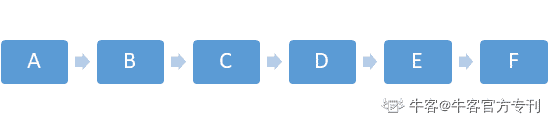
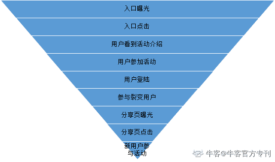
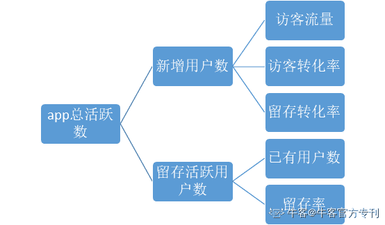
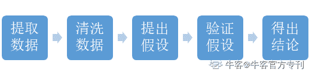

# 第八章 第 1 节 数据分析

> 原文：[`www.nowcoder.com/tutorial/10036/296441eb9aff48a188ec84de70823471`](https://www.nowcoder.com/tutorial/10036/296441eb9aff48a188ec84de70823471)

# 数据分析方法论

## 1、数据分析是什么？

大家都知道数据分析能力对于产品经理来说很重要，但是对于产品经理而言，数据分析到底是什么呢？在百度百科的定义中，数据分析的定义为：数据分析是为了提取有用信息和形成结论而对数据加以详细研究和概括总结的过程。从这句话中我们可以得出，数据分析并不单纯是学习技能，而是形成一套思维模型。数据分析思路远远比工具要重要，工具只是帮助你提升分析效率。对数据分析而言，“做正确的事远远比正确的做事要重要”。

## 2、数据分析为谁服务？

我们接下来讨论的数据分析只是在产品/运营层面的数据分析，不涉及到数据科学方面的数据分析。从不同的角度，我们一般把数据分析分为三个方向。

*   通过数据发现用户需求以创造产品、新增功能或者优化产品，比如各种的用户的报告和用户行为的分析等；
*   提升产品效率，找到数据环节的漏斗，并且进行针对性的提升，比如对应用新增在不同场景的转化环节进行分析得到产品新增效率的提升点；
*   定位问题，当应用线上出现问题，对线上的问题进行评估、定位和解决时，需要进行不同程度的数据分析，比如产品注册率付费率下降、线上核心功能用户减少等等需要进行定位并解决；

**此外，产品/运营的数据分析跟传统的数据分析有一个最大的区别在于产品/运营需要结合用户行为/用户侧的感知来进行数据分析。**举个简单的例子：你的产品上线了一个运营活动，这个活动的步骤为 A->B->C->D->E->F（如图所示）。
数据分析师的职责是保证每一步的统计口径一致且正确，并计算出各步骤的转化率及流失情况。而作为产品经理，我们的工作需要增加更多的用户研究的工作，我们目前拿到的是后台的数据，所以数据分析的工作可能包括以下几点是 ：a. 分析每一步转化率是否符合产品预期，如果低于预期，原因是什么？
b. 每一步都会有流失的用户，这些用户是一个什么用户画像呢？ 
c. 对于这个运营活动而言，用户在某些页面的停留时间很短且通过率很高，是否可以削减活动步骤？
d.成功参与活动的用户是否符合预期，羊毛党的比例有多少？等等

**产品数据分析的难点在于如何快速理解业务，从业务数据中洞察用户行为。针对不同的业务会有不同的业务逻辑，但是对于互联网产品而言，数据分析的框架其实是类似的，所以学习数据分析框架之后再去结合业务进行数据分析才是一个正确的思路。**

## 3、数据分析的概念与框架

### a.数据分析的基本概念

*   **同比：**和上一时期、上一年度或历史相比的增长（变化幅度）。同比发展速度主要是为了消除季节或者时间周期变动的影响，用以说明本期发展水平与去年同期发展水平对比而达到的相对发展速度。如，本期 2 月比去年 2 月。
*   **环比：**表示连续 2 个单位周期（比如连续两月）内的量的变化比。环比增长率=（本期数-上期数）/上期数×100%。这个指标反映本期比上期增长了多少；环比发展速度，一般是指当前的数据与前一个时间周期之比，用于分析相邻两个时间周期的数据的变动，表明产品的逐期的发展趋势。
*   **日活跃用户****DAU****：**每天打开 app/服务的用户数（非严格意义），例如抖音曾公布 DAU 突破 4 亿，这是大部分 c 端 app 都会看的核心指标，但是受到节假日/运营动作的影响会产生波动。
*   **月活跃用户****MAU****：**每个月打开 app/服务的用户数（非严格意义），例如微信 MAU 为 12 亿，这是大部分 c 端 app 最为关注的核心指标，衡量一个产品体量的核心指标。
*   **次日留存率：**T 日新增用户在 T+1 日仍然打开 app 的比例。具体公式为：T 日新增用户数/T 日新增用户中在 T+1 日仍然打开 app 的比例。衡量一个产品核心竞争力的指标。此外，还有远期留存（7 日留存，15 日留存，30 日留存）都是反映产品黏性的指标。

此外，对于产品数据分析而言，我们经常谈到三个词：“维度，口径，算法”。具体来说，维度代表了你看问题的角度；口径是指如何去框定业务主要的使用对象（框定范围），算法是用来评估每一个产品策略/运营动作的效果。

举个例子，如果你是微信看一看的产品经理，你的一个产品任务是在不同的用户群中使用不同的推荐策略，然后分析不同的策略对于产品的影响。 在这个实际产品的数据分析问题中，你首先要选定用户群，这里就是我们数据分析的 base，也就是口径。然后我们一般会选择是与前一天同一个时间段来进行对比（不考虑周末这种特殊情况），然后分析不同的推荐策略是否对 DAU、停留时长、点击在看的人数有影响。对于不同的目标指标，就是我们看问题的维度，某一个策略会影响 DAU，但是不一定会影响停留时长，对于产品经理而言，这里我们就需要分析这个策略为什么只会影响 DAU，而不会影响停留时长，用户面对这样的策略时，用户会如何去使用我们的产品，我们的策略是如何改变用户的习惯的，这都是产品需要从数据中洞察出来的问题。最后，围绕数据，我们需要输出策略的效果，这里就需要我们有一个计算效果的算法，选取环比还是同比，选用什么指标，这就是关于“算法”的部分。

### b. 数据分析的层次

产品的数据分析经常会遇到这样的问题：只有数据，没有分析。仅仅是告诉你数据表现是什么，告诉你产品发生了什么。比如某 app 次日留存率只有 10%，这个数据偏低，可以看出该功能无法满足用户需求，导致用户黏性不好。然后呢？一般的产品经理往往就没有然后了。

那么正确的数据分析方法应该是什么呢？

数据分析过程要解决的问题往往有四个层级（如下图）：

第一步，问发生了什么？如 app 留存率降低，所以用户粘性下降。初级分析基本到此结束。

第二步，问为什么留存率降低？这个答案要落实到用户层面，是第一步的延伸。是用户找不到想要的功能，还是功能不符合用户的预期？数据分析基本分析到这一步已经基本及格了

第三层，继续问为什么用户会找不到想要的功能？为什么功能不符合预期呢？这几个问题的答案都要落实到产品上，即我们的产品的哪项内容造成了用户出现了第二层的问题。数据分析到这一层已经很优秀了。

第四层，我们该如何去改进我们的产品呢？针对用户的问题，抽象出用户的需求，然后迭代产品，完整而优异的数据分析就基本完整了。

### c 数据分析的框架

对于校招生来说，数据分析的框架和结构远远要比具体的实际操作重要。思路最能体现一个人的逻辑思维。对于数据分析问题，核心是拆解数据和产品流程，接下来介绍两种很常见的方法：

#### 

*   漏斗分析法

漏斗分析不仅仅是一个数据分析的模型，更是一种可以普遍适用的方法论，或者说是一种思维方式。漏斗分析方法就是明确目标，然后根据关键链路进行分解和量化。

举个例子，假如你设计了一个红包分享裂变活动，如 pdd 的邀请好友来给你点赞。对于红包分享裂变活动而言，我们最关注的几个指标分别是：投放入口点击率、分享率、拉新率、拉新量。对于整个流程而言，我们可以有这样一个漏斗：

漏斗分析法，还有一个显著的用途就是，发现功能或者活动的薄弱环节，通过这样的一个漏斗分析，我们可以看到用户在转化的过程中是哪一个步骤损耗最大从而进行有针对性的优化。漏斗分析方法也是进行目标回顾和自我审查的一个很好的管理工具，通过环比或者同比，定期的 review 我们所做的工作会对哪个环节的数据产生影响并加以监控。

#### 

*   结构思维方式

对于校招生来说，数据分析的框架和结构远远要比具体的实际操作重要。思路最能体现一个人的逻辑思维。对于数据分析问题，核心是“拆解”问题，具体来说就是拆解一个指标。举一个简单的例子，如果我们要提升某 app 的总活跃人数，那么我们应该如何从数据中找到突破呢？

首先，我们应该拆分总活跃人数这个指标。总活跃人数=新增活跃用户+留存活跃用户。这只是第一道拆解，对于产品而言，这两个指标都是不可直接运营的。那么我们还需要继续细分。新增活跃人数=访客流量*访客转化率*留存转化率；留存活跃用户数=已有用户数*留存率。这些指标就是产品可以运营的了，这就是需要结合一定的产品知识来拆解数据，这是产品人必备的一项技能。如下图：

## 4、校招生对于数据分析应有的态度

对于校招生而言，产品感一般不是特别好，所以需要从数据中去给自己一些反馈，才能建立起自己的用户模型。但是除了数据分析本身之外，更要从数据分析中洞察出用户的思考，总结出用户行为路径，反思产品逻辑，并优化产品细节，这才是对用户最大的价值。

## 必备技能

对数据分析而言，我们工作中的实操路径如下图所示：

具体来说，我们一般是从原始数据库中提取出来符合我们条件的数据，然后在本地或者云端的服务器用 python 完成复杂的处理。对于数据分析实战而言，最重要的就是 coding，coding，coding。只有遇到 coding 的问题，才能知道自己应该学什么。解决一个实际数据分析问题，比看几本数据分析的书籍都管用。

#### 

*   SQL

**针对****SQL****部分，下面会有一个场景的具体****SQL****写法：**

假如你是腾讯视频会员的产品经理：有一个会员表，命名为 txsp_vip，三个字段，date,qq,status(1 为会员，0 为非会员)，按 date 分区，每个分区全量数据。(写出对应 SQL 语句)

1.       当日会员总量，当日新增会员数，当日回流会员数，当日到期会员数这四个指标怎么算?(注:历史状态统一选取昨天对比)

2.       提取当月的所有新会员号码包

------当日会员总量

select count(distinct qq) from txsp_vip where date='当日日期' and status=1;

------当日新增会员数

select count(distinct a.qq) from

(select qq from txsp_vip where date='当日日期' and status=1) a

left join

(select qq from txsp_vip where date='昨天日期' and status=1) b

on a.qq=b.qq

where b.qq is null

------当日回流会员数

select count(distinct a.qq) from

(select qq from txsp_vip where date='当日日期' and status=1) a

join

(select qq from txsp_vip where date='昨日日期' and status=1) b

on a.qq=b.qq

------当日到期会员数

select count(distinct a.qq) from

(select qq from txsp_vip where date='当日日期' and status=0) a

join

(select qq from txsq_vip where data='昨天日期' and status=1) b

on a.qq=b.qq

------提取当月的所有新会员号码包。

select count(a.qq) from

(select qq from txsp_vip where date>='当月第一天' and date<='当月最后一天' and status=1) a

left join

(select qq from txsp_vip where data='上月最后一天' and status=1) b

on a.qq=b.qq

where b.qq is null

### 最后，有一个开放性问题，

如果你是腾讯视频会员的产品经理，你会关注哪些关于会员的哪些指标？

 （可以在本文下方思考留言，详细拆解指标见附录）