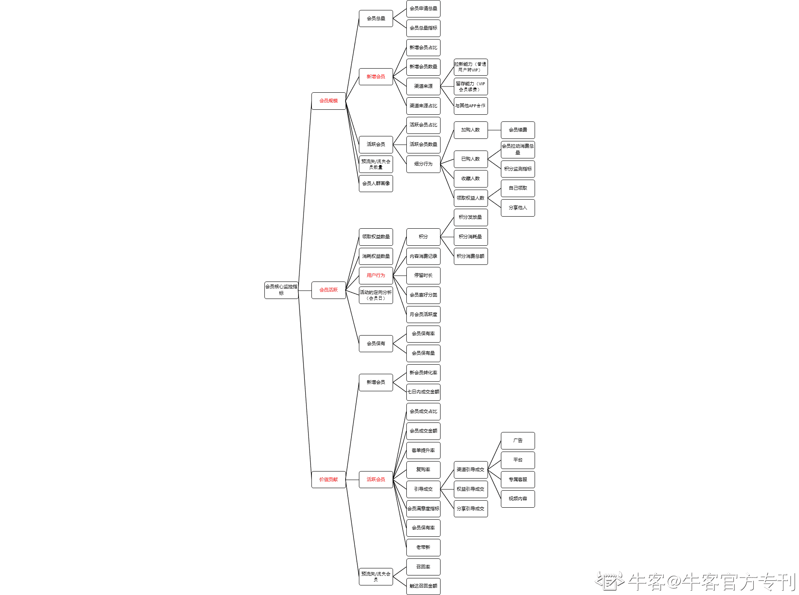

# 第九章 第 1 节 思考题解答

> 原文：[`www.nowcoder.com/tutorial/10036/f5994f98654942f4aec8b227541d6748`](https://www.nowcoder.com/tutorial/10036/f5994f98654942f4aec8b227541d6748)

### **方案调研参考解答思路：**

微信是一款非常成熟的社交产品，从不同角度切入调研，可以调研完整产品，重点关注其产品发展历程（包括对迭代路径、运营手段和产品数据表现的分析），从中借鉴宝贵的产品经验。或者也可以从社交产品的核心功能模块切入调研，例如：调研微信朋友圈的定位，分析其是如何满足用户需求的。

### **数据分析章节思考题指标拆解：**

