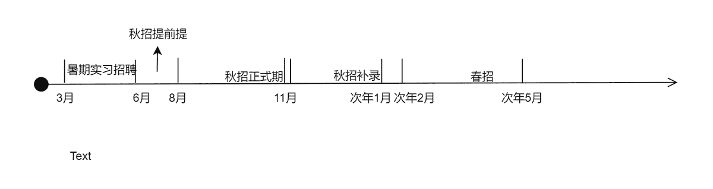
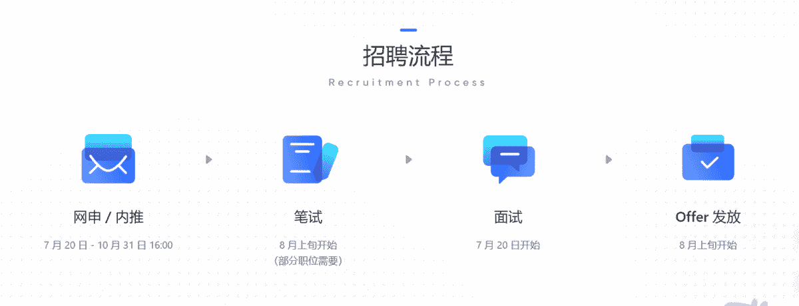

# 第二章 第 1 节 了解校招

> 原文：[`www.nowcoder.com/tutorial/10052/64784b9d22c04c7f84da8f25d8dacf57`](https://www.nowcoder.com/tutorial/10052/64784b9d22c04c7f84da8f25d8dacf57)

# **1\. 招聘对象**

顾名思义，校招是针对应届毕业生的招聘。招聘主体可以是企业、国家机关、中小学校等事业单位。招聘对象一般为应届毕业生，即处于研三或者大四阶段的同学。有的公司的校招可能会把招聘对象扩大到前几届毕业但还未就业的学生。比如，在 2020 年，由于新冠疫情的影响，世界经济形势非常严峻，很多公司缩招甚至裁员，使得有一部分 2020 届的毕业生还未就业。因此在 2020 年的招聘季，很多公司，特别是国企，他们的招聘对象并不局限于 2021 届毕业生，而是扩大到了 2020 届甚至 2019 届的毕业生。因此，即便已经毕业的同学，也可以关注各大公司的校招网站，看看他们是否也会招聘非应届毕业生。另外，由于境外学校毕业时间和国内不太一样，针对留学生的招聘时间相对来说是比较宽松的。比如，2020 年的招聘季，很多公司招聘的是 2020 年 1 月 1 日-2021 年 12 月 31 日期间毕业于海外高校的中国籍留学生。所以，一般来讲，留学生可以参加两个招聘季。

# **2 招聘时间线**

了解完招聘季的招聘对象后，我们需要来梳理下招聘季的时间线。招聘季可以分为 3 大版块：暑期实习、秋招、春招。

## **2.1 暑期实习**

暑期实习我在第一章提到过，是有机会直接转正的，相当于秋招提前批。对于应届毕业生来说，无论是期望通过暑期实习转正提早拿到 offer，还是想通过暑期实习获得一个亮眼的实习经历或进行职业探索，暑期实习都是一次非常重要的机会和窗口。暑期实习招聘一般从研二/大三下学期的 3 月份开始，一直持续到当年 6 月份。

## **2.2 秋招**

秋招这个版块可以分为 3 个时期：秋招提前批、秋招正式期和秋招补录。**秋招提前批。**秋招提前批从 6 月份就开始了，一般持续到 8 月份。秋招提前批一般是针对技术岗的，销售岗很少有秋招提前批。**秋招正式期**。秋招的正式期从 8 月份开始，一直持续到 11 月份。几乎所有公司所有岗位都会在秋招正式期进行紧锣密鼓的招聘，从发布岗位、组织线上线下宣讲会、组织笔试面试，到最后的发放 offer，都会尽量在这三个月当中完成。因此这三个月对我们绝大部分的应届毕业生来说是至关重要的。8 月份一般来说大部分公司还处在网申阶段，9 月、10 月我们求职者会面临节奏非常密集的众多公司的从网申到参加笔面试的过程。这个窗口期非常重要，这也是为什么会有金九银十的说法。**秋招补录期。**秋招补录是放弃签约的求职者比较多等原因造成公司在秋招正式期没有完成招聘指标而出现的。并不是每家公司每个岗位都会有补录，而且补录的名额比较少。很多公司秋招补录信息发布的渠道不是很公开，这种的补录通常是定向邀约部分之前投递过这家公司的求职者；比如我经历过的字节跳动的补录是 HR 直接打电话给我有没有意愿再次参加招聘，再比如华为的补录是通过直接给之前正式期部分落选的求职者发送性格测评的邀约开始的。当然，也有一些公司是通过公开渠道发布补录信息，比如腾讯是直接在他的招聘官网和招聘公众号里发布的补录公告，接受所有的求职者的申请。另外，很多公司补录的招聘流程有所简化，比如字节跳动的秋招补录省去了笔试和群面环节。秋招补录一般从 11-12 月份开始，持续到次年 1 月份。

## **2.3 春招**

春招是由于秋招阶段的录取者毁约、升学出国、考公等原因而造成公司没有完成招聘指标而设置的，因此春招也有点补录的意味。正是由于其补录的属性，春招招聘的公司、岗位种类、岗位数量都比秋招要少，整体规模比较小。考研、考公失败却又没有参加秋招的同学也可以抓住春招这次机会。春招一般从招聘季次年 2 月开始，一直持续到次年的 5 月左右。下面，我用一张图片总结一下招聘季的大致时间线。

# **3 招聘形式**

企业的招聘流程包括：网申/内推、网测、笔试、面试等几部分。下图是我用了字节跳动的招聘流程来举例。

## **3.1 网申/内推**

网申就是在各大公司的招聘系统里面填写职位申请信息，基本上包含出生日期、籍贯、电话邮箱等个人信息，教育背景信息，实习经历，语言技能，荣誉获奖等几部分。这几部分和简历的构成基本一致。因此建议大家先把简历制作好，再去海投各大公司去网申。这样也可以直接把简历上的信息复制粘贴到网申系统上，节约网申的时间。内推就是通过公司内部人员填写职位申请信息。有的公司内推有优先通过简历筛选的好处。但对于大部分公司，内推和网申相差无几，只不过如果推荐成功，内推人可以获得一笔赏金而已。

## **3.2 网测（Online Assessment）**

网测可能是在简历筛选前，也可能出现在简历筛选后。国内企业常用的网测的题目，比如北森题库等，一般包括行测的言语理解、资料分析、图形推理这三部分。有的公司的网测还包括了性格测评。并不是所有公司都有网测。很多外企的网测题不是国内企业常用的行测题型，而是比较五花八门：比如宝洁的网测包含 digit challenge, switch challenge, grid challenge；亚马逊的网测有逻辑推理、数***算题和英语测评。很多公司并不把网测成绩当作筛选标准，只是给面试官作参考。

## **3.3 笔试**

笔试。正如我在第一章列举的，很多公司并没有针对于销售等非技术岗位的笔试。即便有，也和网测题型相差无几，题型主要是言语理解、逻辑推理、数量关系、资料分析等。部分公司，如携程、腾讯、字节等会在笔试中设置业务知识相关的题目，这个需要大家提前做好准备。具体的准备方法我会在第三章详述。

## **3.4 面试**

对于销售岗，各大公司通常会有 2-4 轮面试。面试形式包括：群面、业务面、主管面、HR 面。当然在不同的公司，各个环节的面试名称叫法可能会不一样，安排顺序也不尽相同。**群面。**群面通常是面试的第一轮环节，因为可以通过群面快速筛选出符合要求的人，提高面试效率。群面的方式是无领导小组讨论，每个小组需要在规定的时间内根据所给的材料和题目讨论出一个最终的结果。面试官会根据每个人在整场讨论中的表现决定其是否晋级。**业务面。**业务面又称为 par 面，一般是将来入职后的直接上司作为面试官。业务面以考察专业能力为主。面试官会通过深挖简历，深入了解面试者过往的实习经历，来判断他是否适合这个岗位，判断他的能力是否符合这个岗位的要求。**主管面。**主管面或总监面又称 boss 面，一般是面试部门的高级主管作为面试官。主管面以考察个人潜力为主。面试官问的问题偏向于宝洁八大问，通过了解求职者的人生经历来判断他是否有胜任这个岗位所需要的潜力和特质。**HR 面。**HR 面一般由面试部门的 HRBP 作为面试官。HR 面主要考察求职者的性格、与公司和岗位的匹配度、稳定性等等。例如，“能否接受加班”，“平时有什么兴趣爱好”，“讲出自己的三个优点和三个缺点”，“有没有男/女朋友”等等。这些都是 HR 面试中常问的，大家坦诚回答即可。