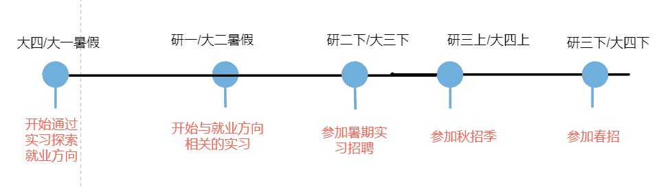
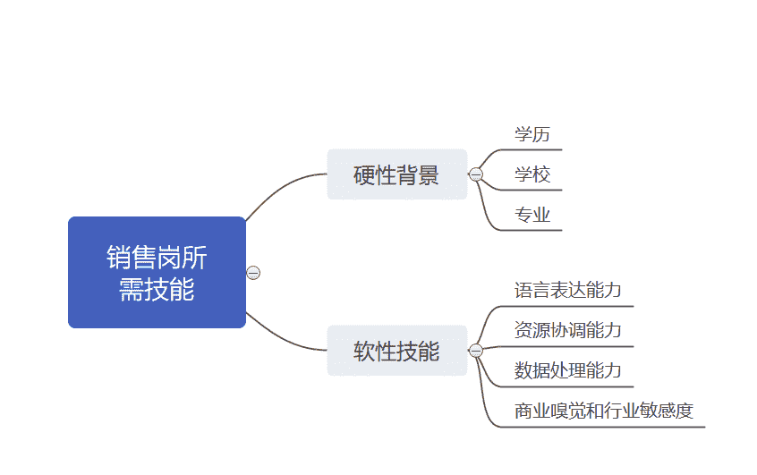

# 第二章 第 3 节 校招学习规划

> 原文：[`www.nowcoder.com/tutorial/10052/c5e240a081ed4f3bbe4e7b6ae6ab8d30`](https://www.nowcoder.com/tutorial/10052/c5e240a081ed4f3bbe4e7b6ae6ab8d30)

# **1 尽早规划实习**

正如前面梳理招聘季时间线介绍的，对于应届毕业生来说，最重要的是 8-11 月份的秋招正式期。很多大厂的销售岗大约在最晚 8 月，最早 7 月初就开始网申了。因此，研究生应届生需要在研二的暑假就准备好简历，本科生需要在大三的暑假准备好简历。随后花时间不断打磨修改自己的简历，并开始准备笔试面试。大厂对销售岗位的求职者是比较看重他们销售相关的实习经历的，所以为了保证自己的竞争力，在秋招季开始前我们需求准备 2 段以上相关的实习经历。一段实习一般在 3 个月以上，所以我们应该提前一年，在研一/大二暑假开始规划实习。但是，往往我们对自己的就业定位一开始是比较迷茫的，有时候在实习后发现自己所从事的岗位不太适合自己，甚至在尝试了几份实习后才可以最终找到适合自己的方向。因此保险起见，需要再提前一年开始规划自己的实习。对研究生来说，就是大四暑假就要开始规划了；对于本科生来说，需要大一暑假开始规划。另外值得一提的是，希望通过暑期实习提前转正的同学，这个时间线往往还需要提前半年。下面，我用了一张时间线来直观地表示求职季时间线。总而言之，对于有志于从事销售岗的同学来说，在进入毕业招聘季之前，最重要的事情是找准就业定位，并准备两段以上销售相关的实习经历。因此，建议大家越早开始规划实习越好。

# **2 职业规划**

对于找准就业定位，我相信很多同学，特别是和我一样的文科生，有很多条路可以选：考公务员，去中学或者辅导机构当老师，进互联网公司做运营/产品，进制造业公司做销售、进地产公司、银行，还有几乎每家公司都会招的 HR、行政岗等等，不一而足。面对这么多条道路，我们该如何选择呢？我认为最重要的是选择适合自己的：需要去了解每个行业、每种岗位，然后根据自己的兴趣爱好和人生/职业规划，选择最适合自己的岗位。首先，我们需要根据自己的专业背景、职业兴趣等个人情况去圈定一个职业范围：哪些行业/岗位是我能够从事并且想要从事的。其次，通过一些公开渠道（如知乎、牛客网等），或者通过询问职场前辈，了解这些行业和岗位。然后选定自己更想从事的行业/岗位。或者做排除法，排除不想从事的行业和岗位。再次，最直接、最精准地了解一个岗位和行业的方法就是通过实习，亲自去接触这个岗位的工作，亲身地参与到这个行业，去了解这个岗位的工作内容、薪资待遇、职业发展，了解这个行业的工作环境和发展前景。但是由于时间有限，毕业前实习的机会还是屈指可数的。所以要珍惜实习的机会，去到最想从事的行业/岗位实习。通过实习了解到更多的岗位信息之后，再来判断自己是否喜欢这个工作，自己的性格能力是否匹配这个岗位，以及这个岗位的薪资待遇和职业发展是否达到自己的预期。了解更多的行业/公司信息后，就可以判断这个行业是否值得进入，这家公司是否值得选择。这就是为什么我建议大家尽早开始实习的原因，越早开始实习，就有越多的时间去接触不同的岗位和行业，就有了更多的试错的机会。最后，建议大家按照“工种-具体岗位-行业-公司”这个步骤来规划职业方向。工种就是明确大的工作方向：比如教师、公务员、销售、互联网产品经理、HR 等等。具体岗位就是确定了大的求职方向后，需要明确具体的工作岗位：比如销售这个工种之下会细分为市场营销、渠道销售、电商、大客户销售、零售、新零售等不同的工作岗位。行业就是明确了岗位后，需要选择将要进入的赛道，也就是行业：比如有志于从事销售岗的同学可以选择进入 IT 行业、快消行业、互联网行业等等。公司就是在明确了将要进入的行业后，选择心仪的目标公司。

# 3 学习规划

虽然销售岗不像技术岗那样有些必备的，如编程能力之类的技能要求，并且销售岗招聘通常都是专业、学历不限；但是销售岗也是有一些隐性的技能要求的。如果求职者能够提前学习掌握这些技能，他/她则能够在求职季收获大公司的青睐。下面我将给大家列举一些销售岗所需要的技能，并给出学习建议，推荐一些学习资源。下图是销售岗技能树。

## **3.1 硬性背景**

### **3.1.1 学历**

大公司招聘通常是要求本科以上的，因此如果是专科的同学，建议通过专转本提高学历。现在招聘市场已经越发呈现出学历内卷的趋势，即便是销售这种本科生、大专生就能从事的岗位，求职者中都有相当多的研究生。各大厂也都倾向于招聘学历更高的人，毕竟学历越高的人大概率综合能力也更强。在 2020 年的招聘季，在我参加的几次群面里，我发现研究生占比通常都达到了 50%以上，甚至更高。由此可见，在简历筛选环节，学历越高越有竞争力。同理，在后面的几轮面试环节中，学历越高的求职者相对来说也更容易获得面试官的青睐。因此，对于是本科的同学，尤其是普通高校的本科的同学，建议通过读研提高自己的竞争力。当然，这条建议不是很适用于 top 高校的本科生。

### **3.1.2 学校**

公司的招聘广告中自然不能对求职者的学校有所限制，这会引发比较严重的公关危机的。但是，大公司倾向于招募名校的学生，这是大家心知肚明的。就以我参加的群面来举例，985 高校和 QS 世界大学排名前 200 的学生占比是很高的。因此，建议本科的同学通过读研的方式，增强自己的学校学历背景。另外，参加出国交换和海外联合培养项目也是提高自己学校背景的方式之一。

### **3.1.3 专业**

通常来说，销售岗并没有严格的专业限制，专业门槛较低。但是，经济类、管理类、新闻广告类、数学统计类的学生会更受欢迎，理工科和商科的学生会更受青睐。因此，如果不是上述专业的同学，可以通过辅修或者双学位的方式提高自己的专业竞争力。但是即便大家不是上述专业也没有办法修习双学位，也不用很担心，因为销售岗的专业限制并不严格。我自己本硕专业都是英语，属于完全的跨专业就业，但是最终也获得了很多大厂的销售岗的 offer。对于上述的三项硬性背景——学校、学历、专业，对很多同学来说很难去改变。我们也不必对这三项条件有过多的焦虑，毕竟正如很多岗位要求里说的，“专业、学历不限”，各大厂往往更看重求职者的软性技能和潜力。下面，我将给大家介绍一下销售岗位所需要的几项软性技能。

## **3.2 软性技能**

### **3.2.1 语言表达能力**

销售就像是一座桥梁，连接着产品和顾客。销售需要向顾客传递产品的价值信息；也需要收集顾客信息来帮助提炼产品卖点，改进产品，提高产品价值。这些过程都涉及到信息的收集和传递，这就需要语言来作为媒介。因此，对于销售人员来说，最重要的是拥有非常强的语言表达能力。由此，建议各位同学平时多与人沟通交流，在课堂上多去发言和展示，课外可以多参加辩论赛、演讲比赛等活动，通过这些方法提高自己的语言表达能力。销售需要经常和各种人打交道：客户、同事、上司、供应商等等。人和人的交往又是非常看重情商的，也就是为人处世之道。因此呢，建议大家性格更加外向一些，多和人打交道，多参加一些团体活动、社交活动等等。大家在学校的交际网通常比较单一，基本上都是自己的同学和老师，因此也建议大家可以通过兼职和实习去接触更多职场上的人、社会中的人。对于想要从事海外销售岗的同学，或者是想要加入外企的同学来说，外语能力是非常重要的。国内的同学需要有较高的六级成绩，英语专业的同学需要获得专八证书，海外留学生需要有较高的托福雅思成绩。各大公司在面试中都会有英文面试环节，面试官会用英文问几个问题，让面试者用英文作答。有的公司会有单独的英语测评环节：比如欧莱雅有 English Video Assessment,华为有专门的英语测评环节，Shopee 的群面是全英文的。因此建议大家去考英语六级或者是雅思托福，尽量考高分；然后平时多注重口语训练，因为面试中的英文测评基本都是考口语的。另外，需要提前准备好英文的自我介绍，和一些常见的英文面试题目，比如“你为什么申请这个公司/岗位”，“介绍一段你最有成就感的事情”，“介绍你的家乡”等等。语言表达能力比较难量化和标准化考核，面试官只能通过和面试者交流考察面试者的语言表达能力。如果面试者有辩论赛、演讲比赛、写作比赛之类的获奖可以写到简历中，外语考试的成绩也需要在简历中体现。

### **3.2.2 资源协调能力**

大公司部门和人员都非常多，销售经常需要和不同的部门、不同的人打交道，争取、调度、协调公司内外部的资源来确保自己的项目能够获得成功。因此，销售需要有较强的资源协调能力。特别是当我们走上领导岗位之后，这一项能力尤为重要。所以，大厂在招聘的时候，尤其是招聘管培生的时候，会着重考察对方的领导力和资源协调能力。大家可以通过在校内担任学生干部来增强自己的资源协调能力。如果能做到学生会主席、班长这种职位是最好的。任职期间多参与举办大型的活动，提高自己的组织领导能力。另外，也可以通过实习来培养自己的资源协调能力。实习需要和不同的部门和人打交道，争取资源，能够锻炼自己的这方面能力。因此，实习期间，大家需要多参加项目，找机会锻炼自己。在简历中，可以用一定的篇幅去介绍自己在校内担任学生干部的经历。如果获得了“优秀班干部”、“优秀共青团干部”这种荣誉可以写在简历上，这能够体现自己领导能力。面试的时候，面试官也会考察求职者的领导力和组织能力，因此在面试前大家需要准备好几个和这项能力有关的经历案例：比如“你是如何组织一场活动并在当中发挥主导作用的”，“你是如何争取有关资源来确保项目成功的”，“你是如何解决组内组员争端矛盾的”。关于领导力的案例，建议大家优先使用学校的案例，因为在学校更有机会去领导团队组织活动；校外实习比较难有这种机会，因此不容易有打动人的案例。

### **3.2.3 数据处理能力**

在销售工作当中，我们每天都要处理大量的数据和报表，因此销售需要有较强的数据处理能力。我们可以在简历中表达自己有足够的数据处理分析能力。我虽然是一个文科生，但是我曾经参加过国家大学生科研创新训练项目并在项目中负责定量分析部分，因此，我在简历中就把我的科研项目写进去了。大家在制作简历时，如果有定量研究和其他相关的科研经历，可以写进简历，在描述科研项目时着重体现自己的数据处理能力。如果没有科研项目，可以写一些其他能体现自己数据处理分析能力的点：比如数学建模大赛获奖、计算机***书等等。excel 表格的使用能力是销售岗最重要，也是最基础的一项能力。因此建议大家去考计算机***书，以考促学，着重训练自己的 excel 操作能力。不过，如果不去考计算机二级证书，也没关系。平时在学习中和实习中，注意多多锻炼自己的 excel 能力就行。学有余力的同学还可以学习更高阶的数据处理技能，比如 SPSS、Python 等等。面试中面试官一般不会特别问求职者的数据处理能力有多强，所以大家不用特别准备这方面的面试题目。简历中有所体现就行。

### **3.2.4 商业嗅觉和行业敏感度**

销售总是在和不同的人交流，交流需要能够聊得起来，需要有谈资。因此销售除了需要有较强的表达能力，也需要有一定的商业信息储备，需要了解国家、市场、行业的大事件，并对此有一定的见解，这样才能和大家谈笑风生。销售也需要对自己所在行业有很深的了解和较高的敏感度，这样才能让自己显得更专业。尤其是在大家工作几年后走上管理岗位后，需要时常作出分析和决策，把握业务的发展方向，更加需要时刻跟进行业动向，需要有很强的商业嗅觉，或者说是 business sense。所以，希望大家及早开始培养自己的 business sense，不仅能够提前增强自己的业务素养，提高自己的 qualification；更能够在面试中，以自己的高度的专业能力和对行业独到的见解力打动各位面试官，特别是在主管面的时候。这里给大家提供一些学习资源来帮助有志于从事销售岗的同学培养自己的 business sense。大家可以经常阅读一些商业和市场相关的公众号文章，以此来提高自己的 business sense。比如我自己经常看的公众号有：36 氪、虎嗅、人人都是产品经理、梅花网、鸟哥笔记等等。多看这些公众号的文章，可以大大丰富自己的专业理论知识，十分有利于后续的简历撰写和笔试和群面的准备。比如我自己就是读了一篇关于互联网运营的概述文章，才把自己电商运营的工作经验系统地串联归纳了起来，分点在简历上描述了这段实习，效果比之前笼统地介绍好了很多。每天抽出些零碎的时间看一两篇自己感兴趣的商业分析文章，坚持个一年半载，你的认识和谈吐绝对会大有改观。这方面的能力不用特别去写在简历上，面试中面试官会提一些专业相关的问题，笔试中有的公司也会考察专业主观题。大家在回答问题时，把自己积累到的业务知识应用起来就行。