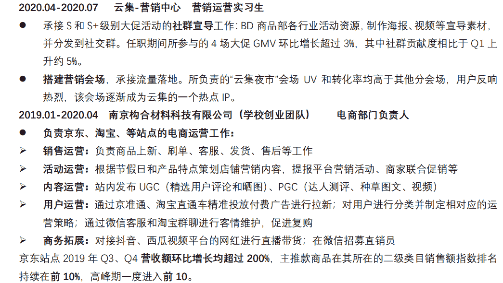
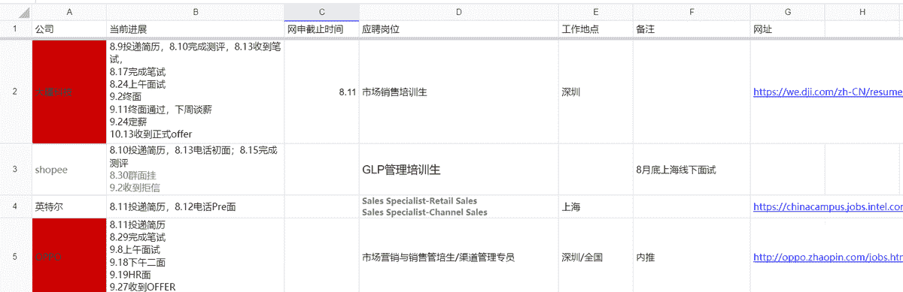

# 第三章 第 1 节 简历的撰写及投递

> 原文：[`www.nowcoder.com/tutorial/10052/82b089939757412f8d881c7ea45a17c8`](https://www.nowcoder.com/tutorial/10052/82b089939757412f8d881c7ea45a17c8)

 **# **1\. 简历**** 

## **1.1 简历的作用**

求职基本上是按照“网申-笔试-面试”的步骤进行的。简历的好坏会在很大程度上影响网申通过的概率。在后续的面试过程中，面试官会在面试之前浏览求职者的简历，所以一个好的简历会给面试官留下好的印象。简历需要在第一个步骤——网申前准备好。
网申需要在各大公司的招聘系统上填写很多繁复的信息，重复性比较高。因此提前写好简历后，就可以直接复制粘贴了，能够节省很多时间。

## **1.2 简历的构成**

一般来说，简历最好不要超过一页 A4 纸。用人单位要筛选很多很多简历，看每份简历的时间就很短，因此简历越精简越好，只写最关键、最相关的信息即可。对于我们销售岗来说，简历最重要的部分是个人信息、教育背景、实习经历这三部分。除此之外，还可以加上在校经历、专业技能、科研项目、获奖荣誉等部分。简历右上角还应加上证件照。下面我会对这几部分详细介绍如何撰写。除了个人信息、教育背景、实习经历外，其他几个版块大家需要根据自己的情况决定是否撰写，和决定撰写形式内容。

### **1.2.1 个人信息**

个人信息包括出生年月或年龄、电话、电子邮箱，这三项是最重要的。其他的个人信息如政治成分、婚否、籍贯等则可以不写，以节约空间。性别也不用写，用人单位可以通过证件照判断性别。

### **1.2.2 教育背景**

教育背景部分从高到低依次介绍自己的教育信息。每一条教育信息都要包括就读时间、就读学校、就读专业、学历。如果有出国出境交换的经历，也可以写上。

### **1.2.3 实习经历**

实习经历这一部分可以写 2-3 项与岗位相关的实习经历。这几段实习经历可以按照相关性来排列，最相关的实习放在最前。如果每段实习相关程度差不多，则可以按照时间排列，最近的一段放在最前。每段实习经历需要包含在职时间、所在公司及部门、任职岗位、工作内容、工作结果等信息。一段实习经历可能会包含好几项工作内容，因此可以分点写，然后每一点的工作内容可以用一个小标题来总结。小标题可以放在句首，加粗，这样能够显得更加突出重点，方便面试官尽快抓到你的亮点。工作结果尽量用数字、事实等直观的方式来表达。数据都是具有“可操作性”的。比如写销售业绩，如果绝对值不高，则可以写增长率。我自己有一段创业公司负责电商销售的经历，在表述销售业绩时，销售总量并不高，一年只有 30 万的营收额；因此我就换了个说法，改为介绍增长率：“营收额 Q3、Q4 的季度环比增长均超过 200%”。一段实习中一般同时有几项工作内容，因此可以在每一项工作内容之后逐个介绍其工作成果，亦可以在写完所有的工作内容之后统一介绍一个总的工作成果，根据实际情况来决定使用哪种表达方式。下面我放上自己的两段实习经历的描述来帮助大家对撰写实习经历有更深的理解。

### **1.2.4 在校经历**

在校经历可以介绍自己的学生工作经历和社团经历，这一部分对应的主要是销售岗技能树里的资源协调能力。写作方法可以参考实习经历的写作方法，这里不作赘述，突出工作内容和工作成果即可。

### **1.2.5 专业技能**

专业技能部分可以针对销售岗所需的技能罗列所获得的的技能证书：例如外语***书、计算机***书、商务类的证书等等。

### **1.2.6 科研项目**

科研项目部分介绍自己的科研经历。这一部分主要是体现技能树里的数据处理能力，另外也可以体现自己的逻辑能力，和发现、分析、解决问题的能力。这一部分突出自己在项目中的工作内容和研究成果即可。工作内容的描述中尽量体现自己的数据处理能力。比如，可以介绍项目中负责哪部分定量研究，使用了哪些统计软件等等。

### **1.2.7 荣誉获奖**

荣誉和获奖这一部分罗列自己的荣誉证书和获奖证书，包含获奖时间、级别（国际级、国家级、省部级、校级、院级等等）、奖项名称等，这一部分可以体现求职者有很强的综合素质。大家可能会有很多的荣誉和获奖，但并不需要每一项都罗列上去，选择最相关、最有分量的写上去即可。“最相关”意思是选择与岗位最相关的荣誉和获奖：比如与销售岗相关的荣誉获奖可以是奖学金、“优秀班干部”、演讲辩论写作比赛的获奖、商赛获奖、创业大赛获奖等等。“最有分量”意思是在每一类获奖中选择最有分量的那一项写进去即可：比如奖学金这一类中，我们可能曾经获得过国家奖学金、校级奖学金、院级奖学金、励志奖学金等。写简历的时候，只需要把国家奖学金写进去即可，这是奖学金类别中最有分量的一个奖项，足以代表求职者在这一项素质中的成就，其他低级别的奖学金就无需再写了。写简历时，罗列出来的各个奖项也需要按照相关性和分量的高低进行排序。关于获奖的表述也有一定的可操作性。比如，我曾经获得过一项国际比赛的优秀奖，虽然优秀奖的分量通常来说很低，但是我在后面用括号加了个排名（前 35/3000 名），表明我在该项比赛中处于前 1%的位置，这个奖项的分量一下子就上去了。

## **1.3 简历的注意事项**

1\. 有的同学会应聘不同类型的岗位，每个岗位所需的任职资质往往各不相同，因此需要针对不同类型的岗位撰写不同简历。2\. 需要准备不同格式的简历：中文版和英文版，PDF 和 Word 版。如果大家是求职外企，建议制作一份英文版简历。PDF 版适合发送给别人，Word 版适合修改。3\. 制作简历不是一蹴而就的事情，做完第一版简历后，后续需要根据自己的总结和别人的建议不断修改。如果自己的实习经历和荣誉获奖等情况有所更新时，也需要根据情况决定是否更新简历。

# 2\. 网申

网申就是要在各大公司的招聘系统上填写简历信息并申请职位。

## 2.1 **获取招聘信息**

获取招聘信息是开始网申的前提。现在是一个信息时代，获取信息的能力是我们所需的一项重要能力。我经常能碰到有的同学错过了某公司网申的截止时间，而丧失了大好的求职机会，可以说是输在了起跑线上。因此，一个优秀的求职者也需要善于搜集招聘信息。这里推荐一些获取招聘信息的渠道。1）公司官方招聘号，包括招聘官网、官微、官博等。2）求职类的公众号和网站：比如，牛客网就是一家专注于提供各种就业信息和服务的网站，大家可以关注他的微信公众号“牛客求职”。学校的就业网站和公众号也可以关注下。3）群组：大家可以加入一些求职互助群和求职信息分享群，里面会分享很多招聘信息。到了招聘季的高峰期，各种招聘信息会密集地发布出来，建议大家每天从上述渠道收集招聘信息，以免错过心仪的公司。有时候看到了某家公司的招聘信息，我们不能够立即去网申，可以选择先把这则信息记录到手机备忘录，或者微信收藏保存起来，等有空再去网申。

## 2.2 **内推**

内推也是网申的一种方式。内推就是找到在那家公司工作的人，通过他提供的内推码或者链接填写简历信息并申请职位。想通过内推申请大厂但又没有人脉资源的同学可以上[牛客内推广场](https://www.nowcoder.com/discuss/referral/all/index)。内推的好处是求职者可以通过内推人更加深刻地了解这家公司和其提供的岗位，内推人如果推荐成功可以获得一定的奖励，所以校招季各企业的员工都会愿意帮助内推。在一小部分公司，内推的求职者可以优先通过简历筛选，甚至免除笔试。但是没有找到内推人也没关系，对绝大部分公司来说，内推并没有多大影响。

## 2.3 **网申方式**

网申就是通过招聘信息上提供的网站申请职位。打开公司招聘网站，首先要浏览相关招聘信息：包括招聘对象、网申截止时间、招聘流程、注意事项等等。然后选择合适的岗位，阅读其工作职责和任职资格。最后申请职位，填写简历信息并提交。到了求职季，大家要网申很多家公司，而每个公司又有独立的网申系统，因此可能需要重复填写申请信息。这里给大家推荐[牛客网的简历助手](https://www.nowcoder.com/quick-fill/show-introduce)。这个工具非常方便智能，一键闪填，非常节约时间。

## 2.4 **网申的注意事项**

1.  有些公司的岗位不是一次性放出来的，不同岗位放上招聘官网的时间不尽相同。因此大家在投递的时候，如果暂时不能找到很符合自己的岗位，可以耐心地等待一段时间，期间记得经常登录网站看有没有适合自己的岗位放出来。如果到了网申截止时间还没有特别适合自己的岗位就可以再考虑投递其他比较合适自己的岗位。
2.  绝大多数公司申请职位的机会是有限的，大部分是只允许投递 2 个岗位，且没有更改志愿的机会。所以大家尽量珍惜自己的投递机会，不要因为还没有出现合适自己的岗位就把投递机会浪费到完全不适合自己的岗位上。
3.  如果自己的简历有所更新，注意在已投递的公司的网申系统上也要去更新。
4.  有的网申系统可以上传简历，然后系统通过解析简历来自动填写当中的信息。建议大家上传 Word 格式的简历，因为 PDF 格式的简历解析过程中常有格式错误。
5.  各个公司招聘系统的账号密码要记录保存，方便后续查询网申和笔试面试状态

## 2.5 **信息记录工具**

建议大家对自己求职季所投递的公司作一个详细的信息记录。可以选择记录的信息包括：投递公司、投递岗位、投递时间、当前进展（笔试+时间/群面+时间/一面+时间......）、网申截止时间、工作地点、网址、岗位职责、岗位要求等等。这样做的好处有三：1）记录宣讲会、网申、笔试、面试的时间，以防止自己忘记招聘行程，错过重要的笔试面试。 2）方便查看一些重要的招聘信息，如招聘官网地址、投递的公司和职位、岗位描述等等。3） 记录求职经历，便于做总结复盘，总结经验。建议大家使用在线文档，比如腾讯文档、石墨文档等，记录招聘信息。在线文档的好处是，在任何设备都可以查阅编辑。如果大家投递的公司很多，则文档会很长，建议冻结第一行题头（题头就是包含了投递公司、岗位等信息名称的那一行），方便查阅。另外，大家也可以用不同的颜色标记进入到不同流程的公司，这样能更直观地显示自己的招聘进展情况。下图是我自己的秋招记录文档，给大家做个参考。