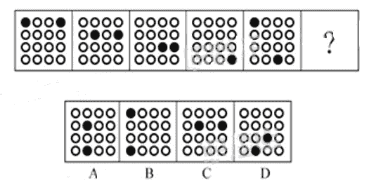
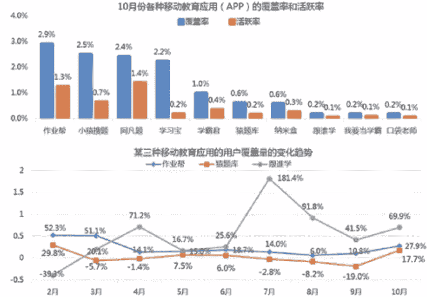

# 第三章 第 2 节 如何通过笔试

> 原文：[`www.nowcoder.com/tutorial/10052/ebee5902bdc644d5b6946eb4f95d4822`](https://www.nowcoder.com/tutorial/10052/ebee5902bdc644d5b6946eb4f95d4822)

# **1 笔试考试形式和考试内容**

我在第二章已经介绍过，在大多数公司，相比于技术岗，销售岗的笔试通过率一般比较高。但即便如此，在竞争如此激烈的就业市场，我们必须提高自己的竞争力，因此还是需要对笔试抱以一定的重视。笔试的组织形式有网测和统一笔试两种。网测一般是简历筛选通过就会发到求职者邮箱，求职者在规定时间内完成即可。统一笔试是公司规定了一个时间，所有的求职者在这个时间段统一参加笔试。笔试的考试内容和公务员考试中的部分行测题型非常相似。笔试的考试内容常见的有：言语理解、逻辑推理、资料分析、数字关系、性格测试、专业简答题。下面我会对这几种常见题型逐一介绍。

## **1.1 言语理解**

言语理解考察的是求职者对语言文字的理解和应用能力。常见的言语理解的题型有阅读理解、逻辑填空、排序题。下面给大家举例每种题型

### **1.1.1 言语理解之阅读理解：**

阅读理解常考对一段文字的理解能力，可能会考察主旨理解、细节信息判断等方面。【例题】（优衣库 2020 笔试真题）融电子写作、电子编辑、电子检索、阅读与电传网络于一体的电子期刊网络出版的兴起，加快了“无纸信息社会”的进程，从根本上改变了原有的期刊出版模式，在信息技术发达的国家，阅读电子出版物已成为人们日常生活的一部分。随着我国信息高速公路建设的推进，电子出版也将逐渐取代传统的期刊出版方式，以适应信息社会发展的趋势。这段话主要支持了以下哪种论点：（A）A. 电子期刊网络出版的兴起，加快了“无纸信息社会”的进程 B. 阅读电子出版物将成为世界潮流 C. 电子期刊网络出版的兴起对传统专刊提出了新的挑战 D. 电子期刊网络较传统期刊更有生命力

### **1.1.2 言语理解之逻辑填空**

逻辑填空常考的有成语填空、词语填空、连接词填空、语句填空等等，考察的是对词语、成语的理解应用能力，和对段落逻辑的理解能力。【例题】（碧桂园 2018 笔试真题）从曾经的自行车王国，到今天的车轮上国家，中国仅用了一代人时间，就实现了欧美几代人的梦想。让更多人开上汽车，这是 ______；让更多车主遵守规则，这是 ______* 。*填入划横线部分最恰当的一项是：（C）A. 趋势 前提 B. 必然 进步 C. 发展 文明 D. 目标 基础

### **1.1.3 言语理解之排序题**

排序题就是将题目中打乱的几个句子按照正确的逻辑重新排序，这种题考察的是逻辑思维能力。【例题】（比亚迪 2018 笔试真题）①时代在变化，城市也在生长，在理解过往的同时，不妨赋予它新的内涵。②若是正好有历史典故可以化用其中当然好，但若没有也不必牵强刻意。③这些新内涵，或许就是后人想要追溯的曾经。④不是无视过去，而是尊重当下。⑤取好地名不必局限于向历史找补。5 个句子重新排列，语序正确的是：（B）A. ③④①②⑤B. ⑤②④①③C. ④③②⑤①D. ①②⑤③④

## **1.2 逻辑推理**

逻辑推理的题型包括图形推理、逻辑判断、定义判断、类比推理。其中，图形推理考察的最多，其他三种题目相对比较少。

### **1.2.1 逻辑推理之图形推理**

在各大公司笔试和网测里，图形推理是逻辑推理类题目的重点考察题型，甚至有的公司只考这一种题目。图形推理题需要发现所给图片的规律，然后根据规律选择正确的图片。这种题目难度比较大，考点也灵活多样，考生平时要多练习。【例题】（比亚迪 2018 笔试真题）这是道典型的图形推理题，规律是从第一幅图开始，左上角的黑色圆形沿着对角线往右下角移动，周而复始；右上角的黑色圆形先是沿着最右边的竖线往下移动，然后沿着最下面的横线往左移动。因此答案选择 A。

### **1.2.2 逻辑推理之逻辑判断**

这种题目考察的也是逻辑能力，最常见的是“三段论”、“判断真假”、“可能性推理”。这种题目的难度较大。【例题】（保利地产 2018 笔试真题）在州长任职的三年里，经常被指控对女性有性别歧视的态度。然而，他已经在他的管理层的 19 个高层空缺职位中任用了 5 名妇女。她们中的所有人仍在服务，这表明州长并不是一名性别歧视者。 下列哪一个如果正确，最反对上面的结论：（B）A. 州长任命的一名高层职位的女性，正准备辞职。B. 州长所在政党的纲领要求他们在高层职位中至少任命五名女性。C. 三年前州长投票中 47%的女性投票支持这位州长。D. 州长在其管理层任命了两名黑人，两名西班牙裔美国人，一名亚裔美国人。

### **1.2.3 逻辑推理之定义判断**

定义判断就是通过题目对定义的描述来判断选项是否符合定义。这种题目的难度较小。【例题】（联合利华 2018 笔试真题）转移收入指不是作为生产要素提供的劳务报酬的收入，从而也是不能计入国民收入的收入，居民用户所得到的政府的转移支付，退休金以及私人赠与等都属于转移收入。下列选项中不属于转移收入的是（D）A. 离退休金。B. 赡养收入。C. 出售财物收入。D. 贸易收入。

### **1.2.4 逻辑推理之类比判断**

类比判断也比较简单，以考察常识为主。【例题】（优衣库 2020 笔试真题）温度计：气温，正确选项为（B）A. 高兴：哀愁 B. 磅秤：重物 C. 甜菜：音乐家 D. 游泳：运动

## **1.3 资料分析**

资料分析也是销售岗笔试中的重点之一。资料分析题会给出一个销售案例，然后会给出 2-5 个计算题。增长率、贡献率、比例等都是常考点。销售岗比较看重求职者的数据分析能力，相关用人单位会比较看重这类题的成绩。【例题】（蓝月亮 2020 笔试真题）10 月份不同移动教育应用中，活跃率与覆盖率之比最大的是（B）A. 作业帮 B. 阿凡题 C. 纳米盒 D. 我要当学霸

## **1.4 数量关系**

数量关系题有点类似中学的数学题，有一定难度，耗时也长，考生得分率较低。但好在这种题目比重比较小，大多数公司并不考这种题目。数量关系题包括数***算和数字推理两种题。

### **1.4.1 数量关系之数***算**

【例题】（碧桂园 2018 笔试真题）向 500kg 浓度为 10%的溶液中加入水稀释为浓度 8%的溶液。需注入（B）Kg 的水。A. 120B. 125C. 130D. 135 数***算就是中学数学应用题了，常需要设方程求解。比如上面的例题，可以设注入 x Kg 的水。则得到方程（500+x）*8%=500*10%。解这个方程，得到 x=125。

### **1.4.2 数量关系之数字推理**

【例题】（比亚迪 2018 笔试真题）1，6，15，28，（45）数字推理一般考数列，需要考生对数字有较高的敏感度。例如上题，通过一级逐差发现差值分别为：5,9,13。然后二级逐差发现差值为 4,4，是一个差值为 0 的等差数列。因此，判断下一个二级差值为 4，则下一个一级差值为 13+4=17，则最终结果为 28+17=45。

## **1.5 性格测试**

性格测试会通过大量的情景题（100 道左右）来分析应试者的性格类型，供用人单位评估应试者与公司和岗位的契合度。这种题目没有对错之分，并且一般来说也没有时间限制。

## **1.6 专业简答题**

部分公司的笔试会设置专业简答题，就是 1-2 道大题，考察求职者的专业方向的知识储备。群面题型中也经常会出现类似的专业相关的讨论题。**【例题】****（2020 年腾讯市场方向笔试题）**当前有一个热门的理财场景叫“梦想计划”，即让用户设定一个目标值，然后通过定投、或者不定期存入资金等方式达到目标。请设计一个针对梦想计划理财的线上推广方案。这种简答题一般没有正确答案，言之成理即可，网上也搜不到标准答案的。用人单位会着重看答题者的解题思路和逻辑，更多的考察他们的逻辑思维能力和文字表述能力。下面我给大家提供一个解题思路吧，仅作参考。如果有更好的解题方法，欢迎大家在评论区补充。针对于推广方案，大家可以从推广渠道这个角度来思考方案。常见的线上推广渠道有：信息宣导类（腾讯新闻、QQ 看点、网易新闻、抖音等）、互动营销类（KOL 转发、微博抽奖等）、销售宣传类（腾讯理财通、美团、京东、京东金融等）、自有渠道（利用腾讯的 APP 矩阵，以弹窗、开屏广告、banner、微信朋友圈广告等形式宣传）。销售岗位还有一种常考的题目是如何提高销售额/销售利润。这种题目大家要记住一个公式：**销售利润/销售额=流量*转化率*客单价*复购率**。提高流量就是涉及到营销。常见的营销方式有互动营销（微博抽奖等）、社交营销（朋友圈广告、裂变券等）、内容营销（微信公众号、视频号、抖音、小红书等 APP 上发布软文、视频、直播）、联合营销（联合其他品牌进行营销活动）、KOL/KOC 引流（大 V 转发、达人开箱测评）提高转化率的方式有：搞促销活动（发放优惠券、送赠品），网店要刷好评和整理买家秀，销售人员/客服提高服务质量（专业、热情、形象好）提高客单价的方式有：通过满减、满折、满送赠品等方式进行捆绑销售，提高产品质量、提高服务质量（如私人管家终身服务等）、品牌溢价提高复购率的方式有：设立积分系统（消费送积分，积分可以抵现）；做好用户关系管理工作，把客户沉淀到微信等私域流量池，后续持续进行营销覆盖；消费后送优惠券

## **1.7 其他**

上面给大家介绍的是常见的几种笔试题型，但有的公司笔试题比较特殊。例如，宝洁的网测题是数字运算题、管道题、网格题。京东管培生 2020 笔试题是游戏测评，线上做一些有趣的游戏。还有一些外企和主营国外业务的公司，如亚马逊、shopee，笔试中还有英语笔试题。

# **2\. 笔试的准备方法**

针对销售岗的笔试，大家需要提早做准备。首先就需要大家在考前去查下公司往年的笔试题型，然后针对性地进行准备。对于言语理解、资料分析、图形推理这三类题，需要重点练习，多刷题。其他几类不常考的题，包括数量关系、逻辑判断、定义判断、类比判断等，大家只需要熟悉考点，平时以一定频率练习即可。平时刷题的时候，要看解题思路和答案解析，要注意多总结多思考，归纳做题技巧，提高自己的准确性和做题速度。推荐大家去[牛客网的题库](https://www.nowcoder.com/intelligentTestr)刷题，题库题型全、题目多，足够大家拿来练手。性格测试题型不需要提前准备，只需要按照自己的真实情况答题即可。不建议猜测题目考察意向，而去迎合公司喜好选择不符合自身情况的选项。原因有三：1）很难判断公司的喜好，不同部门不同岗位偏爱不同性格的人，容易判断失误；2）性格测试中往往带有测谎题，如果被发现在某道题撒谎，会有比较大的风险；3）即便是通过伪装通过了性格测试，但公司部门企业文化和岗位可能会和自己性格格格不入，会大大影响自己以后的工作积极性，最终影响到自己的职业发展。因此，对于性格测试，大家只需放松心态，真实作答即可。专业简答题需要大家去储备专业知识。比如销售岗需要了解 4p 理论、4c 理论、马斯洛需求理论、用户留存方法（AARRR 模型），以及零售/新零售/o2o 的概念、营销和销售的区别等等。这些基础的专业理论知识网上都能查到，建议大家去网上搜下了解下。考前可以去牛客网查下往年的考题，做到心中有数。对于某些公司比较特殊的笔试题，大家需要提前去了解这些公司的笔试题型，然后找往年的题库去练习。牛客网上有非常丰富的笔试题库，大家在做笔试准备时，可以多去牛客网上刷刷题库，刷刷笔经。

# **3\. 笔试的注意事项**

1\. 除了性格测试，其他的笔试题都是有时间限制的，大家在做题的时候要注意时间安排，遇到难的题目的时候考虑直接放弃，不要浪费大量的时间在难题上。在平时的训练中，在保证正确率的前提下，要注意提高自己的做题速度。2\. 参加笔试前做好充分准备，准备好草稿纸和计算器，找一个安静的地方作答。需要检查电脑摄像头，保证网速，保证房间光线充足。这是因为进入考题前需要拍照确认，如果电脑摄像头损坏，或者房间光线不好，则难以通过拍照检核。3\. 有的公司的笔试题会给予一周左右的作答时限，大家一定不要忘记作答，建议设置备忘录提醒。