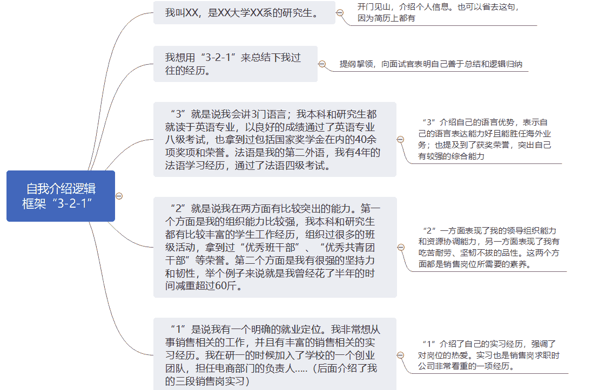

# 第三章 第 3 节 如何准备面试

> 原文：[`www.nowcoder.com/tutorial/10052/f5bf13e5752a409e9df78f628ccc7da4`](https://www.nowcoder.com/tutorial/10052/f5bf13e5752a409e9df78f628ccc7da4)

对于销售等非技术岗，面试是最重要的考核方式。各大厂的面试通常会组织 2-4 轮。面试形式最常见的有：群面、专业面、主管面、HR 面等。

## 1 **自我介绍**

在各轮面试前，通常有一个自我介绍的环节。面试官会在开始面试前阅读求职者的简历，因此自我介绍的时候绝对不要照着简历念。大家需要一个提纲或者逻辑，总结归纳自己的经历，只讲亮点。比如我喜欢用“3-2-1”这个框架来作自我介绍。

> *我叫 XX，是 XX 大学 XX 系的研究生。*（首先开门见山，介绍姓名和教育背景）

> *我想用“3-2-1”来总结下我过往的经历。*（提纲挈领，向面试官表明自己善于总结分析）

> *“3”就是说我会讲 3 门语言；我本科和研究生都就读于英语专业，以良好的成绩通过了英语专业八级考试，也拿到过包括国家奖学金在内的 40 余项奖项和荣誉。法语是我的第二外语，我有 4 年的法语学习经历。*（“3”介绍自己的语言优势，突出自己的表达能力好且能胜任海外业务；也提及到了获奖荣誉，突出自己有较强的综合能力）

> *“2”就是说我在 2 方面有比较突出的能力。第一个方面是我的组织能力比较强，我本科和研究生都有比较丰富的学生工作经历，组织过很多的班级活动，拿到过“优秀班干部”、“优秀共青团干部”等荣誉。第二个方面是我有很强的坚持力和韧性，举个例子来说就是我曾经花了半年的时间减重超过 60 斤。*（“2”一方面表现了我的领导组织能力和资源协调能力，另一方面表现了我有吃苦耐劳、坚韧不拔的品性。这两个方面都是销售岗位所需要的素养。）

> *“1”是说我有一个明确的就业定位。我非常想从事销售相关的岗位，并且有丰富的销售相关的实习经历。我在研一的时候加入了学校的一个创业团队，担任电商部门的负责人.....（后面介绍了我的三段销售岗实习）*（“1”介绍了自己的实习经历，强调了对岗位的热爱。实习也是销售岗非常看重的一项。）

无论大家是用上面的“3-2-1”框架，还是其他的逻辑框架，都要记住需要归类总结，突出亮点，不要照念简历。自我介绍需要准备 4 个版本的：1 分钟、3 分钟，英文版、中文版。如果是准备找不同岗位的工作，则每一个岗位都要单独准备自我介绍。

## 2 **群面**

群面是非技术岗独有的一种面试形式，各大厂对销售类岗位也会设置群面的考核。群面也就是无领导小组讨论，用人单位会给一组求职者发放案例资料，让他们自由讨论，最后汇报一个最终的解决方案，面试官在汇报完后会针对性地进行提问。群面并没有正确答案，最后汇报的总结方案面试官也不会很 care。面试官看重的是求职者在这场讨论中的贡献度、团队合作能力和逻辑表达能力。销售岗群面常见的题型有：排序题、案例分析、专业/行业分析题、正反观点辩论。这里给大家推荐两篇牛客网上的文章，里面详细介绍了群面的各种题型和解题思路：1）[`blog.nowcoder.net/n/fd032b476eea4507b8b16b35d4129817`](https://blog.nowcoder.net/n/fd032b476eea4507b8b16b35d4129817)2）[`blog.nowcoder.net/n/7aef7c2fc0bd47e68a1aa2fec03453cc`](https://blog.nowcoder.net/n/7aef7c2fc0bd47e68a1aa2fec03453cc)在讨论中要有贡献，就要发言。群面发言有一个原则就是“过犹不及”，意思是说太少不好，说太多也不好。说太少显得参与度过低，贡献度不够；说太多显得有点一言堂，侵占了其他队员的参与机会，是团队意识不够的体现。在一场半小时的讨论中，如果是 8-10 人的讨论，一个人能有 5 次左右的发言是差不多的。在一场讨论中，会逐渐形成一些讨论角色：**领导人 leader、计时员 time keeper、记录员 recorder、汇报员 reporter。**Leader 职责在于引导整场讨论的进行和方向，在关键时刻，如发生争执时，作出最终决策。Time keeper 需要规划不同部分的讨论的时长，并注意看时间，提醒 leader 和组员们时间剩余多少；计时员不仅仅只负责计时，也要参与到讨论中。recorder 需要记录各位发言者的主要观点，形成逻辑；如果是线上讨论，则可以使用思维导图来记录并共享屏幕，供大家参阅。reporter 需要梳理逻辑，总结各方观点，形成最终的一个汇报内容；在很多讨论中，reporter 是由主导讨论的人或者是记录员来担任的。一般来说，time keeper 和 recorder 需要在讨论开始前主动请缨担任这两种角色。Leader 是在讨论中由主导讨论的人自然而然地承担了这个角色，reporter 是最后需要总结陈述的时候由大家推举或者 leader 指定的。大家可以根据自己的情况来决定担任什么角色。比如如果你更擅长记录整理，则可以主动承担起 recorder 的角色；如果你气场很强，擅长主导讨论，则可以做 leader；如果你更擅长数理逻辑，归纳重点，表达陈述，则可以做 reporter。大家在讨论中一定要积极承担角色，因为这几个角色是最容易出彩而晋级。不要犹豫不要心虚，勇敢承担，毕竟群面一方面是合作，另一方面也是竞争。如果以上的角色都没有抢到的话，也不要气馁，积极发言，做个 idea contributor 就行。团队合作意识也是群面的考察重点。团队合作意识可以体现在积极参与团队讨论之中，也会体现在其他的方面。比如是否有关注其他同学的观点，是否有关注没有发言的同学。在最后的面试官提问环节，尽量不要说你们最后的方案怎么不好怎么不好，除非面试官问到。因为这是团队意识不足的表现，最终陈述的时候就好比是在给客户陈述方案，面试官提问就好比是客户在针对方案提问，此时还在纠结方案是否完美肯定会给客户（面试官）留下不靠谱的印象。在我参加的一次群面中，有一位组员就犯了这种错误，结果被面试官质疑“为什么不在你们讨论的时候说出来”。面试官的提问有时候会问“你认为应该淘汰/晋级谁”，这是压力面试，言之成理即可。可以按照上述几点原则来评价队友：贡献度、团队合作意识、逻辑能力、表达能力等。如果可以，应该推选自己晋级，因为你自己都不肯定自己，怎么让面试官肯定你呢？群面是面试的第一关，总之一定要保持自信，积极复盘。如果对群面还有不清楚的地方，可以阅读牛客专刊[《群面钻石通关攻略》](https://www.nowcoder.com/tutorial/10030/index)，本篇专刊拆解了群面的各个角色，从应届者求职角度如何去提升，同时从面试官的角度来看应届求职者最应该表现出来的素质。

## 3 **结构化面试**

结构化面试就是单面，可能是 1 对 1，也可能是多对 1。结构化面试包含有专业面试、主管面试、HR 面试。这三种面试我在第二章有介绍过。专业面试又称 par 面，是未来的直接上司来面，重在考察专业能力。主管面试又称 boss 面，是部门高级别主管来担任面试官，重在考察个人潜力。HR 面由公司 HR 或者 HRBP 担任面试官，重在考察求职者稳定性，自驱力，与公司和部门的匹配度等。结构化面试中，面试官最喜欢深挖简历。大家需要对自己的简历每一个细节了如指掌。我在面试拼多多的时候，面试官对我的电商实习经历，从店铺中有多少个 sku，到某个商品的月销量、毛利润，再到部门每个人的工作职责都仔仔细细问的一清二楚。面试官喜欢询问个人案例：比如“介绍一个你最有成就感的事情”，“你在这段经历中遇到的最大的困难是什么”，“在这段经历中，有没有和上司发生过矛盾？怎么解决的？”。大家可以去参考宝洁八大问去准备个人案例。宝洁八大问不仅仅是 8 个问题，每个大问题底下还可以追问出很几个小问题。关于宝洁八大问的回答，推荐参考牛客网上的这位答主的分享 https://www.nowcoder.com/discuss/397161 。因此，大家需要对自己的过往经历进行详细复盘，提炼梳理，有针对性地去总结案例。大家最好用实习工作中的案例来回答问题，如果没有，就用学校中的经历。另外，面试官也会问到一些其他的问题：比如专业类的“如何在学校里为 XX 品牌策划一场营销活动”，HR 面试可能会问的“自己的三个优点三个缺点”等等，这些常见的问题也可以提前去准备。需要大家自己去搜索可能会问到的一些问题，提前想好回答逻辑和案例。建议各位同学去牛客网上多看看其他人分享的面经，里面会分享一些他们被问到的问题。如果是专业类题目不太会的话，可以去网上搜索相关知识，或者请人为自己提供解题思路。无论是自己收集到的问题，还是自己在面试中经历到的问题，建议用文档做好记录，并写下自己想好的答案，方便自己复习。我在秋招的准备过程中，积累了一个 3 万多字的 Q&A 库，里面包含了个人案例类、专业问题类、HR 问题类这三大版块。这个问题库对我准备各轮面试提供了非常大的帮助。面试中，特别是主管面中，常能碰到压力面。比如，“在 xxx 经历中碰到了什么困难？”，“人生中有什么大的挫折？”，“你有什么缺点？”等等。回答这些问题的时候，大家别只回答遇到的困难，或者是缺点。更需要讲明，遇到困难后，如何解决问题的；针对自己的缺点如何去改正的。面试官要考察的其实是求职者分析问题解决问题的能力。这些题目大家提前准备好案例和话术即可。然后，有的时候，求职者会被面试官不断否定，被施加很大压力。我自己在面试大疆的主管面时就遇到了这种情况，我的回答面试官一直说不满意，让我重新作答，回答了两次后，还没说完，就被面试官打断，说这不是他想要的答案，直接问我下一个问题了。这种压力面时，大家一定不要慌张，不要慌不择言，结结巴巴。只需要沉着应对、自信作答即可。因为面试官并不是真的要给你难堪，和你作对，是看你在压力下能否沉着应对。即便最后给怼到体无完肤，心态爆炸，只要你不出大问题，就能够通过。面试最后一个环节通常是面试官让求职者提问。如果是专业面试和主管面试，建议大家通过提前浏览公司官网、公司财报等方式了解企业和部门的相关信息，再从中提出业务相关的问题：比如我在大疆的面试中的提问是“我在虎嗅网上看到一篇文章分析说，大疆无人机业务近几年增长逐步放缓，逐渐触碰到天花板；而其他的产品如机甲大师等在市场上反响平平。想问下您，在产品和市场两方面，公司未来会如何谋求新的增长点？”。这样的回答一方面体现了较高的专业能力，另一方面也表现出对公司非常关注，比较能够打动面试官。如果是 HR 面，则不需要问专业问题，因为 HR 不负责业务，可以问 HR 关于人才培养方面的问题：比如培养方案、晋升通路、考核机制等等。不建议去问诸如“公司加班多不多”，“公司薪酬福利如何”的问题，容易给自己挖坑。比如，如果问加班的问题，会让面试官怀疑你是否不愿意加班，不想吃苦。

## 4 **面试的注意事项**

1.  如果是线上面试，面试前检查好麦克风和摄像头，着装不要过于随意。有的面试官还是比较严格的。我面字节跳动终面的时候，电脑摄像头突然坏了，我问面试官能否改成电话面试，面试官反问道“你觉得电话面试算面试吗”。因此，大家需要在面试之前对电脑设备和环境、网络等做好充分的检查。
2.  面试时间做好备忘录，以免面试较多时忘记。面试进展做好记录，方便回顾复盘。
3.  可以去参加模拟面试，或者找几个朋友组队练习面试，以此提高自己面试的熟练程度。