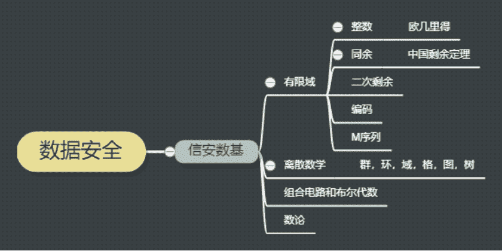
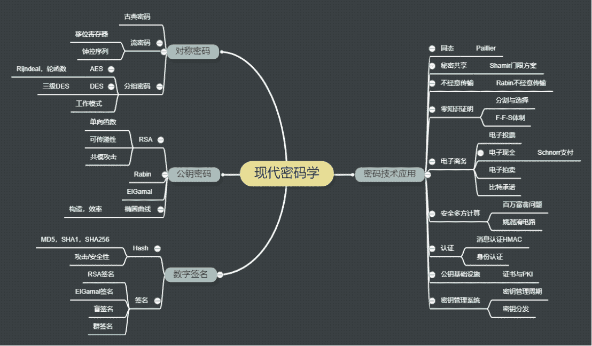
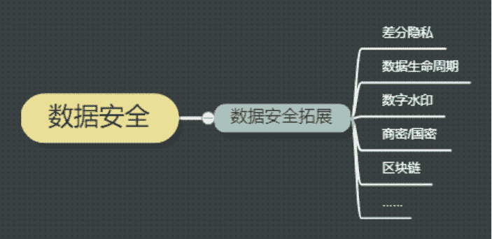
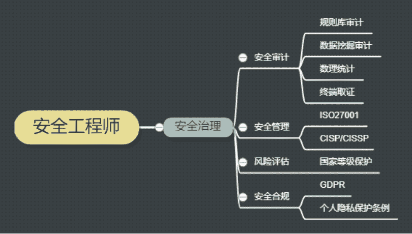
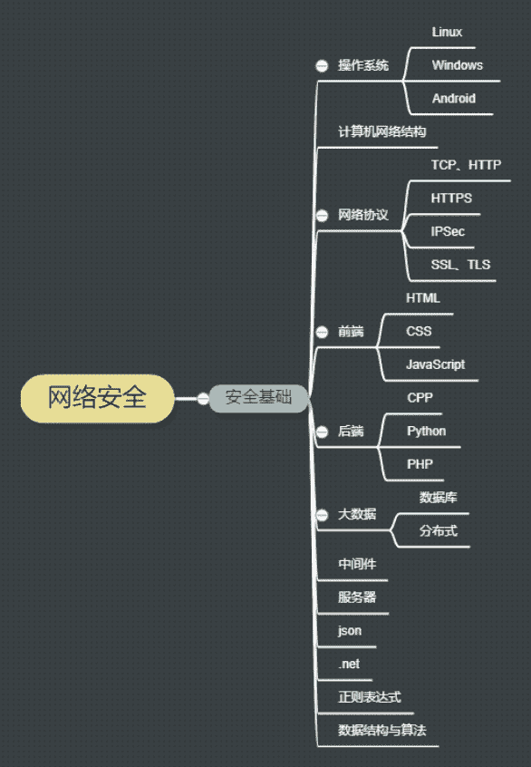
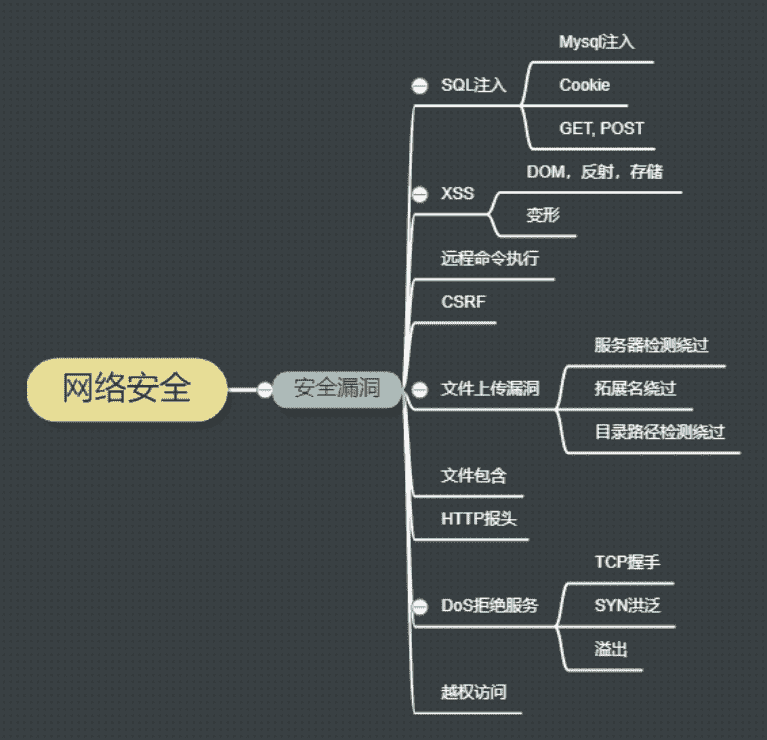

# 第二章 第 4 节 学习规划(下)—分块知识储备

> 原文：[`www.nowcoder.com/tutorial/10057/945aed02a60e4817b438aab2efc79af5`](https://www.nowcoder.com/tutorial/10057/945aed02a60e4817b438aab2efc79af5)

# 1 ** 信息安全数学基础**

        如果说数据安全的基础是现代密码学，那么现代密码学的基础一定是信安数基。“密码学实际上是一门数学课“，教授曾经告诉我们。如果要给这部分排一个重要程度，笔者认为笔试面试会问到信安数基的概率极低，但是它是后续学习的基础，并且随时穿插在各种密码技术原理中出现。

        有的学校没有开设信安数基课程，可以通过其他三门课对这门数学课有一个覆盖：有限域，离散数学和数论。密码学是有门槛的，如果没有接触过大数分解，可能很难理解 RSA 等公钥算法的安全证明是怎么推导的，如果不懂群环域，可能根本不会清楚群签名和环签名的奥妙在哪里。信安数基虽然不那么好学，但是会给后续密码学的学习带来很多方便。

        这部分推荐谢敏老师的教材《信息安全数学基础》，书***，但是信安数基的内容都有覆盖到，麻雀虽小五脏俱全。这本书分为数论和代数两部分来讲（这样分类也是没问题的~），数论部分包括整数，同余，二次剩余等一些密码学中的困难问题理解；代数部分包括群，环，域和有限域的入门知识。

# 2 **现代密码学**

        现代密码学可谓是信息安全专业的同学最重要的课程之一，也是数据安全方向最重要的课，没有之一。密码学覆盖了加密方法，和一些密码技术的拓展，前一部分是数学基础的推导，后一部分是一些由密码算法组成的经典工具，是搭建在数学基础和数据安全应用间的桥梁。这部分的重要程度是非常高的，一些懂密码的面试官会在面试时挖得很细，甚至有一些拓展，一些笔试题里也有出现。

 

        这部分的学习推荐清华大学杨波老师的《现代密码学》，覆盖的知识非常全面，对基础密码算法的解释很精确，但也不会晦涩难懂。该书的密码技术拓展部分非常贴近工程应用，把协议和技术按照不同的应用分配章节，可参考性很强。

        此外还推荐阅读孙茂华老师的《现代密码学 : 基于安全多方计算协议的研究》这本书。安全多方计算是数据安全非常重要的一个课题，可以借助秘密共享，同态等一系列密码手段实现。安全多方计算近几年在金融科技领域应用很多，搭配姚期智老师对于百万富翁问题的讨论和文章食用更佳。

# 3 **数据安全拓展**

        数据安全拓展实际上就和同学们的方向非常相关了，在系统地学习过密码学基础后，数据安全方向的同学一般会有一个属于自己课题组的项目在跟，有的做差分隐私（和机器学习，群体智能等技术联系较多），有的是做数据生命周期的隐私保护，有的做数字水印溯源。现在也有很多项目是与区块链有关的，区块链里的安全隐私问题同样是一个很大的课题。 

        这方面更多的是跟随自己的科研项目走的，有贴切的项目经历，辅以对于新应用场景（如央行数字货币）的日常了解，对面试是一个极大的帮助。如果没有相关课题支撑，这些拓展技术并不像开发类的小项目一样容易入手，不是很建议在这方面下很大功夫，有了解，知道需要用到哪些技术即可。

# 4 **安全治理**

        安全治理是一个很宽泛的概念，包括了技术性的安全审计工作，也包括了运营管理类的风险评估，安全合规。这部分的技能点常见于“安全合规工程师”这个岗位中，主要是负责公司与用户间的隐私标准制定和推动，公司内部的风险合规。因此，需要懂风险来自于哪里，也需要懂国内外的一些相关标准如何规避这些风险，比如 ISO27001 信息安全管理体系，GDPR 数据保护条例等。同时，还需要和业务部门沟通和治理隐私安全，包括了一部分技术性的知识，但是对开发能力的要求不高。 

        这些知识在学校的学习中很少接触到，技能点的学习资料包括 ISO27k 系列和 GDPR 等安全标准文档的和 CISP 考试题库。对安全合规岗位感兴趣的同学可以关注一下。

# 5 **网络安全基础**

        安全是服务与整个计算机系统与网络的，这部分是网络安全学习的基础，其实也就是计算机和网络基础。因此，开发类岗位所需要的基础知识，包括操作系统，计算机网络等，安全岗也同样需要，甚至在某些公司的某些场景下并不比开发的要求低。只有对计算机系统和网络充分了解，才能知道风险来源于哪里。

        这部分的考察在笔试和面试中都很常见，首先建议大家把开发基础打好。计网可以参考《计算机网络自顶向下方法》，非常系统地把网络的结构和功能做了阐释；数据结构推荐严蔚敏老师的经典教材《[数据结构(C 语言版)]》；CPP 目前来说最好的书还是《C++ Primer Plus》，JAVA 看一下《JAVA 编程思想》，编程语言的话需要达到对常见函数熟悉，对语言的运行机制和异常了解，；Linux 推荐《鸟哥的 Linux 私房菜》，同样也是开发的基本要求，熟悉不深挖。算法能力达到 middle 难度题即可，笔试和面试大多数时候不会达到开发岗的要求。 

        打好基础之后，需要系统的学习网络的安全知识，推荐《白帽子讲 Web 安全》和《Web 之困》，这两本可以说是网络安全学习必备书籍。如果是零基础入门，可以在此之前读《网络空间信息安全》教材，了解 OWASP 十大漏洞，对网络空间安全有一个全方位认识。由于这部分的考点较多，对知识点的学习要做到细致和全面，可以对照牛客的[安全岗题库熟悉高频考点](https://www.nowcoder.com/contestRoom?mutiTagIds=682)。

# 6 **网络安全漏洞**

        常见安全漏洞这块是笔试题的大头，安全本身就是一个攻和防的过程，没有漏洞，就没有攻击的可能。下图提到的几种漏洞在安全岗（如果试卷不区分方向）笔试的选择和简答题中出现频率极高，也是作为网络安全工程师的必备技能，对于 web 安全方向的同学，重要程度甚至高过现代密码学。 

        这部分是在安全基础上的提炼和应用，推荐一下张玉清老师的教材《网络攻击与防御技术》。《黑客攻防技术宝典 - Web 实战篇》和《渗透测试实践指南:必知必会的工具与方法》从不同角度出发了解网络攻防，也可以通读学习。落到具体知识点的话，前端看一下《Web 前端黑客技术揭秘》，xss 和 sql 的考题也比较多，推荐《xss 跨站脚本攻击剖析与防御》和《SQL 注入攻击与防御(第 2 版)》。

        此外，推荐同学们关注腾讯/阿里/百度/小米等 SRC 安全应急响应中心的公众号，了解企业的实际场景需求，对已经拥有的安全漏洞知识查漏补缺。

# 7 **其他**

        网络安全的知识点，除了计算机网络基础和常见漏洞之外，还有一些安全工具的使用和安全产品的开发，前者是在漏洞攻击与防御过程中的技能工具，而后者更多是安全攻防知识的业务化应用。如果说网络安全是基础安全，那在此基础上发展的移动安全和病毒分析岗位，则是对于网络安全的拓展和深入。病毒分析在一些乙方公司一直是作为研究类岗位需求；移动安全近几年也发展很快，在一些“软硬结合“厂商比较常见。

        实际上，这些岗位都属于安全领域非常专业性的方向，一般跟自身项目经历结合密切，有这方面兴趣和经历的同学可以在安全圈 info 导航上看一些前辈做过的实战项目，让科研项目和实战应用接轨。