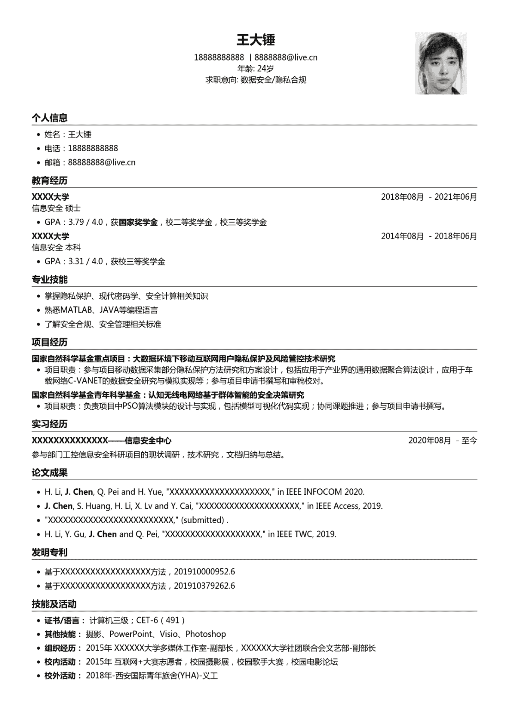

# 第四章 第 1 节 简历撰写

> 原文：[`www.nowcoder.com/tutorial/10057/417e39d2b47943808ccccb0563f94901`](https://www.nowcoder.com/tutorial/10057/417e39d2b47943808ccccb0563f94901)

        在结束专业技能的提升之后，就要了解如何准备和提升求职技能了，这部分将跟大家分享简历，笔试，面试，以及 offer 选择过程中的经验和注意事项，希望对大家所有帮助。

# **1 简历**

## 1.1 **关于简历**

        简历是求职者向企业展示的第一张名片，也是企业对求职者的第一道考验。作为“通关”的第一步，简历的重要性不言而喻。一份优秀的简历能够体现求职者的优势，简明扼要地展示自身特质，吸引企业的注意。一般来说，求职者在校招网站上投递简历后，所有 HR 都能看到简历，并根据简历的意向岗位向不同的业务部门推送简历，再有业务官对简历进行筛选和评估，也就是说，在被发起面试之前，通常是已经经历过两轮简历考察了，在几轮面试过程中，面试官也会参考简历对求职者提问，因此，从任何角度出发简历都是非常重要的。

## 1.2 **如何制作一份简历**

        对于没有制作过简历的同学，如何制作简历的确是一个非常大的问题。简历应该包含哪些内容？我的经历不足该怎么办？简历应该写得“美化”一点还是“写实”一点？下面将跟大家一一解答这些问题。

### 1.2.1 ** 简历模板**

        如果对于一份简历完全不知道如何入手，首先推荐一个模板——“超级简历”通用求职简历模板，再根据自己的实际需求调整。超级简历包括了常见的个人信息，教育背景，工作经历，项目经历，个人简述等模块，可以自由调整竞赛与奖励，课外实践等模块，并且支持自由添加和修改标题，拖动顺序，提供的个人信息模块也可以改动要素。此外，还提供自动检查和简历评分，可供参考修改。总之，是一款非常方便的工具。

        此外，牛客也提供求职简历模板，牛客的简历助手可以参考到每一个模块，一次填写，可以投递多个企业。

### 1.2.2 ** 简历要素**

        对一份安全岗校招生简历来说，个人信息，教育背景，技能，项目经历是必需的，实习是重要的，竞赛获奖，科研成果是加分的，其他的校内外活动只能算是补充了。

*   个人信息应该包括姓名，电话，邮箱，年龄和求职意向。求职意向这一点可以给到筛选的时候一个辅助，甚至可以加上意向方向，这样是有利于给求职者安排对应岗位的面试官的。
*   教育背景应该包括本科以来的所有经历。
*   技能部分应该突出专业的计算机能力，安全方面的技能，其他软件或者语言能力可以放在其他 part。
*   项目经历之所以说是必须，是因为企业是看重动手的工程能力的，不管是科研项目，还是自己开发的小项目，都需要写上去。
*   实习是很重要的，前面也讲到过，有一份匹配的实习帮助非常大，但是不是必须。
*   竞赛获奖，科研成果可以作为专业知识的佐证，如果这方面很突出，也会让面试官刮目相看。今年的算法岗，对这一块的要求比较严格。

### 1.2.3 ** 简历示例**

        了解简历需要哪些要素之后，就可以对简历模板做修改，将自己的经历往里填了。下面贴出笔者的一份简历以供参考，部分信息已码，大家可以根据示例对照来参考，了解每个模块应该怎么写。对于同学们来说，有模板就能很好地理解一份简历的要素和写法了。

### 1.2.4 ** 制作和优化**

        制作一份简历时，简历模块之间应当按照一定的优先级顺序。一般来说，简历从上到下的信息依次是：个人信息、教育经历、技能、项目经历/实习经历、竞赛奖励/科研成果、其他课内外活动。简历的排版大概就是这样。除了上一节提到的必要信息外，部分模块还需要注意以下内容：

*   教育经历：此部分不应占据过多篇幅，两三行就行。除了本科以来的教育经历，校内奖学金也可以写在这部分，还可以添加一些和求职方向匹配的课程及成绩，以及专业的排名等。一般来说，亮眼的海外交流经历，访学经历（有实质内容的）都可以写上。
*   技能：这部分以体现自己的专业技能为主，可以稍微展开写，比如说安全漏洞中熟悉哪些，密码学知识拓展中做过哪些；也可以写上一些熟悉的大型仿真平台等，都可能对履历有帮助。技能部分要体现广度，也要体现深度，一些与学科无关而且大家都具备的技能，没必要占篇幅。
*   项目经历/实习：把与岗位相关性较强的写在前面，相关性不大的也可以写一下，可能会遇到面试官感兴趣的点，刚好是岗位的需要。写清楚项目的全称是什么，自己在项目里负责什么，用到什么技术，解决什么问题。具体的思考和理解可以在面试中补充。这块会在后面详细讲到，请记住一点，对简历里的每一个字负责。
*   竞赛奖励/科研成果：科研成果可以是项目的论文产出，也可以是独立研究的专利、软著。这部分除了罗列，还可以一句话简短介绍这个竞赛或者论文等，注意重量级排列。其实笔者在科研成果部分写得比较多，虽然不是面试官最看重的，但是丰富的成果也能侧面体现求职者的成果转化率。
*   课内外活动：四六级等信息可以在最后这部分来写。对于银行等国企，在简历投递时可以和互联网技术岗位体现一些区别，可以在简历上丰富一下这部分内容，体现自己的性格和综合能力。一些企业会在面试时习惯性地问到兴趣爱好，不失为为自己加分的好机会，千万不能说没有。

        在写技能和项目经历的时候，常常会有一个问题，这部分我应该“美化”一点还是“写实”一点呢？笔者认为，美化是有必要的，但是不要超过个人能力边界。把经历这部分修饰得漂亮一点，但要有逻辑性，项目里的背景问题和知识点其实都是可以包装的，但是也不要硬加自己根本不了解或者明显逻辑错误的东西；技能这部分，岗位的必要技能一定要写上，比如安全基础知识，开发基本知识，但是如果往细的知识点写，一定要非常熟悉，面试时有把握不被问住，质疑整份简历的可信度。

## 1.3 **网申及注意事项**

        简历完成过后就可以网申了，关于网申和内推的介绍在前面的章节已经详细讲过，内推可以使用牛客的内推广场。这里提一下网申过程中需要注意的一些点。

        大部分企业的网申平台都是使用的第三方统一平台，比如 Moka，大易，51job 等。这些平台往往已经提供模板，只需要填入个人信息即可，可能在最后有补充简历的地方，可以贴上自己准备的简历。不同企业使用同一个网申平台时，我们填写信息时可能会有上一次填写的记录填充，需要根据岗位实际情况对应修改，不可大意。

        此外，一些企业（尤其是大型国企）会要求填写简历留空比不能超过 20%或者 10%，对于一些不涉及敏感隐私的信息，最好还是填写得全面一些，体现自己的重视态度。