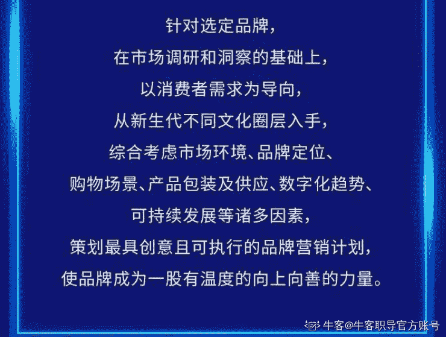

# 第二章 第 1 节 市场营销类

> 原文：[`www.nowcoder.com/tutorial/10092/12ab1012f9be422c829e56148fd33efb`](https://www.nowcoder.com/tutorial/10092/12ab1012f9be422c829e56148fd33efb)

### 宝洁总裁 CEO 练习生校园精英挑战赛

宝洁总裁 CEO 练习生校园精英挑战赛是宝洁全球最高规模比赛，未来领袖的孵化营，含金量超高不仅是一段让你履历十倍“镀金”的硬核经历，更有机会获得宝洁官方实践项目证明、直通终面绿卡等丰厚奖励。

#以 2021 年宝洁 CEO 挑战赛为例

#1.面向对象

#2 参赛品牌

#3 你的使命

#4 你的任务

#5 赛事福利

#6 赛程安排

[（以上图来自宝洁招聘）]

2022 宝洁 CEO 挑战赛也即将开始，中国赛区将于 12.21 日正式开启组队/注册

#### 欧莱雅校园市场策划大赛

欧莱雅校园市场策划大赛于 1992 年发起，是全球最著名的大学生国际性赛事之一，影响力非常大非常具有含金量由三人组队参赛，同时要综合考虑市场及数字化趋势、技术创新、可持续性发展等诸多因素，同时以消费者为中心来定义未来的品牌体验，做出最具创意和可执行性的方案。

#以 2021 年欧莱雅校园市场策划大赛为例

#1 游戏规则

#2 主线任务

#3 成就奖励

#4 导师团队

#5 整体进度

[（以上图来自欧莱雅校园招聘）]

除此以外，市场营销类商赛还有：京东大学生创意营销大赛、联合利华未来商业精英挑战赛等，想了解更多关于市场营销类内容和竞赛报名开启时间可收藏本专刊~本专刊会持续更新内容