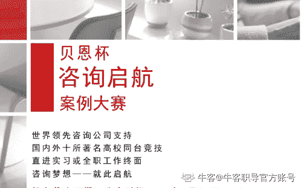
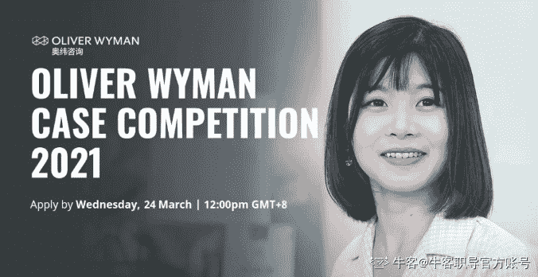

# 第二章 第 2 节 案例分析类

> 原文：[`www.nowcoder.com/tutorial/10092/8dd960ea37294339bc1bfccc1ac96fa1`](https://www.nowcoder.com/tutorial/10092/8dd960ea37294339bc1bfccc1ac96fa1)

#### 贝恩杯咨询启航案例大赛

贝恩杯咨询启航案例大赛是北京大学咨询学会最为成功的品牌活动之一，大赛着眼于高校中咨询人才的挖掘和培养，致力于为参赛选手提供一个实际应用咨询知识和技能的平台。往届大赛吸引到各大高校无数顶尖学子的目光。自 2006 年，大赛得到了全球领先的管理咨询公司贝恩公司（Bain & Company）的大力支持。在咨询类商赛中具有很高的含金量。

#以 2021 年为例

#1 报名条件

大赛分为三个赛区

北京赛区：北京大学、清华大学、中国人民大学

上海赛区：复旦大学、上海交通大学、浙江大学、南京大学

海外赛区：哥伦比亚大学、芝加哥大学、麻省理工大学

*必须 4 人组成一支队伍（可跨校组队），队长和一名队员必须来自上述高校，其余队员无此要求，每位同学只能参加一支队伍

#2 比赛形式

初赛案例将直接发送到各参赛队伍邮箱，参赛队伍按照要求，完成案例报告并发送至提交案例的邮箱

晋级名单将于北京大学咨询学会官方微信平台公布

复赛将于每个地区的参赛队伍在赛前抽签决定出场顺序。每支队伍进行 15 分钟限时案例分析 Presentation，并接受评委提问，回答时间不超过 5 分钟。

决赛将向各队队长邮箱发送决赛案例。级决赛的队伍将以线上形式进行巅峰对决，每组进行 20 分钟的案例展示，并于现场回答贝恩顾问以及北京大学教授的提问（限时 5 分钟），届时将在现场评出冠亚军队伍。

注：案例报告需提交英文版，复赛案例展示要求使用英语，决赛案例展示要求使用中文。

#3 奖项设置

决赛冠军: 奖金 12000 元，全部队员均获得贝恩公司全职录用（2022 年毕业生）或暑期实习录用（2023 年毕业生）的终面机会。

决赛亚军: 奖金 8000 元，全部队员均获得贝恩公司全职录用（2022 年毕业生）或暑期实习录用（2023 年毕业生）的终面机会。

入围决赛的队伍: 每支进入决赛的队伍将获得一位贝恩咨询顾问的一小时“团队咨询时间”，用于决赛备战指导，或回答团队成员与咨询相关的职业规划问题。此外，本届除冠军、亚军之外的队伍，全部队员均获得贝恩公司全职录用（2022 年毕业生）或暑期实习录用（2023 年毕业生）的初面机会。

#4 往年例题

2013：永辉超市在中国市场未来 5 年的发展战略

2015：ApparelCo.未来 5 年在中国的电子商务战略

2016：日韩顶尖化妆品公司在中国市场未来 5 年的拓展战略

2017：顶级家电企业在中国市场未来 5 年的数字化转型战略

2019：潘多拉在中国内地珠宝市场的营销策略

2020：中国健身市场的成长战略

#### 奥纬杯咨询案例大赛

奥纬杯咨询案例大赛从 2017 年创办至今，每年都吸引了大批有志于投身咨询行业的同学们再此挥洒汗水于才华。奥纬咨询作为全球领先的国际化管理咨询公司之一，在全球 29 个国家都设有分支机构，在战略、风险管理、组织转型等领域均拥有精准的专业能力。奥纬杯在咨询类商赛中具有很高的知名度

#以 2021 年为例

#1 参赛要求

赛事面向毕业时间晚于 2021 年 8 月的在校生

本硕均可

不限学校、专业

4 人组队

#2 奖项

决赛中将产生冠军、三强、十强队伍。根据比赛排名，将为决赛入围者提供全职/实习生的首次或最终面试的快速通道。此外案例分析类商赛还有罗兰贝格校园精英挑战赛、毕马威企业文化案例分析大赛等等~本专刊会持续更新~各位同学记得收藏专刊哈~

#3 往届初赛案例

2018：一家外资超市想要进入中国，客户了解到中国在新零售领域有很多模式上的创新之举，请你和你的团队帮客户做一个 Benchmark，并提出适合的建议

2019：一家投资机构看好健身市场的长期发展潜力，请你和你的团队做一个市场和公司研究，找到具备长期发展潜力的投资标的

2020：一家互联网公司打算开拓健康险市场，请你和你的团队为其分析进入健康险市场的机遇和长远增长战略

#4 报名方式

官网提交报名申请

Tips:

在报名页填写整组队员信息基本信息

每位成员均需提交按照固定格式命名的 PDF 简历，命名格式为—— 团队名称-名字-姓氏

简历 PDF 文件大小不超过 5MB

【注意事项 】

大赛初赛为线上提交案例调研报告

由评委会审核后决选出决赛名单

决赛展示形式将视疫情发展情况而定