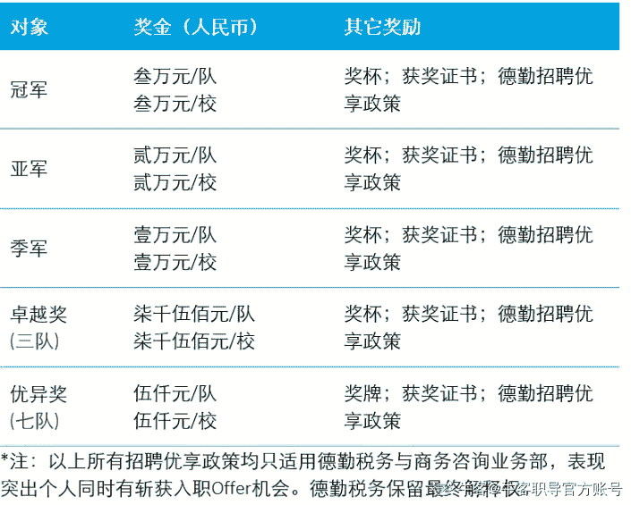
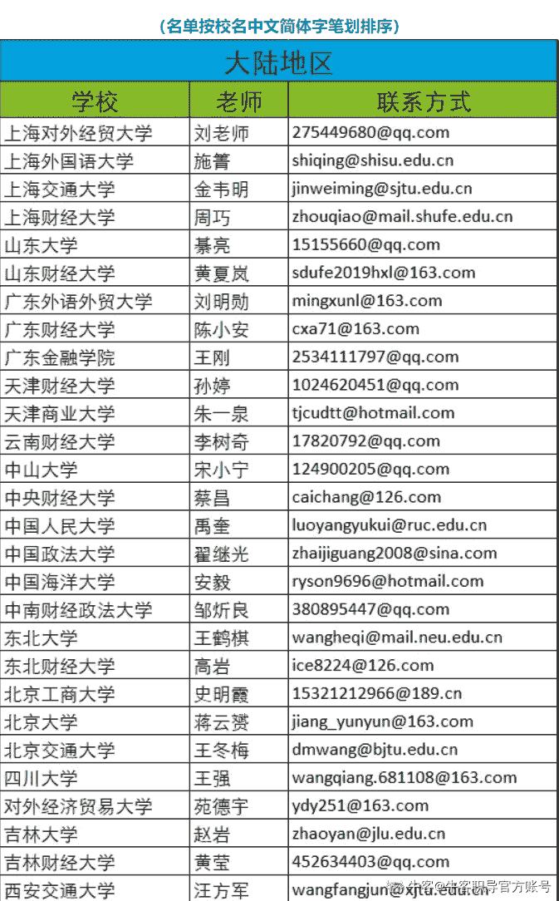
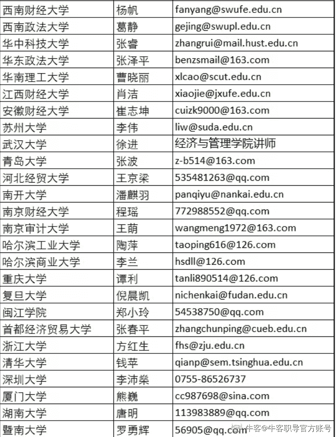
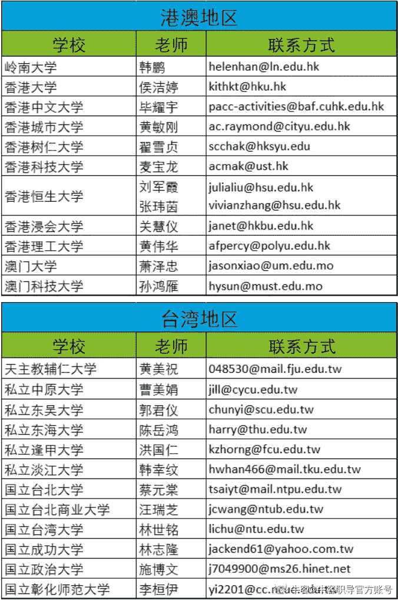

# 第二章 第 3 节 财务金融类

> 原文：[`www.nowcoder.com/tutorial/10092/7e84b788a4954b2c8af1ddb2f78fef8b`](https://www.nowcoder.com/tutorial/10092/7e84b788a4954b2c8af1ddb2f78fef8b)

### 华为财务精英挑战赛

华为财务精英挑战赛是华为公司面向全球大学生提供的一个“专业深度、企业实战、全球视野”的财务竞技平台。自 2011 年创办以来至今，已有上万余名财子报名参赛，已成为商科类最具吸引力及获得感的校园赛事之一。

#以 2021 为例

#1 参赛对象

海内外大二及以上在校大学生

团队成员人数需为 4-6 人，可跨校组队，每队同一学校人数占比不低于 60%

#2 比赛形式

参赛团队需完成对给定案例的分析，并根据安排参加答辩。答辩计划在线下进行（海外赛区除外），如因疫情影响无法组织线下答辩，将采取线上比赛形式，具体安排以大赛组委会通知为准。

#3 奖励

全球总决赛

冠军团队：100000 元奖金

亚军团队：50000 元奖金

季军团队：30000 元奖金

其余优秀团队：10000 元奖金

全场 MVP（1 人）：华为财经秋招 Offer

优秀个人（5 人）：华为财经 2021 年暑期实习 Offer

复赛

冠军团队：10000 元奖金

亚军团队：5000 元奖金

季军团队：3000 元奖金

其余优秀团队：精美奖品

优秀个人（5 人）：华为财经应届生招聘面试 Pass 卡（可免部分面试环节）

初赛

一等奖团队：2000 元奖金

二等奖团队：1500 元奖金

三等奖团队：1000 元奖金

优秀个人（若干）：获奖证书及奖品

【注：以上所有奖金均为税前】

#### 德勤税务精英挑战赛

德勤税务精英挑战赛自 2017 年创办以来，已经吸引数万优秀学子同台竞技，发现顶尖数字化人才，助力他们在德勤这个全球最大专业服务机构和市场引领者的平台上快速成长。作为鼎鼎有名的业内四大，其举办的商赛在行业中有非常高的含金量。

#以 2021 年为例

#1 赛事重点

赛事实行邀请制，仅限受邀学校学生。学生于报名参赛及进行比赛时必须均为全日制本科或硕士生；每支队伍由 4 名队员组成，其中硕士生不可超过 2 名。赛事的所有阶段，每支参赛队伍的 4 名组队队员均须全员出席。

初赛：考核内容为个案分析报告及演示，共 30 支队伍可获晋级；

复赛/实习：晋级团队全员将会以实习生的身份被安排至德勤中国事务所带薪见习，根据每支队伍的实习综评成绩，连同报告书的评分情况，选出 13 支队伍晋级全国总决赛；

全国总决赛：历时一天半，比赛内容为个案分析汇报演示，决出最后的冠亚季军、卓越奖以及优异奖队伍。

#2 奖项设置

#3 受邀院校名单及老师联系方式

