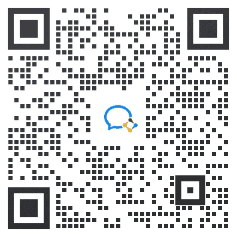

# 第三章 第 1 节 参与前要做那些准备

> 原文：[`www.nowcoder.com/tutorial/10092/74bd300499d847b78065143dfaa56f97`](https://www.nowcoder.com/tutorial/10092/74bd300499d847b78065143dfaa56f97)

### 了解商赛

首先肯定是要了解参加的商赛类型是否符合自己的诉求，你为什么参加商赛？是为了升学、留学丰富简历，还是为就业增加筹码？还是为了奖金？如果是为了丰富自己的简历，为以后就业增加筹码，那一定要选择和自己求职行业符合的商赛，比如以后想进入快消公司，那一定要积极参与市场营销类的商赛，比如宝洁 CEO 挑战赛、欧莱雅校园市场策划大赛、强生未来精英挑战赛等，不仅可以提高你简历的含金量，更有机会获得直通终面的绿卡~

其次更要要了解各个商赛的报名时间，参赛方式，以及快速寻找合适的队友，可以关注牛客网，我们会第一时间公布商赛的最新进程，帮助大家掌握时间，也会公布更多商赛的及时信息~还会不定期分享往届获奖 case~

### 完成成功的商业案例分析有那几步

*   案例发布：拿到案例之后首先要了解案例背景，梳理案例整体逻辑，找到核心问题

*   案例分析：结合商业洞察，以专业框架拆解问题进行分析

*   团队分工：同时队伍里要有明确的分工，最好有一个数理背景的，一个商科相关的，还有财务、咨询等相关的一些同学

*   假设驱动：确定研究目标/公司，提炼核心创意理念，要有自己的观点和想法，更要清楚自己策划的整体逻辑和背景

*   资料搜集：网络上常规资料+多方面打探

*   分析/完成：定性定量分析，要有一个逻辑和的故事线，有充分的数据、图表以及信息来支撑论点。

*   准备展示：PPT/视频

### 需要那些技能

根据参与商赛种类的不同，所需要具备的能力也不同~

*   咨询类：需要根据题目中给出的市场以及公司背景设定，挖掘现存原因并寻找解决方法

*   要求：超级棒的逻辑能力、PPT 绘制能力、数据分析能力、资料查找能力

*   市场营销类：需要选择适合的产品进行运营、宣传、供应链等方面的改进。重在新颖独特以及高实践性

*   要求：对市场/新鲜事物/潮流时尚足够敏锐、视频剪辑能力、PPT 制作能力、演讲能力、产品设计能力（部分需要）、销售渠道等方面的经验

*   财务金融类：需要财务会计知识，以画 PPT、做 pre 解决公司的财务题为主，同时

*   要求：财务会计类知识、Excel、PPT、storyline

*   总结：整体来看商赛需要的专业能力，首先是 storyline（用 PPT 讲故事），其次是 research、数据分析、用户调研、Business sense、合作能力、解决问题能力之类的基础能力

*   其中各种软硬必备技能也要熟悉~比如 office 全家桶、编程工具、Adobe、行业研究、案例分析、数据建模 ，而软技能就是 Business sense、合作能力、解决问题能力、Leadership、战略性思考。

### 如何选合适的队友（队伍配置）

商赛基本都是以 3-5 人的小团队进行的~所以合理的团队搭配也是非常重要的~

商赛队友最好具备以下素质

*   参赛经验：0 经验的对整体流程和进度把握都会有所欠缺，如果都是第一次参加，那很容易初赛被秒，一个团队中有经验的 Leader 是很重要的。

*   技术大佬：PS、AI、Office 全家桶样样精通，才可以更好的把想法落地（如果每个人都有一个技术掌握的非常好也是可以的~只要没有特别明显的短板就好）

*   数据天才：能够完美对 Data 进行数学化的模型分析充分挖掘数据

*   口语要好：一定要能够英文 pre，英语口语发音好听真的可以加好多分~

*   ！！！有责任心！！！：划重点，靠谱的队友是成功的基础~一定要有目标感，对 Team 负责。自驱力强

大家想要了解那些商赛内容或者其它金融、快消方面校招资讯都可以在专刊下留言哈~~

另外如果大家想了解更多商赛信息欢迎加入——牛客商赛交流群

群内有

01：独家商赛信息汇总

交流群会第一时间公布商赛的最新进程，帮助大家掌握时间，也会公布更多商赛的及时信息。

加入商赛交流群，再也不怕错过比赛啦~

02：精准合适的商赛搭档

牛客商赛交流群聚集了来自各个学校、各个专业的优秀同学，大家可以根据自己的条件和需求，寻找合适的搭档，开启商赛之路。

03：牛客独家资料免费送

不光有商赛的第一手独家资料，还有金融、快消校招真题，面经总会~

还会定期分享商赛优秀案例~

快来扫描下方二维码加入交流群吧~

