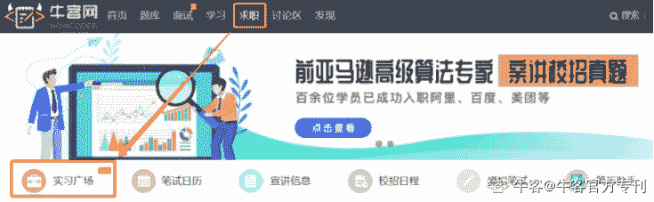

# 第三章 第 2 节 招聘日程及流程

> 原文：[`www.nowcoder.com/tutorial/10022/76cce0971d944de7af764a07a83cb270`](https://www.nowcoder.com/tutorial/10022/76cce0971d944de7af764a07a83cb270)

## **1.1 校招信息渠道**

校招（包括秋招和春招）、实习（包括暑期实习和日常实习）信息发布平台：

**·****公司官网+官方招聘公众号**

正常的校园招聘信息获取途径最快捷最准确的是公司官网或官微，但是官网那么多，一个个翻找会浪费很多时间和精力。

这时候，认准牛客网就可以了。可通过牛客校招指南，一键直达各个公司官网：牛客网>求职>校招日程汇总（**地址**：[`www.nowcoder.com/school/schedule`](https://www.nowcoder.com/school/schedule)）

**·****牛客网**

**实习广场：**企业最新招聘信息，由用人部门/企业 HR 直接发布，信息真实可靠，简历处理效率快，岗位齐全，随时可以找到职位发布者直接联系。 电脑端地址：牛客网>求职>实习广场：[`www.nowcoder.com/job/center`](https://www.nowcoder.com/job/center)  **移动端地址：牛客 APP > 求职** 

**讨论区**：内推消息，由已拿到 offer 的前辈以及 HR 发布

电脑端地址：牛客网>讨论区>招聘信息[`www.nowcoder.com/discuss?type=7`](https://www.nowcoder.com/discuss?type=7) 

移动端地址：牛客 APP > 社区 

关注牛客讨论区，随时查看同行动态、校招/内推信息、offer 比较、面试交流等等。

**企业校招日程汇总：**各企业校招时间明细

电脑端地址：牛客网>求职>校招日程：[`www.nowcoder.com/school/schedule`](https://www.nowcoder.com/school/schedule)

移动端地址：牛客 APP > 求职 >求职工具> 校招日程

**公众号：**

**牛客网：**官方资源第一手送到，陪你走过秋招。

**经管校招实习：**每日推送校招/内推资讯以及面经干货。

 

 牛客网                    快消校园招聘

通过以上方式，大家能更快获取招聘信息，避免浪费大量时间在查找信息上。事半功倍，将时间运用到更重要的事情——准备校招。

## **1****.2** **商赛**

进入快消行业的 top 公司，还可以尝试通过商赛，例如：宝洁 CEO Challenge，欧莱雅有校园义卖，欧莱雅校园市场策划大赛，联合利华闪亮未来商业精英挑战赛，宝洁精英挑战赛等等，还有机会获得暑期实习机会。

参与商赛，从某种程度上说是能体现你的设计能力、创意能力、营销能力及策划能力的。所以，如果你想展现或提升自己的能力，宝洁商赛会是个不错的选择，对进入快消行业都会有很大的帮助。有机会能进入全国前几强的选手，一般有机会获得 pass 卡或其他奖励，是一条进入顶级快消公司很好的途径。

（除了商赛，同学们也可以选择加入校园俱乐部，比如说强生、宝洁、欧莱雅、联合利华都有在比较顶尖的高校设立校园俱乐部，负责公司的校园招聘、校园推广、商赛等活动，有很多机会可以联系到公司的 HR，所以加入校园俱乐部也是不错的选择）

如果你现在大一大二，对于自己的未来还没有十分清晰地规划的话，多刷一些商赛其实是一个提高自己的性价比很高的方法。因为这么早就翘课去实习的话也找不到很好的公司。商赛的过程，可以让自己学到一些长期很有用、终生受益的技能。

比如，用 Excel 画一些很商务风的图、表格，PS 做宣传海报，用 Python 爬数据等等，这些你平时应该很少去专门学习，但是做商赛又常常会用到，而这些软技能其实在之后找实习、去工作时是一个很大的加分项，并且也可以省掉你以后从头开始摸索学习的很多宝贵时间。再比如，现在你听到行业分析、案例分析、数据建模、战略规划、市场感知力…大部分同学是不知道从何下手的，但当你经历过一次，你基本上能搞明白是怎么回事了。

商赛经历，是找实习以及校招时简历上一个很不错的加分项在 HR 眼中，一个与你所面试的工作非常对口的商赛奖项，权重其实未必比一份短期实习要低。更何况，有些商赛会给获奖者提供内部实习机会，比如安永 Go Beyond、毕马威商业案例分析、德勤税务精英挑战赛、美世杯、贝恩杯。或者获得暑期实习的直通终面机会，比如欧莱雅校园市场策划大赛、联合利华闪亮未来商业精英挑战赛等。

那么，商赛队友怎么找呢？其实，参加商赛，队友的选择直接决定最后的成绩和小组作业。一个比赛的完成，既需要领导力 max 的 leader，也需要强有力的执行者，和脑洞大开的创意人，更需要擅长排版文书的队员，一般 3-5 个人的团队，一定要有不同的分工，要不然很容易出现有些环节推进不下去拖 DDL 的情况。选队友就格外重要，要寻找不同长处不同分工可以互补的队友，关键是合适而不是大神越多越好。

### **1****、****2019 年宝洁 CEO Challenge 挑战赛**

宝洁的 CEO Challenge 含金量非常高。不光是宝洁在快消的老大哥身份，我们只需要看一看参加**商赛的奖励**即可：

·宝洁实践证明：完成复赛项目即可获得人手一份宝洁官方项目实践证明；

·校招终面绿卡：完成决赛即可获得校招终面直通卡（宝洁秋招一共只有两轮面试，免去一轮面试可以大大增加获得 offer 的机会！2018 年的终面直通卡大概发出了 50-60 个，数量也是非常可观的）；

·万元梦想基金：营销组共决出 2 支冠军队伍，数据组共决出 1 支冠军队伍，各获得 10000 元。

·墨西哥全球总决机票：营销组共决出 2 名 C 位队员，数据组共决出 1 名 C 位队员组成新团队，代表宝洁中国，免费前往墨西哥参加 6 月全球总决赛（2018 年是去迪拜）。

**可参赛对象：**2020 年及之后毕业的海内外所有在校大学生，不限年级专业。实战项目线上即可进行，可以跨区域跨学校组队。

**商业营销组参赛方式：**以 3—5 人为一个小组，组队以“3.8 节”为主题，针对指定宝洁产品制作创意作品，短视频/海报/广告语图播/宣传文案/脚本等，形式不限

**大赛流程：**

11 月 26 日—12 月 29 日，报名参赛、作品/简历提交

1 月上旬—2 月上旬，项目方案呈报

2 月中旬—3 月上旬，超 100 个席位，有实践证明！在线即可完成

3 月中旬，全国 9 强免费前往广州

### **2****、****2019 年联合利华未来商业精英挑战赛（3-6 月）**

联合利华商赛从 2014 年开始变成了单人参赛形式、由旗下品牌立顿主办，决赛胜出的队伍可以获得 FLL（未来领袖联盟）的机会。

**第一轮****：****申请**

Application 环节，填写基本身份资料（每个商赛第一轮都是这个环节，不过立顿商赛的报名简化了很多）其中比较重要的是“人气红人”***，要求是用 50 字以内阐述你的参赛原因。立顿非常重视从品牌和公司角度出发考虑，可以找到个人和立顿以及商赛的契合点。

**第二轮****：****创意方案**

思考以下三个问题：

·20~35 岁年轻人（处于人生转型期）有什么特点？

·立顿红茶能为消费者带来怎样的产品体验？

·目标消费者会在什么场合喝立顿？

以一张图片形式回答以上三个问题并上传，同时说明你的答案。（这一轮的题目最主要还是考验对品牌认识。除了题目以外，立顿还给参赛选手准备了材料包，更好地了解立顿。）

**第三轮****：****营销策划方案**

第三轮是做策划案，题目是：**在一个月中，让校内****20%的同学尝试立顿。**

赛题里面有一个重要的信息点——“校内”，也就是策划案的范围和要求，即做出一个有因地制宜、“校园特色”的策划案。因此了解校园、了解学生非常重要。这一轮可以用提交 ppt 或者视频展示。

**决赛**

决赛为期 3 天，来自各地的小伙伴聚集到联合利华上海总部。

第一天有拍摄海报、大片的环节，非常 High Fashion；第二天是 training（CMI、E-commerce、marketing）；第二天 training 结束以后，会公布决赛赛题：

**如果你是立顿的品牌经理，请设计一份方案，使****18~35 岁更多的年轻人喝立顿红茶。**

之前是单人参赛形式，到了决赛随机组队。大家一起 brainstorm、做策划方案、并且会获得专属导师的指导，最后做 presentation。

### **3****、****2019 年欧莱雅校园市场策划大赛 Brandstorm**

欧莱雅集团于 1992 年发起并主办的“欧莱雅校园市场策划大赛”(BRANDSTORM), 是全球最著名的大学生间的一项国际性营销和品牌管理赛事。

参赛者将被分为 3 人一组，在比赛中为一个具体的品牌做出最具创意和可执行性的营销方案。BRANDSTORM 作为欧莱雅公司组织的国际创新大赛，是欧莱雅国际人力资源交流战略的一部分，它旨在提高大学生的创业技能、创新能力、以及增进其对欧莱雅业务的了解。进入全国总决赛的 10-15 支队伍的同学还有机会直接进管理培训生或暑期实习生终面。

**比赛流程：**

（1）完成网上注册（截止日期：3 月 2 日，24:00）

（2）校内预赛筛选（比赛日期请各位参赛者留意后续通知）

（3）全国初赛筛选（上海）

（4）全球决赛（巴黎）

### **4****、****2019 年欧莱雅“真情互动”校园义卖助学活动**

**（1）****义卖机制**

义卖时间：今年 10 月为 2019 年的“义卖月”，学生可根据具体情况选择本校义卖的“激情 48 小时” （需提出 2-3 个日期供组织方备选安排）

“O+O”模式：线上销售（Online）：交易将全部通过“校园义卖官方微信商城”完成，并由物流直接配送到消费者手中；线下活动（Offline）：学生需要组织强有力的爱心义卖落地活动；

义卖捐赠：义卖所得善款去除必要成本后，将全部作为“欧莱雅校园助学金”和“欧莱雅校园基金”捐赠给本校。

**（2）****团队要求**

组建 8 人“梦之队”：全权负责组织本校义卖活动，筹集慈善助学金，传递爱与美；

玩转“O+O”新零售：管理并完成线上销售：结合时下最酷炫的电商销售玩法，定制整套线上营销方案（如买赠、促销机制等）；完成库存管理、销售统计等工作，确保物流通畅、产品顺利抵达消费者手中；

策划并执行线下活动：必须突出项目的“公益”性质（如组织助学金发放仪式等）；提供完美的产品体验与服务（如开展潮妆课堂、护肤试用等）；其他能帮助达成义卖销量，筹集善款的活动

展开创意新营销：铺开线上线下相结合的全渠道宣传，实现校园师生的全覆盖传播，持续播撒青春正能量；

志愿者招募与管理：招募 35-40 名志愿者，共同组成义卖大团队，依照本校“义卖 48 小时”的具体需求，分配美容顾问、现场导购、活动执行等相应职位；

计划并管理运营成本：提出具体的运营方案和财务预算，包括推广宣传、物料制作、落地执行等在内的必要开销，将一并计入本校运营成本。

**（****3****）****项目收获**

面试直通车：直接向世界 500 强展示自己的才能与风采，并有机会直面欧莱雅 HR，获得暑期实习或日常实习的推荐机会；

丰富经验：收获“两天内卖出几十万的产品”、“玩转智慧电商”、“全程负责项目策划运营”的非凡经历；表现优异者将赢取高达万元的现金大奖和丰厚奖品。

自我提升的绝佳机会：梦之队组建后，将全程获得欧莱雅导师全面、详细的指导，丰富实践经验同时，获得学习成长机会。

**（****4****）****报名范围及时间**

来自复旦大学、浙江大学、南开大学、南京大学、山东大学（威海校区）、武汉大学、中央民族大学、黑龙江大学、郑州大学、深圳大学、四川大学 11 所大学的在读全日制大学生均可在 2019 年 7 月 12 日之前报名参加活动。

**（****5****）****报名方式**

仅接受以团队形式报名，每队人数 8 人

## **1****.3** **暑期实习&日常实习介绍**

快消公司的实习一般分为日常实习和暑期实习。先说暑期实习，暑期实习是秋招的预备役，打赢暑期实习这一仗，秋招就赢了一半。

首先，高含金量、多一次拿全职的机会，转正就是保底 offer。想象一下，如果 6 个月之后，你在校招的时候交出一份零实习的简历，和那些手握宝洁、联合利华的同学一对比，就立马不战而败了！

其次，面试的时候自我介绍，有干货可以跟面试官聊。当面试官询问你的个人经历，别人的实习工作经验说的一桩桩一件件精彩纷呈，而你只能搜肠刮肚，巧妇难为无米之炊。

最重要的是，暑期实习申请难度不亚于秋招，相当于多了一次提前模拟演练的机会。暑期实习的招收名额通常不多，所以很多同学在第一关网申就“死掉”也是正常的，因此难度较高。

暑期实习招聘的流程几乎与秋招一致，所以含金量也并不低。其次，对于想进大公司的同学来说，暑期实习是一块最好的跳板，几乎等同于提前批资格。

**暑期****实习****会在每年的****3、4 月份开始****进****行招聘，分****为****网申、****电话****面****试****、****线****下面****试****几个步****骤**，各大快消公司都会在这个时期投入很大精力进行暑期实习生的招聘，因为不仅是为来年的秋招储备人才，也是雇主品牌宣传的最好时机。在暑期实习中表现较好的，一般通过考核后可以直接拿到 offer,省去秋季招聘的繁琐，所以暑期实习生是各高校学子需要竭尽全力争取的一个机会。

### **1.3.1** **暑期****实习**

#### **1、****宝洁 2019 暑期****实习****面****试**

宝洁 2019 暑期实习，4 月 12 日开始面试。

**面****试****流程：**两轮面试，第一轮是一对一面试，过程大概 30-45 分钟；第二轮是多对一面试，一般会是 1 小时。

宝洁的面试哲学是：一个人过去的行为是他未来成功与否的重要预测因子。因此，面试官会在面试中了解应聘者的个人经历，只要自信地把你最优秀、最真实的一面表现出来就可以了。

【宝洁面试小攻略】

（1）对公司全面了解。

（2）对自己的了解，要寻求自身优势与公司需求相符合的点。

（3）回顾经历，找出能展现你强项的 3-4 个“代表作”，你个人对项目的最大贡献分别是什么，如被面试官问到，你会怎么有条理又精简地把这几条经验分别叙述给他.

（4）表达思维和逻辑清晰。

（5）做回自己，要很真诚，不要编故事别无中生有，面试官绝对会看穿的.

（6）面试时要多微笑，眼睛直视面试官，别握紧双手，留意语速和音调（注：人在国外，无法回国参加面试的留学生，可以申请宝洁的视频面试）。

#### **2****、****联****合利****华****2019 暑期****实习****面****试**

联合利华 2019 暑期实习，5 月下旬开始面试。

**面****试****流程：**电话面试、评估中心（涉及群面、案例分析）。

联合利华的面试官大概率是你实习期的 leader，他们将根据你的回答来判断你是否匹配职位，也会根据你自身的情况来调整培养计划，不管是上午的群面还是下午的单面，都要大胆表达，你可以突出你的优势，但不要捏造。

【联合利华面试小攻略】

（1）做足功课，充分了解岗位。

（2）态度自信诚恳，避免太腼腆，也不要太放飞自我

（3）回答问题逻辑要清晰，条理性要强

（4）展现足够多的专业素养

（5）面试过程时浅层灵魂交流，抓住聊天重点，英语口语表达不能少

（6）不要放过任何时机展现自己领导力的机会

（7）态度谦虚，真诚

（8）兴趣很重要，知道自己喜欢什么

（9）充分准备行为面试题目

举例说明：比如了解你过去的实习经历/校园/社团经历，具体地问过去的经历的过程和细节；了解你的硬技能和软实力，领导力/沟通能力/解决问题的能力/创新能力/组织策划能力/团队合作能力/抗压适应能力/学习能力等等，让你举出具体的例子；了解你个人的职业规划/做事习惯/性格特点/兴趣爱好等等，从而判断你是否适合这家公司），个人经历要理清。

（10）回答面试问题，注意行动、积累不可少

#### **3****、****欧莱雅 2019 暑期****实习****面****试**

欧莱雅 2019 暑期实习，5 月初开始发面试通知，5 月上旬开始面。

**面****试****流程：**HR 面试+业务部门面试。

【欧莱雅面试小攻略】

（1）回顾过往经历，总结出自己的竞争优势

（2）正确的岗位认知，表达清楚自己匹配目标岗位的比较有说服力的原因

（3）针对面试官的提问，可以开门见山，告诉面试官最后取得的结果与成就。在面试官感兴趣的情况下，再介绍整个活动过程中的细节。

（4）避免“答非所问”，直面问题，言简意赅。

（5）“懂美妆”并非是男同学求职欧莱雅的必选项

（6）男同学可以发挥你们的相对优势：较强的逻辑思维，对数据的敏感度，战略角度的大局观等等。

（7）能力比美貌更重要，大家不要有太大的心里负担

#### **4****、****玛****氏****2019 暑期****实习****面****试**

玛氏 2019 暑期实习，5 月下旬开始面试。

**面****试****流程：**电话面试+视频面试。

【玛氏面试小攻略】

（1）英语能力要好

（2）逻辑框架要清晰，面试中表现出你分析问题的思路，让一切基于事实和数据，言之有理

（3）不要这么“学术派”

（4）展示出来的自信与淡定

（5）一方面突出你对岗位的了解，另一方面要结合自身情况突出与岗位的契合度

（6）没有最好，只有最合适，Be yourself

（7）面试官会通过关注你是否有走出自己的舒适圈，尽可能挑战自己的经历，以及在这些经历中的感悟和成长

（8）充分的回顾自己的经历，自信、真诚和客观的展示自己

（9）做 120 分的准备，展现 100 分真实的自己，不要粉饰堆砌，避重就轻

### **1****.3.2** **日常实习**

日常实习则是有企业不定时不定量对外发布，信息比较零散。所以可通过如下渠道及时获取实习信息：

**① 公司校园招聘官网+官方公众号**

可通过牛客校招指南，一键直达各个公司官网，节省 80%的时间：牛客网>求职>校招日程汇总（**地址**：[`www.nowcoder.com/school/schedule`](https://www.nowcoder.com/school/schedule)）

**② 牛客网**

**实习****广****场****：**企业最新招聘信息，由用人部门/企业 HR 直接发布，信息真实可靠，简历处理效率快，岗位齐全，随时可以找到职位发布者直接联系。 

电脑端地址：牛客网>求职>实习广场：[`www.nowcoder.com/job/center`](https://www.nowcoder.com/job/center)  

移动端地址：牛客 APP > 求职

## **1****.4** **校招流程介****绍**

校招是大多数应届毕业生均会参与的一次招聘会，秋招中，企业会进行大量的人才招聘，岗位需求较多，应届生可以选择的也较广，快消公司的秋招时间一般在每年的 9 月至 11 月（互联网是最早的一批，一般 8 月开始发布，快消公司会晚 2-4 周进行发布）。

春招一般在每年的 2 月-3 月开始，主要是一些公司进行相关岗位的补招，此时的岗位需求较秋招时有大幅度的缩减，如果在秋招时没有投递到合适岗位的同学仍然可以在春招时进行应聘。

为了筛选出更符合公司标准的人才，多数快消公司通常都有 4 轮以上的流程，如：

Step1：网申

Step2：电话面试

Step3：文化/性格测试/SHL 能力测试等

Step4：个人商业案例分析 IBC/行为面试 SI

Step5：评估中心 Accessment Center

Step6：高管面试。

一般历时两个月左右，一个环节出错就可能满盘皆输。

更让人头大的是，快消公司的面试形式花样百出、灵活多变、个性十足，基本上每家公司每年都在推出新的面试形式和题目，让人防不胜防。

快消对候选人的考察方式一直在变动中，19 年各快消巨头在网申、笔面试阶段都有个性化的考验：

（1）联合利华在 Superday 面试之前，要自录视频面试；

（2）欧莱雅的 Selection Day 的面试 2018 年是狼人杀大赛、2019 年增加了奇葩说辩论环节；

（3）宝洁的两轮面试之后的英语测试，难度据说赶超托业考试；

（4）玛氏面试中的英语口语考试的问题会涉及到社会现象和数据分析。

（5）而 2020 年联合利华暑期的“在线测评”是语音题，秋招的“在线测评”环节变成了 4 道文字题；宝洁也取消了单独的英语测试环节，直接在面试中进行英文水平的测试。

你永远猜不到下一次快消企业会准备什么测试。所以千万要摸清最新动态，掌握最新的面试流程和形式，看一些陈年老题目是没什么用的。

下面章节将逐个公司，详细给大家讲解如何求职备战。