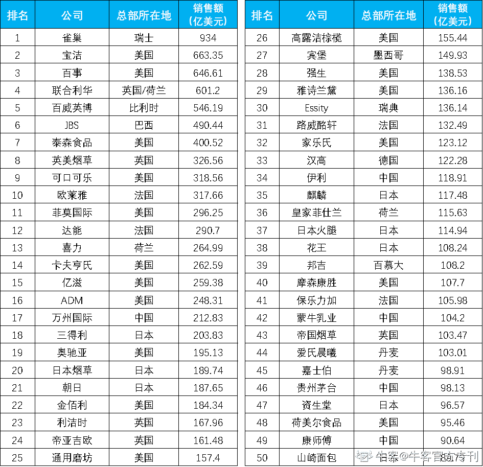

# 第三章 第 1 节 行业介绍

> 原文：[`www.nowcoder.com/tutorial/10022/27e6711d557b43718eedad06fac430b6`](https://www.nowcoder.com/tutorial/10022/27e6711d557b43718eedad06fac430b6)

# **一、行****业****介****绍**

## **1****.1** **行****业简****介**

时间往前推个 5-10 年，大家对快消行业的认识，可能还有许多光环：高大上的工作环境，中英混合的工作语言，工作还可以接触明星。近几年快消早已褪去了光鲜亮丽的光环，互联网变得趋之若鹜，唱衰快消的声音不绝于耳。

那么，快消真的如大家所说，是“上个世纪的行业”，在“走下坡路”？快消公司到底还值不值得去呢？事实上，快消公司在当今的就业市场上，仍旧是很有含金量的 offer。快消 500 强起薪高涨薪快，培训和成长体系完善，未来发展出路广，尤其是顶尖快消的管培，更是许多求职者的 dream offer。无论在哪个大学，宝洁、联合利华、玛氏、欧莱雅等顶级快消公司的校园宣讲会都会场场爆满。

接下来就从求职门槛、薪资、培训和成长体系、出路、能力要求和企业文化具体地分析一下，为什么顶级快消公司仍旧是很有含金量的 offer。

### **1.1.1** **企****业薪资****及招聘要求**

**1、招聘门****槛**

首先，快消公司的招聘门槛相对较低。学校和专业方面，限制就比较少，大部分快消公司招聘都不限专业，也不像咨询、金融一样有 Target School。对于 GPA 和证书也没有太高的要求，GPA 只要过得去，英语通过四六级，一般都不会在简历关被刷掉。

很多同学仍然会觉得自己没有商科同学有竞争力，但是说实话，快消行业的核心岗位是市场部，并不看重硬技能，反而对领导力、沟通能力、团队合作这些软技能要求更高。因此，从结果上来看，思路灵活、语言表达能力强的文科生门在面试中胜出的几率是完全不逊于理科生的。另外，从年级的限制来看，快消公司也相对宽泛。比如说，19 年校招，普通公司的都会要求是 20 届毕业生，而大多数快消的校招面向 19-20 届的学生，给了更多同学机会。

但是，快消行业门槛低，录取压力却不低，玛氏每年管理培训生申请人数超过 30000 人，但是最后仅仅录取 15 人；宝洁每年校招的申请人数超过 100000 人，但是市场部录取人数每年也不会超过 20 人；再比如 2018 年卡夫亨氏秋招 16000+人申请管培生，只录取了 9 个人。几乎绝大多数同学成为了炮灰。

**2、薪****资****情况**

快消行业的 entry level 薪资基本上都有 15-18W。百威和玛氏是薪资最高的，可以达到 25W（但是这两家招人都比较少，往年都在十几个左右，今年快消集体扩招，据说招到了 40-50 人）；宝洁略微高一些，20W 左右，联合利华 18W 左右，这两家是招人大户，招人都在上百，当然市场部的名额也不会太多。

就起薪而言，快消五巨头：百威>玛氏> 宝洁 >联合利华> 欧莱雅。

但是大家千万不要以为起薪 means everything，还需要看两样东西——年终奖、以及很重要的涨幅（宝洁的起薪不高，但涨幅可是快得令人羡慕嫉妒恨）。

总的来看，快消薪资虽然没有顶级互联网、咨询年薪 30W 那么高，但是从工作时间来看，快消基本上工作 8 小时，相比 996 的互联网和 007 的咨询，时薪是很高的了。以及快消公司的福利相对比较好，宝洁是 18 天带薪年假，算上各种节假日一年 30 多天假期。对于追求 work-life balance 的同学真的是非常友好了！

**（1）宝洁**

·起薪：所有岗位起薪一致，研究生 14.2K*14，本科生 12.6K*14

（一般情况下快消公司给本科生开的薪资会比研究生低 1-1.5K 左右）

·涨幅：BRM（就是宝洁的 marketing 部门）是涨的最快的部门，每 6 个月涨 30% （base 高之后涨幅会慢），BRM 一般 5 年之后大概税前 60W；band3: 60-80w；band4: 100-120w；Sales 涨幅第二快，每九个月涨 20%；其他部门一年 15%-20%

**（2）****联****合利****华**

·起薪：所有岗位起薪一致，本科 12.5k*12+14.5%，研究生 12.5K*12，年终奖为年薪的 15%-20%。

·涨幅：管培生每半年轮岗一次，轮岗后薪资会有 15%-25%的涨幅。

**（3）欧莱雅：**10.5K*13，每年大概涨 10%；管培生本科 11K*13，研究生 12K*13。

**（4）****玛****氏：**综合管培项目，统一培养，14.44K*14，全英面试，在中国区招人非常少。

**（****5****）百威：**17.5K*13 薪+1.5K*13 补贴。

**（6）可口可****乐****：**14K*13 薪，涨幅一年 5%（2.5%看公司发展，2.5%看个人绩效）。

（可口可乐中国 2019 年秋招一共招了 15 个人，算上暑期留用）

**（7）卡夫亨氏：**管培 13K*13 薪，sales10K*13 薪

**（8）强生：**11.9K*13 薪*1.17 奖金

**（9）本土快消：**起薪在 11-15W 左右

### **1.1.2** **培****训****体系及未来****发****展**

**1、培养和成****长****体系**

快消经历近百年的发展，人才发展体系非常完善。尤其是快消管培生项目，含金量高，出路也非常好。业务稳定、体系完善、晋升通道明确的大公司，永远是毕业生的首选，无论经济好坏，快消大公司就是典型。

快消绝大多数都是老牌公司，历史悠久，长期以来十分看重人才培养，每年在人才培养上都会有大量且稳定的投入。以宝洁为例，每个季度都有关门离线培训三天的机会，无论是小朋友、还是管理人员。每个入职管培每年的固定培训预算是 6 万起，最好的企业内外培训师、最好的酒店。

快消 500 强公司的培养机制也是非常成熟的，一般都会为 new hire 量身订做科学培养计划，刚进公司你会有专门的 buddy、mentor 还有 line manager，不同角色帮助你提升，让你迅速成长，从职场小白蜕变成为市场精英。体系完善意味着刚刚走进职场的人可以有巨大的学习空间。不受生意的短暂好坏影响，甚至不论是否遇到优秀或者合拍的领导，都能够学到东西。

从晋升和成长路径来看，快消公司是非常鼓励内部晋升的，内部晋升通道完善且透明，职业生涯发展路径也会非常清晰。对于快消市场部的职业发展路径，举例如下：

**·宝洁：**

**市****场****部的成****长****路****线****：**

助理品牌经理→品牌经理→助理市场总监→市场总监→总经理；

**销****售部的成****长****路****线****：**

Key Account Manager（大客户经理），后续晋升路线为 Unit Manager（区域经理）, Market Manager（市场经理）与 Director（总监）。

**·欧莱雅：**

**管培生成****长****路****线****：**

Trainee → Executive → JPM → PM → SPM → Marketing Manager → Marketing Director。

当然，拥有一份快消管培生的经历也可以成为日后跳槽时的强有力的助推。

**2、未来****发****展**

快消的工作接触范围比较广，培养出来的人思路也比较灵活，顶级快消的销售和市场部出来的跳槽都非常受欢迎。例如跳去咨询公司，猎头公司，或广告公关和运营工作，都没有问题。哪怕是选择自主创业，在快消公司学到的知识也会很有帮助。各行各业的老大很多都是快消出身。接下来简单列举下普遍的去向：

**·快消公司：**

宝洁联合利华玛氏雀巢之间的跳槽是非常频繁的，除了各个公司企业文化不同、产品品类差异，总部 location 不一样（比如宝洁总部在广州，欧莱雅总部在上海，玛氏百威总部在北京，在总部的发展机会和前景肯定都更好），最大的动力应该就是薪资了，基本上，快消行业的跳槽涨幅在 10%-30%之间。

**·咨****询****公司：**

快消市场部是很好的跳去顶尖咨询公司的跳板，在快消公司获得的宝贵的快消行业的 insight，会是进入咨询公司非常有力的武器；而且咨询公司会高薪聘请快消人才做行业专家，邀请进行访谈，时薪也是上千起的。

**·互****联****网公司：**

跳去阿里（据说在阿里的宝洁人有 200-300）、京东、苏宁等互联网公司，做电商策划运营或 business analysis。

**·****读****M****BA****：**

尤其是玛氏，号称是各大 MBA 都很喜欢的。对于本科毕业就进入顶级快消工作的同学，还是有相当一部分选择工作 3-5 年去海外读 MBA 的，一方面海外 MBA 对国际快消认可度高，可以申请到比较好的学校；另一方面读过 MBA 之后职业道路会更宽广。

**·****创业****：**

很多创业的，做自己的品牌，比如独立小众的化妆、护肤品牌，在快消行业积累的渠道、人脉、资源都可以成为创业的有力武器。

**3、企****业****文化**

这个因素是很多情况下会被大家忽略，但其实是最为重要的一个。公司的氛围如何、周围的同事做事方式如何等等都决定了你工作是否顺利是否开心。去做一些调查，否则之后工作了会很 suffer。尤其是对人的尊重，不能不提。

现在大家趋之若鹜的互联网大厂，起薪确实让大家心动，但是倡导 996 和狼性文化的时候绝对力排众议，收缩裁员的时候也是绝对毫不留情。相信大家也看到了今年互联网公司的裁员和纠纷，各种关于互联网公司裁员时候的手段确实让人不寒而栗。但是快消公司几乎没有这类纠纷，尤其是外资快消，员工保障是非常健全的，其次企业文化也是尊重每一位员工。

以宝洁为例，大家一般是在秋招的 11 月拿到 offer，次年 7 月入职，但是 1 月份的时候宝洁会给拿了 offer 的所有 new hire 的家里，寄出一份内含所有公司产品的新年礼物，并且附上卡片：“感谢你的家人加入宝洁，我们会像你们一样陪伴他继续成长进步”。7 月入职之前，每个人都会收到公司的 1 万多元无息贷款，属于毕业安置费。这些都不是宝洁会大张旗鼓去宣传的，但是能像宝洁一样做到这些细节的公司真的很少。宝洁的工牌背后是一张小卡片，写着核心价值和核心原则：第一条价值就是人；第一个原则就是：做正确的事。被真的尊重、被鼓励做正确的事，对每个人来说能体面的工作和生活很重要。能进到一家你尊敬并且也尊敬你的公司，将会是何其有幸的事。

另外，不同快消公司的 culture 也不尽相同，比如相对来说欧莱雅比较喜欢 aggressive 的性格，这可能和美妆生意有一定的关系，但也是长久以来公司和员工相互选择之后的结果。入职之前多做这方面的了解也是必要的，评估自己的 personality 和公司是否契合。

### **1.1.3**** 能力要求**

快消这个行业是高端大气上档次与平凡朴实接地气共存的，你可能会受邀参加高级发布会，也可能被派前往县城大卖场。这样的工作对人的能力要求是怎样的呢？总的来说，分为软实力和硬实力：

**1、****软实****力**

招聘门槛低是快消行业的特征，行业内更看重求职者的自身特质，比如领导力、沟通能力/团队合作能力、多任务处理能力、等等。这些要如何培养呢？

**·leadership****领导****力**

领导力虽然是一个比较虚的东西，但是这确实是很多快消行业都需要的一个能力。领导力不是说你有下属的时候才需要，哪怕你只有一个人的时候都需要这种能力。销售部门的同事一进公司就要领导数百人的分销商团队，市场部的同事则要统领不同部门的人，分析市场和消费者、研发上线新品、沟通宣传和代言人、铺开销售渠道、确保供应和售后等等，强大的领导能力真的不可或缺。

**·communication****沟通能力/****团队****合作能力**

市场部、销售部非常看重这种能力。因为这两个部门不像 IT 部门的人，开发一个程序只要你有能力，你就可以一声不吭，闷头把代码敲好就可以了。市场部和销售部的所有事情都需要很多部门的沟通和协助才能完成。例如市场部要确保一个产品成功推广，就需要和广告部门合作，又需要和销售部沟通确保产品信息准确无误地传递给门店里面的消费者等等。

**·multi-task****多任****务处****理能力**

在销售部、市场部，每个人基本都有 4-5 项目同时进行。如市场部的人会同时和广告公司沟通，又会和设计部门的人沟通等等。

**·commercial****sense 商****业****思****维**

市场部员工需要具有较强的市场敏感度，能够把握行业最新动态，感知用户需求、消费习惯；具有较强的逻辑分析能力，通过市场调研，分析竞争品；具有较强的策划能力、创新能力与执行力等等。

**·****beauty sense****审****美能力**

产品包装决定了消费者的感受，精细到每个颜色的色号，打样的颜色是否追色正确等等都需要有很高的敏感度，一份海报上的模特和元素该怎样安排，都需要极其敏感的审美神经。所以快消在招募人才的时候，尤其是化妆品行业，也会很注重看他/她的审美意识，观察他/她的着装搭配等等。

**·data****analysis 数据分析****能力**

很多同学以为市场部最注重的就是创意。但是其实市场部也是很需要数据分析能力，每天都需要看很多尼尔森的数据报告，懂得从数字看到本质。平时的工作中也需要用市场数据（比如盈亏分析、竞品数据、客户流失、消费者评价等等）去指导下一步的市场决策。平时同学们也可以多关注一些快消行业的市场报告，积累一些相关数据和市场走势，在面试的关键时刻会成为展示你的数据敏感的杀手锏。

**2、****硬****实****力**

快消公司的硬件要求不多，硬实力主要就是看学历、英语和实习经历。

**·****学****历****及****专业****：**

本科及以上，硕士优先，211/985 名校会优先，绩点高的同学会有加分。虽然各家快消公司的 HR 都说不看重学历，但成功上岸的二本同学确实比较稀少，网申被刷掉的可能性很高。至于具体专业，finance 和研发部门可能会有偏好，像市场、销售这些部门对任何专业的同学都是敞开大门的。

**·****英****语****水平：**

大学英语四六级是最基本的要求，因为这些快消公司基本都会有英文面试，如果不会英文，可能求职的时候会碰壁。除此之外，现在筛选简历基本上会运用机器筛选，如果你的这些硬性条件本身就有，那么就减少前期被筛选掉的几率。

**·****实习经历****：**

一般来说，快消公司市场部相关实习经验>咨询、市场研究的公司实习经验>广告公关传媒的实习经验和其他行业市场相关实习经验>商业大赛经验或创业经验。

### **1.1.4 行****业现****状**

**1、快消行****业****概述**

快消定义快速消费品（Fast Moving Consumer Goods，简称 FMCG），是指那些使用寿命较短，消费速度较快、消费者需要不断重复购买的产品，涉及食品、饮料、化妆品、洗涤用品、电池、卫生纸等多个行业。典型的快速消费品包括日化用品、食品饮料、烟草等；药品中的非处方药(OTC)通常也可以归为此类。

之所以被称为快速消费品，是因为他们首先是日常用品，消费者的购买使用是高频次和反复消耗的，通过规模的市场量来获得利润和价值的实现。所以快速消费品行业会有“三个月规律”，如果你让一个新的竞争对手在三个月里无法取得量的突破，你就很可能消灭它。

市面上的快消产品品牌和选择都非常多，在同质化竞争如此激烈的市场环境中，各家公司就是要想尽一切办法来让消费者选择购买自家的产品，而不是竞品。比如说代言人、包装、促销活动、广告宣传、品牌调性等等，来抓住客户。

快消品与其他类型消费品相比，购买决策和购买过程有着明显的差别。快速消费品属于冲动购买产品，即兴的采购决策，对周围众多人的建议不敏感，取决于个人偏好、类似的产品不需比较，产品的外观/包装、广告促销、价格、销售点等对销售起着重要作用。

因此，**快速消****费****品有以下几个基本特点：**

便利性：因为快速更新替换，所以消费者会倾向就近购买，当然现在网购也已经非常方便了；

视觉化产品：消费者在购买时很容易受到卖场打折促销的影响；

品牌忠诚度不高：消费者很容易在同类产品中转换不同的品牌；

**快速消****费****品的****购买习惯****是：****简单****、迅速、冲****动****、感性。**

**2、快消行****业发****展****阶****段**

都说传统的快消行业已经陷入困局，增长势头放缓，成本增加，销量却降低，说得快消行业俨然一副满是将亡之势的模样。

首先，快消行业在中国市场进入成熟期，增速明显放缓。快消行业的发展可以简单分为两个阶段：2012 年之前（2002-2012）是快消行业的黄金十年，以宝洁为首的大企业保持着高速增长；2012 年后行业进入了成熟阶段，从双位数增长跌到个位数。目前的增长速度越来越缓慢。

不可否认的是快消行业已经不像互联网、金融这些行业发展势头这样猛烈了。所以大家也不断看到关于宝洁削减广告支出，出售 100 多个品牌的新闻。确实客观来说这个行业生意越来越难做。

所以，很多人都在唱衰快消行业，真的是这样么？并不是，只是快消行业进入了发展成熟期。从行业的角度看，快消品是生活必需品，无论什么时代这个需求都是恒定存在的，所以本身行业的稳定性比较高，不会像互联网一样有明显的周期性和波动性，也不会瞬间迭代。而且，快消行业经过百年已经发展的比较成熟，它经过了许多轮的商业发展周期仍然屹立不倒。

电商行业的崛起，分掉了传统快消很大一杯羹。但是快消也在转型做电商的生意，E-commerce 已经成为快消最吃香的部门。阿里、京东、苏宁这样的电商巨头也是和宝洁、联合利华有着密切的合作，很多快消公司的员工甚至会直接到客户部门去办公。从数据的角度看，2018 年全球快消品行业 50 强销量有机增长达到 1.8% ，这一数据是从 2016 年以来最高的，同时它们的利润率也达到了 18.2%，这是自 2002 年首次进行全球 50 强研调以来的最高水平。可见，快消头部公司都活的很好，并不是大家传言中的那样。

其次，从快消的各个渠道来看，电商发展强劲，便利店也增长迅猛，线下传统零售商越来越困难。电商渠道从 2012-2016 年的年平均增长率达到了 40%，是所有销售渠道里面增长势头最强劲的一个。连锁便利店增长迅速，如全家，罗森，711 等零售商的增长都达到了双位数，这是快消公司越来越重视的一个销售渠道。

快消行业最重要的下游零售商就是连锁的大卖场。这些卖场规模大，人流量高，一直都是快消公司的必争之地，而这些渠道的销量产出一般都能占到一间快消公司的 20%-30%的销量。但是近年来随着电商的崛起线下商超受到巨大冲击，许多连锁商超都出现了一波又一波的关店潮，大润发被阿里收购，家乐福被苏宁收购。

老牌外企名声在外，但是近些年本土快销品牌也在飞速崛起。立白、蓝月亮这些企业在这几年发展都非常迅速。国内的本土企业占据了中国快速消费品行业的 70%的市场份额。这一点或许是令大部分人感到最意外的。毕竟在我们身边耳熟能详的快消公司，如宝洁、联合利华、玛氏都是外企，势必他们的市场份额应该是占大头的。所以其实大家也不要只把目光放在外企，很多国内的民企都是值得考虑的。

## **1****.2** **岗****位介****绍**

快消公司一般的组织架构会包含：处于中枢的市场部、站在前线的销售部、大后方的调研部、研发部、供应链部门（包括工厂和物流，也叫供应保障部）以及财务、法务、人事、IT 等支持性部门。主要由市场部和销售部两个核心部门推进工作，剩下的都属于支持部门。

### **1、市****场****部**

市场部是快消最为核心部门，为什么这么说呢？首先，快消最重要的事情就是营销。创新的产品概念、必要的广告投入、长期的品牌维护，这些都是由市场部做的事情，由此可见市场部在快速消费品行业的重要作用。

比如香皂有一百多年的历史，主要成分还是那样，只不过增添更多的新价值，或滋润、或清爽、或花香、或感受。舒肤佳香皂在中国市场很多年，主要的成分没有变化多少，但每年会变换新包装，投放新广告，实行新促销，进行新活动，形式上的新意和主张上的新意胜过一切，可口可乐和百事可乐的方法如出一辙。快消品之间的差异很小，当功能无法差异化时，那不同公司的主要战场就是看谁家的营销做的更到位，更能打到消费者，让消费者买单——这正是市场部工作的核心所在。

快消行业的市场部与其他行业不同之处在于，行业变化日新月异，需要你能快速适应。消费者今天需要的不一定是他们明天需要的，因此市场部需要洞悉消费者偏爱和行为的变更。快消行业的市场部经常需要管理产品的整个生命周期，从研发到产品发布，以及正在进行的市场推广成果。

市场部与其他部门名义上是平级部门，实际上是个牵头组织（比如宝洁的管培生，其他部门 entry level 是 band1，但是市场部 BRM 的 entry level 就是 band2）。在快消行业，我们习惯称为 leading function。市场部通过深入了解消费者的需求和心理，结合品牌定位与公司发展，将创造性的概念转化为优质的产品，并制定实施品牌传播与沟通策略。市场部需要与研发部门、市场调研部门和全球品牌小组共同合作，从事新产品开发；同时积极与客户发展部配合，参与到店内活动以及一切与消费者直接接触的活动中。

市场部还将与最优秀的市场调研公司、广告创意公司、媒体公司紧密合作，利用他们的专业知识和经验，不断提高品牌的知名度和美誉度，扩大市场份额。从 BB 那里接受产品，到这个产品有包装、有价格、质量合格、在中国有产品线，到这个产品为中国消费者所熟知。市场部门制定一定的市场战略，销售部门、供应链、财务支持等，都遵照市场部门的指令与要求。概括来说市场部对外要跟广告商打交道，对内跟生产部门，物流部门，CBD 打交道。

市场部由市场总监负责，市场总监下面通常有 2-3 个品牌经理，每个品牌经理基本专注于一个品牌，全面管理与该品牌及相关产品有关的所有业务。以品牌为核心的多部门协同小组，每个品牌管理小组都像一个微型事业部，居于核心的就是品牌经理。

在宝洁等快消公司的市场部里，一个品牌总监/经理的工作大致可分为以下三个环节：挖掘用户需求（消费者需要什么）、打造产品（我们要卖什么）、上市推广（具体怎么卖出去，广告传播+销售渠道），每一个环节，都需要与其他部门进行协同，这也是为什么市场部居于中枢地位的原因。

与市场研究部和调研公司（比如尼尔森）合作挖掘用户需求。我们得知道消费者想要什么，有什么新需求，对现有的产品有什么需要改进的地方。我们会通过做调查问卷、消费者面对面访谈等形式来获得信息。

把我们从消费者那里获取的信息分享出来，与研发部门和供应链部门协同打造产品。

产品有了之后，我们需要为它找代言人，制作广告片，与媒介和公关部门以及广告公司（比如奥美等）合作，然后在各种媒体上传播，完成上市推广的传播工作；为了让消费者能在家附近的便利、商场等场所购买到我们的产品，我们需要与销售部门及外部的分销商公司合作，制定价格、销售奖励和促销活动，合作完成上市推广的的渠道工作。

事实上，不同公司的市场部是不尽相同的。联合利华会把市场部分得更细致，marketing 又被分为 BD-Brand Development 品牌发展和 BB-Brand Building 品牌建设。雀巢的市场部也是这样分的。BD 就对照上面的 1、2 两项工作，类似把孩子生出来的过程。把产品从无到有开发出来。具体一点就是产品包装、广告、定价、质检卫检、甚至到生产线制定，总的产品毛利率等确定后，才能确保“这个孩子在这个市场能生”。

而 BB 对应上面的 3、4 两项工作，相当于养孩子的过程，为产品打广告搞促销活动。根据 CMI 的报告分析市场，不断想新的促销方案，然后落实下去。比如夏天的促销结束了，要想冬天怎么促销，什么主题，什么形式，做什么样的广告，做多大做多少量做多少城市多少卖场。用什么样的促销方案：赠品，打折，返券，捆绑销售，抽奖还是冠名活动。这个流程中具体的工作包括广告投放（TVC）、店内货架占比（instore share of shelf）、户外广告牌（OOH）、推头促销装（promotion pack）、电影电视广告植入、杂志广告等等，都是 BD 来完成。

需要注意的是，宝洁的市场部现在叫品牌管理部，对 marketing 感兴趣的同学记得选择品牌管理部，而不是市场研究部，市场研究部更多的是以消费者为中心，进行数据的挖掘和消费者洞察，两个部门是配合关系，品牌管理部会基于市场研究部的数据和结论展开工作。宝洁的 BRM、CMK、CBD 的具体区别在公司的部门会专门介绍。 

可以说，市场部占有领导地位，是快消市场部区别于其他任何公司市场部的典型特征。

### **2、销****售部**

销售部门是快消企业的核心部门之一，不同企业的销售部门往往有不同的名称，如联合利华的客户发展部（Customer Development），宝洁的客户业务发展部(CBD，Customer Business Development)。

工作内容上看，销售部需要与客户保持紧密的合作伙伴关系，与消费者和购物者保持有效的沟通；通过对渠道的不断拓展来寻找业务机会；发展与执行客户业务发展计划，建立促销活动，并有效执行新产品的上市活动。负责具体执行实施，为产品争取促销机会，执行批准的促销计划和既定的营销策略，实现预定的销售目标。譬如跟通路的零售商，超市卖场打交道就是销售部门的事。

具体来说，包括对接与开发现代零售渠道商、分销商、大卖场、标超与便利店等销售渠道，开发公司大客户，发展战略合作关系进行产品销售，当然也包括电商的渠道和生意，很有可能会和阿里巴巴、京东、苏宁这样的电商 marketing 部门一起工作负责提升他们的生意。例如，负责北上广深等大城市一部分大卖场，或是前往二三级城市、中西部省份全面负责一定区域的业务，真枪实战地和竞争对手在线下竞争。同时，建设并管理近年内出现且迅速发展的新兴购物渠道如：网上购物，母婴店，药店，美妆店等。

以联合利华为例，销售部门的团队和职责分工是这样的：

**区域****销****售****团队****：**负责区域市场渠道管理与拓展、经销商/现代通路门店管理、第三方销售代表团队管理、确保经销商客户/现代通路客户生意计划在区域销售终端执行

**重点客****户****管理****团队****：**负责重点客户的销售和利润目标实现：管理客户全国及区域总部、发展并执行联合客户生意计划、管理贸易条款及费用

**客****户营销团队****：**通过对不同渠道/客户的研究了解, 以及不同渠道/客户的购物者的洞察, 建立专业的品类和渠道的管理。 根据品类和渠道的综合特点, 制定针对性的渠道/客户品类活动计划。 与销售团队沟通并推进品类活动计划的执行,并着力于建立专业的店内活动执行管理计划。

**全国****销****售运作****团队**：制定渠道分销策略和覆盖模式，通过提高权重分销持续获得市场份额；制定全国分销商和分销商销售代表管理策略和模式；销售目标设定与追踪管理，制定渠道门店投资策略，制定全国销售营运规则

店内活动/店内生动化陈列/能力发展团队：负责品类店内活动执行管理，第三方管理与促销员管理，以及品类助销工具设计、开发、制作及执行管理和销售专业技能培训管理与发展。

作为快消行业的销售人员，要具有过硬的销售技巧与统筹眼光，充分开发各级销售渠道。尤其是具有较强的沟通能力与协作能力，极佳的人际沟通技巧，能够和不同层次、年龄段的客户进行沟通和互动，因为销售部门需要比较多的参与商务谈判的工作，有的时候需要到二三线城市甚至是山区和生意伙伴洽谈生意，没有一颗热爱销售行业的心是坚持不下来的。

### **3、市****场****研究部**

市场研究部（CMI，Customer & Market Insight，或 CMK，Customer & Marketing Knowledge），是区别于市场部和销售部的部门，我们分成联合利华和宝洁来举例说明。

在宝洁，从全球的决策制定到各地区市场的具体执行，CMK 为生意发展指明方向。这里也许是未来商业精英的最佳起步点，与经验丰富的商业领袖共事，收获宏观视野、精通商业分析，并以此影响数亿美元生意结果。中国每卖出两瓶洗发水，就有一瓶来自宝洁公司。这巨大的商业成功正体现了 CMK 的力量。宝洁公司多年来的经验表明，要想有计划、有系统、可预见、可持续地取得成功，最重要的是了解消费者的需求，发掘有价值的“消费者洞察（consumer insight）”，并把这些洞察转化为令消费者满意的产品，而 CMK 在全面了解消费者方面扮演最核心的角色。

CMK 的前身市场调查部（MBD）成立于 1924 年，是人类工业史上最早的市场研究部门之一，开启了整个商业领域大规模，持续的消费者研究的历程。宝洁的市场研究部门，是全球最大最领先的市场研究部门，目前全球许多公司市场研究部的领导都是从宝洁 CMK 毕业的校友。

CMK 到底是做什么的呢？

解析市场层出不穷的商业模式，预知市场发展趋势；

指导公司战略发展决策，领航公司未来发展；

洞悉市场先机，发掘消费者内心的“处女地”。

CMKer 一方面将各种大数据玩转在手，分析生意机会。另一方面，CMKer 也装备了各种先进的消费者研究的高科技武器，像眼球追踪、脑电波探测、人工智能。当然 CMKer 也是全公司最接地气的，有时候会和消费者同吃同住去了解他们的需求。

### **4、研****发****部**

产品研发部（Research&Development，简称 R&D。联合利华的研发部叫做 innovation&tech，是 base 在供应链部门下面的，），快消品更新换代非常快，产品生命周期相对较短，所以储备和研发新产品尤为重要。主要是新产品概念研发，而研发的来源一般依靠市场部的调研数据。通过分析市场和消费者数据，跟踪零售市场，把握未来消费趋势。同时，还包括将原有产品进行重新包装和改良，成为新的产品概念。

快消行业中的研发岗位与消费电子等行业不一样，研发的重心在于对产品细微创新和改进，为一个产品推出不同的版本（例如，一个新口味的冰淇淋），而非依赖于重大变革。因此，在研发部门里工作不会有压力去创造一个“划时代杰作”，而要求候选人可以对产品提供稳定持续的改进。

大型快消公司和小公司最大的区别之一是会先请第三方做大量的市场和消费者调查，根据需求来设计生产线、有的放矢的研发新品。所以新品成功率很高。而很多小公司土豪老板会先买生产线再想做什么、拍脑袋决定新产品叫什么名字。新品周期快、也非常的灵活，但是大多数还处于模仿别人的阶段，很难有全新的产品出现，也很难创造非常大的动销。

另一方面，大公司的研发中心确实会投入大量费用人力进行研究。参观过公司的 Reserch Center，比如巧克力，就有意大利的巧克力大师对其不同温度、形状、口味等做实验研究，还有专门负责品尝的小组负责打分、对口味提建议。

那快消公司的研发部门具体做什么呢？一般上研发分为工艺流程-process，配方-formulation，包装-packaging。

产品的工艺流程-process，主要包括四方面：从实验室到工业大生产的实现过程；通过开发新型的工艺流程，设计新产品，最大程度来优化产品；减少生产而产生的对水，能源的浪费；从原料，产品和生产设备各方面着手，解决大规模生产出现的问题。通过在不同的国家和工厂考察，实现并负责创新技术由研发部门到实际生产部门的技术转移。

产品的配方-formulation，这个比较好理解，有的时候大家感觉换汤不换药，但是其实每一个细微成分的改变都是要研发部门拍板的，比如换个香水，想要闻起来比竞争者产品更高级（需要消费者测评），formulation 的研发人员就要做测试，还要确定这个成分和现有的包装材料是否兼容。同时研发部门也是采购和工厂生产之间的重要纽带，采购买什么物料，也是要研发部门签发的，采购部门才知道买什么。同理，材料运到工厂，怎么解决材料，怎么确定材料和机器设置匹配，其实都是研发的工作呢。当然，研发的最重要的工作还是创新和节省，有时候公司要 saving，可能不是采购的谈判技术有多好，而是产品成分的变化，不是说便宜的原材料做出来的东西质量就不好了，这个成分配比完全是要看材料价格走向趋势的。

产品的包装-packaging，快消品的包装不光是要好看，而且是要更加实用、更加 customer-friendly，深入了解消费者的需求和品牌及产品的定位，与公司内外部各个部门充分沟通协作，开发出能体现产品灵魂的，同时又满足公司/消费者/绿色环保三者要求的包装。这里从一个例子看：奥妙洗衣液，比如它的瓶口有个白色的塑料槽，称为导流槽，也就是引流的。作用是为了让洗衣液在倒出来的过程中不漏到瓶身的外面，看起来简单，但是这个导流槽需要设计，测试，再考虑成本，最后不断不断优化到最后的生产。这个过程需要研发部门设计，还需要供应连的工艺工程师配合测验，改善，生产部门需要全力配合。可能很多人都认为日化品的研发都是化学的那种研究，其实不然。只要是能有助于改善工艺，缩减成本，推出新品等等。

研发岗位需要的人员，不是大家想象的那种实验室里面的博士。他们更多是需要有 business mindset 和要 consumer focus，而且每天要跟各个部门开会的，供应商，工厂，还有市场部。一个好产品的上市，是大家共同努力的结果。

### **5、供****应链****部**

快消行业的供应链相对较长，运行节奏较其它行业要快，因此其供应链就要求必须具有快速的响应速度。从原料生产、加工、包装、运输、分销、销售到售后服务等的每个环节，都需要供应链管理来提高整个运行链的效率与效益，从而保证前端的销售和供货。

供应链部门，Supply Chain 也叫产品供应部（也叫 PS）。负责供应链整合，保证产品从原料到成品，通过每一个环节的物料供应，第一时间抵达消费者手中；保证设备、系统、厂房、配套设施等在安全高效的条件下运转；负责产品生产，以最先进的技术、人力、设备等管理产品的生产、包装等各个流程，保证及时、持续、高品质的产品供应；负责从原料、包装、设备到明星、广告、市场活动等各项内容的全面采购；建设全面的质量体系。供应链部的四个关键职能分别是计划 planning、采购 procurement、生产制造 manufacture、物流 logistics。

计划 planning，整个供应链的大脑，支配资金流、物流还有信息流。通过应用先进的技术系统，制定精密准确的计划，提供专业标准的服务，来保障高效准时地将产品送达客户终端。

采购 procurement，需要寻求新的供应商，并且与供应商建立良好的合作关系。 

生产制造部 manufacture，将计划部门的计划生产制造成实实在在的商品。了解工厂在保持世界一流的质量标准的同时，如何提高效率和适应不断变化的需求。

物流 logistics，有计划地将商品运往世界各地的分销仓库，与仓储和运输相配合，确保产品上架的上架率及订单管理，提供卓越的物流服务，并在销售和促销的活动策划、执行中与客户发展部门和主要客户密切配合，以更优化的方案来满足客户更高的要求。

大型的快消外企的供应链部门，一般都有上百个工厂，成千上万跳生产线，每分钟向全世界各地输送产品。从采购原材料到交付最终产品，供应链部门起着非常重要的作。供应链部门通过准确的计划，高品质高标准的制造，全球领先的采购，高效及时的物流系统，对客户和市场作出敏捷的反应，将一流的产品准时送达客户终端。这中间，小到车间产线效率提升，大到工厂搬迁，都是真正为公司做有价值的事情。

### **6、其他****职****能部门**

**（1）财务****部（****F&A）**

快消企业的财务部非常庞大，财务管控的重点是费用控制及绩效分析。大致可分为品牌财务、销售财务、供应链财务、公司财务等板块。

【品牌财务】指按照产品品牌分类，负责某一品牌的战略、上市、预算管理等。

【销售财务】主要对接客户，负责客户生意发展，给出促销及盈利建议。

【供应链财务】注重优化供应链，减少生产过程中的损耗，投资新生产线时做好战略规划。

【公司财务】则指公司层面的财务工作，包括会计、税务、财务分析、内部审计、合规等。

**（2）人力****资****源部（****HR）**

主要是招聘及人事管理，负责招聘方案，优化招聘流程，执行招聘工作，提高招聘效率，规划和人员编制预算的统筹；还需要负责公司日常人事工作，员工关系，薪酬福利等方面的工作。

**（3）信息技****术****部（****IT）**

信息技术部和商业关联较大，主要运用 IT 技术去找到商业解决方案。比如：和供应链合作，实现实时货运可视化，通过先进的安全警报系统，尽收眼底的指标考核，结合大数据分析，三管齐下不断找到物流瓶颈，进行供应链的层层优化。通过高性能的 IT 基础架构保证广告的精准评估和投放。在保证消费者隐私的前提下，基于海量的网站浏览数据、广告曝光数据和其他第三方数据，根据品牌的需求，定义基于规则的用户分组，或者使用机器学习算法，推测出用户的兴趣标签，为广告精准投放提供数据基础。

### **7、管培生**

快消的管理培训生（Management Trainee）是“以培养公司未来领导者”为主要目标的项目，是专为渴望成为“综合型、国际化、高级职业经理的毕业生设计的领导力发展项目”（来自玛氏管培生项目介绍）。这一句话就足够吸引 90%的应届生。

管培生项目的培养方式，是按照所谓的 70/20/10 的法则来进行：70%的工作实践+20%的同事学习+10%的课堂培训。以玛氏为例，玛氏从暑期实习生项目（MLEP）开始，在 8 周的实习期内，就会被安排到 mentor 和优秀管培生的辅导，而且将作为项目负责人被给予最大的机会和挑战。

同时，参加快消管培生能给你带来快速的晋升机会。据统计，市场上职场人平均晋升为经理的年龄为 33.2 岁，而通过参加快消巨头的管培生项目晋升为经理的年龄为 26.5 岁。那要怎样才能成为“高起点、高薪资、高逼格”的快消管培生呢？

一般来说，管培生分为两种 Management trainee 和 graduation trainee。管理培训生的全称叫做 Management Trainee，就是一个公司为了从应届毕业生中选拔一批高潜力的人才制订的一个 program。选拔这一批人才进来主要是为了把资源更好地应用到这一批应届毕业生身上，同时也为公司未来培养管理层储备资源。一般来说，在快消行业的整个管培项目会持续两年到三年的时间。

那么具体是一个什么样的机制呢？以百威英博的 GMT program 为例来给大家介绍一下。第 1 周在美国进行入职培训，紧接着会有 1 个月在亚太区总部进行培训，为了让你了解公司的各个基本情况，了解各个职能之间的合作、配合和特点，以及一些基本的工作技能培训；接下来 5 周就是去销售一线培训，了解公司的运作模式；接下来的 5 周就是在供应链或者其他的一些部门进行实地培训；紧接着是 1 个月的市场部培训；然后是 1 周的 IBS 实地培训，IBS 百威英博公司内部专业的简称；最后 5 个月就是在你自己感兴趣的部门进行培训。

综合来讲，百威英博的管培生培训就是 10 个月的带薪轮岗，让你对公司的各个部门有一个基本的了解，了解之后根据你的兴趣来选择你未来的定岗部门。定岗之后就是在这个部门进行深入的了解部门的日常工作。

百威英博 GMT 很好的一个特点就是在面试过程中不会先让你去选择你要确定的部门，因为确实应届毕业生之前没有很多机会去接触社会，可能也不是很确定未来自己在哪个部门工作。正好通过前期短暂但完整的轮岗对各个部门都有了解之后再去选择，会更基于自己的能力和兴趣去选择自己未来的发展方向。

不同于百威英博，达能的管培在面试之前就会让应聘者去选择未来感兴趣的职能，选择部门之后，参与这个部门对于人员的招聘流程，通过面试之后直接就定岗在这个部门。

## **1****.3** **企****业****介****绍**

### **1****.3.1** **企****业****分类**

快速消费品行业的包容面很广，按照各家产品不同大致分为四个子行业：

① 个人护理：如口腔护理、护发、护肤等；

② 家庭护理：如各种衣物清洁、厨房清洁用品等。大的日化巨头比如宝洁、联合利华的业务就涵盖了个人护理和家庭护理；

③ 食品饮料：比如各种饮料、瓶装水、糖果等，例如可口可乐、雀巢、玛氏、农夫山泉等；卡夫

④ 烟酒：比如百威。

其他的，比如化妆品行业、奢侈品行业、服装行业，因为工作性质和求职准备上都比较像，我们也把它们列为宽泛意义上的快消行业求职之中加以介绍，接下来简单介绍下各大快消公司的产品和品牌。

**宝洁：**主要产品线涵盖了洗发、护发、护肤、化妆品、姨妈巾等等，旗下品牌都是大家耳熟能详的，飘柔、舒肤佳、玉兰油、帮宝适、汰渍及吉列这些。

**联****合利****华****：**除了做个人护理和家庭护理，也做食品饮料，个人洗护主要有多芬、清扬、旁氏、夏士莲，家庭护理有奥妙、金纺，食品饮料有立顿和家乐。

**玛****氏：**主要做巧克力、糖果，还有宠物，各种狗粮猫粮，玛氏是全球最大的食品生产商之一，拥有众多世界知名的品牌，比如德芙、玛氏、M&M’S、士力架等等。

**可口可****乐****：**在世界 500 强排名中位列前 10，甚至超过宝洁。

**亿****滋：**巧克力、饼干、口香糖、糖果、咖啡、饮料。

**卡夫亨氏****：**婴幼儿食品、佐餐、调味品酱料之类的。

关于快消公司的排名情况，各家都说各家的好，莫衷一是。我们能够看到的就是客观的数据和经营状况。2019 年《财富》世界 500 强排行榜中，雀巢全球排名 76 名，强生 109 名（强生的医疗产品和医疗器械份额占比较大），宝洁 146 名，百事 154 名，联合利华 167 名，百威英博 192 名，可口可乐 395 名，欧莱雅 396 名，达能 432 名，卡夫亨氏 472 名，亿滋 480 名。

欧晰析企业管理咨询公司(OC&C)发布了 2019 全球 50 强快速消费品公司排行，该榜单主要根据各企业 2018 财政年度的业绩进行排名，其中上榜的品牌都是人们耳熟能详的，譬如雀巢、宝洁、百事、联合利华等等都在列内。下面这个全球 50 强快消公司榜单，供大家参考：

 

**2019 全球 50 大快速消费品公司排行名单**

关于快消公司市面上流传的不成文的 tier 划分，根据薪资、企业实力、未来发展等等分成 3 个 tier，大家在求职的时候也可以参考：

Tier1: 宝洁、可口可乐；

Tier2: 强生、联合利华、百威英博、玛氏、雀巢、欧莱雅、雅诗兰黛、利洁时、汉高、高露洁、达能、益海嘉里（金龙鱼）、中粮、金佰利、蓝月亮、立白、费列罗、阿迪达斯、红珏高级时装、如新（中国）、路易威登 LVMH、迪奥 Dior、卡地亚 Cartier、爱马仕、Calvin Klein、Tiffany & Co.、古驰 coach、百事、伊利集团、Mattel；

Tier 3: 星巴克、国美、李锦记、蒙牛、迪卡侬、农夫山泉、苹果、郎酒、沃尔玛、永旺、红星美凯龙； 

在消费品行业日益发展的今天，虽然大部分市场份额依然由宝洁、联合利华等巨头占据主要地位。但是国内品牌的发展势头也很迅猛，大家在求职快消行业时，也可以多考虑考虑国内的快消公司。比较知名的国内公司有，个人&家庭洗护：纳爱斯、立白、隆力奇、重庆奥妮、上海家化、北京三露等。食品饮料：娃哈哈、光明、蒙牛、伊利、五粮液、青岛啤酒、汇源果汁、康师傅、统一、雅士利、冠生园等。

### **1****.3.2** **公司介****绍**

#### **1、宝洁**

宝洁公司始创于 1837 年，是世界上最大的日用消费品公司之一，总部位于美国俄亥俄州辛辛那提市。宝洁公司在全球大约 70 个国家和地区开展业务。宝洁公司在全球 80 多个国家设有工厂或分公司，所经营的 65 个品牌的产品畅销 180 多个国家和地区，其中包括美发、健康和美容、织物和家居护理、婴儿，女性和家庭护理。

宝洁通过旗下品牌服务全球大约 50 亿人。1988 年，宝洁落户广州，并成立了宝洁在中国的第一家合资企业－广州宝洁有限公司，从此开始了其中国业务发展的历程。宝洁大中华区总部位于广州，目前在广州、北京、上海、成都、天津、东莞、江苏等地设有多家分公司及工厂。宝洁进入中国近 30 年，中国市场成长为宝洁全球发展速度最快的市场之一。宝洁也一直通过在环保以及社会责任等方面的一系列努力，切实履行对中国社会的可持续发展所负有的责任。目前宝洁在中国拥有 8000 多名员工，超过 98%为本土员工。

宝洁的“黄埔军校”绝非虚名。长期以来，宝洁招聘了大量优秀的应届毕业生，是许多业内精英的第一份工作，宝洁里边完善的培养制度、师徒机制，让一批又一批聪明优秀的年轻人最大化地发挥了自己的价值。很多人甚至愿意降薪去宝洁，就为了更系统地学习宝洁内部的一系列的培养课程。因此，从宝洁出来的很多人，跳槽的时候都会十分受欢迎。

**宝洁品牌和****产****品介****绍****：**

顶级品牌：SK-II

二线品牌：Olay（玉兰油）

洗护品牌：飘柔、海飞丝、沙宣、潘婷、汰渍、碧浪、博朗、润妍、舒肤佳、佳洁士、欧乐 B、护舒宝、帮宝适

#### **2、联****合利****华**

联合利华作为全球财富 500 强之一的跨国公司，以全年超过 520 亿美元的总销售额，跻身世界三大顶级食品和饮料公司之列，是世界第一大冰淇淋、冷冻食品、茶和香皂制造商，世界第二位的牙膏和肥皂制造商，以及世界第三位的护发产品生产商。

联合利华集团是由荷兰 Margarine Unie 人造奶油公司和英国 Lever Brothers 香皂公司于 1929 年合并而成。总部设于荷兰鹿特丹和英国伦敦，分别负责食品及洗涤用品事业的经营。联合利华公司现已成为国际快消巨头之一，是世界 500 强企业不可或缺的一部分。

旁氏、力士、夏士莲、奥妙、中华、立顿黄牌、和路雪等十三个品牌分属家庭及个人护理用品、冰淇淋、食品等三个系列的产品，联系着人们日常生活的各个方面。联合利华在全球有 400 多个品牌，其中大部分是收购来并推广到世界各地，比如，旁氏原是一个美国品牌，联合利华将其买下并发展为一个护肤品名牌，推广到中国；而“夏士莲”原是在东南亚推广的一个英国牌子，联合利华也将其引入中国。“成为本地化的跨国公司”是联合利华的全球经营宗旨和长期以来的传统。

**主要****产****品：**

食品：2000 年购入的百仕福使联合利华在调味品界处于领先地位。现在，家乐是联合利华最大的食品品牌，它遍及 100 多个国家，销售额达到 23 亿欧元，产品涵盖汤类，肉羹类，调味酱，面条和现成膳食。在中国地区 2011 年所经营的食品品牌目前分为：超商普通大众类（调味品，茶，冰淇淋）和餐饮业的饮食策划类（调味品，茶），有家乐、立顿、和路雪、四季宝品牌等。

日化类：在全世界大多数地方，联合利华都是家用洗涤和个人护理用品市场的主导者。包括金纺、奥妙，晶杰等在内的联合利华许多的家用护理产品都是市场上的领头羊。在个人护理用品领域，联合利华的洁肤产品，除臭剂和抗汗剂在国际市场有着不可动摇的地位。联合利华全球个人护理用品的主要品牌有多芬，力士，旁氏，清扬，凌仕，舒耐，夏士莲，通用商标凡士林也是联合利华旗下品牌。

#### **3、可口可****乐**

可口可乐公司从 1886 年创立以来，一直以其可口的碳酸饮料系列产品风靡全世界，历经 121 年长盛不衰。这种神奇的饮料以它不可抗拒的魅力征服了全世界数以亿计的消费者，成为“世界饮料之王”，甚至曾享有“饮料日不落帝国”的赞誉。

可口可乐公司是全球最大的饮料公司，拥有超过 500 个饮料品牌，每天为全球的人们提供怡神畅爽的饮品。除全球最有价值品牌可口可乐外，可口可乐公司还拥有 12 个价值数十亿的品牌，其中包括健怡可口可乐、雪碧和芬达，零度可口可乐、维他命水、动乐、美汁源和乔治亚咖啡。

在全球，可口可乐是世界上最大的汽水、果汁、果味饮料和即饮茶和即饮咖啡的生产商。通过全球最大的分销系统，200 多个国家的消费者每天享用超过 16 亿杯可口可乐产品。

#### **4、百威**

英博(Inbev)创立于 1366 年，是全球第一大啤酒公司，总部设在比利时的 Leuven。英博集团拥有 200 多个品牌，包括时代(Stella Artois)、Brahma、贝克(Beck's)、Leffe、Hoegaarden、Staropramen 和巴斯(Bass)。公司雇用约七万名员工，业务遍及美洲、欧洲和亚太区 30 多个国家。英博浙东啤酒有限公司是英博国际集团控股的独资企业。

全球最大的啤酒酿造商，在 2004 年销售达到 2020 万吨啤酒和 315 万吨饮料（包括英博和美洲饮料集团）。英博啤酒集团系总部设于比利时 Leuven 之上市公司(INB-Euronext 证券交易所)。英博啤酒集团，于 2004 年 8 月 27 日创立，将英特布鲁和美洲饮料公司合并为一体，合并规模达 112 亿美元，公司把业务重点放在中国的富裕地区。在此之前在中国进行的收购都是由英特布鲁啤酒集团完成的。因为这个合并，公司现保持着健康平衡的商业综合发展和市场增长而近全球的市场份额 14%。今天英博啤酒集团已经成为中国最大的啤酒生产商之一。32 个啤酒生产厂的年产能达 300 万吨，中国五个大省中排名第一。集团业务分布于浙江、福建、广东、湖北、湖南、河北、江西、江苏及山东。

从地理来讲，英博在美洲、欧洲和亚洲有主导地位。他在 20 个主要市场保持着第一和第二的位置。英博集团拥有逾 200 个品牌，包括时代 (Stella Artois)、百瑞马（Brahma）、贝克(Beck's)，等英博的全球旗帜性品牌。公司全球雇用约七万多名员工，业务遍及美洲、欧洲和亚太区 30 多个国家。英博集团旗下的众多本土啤酒品牌中有双鹿，雪津、金龙泉，KK，红石梁，白沙，金陵，绿兰莎、三泰等。

#### **5、玛****氏**

玛氏公司成立于 1911 年，总部位于美国弗吉尼亚州麦克莱恩（McLean），是一家拥有百余年历史的私营家族企业，也是全球知名的食品制造与分销领导者，足迹遍布全球 80 多个国家与地区。玛氏公司(Mars Incorporated)是全球最大的食品生厂商之一。它生产与销售种类丰富的商品，包括宠物护理产品、巧克力、口香糖及糖果、食品、饮料、系统生物科学产品。玛氏产品行销全球，年净销售额超过 330 亿美元。

玛氏拥有众多世界知名的品牌，其中年销售额超过 10 亿美元的品牌就有 9 个。其中，宠物护理类产品、口香糖及巧克力类产品销量分别位居全球同类产品首位。目前全球有三分之一的宠物每天在食用宝路狗粮和伟嘉猫粮。

玛氏旗下品牌有：M&M’s、士力架（SNICKERS）、特趣（TWIX）、MILKY WAY、德芙（DOVE）、宝路（PEDIGREE）、皇家宠物食品（ROYAL CANIN）、伟嘉（WHISKAS）、BANFIELD 宠物连锁医院和 VCA 宠物连锁医院的品牌价值均跻身 10 亿美元行列；脆香米（CRISPY）、益达（EXTRA）、奥碧（ORBIT）、5™、彩虹（SKITTLES）、 希宝 （SHEBA）、每食富（MASTERFOODS）、UNCLE BEN’S、COCOAVIA、KIND 等品牌也广受欢迎。

2017 年，玛氏公司的净销售额已超过 350 亿美元。玛氏中国成立于 1989 年，旗下有玛氏箭牌、玛氏宠物护理（分设宠物营养业务与皇家宠物食品业务）、玛氏食品以及玛氏全球共享服务中心四大事业部。公司拥有 7 家工厂、4 个创新中心、47 个分支办公室、30 多个品牌和 9000 余名同事。

在全球权威调研机构 Great Place to Work Institute （卓越职场研究所）近期公布的 2016 年“大中华区最佳职场”榜单，玛氏作为快速消费品行业的唯一代表再度上榜。此外，玛氏公司连续五年上榜“全球最佳跨国工作场所”25 强，今年更荣登第 20 位，较去年上升两个名次。

#### **6、欧莱雅**

传统快消品的发展相比上一个十年确实增速放缓了，但特定品类（比如护肤和彩妆）还是保持着高增长率的。而欧莱雅也是当之无愧的彩妆 NO.1。

作为财富 500 强之一的欧莱雅集团，由发明世界上第一种合成染发剂的法国化学家欧仁·舒莱尔创立于 1907 年。历经近一个世纪的努力，今天欧莱雅已从一个小型家庭企业跃居世界化妆品行业的领头羊。

2002 年 11 月 13 日，欧莱雅集团荣获《经济学人》（The Economist）评选的“2002 年欧洲最佳跨国企业成就奖”。2003 年初，欧莱雅荣登《财富》评选的 2002 年度全球最受赞赏公司排行榜第 23 名，在入选的法国公司中名列榜首。

欧莱雅集团的事业遍及 150 多个国家和地区，在全球拥有 283 家分公司及 100 多个代理商，2002 年销售额高达 143 亿欧元，连续十八年利润增长超过 10%。此外，欧莱雅集团在全球还拥有 50,491 名员工、42 家工厂和 500 多个优质品牌，产品包括护肤防晒、护发染发、彩妆、香水、卫浴、药房专销化妆品和皮肤科疾病辅疗护肤品等。1996 年，欧莱雅正式进军中国市场，并先后将旗下的兰蔻、美宝莲和巴黎欧莱雅等十大明星品牌引入中国。目前，欧莱雅（中国）公司拥有员工 3000 多名，业务范围遍布北京、上海、广州、成都等 600 多个城市。

欧莱雅框架的事业部分为四大块：CPD/LD/ACD/PPD，按照不同的产品属性分成了大致四个部分:

CPD（Consumer Product Division 大众化妆品事业部），品牌有巴黎欧莱雅、美宝莲等。

LD（Luxury Division 高档化妆品事业部），品牌有兰蔻、科颜氏、植村秀、赫莲娜、碧欧泉、科莱丽、羽西、阿玛尼、YSL、RALPH LAUREN、DIESEL 等，后面两个目前只有 perfume。

ACD（Active Comestic Division 活性健康化妆品事业部），品牌有薇姿、理肤泉、修丽可等。

PPD（Professional Product Division 专业美发产品部），品牌有卡诗、巴黎欧莱雅沙龙专属、美奇丝等。

#### **7、****强生**

成立于 1887 年的美国强生(Johnson & Johnson)公司是世界上规模大、产品多元化的医疗卫生保健品及消费者护理产品公司。据《财富》和《商业周刊》97 年公布的结果，强生公司市场价值指标评比名列全球第 20 位，并位居全美十大最令人羡慕的公司之列，1999 年全球营业额达 275 亿美元。强生是全球具综合性、业务分布范围广的医疗健康企业，业务涉及消费品、制药、医疗器材三大领域。全球员工超过 13 万人，2018 年全球营收达 816 亿美元。

1985 年，作为首批进入中国市场的跨国企业，强生在华成立了西安杨森制药有限公司。强生在中国的业务涉及消费品、制药、医疗器材三大领域，在华 16 家运营子公司，近 10 个生产基地，在北京、上海、广州、苏州、西安等 90 多个城市运营，员工数约 1 万人。

#### **8、****百事公司**

百事公司是全球食品和饮料行业的领导者，2018 年百事公司的净收入超过 640 亿美元，得益于其互补性的食品和饮料产品系列。

百事公司的系列产品中有 22 个品牌的年销售额都在 10 亿美元以上，如：百事可乐（Pepsi）、激浪（Mountain Dew）、佳得乐（Gatorade）、乐事（Lay's）、百事轻怡（Pepsi Light）、百事极度（Pepsi Max）、纯果乐（Tropicana）、多力多滋（Doritos）、立顿茶（Lipton Teas）、桂格麦片（Quaker Oats）、奇多（Cheetos）、七喜 （7-UP）、美年达（Mirinda）等。百事公司的产品在全球 200 多个国家和地区销售。

百事（中国）有限公司属于百事全球浓缩液方案集团，作为百事公司在大中华地区的浓缩液生产基地，自 1991 年在广州经济技术开发区正式投产，为百事大中华区供应碳酸和非碳酸饮料的浓缩液和香精香料的生产和技术服务。

#### **9、****雀巢**

雀巢是世界知名的食品饮料公司，拥有 138 年历史的雀巢公司起源于瑞士。它最初是以生产婴儿食品起家的，以生产巧克力棒和速溶咖啡闻名遐迩。今天，雀巢公司已是世界上最大的食品制造商，在全球 80 多个国家拥有 500 多家工厂，近 25 万名员工，位居欧洲第八大公司，世界第三十六大公司。雀巢所有产品的生产和销售由总部领导下的约 200 多个部门完成，销售额的 98%来自国外，因而被称为”最国际化的跨国集团”。

在中国，雀巢投资建立了 18 家企业，生产和销售的产品有：奶粉、炼乳、酸奶、婴儿配方奶粉、雀巢咖啡及伴侣、美禄、柠檬茶、矿泉水、汤料、调味品及酱汁、巧克力、糖果、冰淇淋及其他冷冻食品。

**雀巢旗下品牌和****产****品如下：**

（1）保健营养品：佳膳；

（2）饮用水：雀巢优活饮用水、雀巢深泉饮用天然矿泉水；

（3）烹调产品：美极、豪吉、太太乐；

（3）谷物食品：雀巢优麦；

（5）咖啡：雀巢咖啡、奈斯派索；

（6）饮品：雀巢果维、雀巢美禄、雀巢冰爽茶；

（7）巧克力和糖果：雀巢脆脆鲨、奇巧、宝路薄荷糖等；

（8）冰淇淋：雀巢冰淇淋、五羊牌雪糕。

#### **1****0****、****卡夫****亨氏**

卡夫亨氏是世界第五大的食品和饮料公司，拥有 8 个年营收逾 10 亿美元的品牌，是全球消费者信赖的食品生产商。公司一直致力于为全球消费者提供最优质的食品，树立并保持广受欢迎和信赖的品牌形象。

卡夫亨氏现在共有与四大产品系列：味事达酱油酱料、亨氏西式酱料、亨氏婴幼儿辅食和绅士牌坚果。具体产品有酱油、番茄酱、沙拉酱、婴幼儿辅食和坚果。亨氏自 1984 年进入中国，成为了首家婴幼儿辅助食品合资公司。卡夫亨氏中国区业务覆盖全国各地。在中国的生意分为两大业务单元和四大销售区域，共有正编员工 2,800 人。包含两大独立的业务单元：线下销售及电子商务和四大销售区域。

卡夫亨氏中国区目前在中国境内共计运营 7 家工厂，另有阳江工厂在投建中。所有工厂都汇集业内先进的研究技术与生产设备，贯彻卡夫亨氏对食品质量和安全的严格品控，以客为先，创新进取，保持品牌在食品行业中的领导地位。

#### **1****1****、****达能**

达能集团业务范围广泛，产品遍布全球。其乳制品、瓶装水和甜味饼干三大主导产品销量均居世界第一。达能集团不断扩展在中国的业务，目前在中国已拥有十多家合资企业，在饼干、矿泉水、乳制品市场中销售均位居前列。中国达能饼干在中、高档饼干市场中销售额稳居第一。达能目前为世界第一大鲜奶制品和瓶装水生产企业。

达能旗目前下有四大事业部：

（1）饮用水和饮料 WATERS：达能是全球知名的饮用水和饮料生产商。达能中国饮料深耕中国市场逾三十年，致力于持续带给消费者优质安心的产品。达能中国饮料旗下产品主要为脉动维生素饮料和依云矿泉水。近年来，脉动快速发展，现已经为中国饮料市场的一个知名品牌。

（2）生命早期营养品 EARLY LIFE NUTRITION：达能生命早期营养的历史可追溯到 1896 年，其产品致力于满足母亲及婴幼儿的特定营养需求，主要品牌有诺优能奶粉、爱他美奶粉、牛栏牌奶粉、Bledina 奶粉等。

（3）医学营养品 ADVANCED MEDICAL NUTRITION：达能医学营养品业务自 1993 年进入中国市场以来，立足于成人医学营养和儿童医学营养两大领域。产品有纽康特婴儿医学奶粉等。

（4）基础乳制品和植物基产品-ESSENTIAL DAIRY & PLANT-BASED PRODUCTS，达能与蒙牛和中粮集团强强联手，双方于 2013 年签订协议，达能对蒙牛进行战略投资，随后还成为蒙牛的第二大股东。产品有碧悠酸奶和 SILK 美式豆奶。