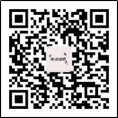

# 第三章 第 3 节 求职攻略指南

> 原文：[`www.nowcoder.com/tutorial/10022/d789f5fe7749496c826014a8f81a358d`](https://www.nowcoder.com/tutorial/10022/d789f5fe7749496c826014a8f81a358d)

# **1****.1** **宝洁**

## **1、校招岗位**

宝洁校招岗位均为管培生，部门有：

·客户生意发展部 Customer Business Develpoment

·供应链管理部 Product Supply

·品牌管理部 Brand Management

·信息技术部 Information Technology

·市场研究部 Consumer & Market Knowledge

·财务部 Finance & Accounting

·人力资源部 Human Resources

·研发部 Research & Development

**申请条件：**2018-2020 年的毕业生

（申请时间一定要关注，2020 年秋招可口可乐的毕业时间要求特别严格，据说因为很多海外毕业生因为毕业时间不符而被刷下简历，所以一定要看清楚。宝洁是所有快消公司中对毕业生的时间要求最宽泛的，“二战”秋招小伙伴们一定要抓住机会）

**岗位介绍和投递链接为：**[`www.nowcoder.com/school/schedule/1517`](https://www.nowcoder.com/school/schedule/1517)

## **2、****招聘流程**

网申及网测：8 月 26 日-9 月 20 日

简历筛选&2 轮面试：9 月底-10 月下旬

Offer 发放及 offer party：11 月初

网申（填写基本资料+逻辑测试）：

第一轮一对一的单面，第二轮是一对三或一对四的二面；今年取消面试结束后的笔试，且没有群面。

这里推荐大家去牛客的行测题库去练一下，行测题目虽然不难，但是考前也要刷一刷，不能在容易的地方绊倒。

行测题库地址：[`www.nowcoder.com/intelligentTest?categories=5`](https://www.nowcoder.com/intelligentTest?categories=5)

**两轮面试的基本构成：**

自我介绍（5min）+两个宝洁八大问的问题（30min）+situation question/behavior question（10min），全程 45 分钟。

关于语言，自我介绍必须用英文，后面的环节看面试官的喜好，如果有国外的 manager 在场，那肯定要全英文面试。CBD 部门的英文要求略低一些，因为日常打交道是中国客户，BRM 和 CMK 英文要求较高。

Behavior question 基本就是问简历，大家把自己简历的每一条都梳理清楚，自己挖掘自己的经历；包括 3why(why this company？why this function？why you？)，对公司的文化、品牌和产品多做了解。

接下来重点介绍一下宝洁八大问和 situation question。

## **3、宝洁八大问**

大名鼎鼎的宝洁八大问，至今仍然贯彻在宝洁的面试中，在第一轮和第二轮的主要部分都是结合简历去问宝洁八大问。下面为大家列举八大问的问题和答题要点：

第一问：Describe an instance where you set your sights on a high/demanding goal and saw it through completion.

举例说明，你如何制定了一个很高的目标，并且最终实现了它。

【问题解析】

考察目的：目标设定能力和执行能力。

关键词：demanding goal + saw it through。

在描述的时候要突出：为什么制动这个目标，遇到了什么困难，怎样去克服的。

第二问：Summarize a situation where you took the initiative to get others going on an important task or issue and played a leading role to achieve the results you wanted.

请举例说明你在一项团队活动中如何采取主动性，并且起到领导者的作用，最终获得你所希望的结果。

【问题解析】

考察目的：团队领导能力

关键词：took the initiative, get others to complete, leading role。

在描述的时候要重点突出：自己是怎样说服他人参加的，在组织过程中有哪些领导力的表现，最终取得了什么样的成果。

第三问：Describe a situation where you had to seek out relevant information, define key issues and decide on which steps to take to get the desired results.

请详细描述一个情景，在这个情景中你必须搜集相关信息，划定关键点，并且决定依照哪些步骤能够达到所期望的结果。

【问题解析】

考察目的：计划性，工作计划能力

关键词：seek out relevant information, define key issues, decide on the steps。

在描述时要完整表现出：你分析处理一件事情的全过程。和第二个问题是不同的。

第四问：Describe an instance where you made effective use of facts to secure the agreement of others.

举例说明你是怎样用事实促使他人与你达成一致意见的。

【问题解析】

考察目的：说服他人能力

关键词：facts, secure agreements。

在描述时应该直截了当，先列出团队成员的不同意见，以及他人为什么不同意，然后逐条以事实进行说服。

第五问：Give an example of how you worked effectively with people to accomplish an important result.

举例证明你可以和他人合作，共同实现一个重要目标。

【问题解析】

考察目的：协调协作能力

关键词：worked effectively with people。

在描述时应该清晰表现出：我的优势是什么，能做什么；合作伙伴优势是什么，能做什么；你们是怎么协作的。

第六问 ：Describe a creative/innovative idea that you produced which led to a significant contribution to the success of an activity or project.

举例证明，你的一个创意曾经对一个项目的成功起到了关键作用。

【问题解析】

考察目的：创新能力

关键词：creative/innovative、significant contribution、success

一定要想清楚为什么自己的做法是“创新”的、和别的做法下相比“新”在哪里，这也是面试官最关注的地方。

第七问：Provide an example of how you assessed a situation and achieved good results by focusing on the most important priorities.

请举例，你是怎样评估一种情况，并将注意力集中在关键问题的解决。

【问题解析】

考察目的：前瞻性，评估专注能力

关键词：assessed a situation, focused on the priorities。

描述应该是着重表现：对当前情况的分析过程，以及解决的方法。

第八问：Provide an example of how you acquired technical skills and converted them to practical application.

举例说明你怎样获得一种技能，并将其转化为实践。

【问题解析】

考察目的：学习应用能力

关键词：convert technical skills to practical application

在描述时应突出：你对该技能的认知，学习该技能的拆解步骤，怎么应用到实践中。

**注意事项****：**

（1）宝洁的面试基本是全程英语（CBD 部门的要求是：英文自我介绍，后面随机使用中文或英文），招聘中要求也是“英语可以作为工作语言”。所以，英语不好的同学要加强口语方面的准备。

（2）注意审题，抓住每个问题的关键词，上文都已经给出。问题只是表象，关键是分析面试官要考察你的哪项能力，对症下药。

（3）大多数问题都要举出具体事例，推荐使用 star 法则（情境 situation、任务 task、行动 action、结果 result），建议每个问题准备两个事例，防止面试官让你再举一个例子。

（4）找几个小伙伴，互相进行模拟面试，或者分享自己的答案。互相交流、发现问题。

（5）重视细节、重视思考过程、轻结果。宝洁八大问的八个问题都从各个方面强调了应试者的各种能力——个人的基本能力、学习能力、认知能力、执行力、对情况的掌握能力、领导能力等。

建议小伙伴们对八大问的每个问题准备两个经历，提前做面试演练，有余力最好用英文准备。面试时可能被打断，面试官偏向深挖感兴趣的点。建议提前想好自己当时具体是怎么做的，以免不知所措。

第一，准备经历时要想清楚当时发生了什么，自己采取的措施是什么，不要用肤浅表面的一句话带过，一定要有细节；

第二，不要虚构经历，面试官一定会发现，面试现场很有可能会对每一个细节追问追问再追问，在面试官狂轰滥炸和巨大压力之下，说谎的人一定会原形毕露。举个例子，如果你说你做了个公众号，那么面试官会现场去搜索公众号并且看每一篇的作者和阅读量，如果有和你说的不匹配的地方，导致面试官怀疑你的案例的真实性，那么你的面试肯定就 over 了。

另外，宝洁对专业没有要求。招聘时根据每个人过去的经历推断未来的潜质，宝洁八大问基本涵盖了宝洁对人才的要求，主要就是 Leadership、Creativity、Communication、Problem-solving 和 Strategy thinking 的能力。建议大家把自己的简历好好地梳理一下，看看每段经历能不能符合公司的要求，然后有选择性地筛选简历的内容。

## **4、情景设定-****S****ituation****question**

Situation qustion 是在八大问这道“主菜”结束之后的“茶歇”，面试官会让你放松一下，聊一聊工作中遇到这些情况你会怎么做——千万不能放松，这个时候是面试官在考察你的下意识处理问题的方式。通过提问一些看起来比较棘手的问题，来看看你这个人到底适不适合做他/她的 team member。

接下来列举一些常见的 situation question：

（1）如何让 Agency（公司的代理机构或者理解成经销商）更好的配合？

（2）作为一个 Junior 的职员，当高层对于一个项目的指导意见与自己不同时，该如何处理？

（3）关于任务突然提前，预计遇到什么问题，如何解决？

（4）你和你的 team 一起做一个项目，你负责 60%，其他人 40%。

（5）如果老板突然说 ddl 提前了 1 个月，而且必须在 ddl 前交，你怎么处理？

（6）现在有一个新想法，但是你感觉你周围的同事都不会太赞同，因为你们已经有了一个非常完善的用了很多年的方案了，你要怎样说服他们跟你一起尝试实施你的新想法？

（7）任务忽然提前怎么办，期间领导派了新任务怎么办？

（8）刚接手工作经常出错怎么办？

（9）你组织的会议大家都不积极怎么办？

（10）怎么说服同事帮助你？

（11）假设 DDL 是一周变成了 2 天，如何解决？

（12）怎么处理冲突？

（13）怎么面对失败？

（14）跟气场不和性格不合的两位同事工作，且面对 DDL，怎么处理？

（15）你的意见和团队里其他人不一样，坚定自己是对的，自己不是 leader，应该怎么办？

（16）你有四个任务铁定要拖 ddl 了，不过一个是一天后 ddl。一个是周后，一个是一个月后，一个是一年后，你现在怎么做？

（17）你现在有一个新想法，但是你感觉你周围的同事都不会太赞同，因为你们已经有了一个非常完善的用了很多年的方案了，你要怎么说服他们跟你一起尝试实施你的新想法？

（18）去年双十一比前年销售额提升了 200%，主管让今年继续提升 200%，但你发现以现有的资源无法做到，会和目标有一个 gap，问怎么办？

（19）主管一定让给一个计划完成 original 目标，而我和我的两个组员已经加班好几天了，而且我不能寻求其他同事的帮助，问怎么办？

（20）你的 boss 有一个非常执着但对公司无益的 idea 你怎样面对？

Situation question 千变万化，这里只是列举了我搜集的一部分。有些问题很可能是面试官当场想出来的，主要用来考察沟通能力，临场反应能力，做事的风格，个人的性格——综合来说就是面试者的情商。

这些问题的答案最好比较稳重、全面、顾全大局，切勿为了彰显个人聪明另辟蹊径。有一些问题会存在一些通用的 principle 和答案，比如说和上司/同事及时沟通、为老板提供替代解决方案、时间管理四象限、寻求他人帮助等等。建议大家多准备一些这样的问题，和小伙伴互相提问，完善思路和表达，面试的时候就会稳妥很多。

# **1****.2** **联合利华**

## **1、校招岗位**

联合利华的部门岗位，校招的管理培训生项目有以下九个部门的岗位：

·客户发展部 Customer Development

·财务部 Finance

·人力资源部 Human Resources

·消费者市场研究部 Consumer Market Insights

·市场部 Marketing

·研究发展部 Research and Development

·供应链部门 Supply Chain

·饮食策划部门 Unilever Food Solutions

·电子商务部门 E-commerce

另外还有布鲁雅尔 Blueair（收购的瑞士空气净化品牌）和生活健康要素品类 Life Essential，招收各个部门的管培生。 

**申请条件：**毕业于中国内地（大陆）高校的中国学生：2019.08.01-2020.07.31

毕业于中国港澳台及海外高校的中国学生：2019.01.01-2020.07.31

**岗位介绍和投递链接为：**[`www.nowcoder.com/school/schedule/2755`](https://www.nowcoder.com/school/schedule/2755)

## 2、**招聘流程**

网申+线上测评+电面+AC 群面+manager 单面

极速网申：8.18-9.29

在线测评：8.18-10.06

视频面试：10.08-11.08

探索与发现之旅：11.25-11.29

## **3、****网申****+线上测评**

U 家（大家一般习惯把联合利华简称 U 家，欧莱雅简称欧家）的网申通过中华英才网进行，全英文。主要是填写基本个人信息，学校专业年级 GPA 奖学金之类的。

在网申过程中开放性问题非常重要，一定要认真填写。除了必填的之外选填的最好也写，保证简历完整率达到 100%。网申之前先了解一下联合利华的基本情况以及人才期望，同时考虑自己为什么想加***合利华。

【注意事项】

（1）由于有字数限制，最好事先自己在 word 里面先写一下。

（2）回答问题时注意分点，要有关键词，注意逻辑性。（AC 面的时候你的 Manager 手里会有你网申所有材料的打印版，所以不能轻视网申）

（3）以往的开放性问题的列举：

·Please describe one attribute of Unilever and Campus Program that impress you most and tell us why?(Please answer in English, 150-200 words)

·Please describe a most difficult and stressful situation your team has ever experienced, and tell what did you do in details in resolving it? (150-200 words)

·Please go through Unilever virtual experience which scene impressed you most and why? (150-200 words)

·Why do you apply for Unilever Management Trainee Program and why do you think you are suitable for the functionapplied? (150-200 words)

·What do you value the most when choosing a career? And how does it link with Unilever? (150-200 words)

2020 年网申不作为筛选的标准，网申后 3 天所有人都会收到线上测评的笔试题目的链接。收到邮件 7 天内必须将在线笔试题做完。线上测评 45 分钟，不能中途离开，有 4 道文字题，每道题字数限制在 1000 字之内。

**联合利华笔试真题地址：**

[`www.nowcoder.com/contestRoom?categories=5&mutiTagIds=2755`](https://www.nowcoder.com/contestRoom?categories=5&mutiTagIds=2755)

“通过测评结果，U 家可以对面试者的认知特点、思维水平和综合理解能力有一个全面的了解（来自联合利华招聘公众号）”。下面是搜集的秋招线上测评的题目，可做参考：

（1）请回忆过去半年内，距离说明你是如何突破自己原定的目标，获得更大的成果？在这个过程中，你付出了什么？和以往的经历有什么不同？（1000 字以内）

（2）举一个实例：曾遇到过什么复杂多变的问题，当时的背景是怎样，你是如何解决处理的这些紧急变化的问题的？请描述具体过程（1000 字以内）

（3）在过去半年里，你是如何面对挑战或者压力不断提升自己，并且带动他人一起成长的？当时的挑战和压力是什么？你具体做了哪些事情起到了作用？（1000 字以内）

（4）请举实例说明，你是在团队中起什么样的作用，你和团队之间是如何互动的？这个团队成立了多久，一起做了什么事情？（1000 字以内）

【注意事项】

（1）紧扣题干

这是所有注意事项里最最重要的一点没有之一,请大家在写答案之前反复多读几遍题目，抓住题目中的 key words，这就是后面“讲故事”或者在描述情景、做法和结果时的“重中之重”。我们都知道考试的时候要看清楚题目到底考我们的是什么，谨记题目的要求，这才是我们辛苦准备的答案最后需要达成的具体目标。

（2）最佳事例

在确定自己充分理解题目后，再从个人的过往经历中选取最佳的事例来回答。

（2.1）什么是最佳事例？当然是事例中的要素都尽可能契合题干的关键点，不说 100%契合但至少做到 80%，剩下的 20%可以通过细节加工来弥补。另外，这个事例的细节要能够充分展现你的优势和亮点。常见例子优先级：实习>比赛或社团活动>科研>学习>生活小事。

（2.2）如何找最佳事例？对于经历比较丰富的同学，可以先把经历中比较符合此题要求的几条经历都先罗列出来，然后根据题干的要求逐个筛选，每道题建议选一个最佳事例，并备选一个次佳事例（选次佳事例的原因是有时候面试官会让你再举个例子）；对于实习或社团经历较少的同学，可以采用“以小见大”的策略，把小事讲好，之前听有小伙伴讲过在实验室做科研和准备期末考试 的例子，这些事例看起来也不算独一无二，但就是有大神可以讲得很出彩。

（2.3）选事例感觉好难？不得不说，对于某些问题确实选事例都不是特别容易，很多人是纠结了很久都感觉找不到太合适的例子。这时候，建议可以先听听身边其他小伙伴的事例获取灵感，再找自己身上有没有类似的经历可以借鉴，反正一个最佳事例确实是要不断打磨才能变成最佳。

（3）游戏化潜质测评

联合利华 2018 年校招是游戏化测评，2019 年联合利华笔试改版，不再考游戏测评，所以这个部分小伙伴暂时可以不用担心了。

## **4****、一面-英文视频/电话面试**

通过笔试后会进入一面环节，联合利华的一面统一采用线上视频面试。通过笔试的求职者会一般都会提前 2 天收到 HR 电话以预约时间，注意是 0411 开头打来的电话。

这一轮面试主要会问一些基本的行为面试问题，对岗位职责的理解等。

**这个环节的主要问题是行为面试-behavior****question****+****简历+**** 3****why**，会随机让你用英文和中文来回答，所以考察口语也是重要目的。是为了之后的 AC 面做准备，所以不要太紧张，做好充分的准备，做自己就好，要真诚的对 HR 表现出你对 U 家的喜爱和向往之情。

这里附上以往出现的一面问题（不同岗位不一样，建议全部准备）：

常规问题：

（1）三个词配一句话描述自己

（2）自己实习经历中有领导力的事

（3）实习的主要收获

（4）近期做过的创新的事

（5）未来新媒体的趋势，特别是对于 HR 部门（针对申请 HR 部门的求职者）

（6）U 家 HR 的作用（针对申请 HR 部门的求职者）

（7）毕业后的职业规划

（8）失败的事情

（9）是否申请了其他快消公司？如果都被录取，选哪一个？

非常规问题：

（1）喜不喜欢运动？

（2）你认为自己小时候是不是一个调皮的男生

（3）假如给你一个机会重新活一次，你最想改变的事情是什么。

（4）怎么看待你的父母？

【注意事项】

（1）自我介绍：因为是提前收到通知，自我介绍中英文两版一定要准备好，好的自我介绍是一个好的开始。

（2）提前模拟：电面前提前进行英文提问的准备工作，最好找人一起练一段时间，这样面试的时候就不会出现说出口的英文很僵硬的场景。

（3）保证网络：选择合适的通话环境，让 HR 能够听清楚你的回答。

（4）STAR 法则：做准备工作时根据问题的类型和方向分点确定好自己答案的核心关键词，回答的时候紧紧围绕关键点；在讲一段经历时使用 STAR 原则；结合联合利华的领导力模型，讲的故事要围绕这个模型中的能力展开。

（5）时间控制：分别做好 1 分钟和 3 分钟自我介绍的方案。一般的问题应该自己掌控一下时间，2-3 分钟最好，不要超过 5 分钟；过程中要注意和面试官的互动，时刻感受面试官的反馈，一旦感受到面试官不耐烦（长时间毫无反应），就要赶快结束自己的长篇大论，避免自说自话。

（6）背景了解：几乎所有的电话都会问到对联合利华以及这个岗位的了解，因此在一面前一定要在这一块做好充分的准备。

（7）逻辑严密：电面问到的比如 why Unilever,why 这个部门,以及 why you 等这类问题最好都用（总+分+总）的形式回答。三点，1.2.3 分点简要论述，最后总结以上 3 点的关键词就是我选择 Unilever 的原因。清楚的逻辑概念+热情+STAR 原则+流利的口语，过电面一般就 OK 了。

## **5****、****AC 面（群面+****一对一单面+案例分析****）**

AC 面的来源：评价中心（Assessment Centres）面试。这是大多数外国公司常用的人才评估方法。评估中心评估不同于传统的纸笔测试和面试。它主要采用群体讨论，文件篮和角色扮演等群体模拟方法，来对面试者的知识、能力、个性和动机进行评估。

（注:文件篮/文件筐测试,又叫篮中训练法，In-basket，也叫公文处理测试。这个测试就是把面试者放到特定的职位或岗位的模拟环境里，面试官提供一批这个岗位经常需要处理的文件，要求面试的人在一定的时间和规定的条件下处理完毕，并且还要以书面或口头的方式汇报解释说明这样处理的原则和理由。是评价中心中最常用和最核心的手段之一。）

联合利华的 AC 被在业内被称为史上最为强大的 AC 面试，也是 U 家整个面试流程中最精彩、最刺激、收获最多的环节，这是一个智商、情商、体能的三重考验。作为一个 businessman，不仅要通过分析解决大量问题，还要学会如何在团队中工作，学会在连续工作中保持精力充沛，AC 面不仅是一个面试，更是一个商场的缩影——官方美其名曰：探索发现之旅。

U 家的 AC 面一天之内要经历 3 轮（有些时候不止 3 轮，可能会有 4-5 轮，但是基本形式就是群面、一对一单面和案例分析三种），从早上 8 点开始历经群面，一对一单面，案例分析，一直到下午 4 点才结束。6-8 人一组，小组协作完成一天的面试，面试官将是 Director level 的人。基本到最后一轮的时候，各路精英都已经筋疲力尽，已经不知道自己在说什么了。

建议：多看些咨询案例，学着自己做 presentation，最好能有其他外企的 group discussion 的经历，毕竟实战的经验是最宝贵的。

### **（1）群面-无领导小组讨论**

U 家的 AC 群面是按照部门分成 6-8 人一组进行，材料是全英文。

流程：45 分钟阅读英文材料。同时，每个人除了共同的 20 页左右的公共案例以外，还有一个属于自己一页的部分。

材料阅读结束，首先每个人按照编号顺序做一个 2 分钟的 pre，陈述一下属于自己的特殊信息。然后开始中文的无领导小组讨论。两位面试官在一边旁听，两位中其中一位将会是下一轮单面的面试官。最后没有做 Pre 的要求。

每年联合利华群面的案例都是不一样且都至少 20 页以上，而且每年参与 AC 面的人都被 HR 要求对案例进行保密，因此网上基本没有详细的案例。可参考以下：

① 推出新产品，要选择原材料、包装、算各种成本、最后出一个完整的营销方案；

② 一家食品公司是不是应该接受生产线转换生产绿色食品的；

③ 一家公司为了进军化妆品市场，要在两家候选公司中收购一家公司。Case 的大部分内容是关于两家公司的情况的，从公司文化，产品线，市场情况，工厂，员工情况等多个方面提供资料；

④ 有关收购方案的选择，有两家不同的日化公司可以收购，确定选择哪一家，风险有哪些，收购以后的措施等等，其中会给出很多数据；

⑤ 某快消公司要推出一个 environmental-friendly 的新产品。案例中会提供各种资料有关于 staff training 的、supplier 的、manufacturing 的、公司选址或者别的问题的、还有很多图表和数据、设计调查的哪些城市对该产品需求高、生产渠道、消费渠道、花费、利润、销售额、竞争对手、市场份额等方方面面。

有 4 个问题：整个过程会碰到哪些问题？如何解决这些问题？设计一个 action plan？该公司要和一个大型超市推销自己这一方案，从哪些点可以说明该公司比竞争对手更有竞争力？

⑥ 一家公司要推出一种环保产品，Case 介绍了不同地方人的环保理念深浅程度，环保产品的潜力市场，原材料的一些情况，一些其他供应链的情况等，问你如何将产品成功推出。

【群面注意事项】

（1）群面要注意注意团队配合度，同时看重你对团队的贡献程度，所以你说话多少不是关键。最主要的是看你能不能为团队做出贡献（这里需要找准自己的定位，Timer 永远是赚的）或者能不能为团队提出建设性意见。不能太 aggressive，但也不能太沉默。一般太沉默会有风险。

（2）阅读材料时间很紧，所以在每页页眉处表明关键词，以便讨论的时候好查找；题目英文，讨论中文，要不要做总结你们小组自己决定；还有最好携带计算器，因为有题目会涉及到包装材料、各种成本的计算。

（3）面试前事先准备一个好的模型，遇到案例时会有一个很清晰的框架，推荐 4P 理论（4P 营销理论是最基本的营销理论，被归结为四个基本市场营销策略的组合，即**产品****-****Product、价格****-****Price、渠道****-****Place、宣传****-****Promotion**，由于这四个词的英文字头都是 P，再加上**策略****-****Strategy**，所以简称为 4P’s）。

（5）有时候会在讨论中间给每人一张竞对材料，5 分钟阅读然后继续讨论。在做竞对分析时推荐用 4P 理论结合自己的产品与竞对做对比然后整合，同时可以注意竞对的市场空白，适时的时候提出一个新点子，会是你的加分点。

### **（2）一对一面试**

U 家的一面是 1v1，面试官一般是 Brand Manager 或者 Senior BM，内容因人而异。

**可以确定的内容是****P&G 八大问**** +****简历+****behavior****question****+****情境问答；**而不能确定的内容，就天马行空了。至于面试语言，也不确定，有的中文面试加一个英文问题，有的就直接全英文了。需要大家表现真实的自己，有热情，有强执行力，抗压，善于交流和团队合作。必须做好各种准备，以应对可能出现的状况。

大部分面试官会一直 challenge 你，任何问题都可能会深挖，引出一连串的问题。因此举例一定要真实，并且是自己很有感触的例子，防止面试官连串的问题。比如，面试官同样问你了 why Unilever，会根据你说的理由再进行追问。回答这样的问题，一定要耐心并且要有说服力。最后会有你问面试官的环节。以下是整理的一对一面试的问题：

① 自我介绍：英文自我介绍；

② 群面评价：包括群面时候的自我评价和队友评价，或者一些补充性的问题；

③ 简历内容：谈下论文的具体内容、社团活动、实习经历中学到什么；

④ 公司/部门了解：用英语谈下自己对联合利华的了解；对联合利华有什么看法；为什么选择这个部门；

⑤ 职业规划：为什么选择 U 家和具体部门的心路历程，要求一直从选专业开始说；你的价值观；你认为一个 manager 应该是怎样的，你有什么特质成为一个 manager；

⑥ 宝洁八大问：是否具备领导力，并举例说明；描述一个场景，其中别人不愿意寻求帮助去完成某事，但你推动事件进程；描述一个场景，大家觉得已经把事情完成得很好了，但你觉得还能更好的；

⑦ 情境问答：假设我是客户服务部的工作人员，目前有一个客户预定了一批某品牌沐浴露今天下单，但这个时候库房说这批货被别人提走了，现在该怎么解决；假设我是产品供应部的经理，某厂家订了一批货，要求在 4 周中生产出 2000 箱某品牌的沐浴液，现在面临的问题是：

1.时值春节期间，生产线员工较少。

2.生产线上某加热元件存在故障，导致生产效率降低，现在联系元器件供应厂家，被告知该元器件暂时缺货，至少一个月后才能进行更换。

3.生产该款沐浴露所用的香料库存只够此次订单量的 70%

请问现在如何解决该问题；

⑧ 关于联合利华，还有什么疑问；

【一对一注意事项】

（1）准备好中英文自我介绍，这一部分是你唯一确定会用到的内容，同样选择一个简单而不俗套的角度开始自己的介绍，不要介绍名字的含义，也不要一味表决心说多么热爱 U 家，最好能够按照三个匹配 U 家特质的能力组织自己的经历，简单明了，加上一些数据和细节来 impress 面试官，并且适当的设置一些小的 hook（钩子），来引起面试官的兴趣，让他追问，引入到你准备好的经历之中。

（2）深度剖析自己的简历，把简历里的每一个点都变成一个故事，要符合 STAR 的原则，说清 situation，task，action，result，要有自己的思考。适当夸张我觉得是每个人都会有的，但不要讲得自己好像救世主一样。任何一个经历一定有不足之处，承认自己做的不好的地方，但是有反思有成长的经历会让你更有价值。

（3）充分了解公司的品牌和简单的背景，面试官肯定不会问你联合利华成立于哪一年，但是面试官可能问你喜欢 U 家什么产品，你肯定不能说你不喜欢任何产品；比如你说很喜欢 U 家的潘婷和海飞丝，那你肯定要说出品牌的特点和定位，面试官不会问你某个品牌的目标客群是什么，但可能会请你为这个品牌设计一个校园推广方法。

（4）请想一想要问面试官什么问题，或许最后没有这个机会，但是带着问题来总是好事。不要问“我表现如何”“公司喜欢什么样的人”“什么时候可以知道结果”之类的问题。以下是一些比较好的例子：

A、结合当下热点——联合利华对下沉市场有哪些特殊的策略呢？私域流量我们有哪些动作？社群营销有没有什么好的做法？ 

B、结合品牌和产品——对**品牌目前定位有什么看法？联合利华的新品净水宝，在国内净水器行业并没有占据太大的份额，如何推进品牌认知？

C、询问公司和部门的具体情况——公司针对新人的培训是怎样的？XX 部门的日常工作是什么？最大的挑战和困难是什么？U 家人生活和工作是否平衡？

D、询问公司对自己的期望和要求——加入 XX 部门需要具备什么样的素质？如何作为一个好的 XX 部门的员工？

### **（3）案例研究-个人****Case Study**

形式：个人 case study + presentation + Q&A

时间：90min + 30min

语言：全英文，但是如果遇到的是中国的面试官也可能一半中文

阅读分析 case 和写板书准备的时间是 90min，一共有两个案例。展示（Presentation）和提问(Q&A)加起来大概 30min。

案例 1 各个部门都相同，案例 2 与所面试的部门有关。

案例 1 一般比较长，大概有 20 多页，包括了各种不同的资料。案例 1 自带四个问题，要把这四个问题都回答出来。在给你案例的同时，会发给你两张 A1 的白纸和记号笔，你可以把你要说的主要意思写在上面，用来帮助你之后做展示。

案例 2 具体与面试的部门有关，问的几个问题给人感觉主要目的是考察寻找资料和分析材料的能力。第二个案例是所应聘部门特有的以考察应聘者在该部门场景下解决问题，分析问题的能力，以财务部为例，会提供许多销售表格，成本表格等等，要求用数据说明附企业推出的产品是否成功。pre 完成后面试官会向你提问。

案例分析之后是 30min 的展示与提问。面试者带着四张白板纸到一个房间去做 presentation。展示为全英文，面试官是中国人。

附整理的 case：

①一家公司要推出一种低糖低脂肪低盐的饼干。Case 有 20 多页，有各种不同的资料，包括政策、产品、成本、财务表现、生产能力、研究报告等等，都是通过邮件，备忘录等形式展现的。case 自带四个问题。其中需要分析大致背景，财务分析，优缺点分析以及下一步的实施计划之类等；

② 关于新产品推向市场，需要多久推向市场，怎么推向市场；

③ 一个项目执行过程中出现了诸多问题，我们要从内外部去分析所有的问题并且推出解决方案。

【Case Study 注意事项】

（1）一定要合理分配好时间，很多时候来不及仔细读每一个地方（当然你英语很牛，那没问题），要有一个对案例大致的了解，否则真的不知道该说什么。准备案例 1 的问题时不要单纯回答四个问题，而是按照公司策略的形式，先阐述决定，然后讨论每种决定的优缺点等等。

（2）如果出现案例阅读时间分配不均的情况时，要对第二个案例有大致的了解来保证做 pre 以及回答面试官问题时知道案例大致的内容。

（3）正如前面所说，面试前多看看咨询的 casebook，以及学习一些咨询如何做 pre 的会非常有帮助。尽量多使用一些表格、路线图以及简单的例如 swot 分析等，这些都会在面试中成为你的亮点。

（4）如果问题多的话，不要只是简单的回答问题，而是要把问题串起来。面试官更容易接受这样的展示方式。

针对一整天的 AC 面，第一个挑战是英文，大量的英文阅读，1v1 的英文 presentation，都会无形中增加压力，这个除了平时的积累，面试前找点商业方面的东西看看也会有点帮助的。

第二个挑战是团队，以往的面试中，小组面试只是一个环节，如果遇到特别强势或者不喜欢的人，最多就是一个环节。可是在 AC 中，6 个人既是竞争者又是合作者，学会与大家相处，学会协调人与人之间的关系就尤为重要。

第三个挑战是逻辑，大量的文字、数据、时间、任务摆在面前，要理清先后次序，用数据支持观点，用事实说服他人，大声说话和抢着发言并不代表你是 leader。

第四个挑战是心态，高强度的面试，往往会让引起面试者的高压力，进而造成不理想的表现和发挥，有几个建议给大家，不要过多关注面试官的反应，不要过多在意已经过去的面试环节，不要过多估计最终的面试结果，focus on 接下来自己可以努力做好的部分。AC 作为一个全面的考察方式，一定不会因为你的一点点失误否定你，同时也要相信面试官足够专业到捕捉你身上的闪光点。

# **1****.3** **百威**

## **1、校招岗位**

百威的校招是项目制，具体分为四大项目：

·百威全球管理培训生 GLOBAL MANAGEMENT TRAINEE，简称 GMT

·百威供应链与物流卓越人才项目 SUPPLY & LOGISTICS EXCELLENT TRAINEE，简称 SET

·百威销售管理培训生（红星）SALES MANAGEMENT TRAINEE（RED STAR）

·百威信息技术及业务运营共享服务部门管理培训生 SOLUTIONS MANAGEMENT TRAINEE （IT 新技术及大数据项目、商务数据分析、财务、物流、人事共享服务）

## **2、招聘流程**

百威的校招非常漫长，网申&在线测试，视频测试，商业模拟，领导力评估，终面。商业模拟算是三轮，加起来一共八轮面试，也就是传说中的“天龙八部”。

但是百威的 GMT 含金量（薪资）也非常高，高达 17.5K，藐视宝洁和联合利华。能够通过百威六轮面试的同学，真的值得尊敬。

百威的面试地点安排在北上广三个城市，截止时间和面试轮次也不一样：

网申：8 月 23 日-10 月中旬；

在线测试：10 月中旬截止；

商业模拟：10 月中旬-11 月上旬；

评估中心面试：11 月 11 日-22 日

终面：11 月 28 日-29 日（之前还会有电话面试，18 年开始取消了）

## **3、网申&在线测试**

网申通过之后，笔试会自动发到所在的邮箱。语言可以选择是中文，默认是英文的，可以请按自己偏好来选。一共 10 题，每题 2 分 30 秒之内完成，不可以回头。

中文的优势：熟悉的语言，反应较快；中文的劣势：有的时候绕；

英文的优势：逻辑很明确，但是碰见新题的时候可能会有点紧张

笔试题库地址：[`www.nowcoder.com/contestRoom?categories=5`](https://www.nowcoder.com/contestRoom?categories=5)

【注意事项】

（1）笔试题库非常有用，一定要先看之前的题。题目重复出现的机率非常高，甚至会 e to the next。

## **4、视频测试**

今年的视频面还是八个问题，有三次录视频的机会，准备好自己想要说的内容大胆去讲就好，偶尔卡壳了不满意可以重新录一遍。整理的八个问题如下：

（1）Introduce yourself and why you think you are a good fit for the job? What have you achieved so far?

（2）Give a situation you lead a team from very different backgrounds and what have you do?

（3）Describe a situation in which you came up with an innovative key strategy or plan for a problem/challenge?

（4）What is the biggest problem or challenge you see for the beer industry?

（5）Real exampleof a time when you were assigned to lead a new project in a team, country, or environment you were not familiar with. How did you feel?Describe the situation, your actions, and the outcome of the situation

（6）Describe a situation when you had toact strictly in accordance with a policy/process/role even when it was not convenient for you

（7）A  real  example  of  a  time  when  you  were  assigned  a  very  difficult &nbs***bsp;challenging  project,  and  your  team members or supervisor were very tough on you.

（8）How ambitious and competitive you are? what's the most ambitious goal that you have ever set for yourself where you had to compete with others to succeed?

这里还是建议大家最好还是认真对待，做好 homework 形成一个有逻辑有条理的稿子，好好练习不要浪费机会，毕竟这是最稳定最能掌握在自己手中的一大关。

## **5、商业模拟（business****game）**

这里的商业模拟包括三个环节：Case 面 + business game 商业游戏面试 + face to face 面试。

### **（1）****C****ase****面案例分析**

**流程：**

首先，带好身份证和照片注册，到一间房等着，然后被带到一间房做 case 分析，全英文，11 页 45min，但是不用怕，时间够用，关键是条理清楚。现场有笔和计算器，最好带个手表。接着 45min 结束后会有人领着去面试官那里，八分钟英文陈述，包括选择产品、计算以及 market plan，最后 Q&A 7min，面试官根据你的讲述提问，可能会问一下某些量的计算过程。

**案例内容：**

你是新产品的经理，过几天要给老板（COO，首席执行官，也是面试官要扮演的角色）进行工作汇报：需要完成俩任务：

（1）八种备选啤酒里选两种在明年推出；

（2）给这两种产品设计市场方案（要求具有创新性），目标是实现净收益增长；挑选的根据是三条：生产能力、市场份额、利润；

【注意事项】

（1）运用“金字塔原理”，先说结果然后说原因。阐述原因的时候体现出你的逻辑性以及框架。（金字塔原理简单说就是，任何事情都可以归纳出一个中心论点，而此中心论点可由三至七个论据支持，这些一级论据本身也可以是个论点，被二级的三至七个论据支持，如此延伸，状如金字塔。大家可以去看《金字塔原理》这本书，是顶级咨询公司麦肯锡的经典培训教材，这本书会仔细讲解如何在表达、思考、解决问题和演示中运用金字塔原理，让你成为逻辑致胜的人）

（2）除了 case 的信息，忘记你所有已知的知识，答案从 case 中来，所有的方案都要 data driven。

（3）草稿纸在最后的 presentation 环节会成为你的笔记，所以建议不要写的太乱，最好能初步想好 Pre 的 outline 写在草稿纸某一个空白处，到时候就看着这个说。

（4）如果对英语不是很自信，可以讲的稍微慢一点，以让人听懂为主。数字都很大且不是整数，不太好读，提前想想怎么表述简洁又舒服。

（5）做案例的时间是比较紧的，没有案例经验的同学强烈建议自己先做几个练习一番。

（6）准备工作做足，包括解题的思路和 MKT 的方案。面试前把解题思路理清，其实无外乎也就那几种，确定目标、将目标确切化、满足要求、进行匹配，重要的是突出自己解题时的逻辑性。材料里要求 MKT 方案不要是传统的 TVC，广告牌，宣***之类的，而是要求创新性，这是可以在面试前思考的。

至于创新的 MKT 方案哪里来，大家可以去网络上搜索品牌最新的动作和趋势，多看社交媒体上的营销热点，总之就是多听多看多思考多总结，功夫下在平时。比如说让完美日记成为黑马的社群营销，就是突破传统思路，抓住私域流量逆势而行异军突起的案例，大家可以去研究一下。

（7）information 可以分成两类：

·数据，例如 net revenue/profitability/MKT share/cost/sales 用于客观计算，选品，核查是否满足数字上的要求。

·主观信息，比如 TA age/competitors trend 等，用于主观推断，筛选产品，计划 MKT plan，建议发现需要的产品需求后从备选单里划出了符合 TA  age/seasonal  trend 等要求的产品，然后稍微加一下看看哪个组合能最大限度满足客观数字上的需求，基本就能得到答案了。这个方法逻辑上更加合理，毕竟这个 case 的目的不是让你快速算很多组数字然后找一个合适的，主要是考验商业思维，而加新品首先要考虑的肯定是先看产品而不是先看产能。选出最适合的产品再看看哪些组合能符合产能才是 business thinking。

（8）be confident,这道题没有完全正确的答案，客观数字符合的选项可能在产品特点这类主管信息上可以被 challenge，产品特点满足要求的可能客观数字不能完全 meet the needs。面对 challenge 你觉得有道理的就承认，觉得面试官没考虑周全的你也可以解释。

### **（2）****商业游戏****面试**

商业游戏 HR 会介绍游戏规则。下面举两个商业游戏的例子：

**案例内容 1：**

有 4 名自告奋勇的 Leader 作为 4 个公司的 President，之后其余同学进行各自加入的方式加入到这 4 个公司并担任不同职位：Sales&Marketing，Finance& Supply Chain。最后一个部分是一个综合参数，和销量，市场份额以及相关投入有关。分完 4 个组后，游戏开始，全程英语，每回合讨论，交流，阐述自己意见。根据彼此公司不同的各种定价策略，市场投入等会有不同的结果。

【注意事项】

你的结果不仅仅由你小组当回合的决策决定，也和其他小组有关。所以如果你觉得为什么一直提升定价但是 Profitability 就是上不去，看看其他小组吧。总体上还是以小组为第一目标，不要因为自己负责的部分不够好就一直过度强调，如果你们小组齐心协力的话，自然会帮助你的，所以彼此体谅解决当回合最需要解决的问题是最重要的。

**案例内容****2****：**

4 人一组，每组 2 个顾问，进行 4 轮模拟，代表 4 个季度，每次都会把每组的 decisions 收上去然后很快出模拟结果。前两轮英文，结束后对顾问给一个英文 pre，阐述自己组的逻辑，反思，和后两轮想要采用什么战略提升模拟结果，之后两轮允许用中文加快讨论进度。任务就是根据 case 信息去讨论决定生产哪几个牌子，在什么渠道投放，每个牌子的啤酒要在这一季生产多少等等。

【注意事项】

（1）不要猜最后的结果是怎么算的，也就是电脑里那个终极公式。这个游戏不是考这个，而是你要 justify your own logic，所以答案根本就不在那个电脑里。

（2）整个运算过程是跟 case 高度关联的，虽然不会给你最佳的（可能并不存在最佳？）运算方案，但如果你只是在猜数字，说明一定有 case 信息被你忽略了，这时候不妨跟队友多交换下意见，回头再看看 case 是不是能拾起来灵感。

（3）顾问虽然表面上来看是来考核你的，但真的不是你的敌人而是朋友，整个过程每轮之后都需要和顾问有交流，必要的时候可以向顾问寻求帮助。

（4）之后的 face to face 会考验你自己对于这个游戏本身+合作过程的想法和反思。所以，还是那句话，真的去体验了去分析了才会有东西可讲，而不是执着于数字或排名。从惨烈的战况中挣扎出来的楼主有一个建议：就是或许可以思考一下，这是个模拟游戏，它到底在模拟现实商业活动中的什么？也许带着这个疑问大家能更跳脱出复杂的数字，去以一个更高层次，也更实际的眼光看待它。

### **（3）****F****ace****to**** face****面**

在通过 case 面之后会进入 Face to face 面试（简称 F2F 面），语言为全中文。时间为 40-50 分钟，形式为 3 对 1。

会让你评价刚刚在 business game 中的表现，其他可能的问题有：

① 用什么词描述自己

② 与其他申请者相比自己最突出的能力是什么，举例子。

③ 申请的其他公司

④ 如果咨询公司和 FMCG 同时给会选什么

⑤ 手里已经有 offer 了，会不会不如其他竞争者那么有动力

⑥ 最能体现自己强项的例子

⑦ 最大的缺点

⑧ 他人反馈

⑨ 失败例子

⑩ 创意解决问题的例子

⑪ 宝洁八大问

⑫ 愿不愿意去二三线城市

⑬ 来自别人的负面评价

⑭ 最喜欢的产品

⑮ 举一个成功的营销案例

## **6、领导力测试**

leadership test，类似于 pwc 的小游戏。有几个环节真的是比较难，考察瞬间记忆。建议多刷一下题库再去做。

注：pwc 游戏测评可见《第一章 金融行业求职攻略》

## **7****、****Final Interview**

形式：5V5，有 2 个老外，3 个中国人。气场还是比较严肃，5v5 是对桌坐的，靠得很近。

问题：整体的气氛比较随意，不是结构化的问题，比如你喝酒频率，去年喝过的新的酒等。最后还会有一两个营销方向的问题，比如营销方案、新品推广、危机公关等等。 

以下是某一年的数据：进终面是 110 人，最初简历收集是 13000 多人，但最后也还是只要 20 人。因此进了终面也不能松懈。

【注意事项】

（1）准备经典的 3Why，公司原则，文化，品牌了解，最好看下去年年报和市场份额以及近期的有关百威的新闻都需要准备。

（2）准备好一个流畅的自我介绍+对每一个值得骄傲的自我经历的深刻反思+想清楚为什么要来 GMT 项目以及希望自己成长为什么样的 GMT。

（3）问题不多，分到每个人的机会也不多，有想法务必要说，要表现，大概 10-15 分钟的样子。

（4）因为每个人分到的时间就很少，自我介绍显得非常重要。最好能把百威的 principle 放在介绍里。

# **1****.4** **玛氏**

## 1、**校招岗位：**

·玛氏校招综合管理培训生项目 Mars Leadership Experience Program

·职能管理培训生 Functional Leadership Experience Program，分为三个子项目：

·销售管理培训生（Mars Sales Leadership Experience Program）

·供应链管理培训生（Mars R&D Leadership Experience Program）

·研发管理培训生（Mars R&D Leadership Experience Program）

·玛氏箭牌供应管理培训生和玛氏皇家供应管理培训生

**申请条件：**毕业时间在 2019 年 12 月-2020 年 7 月之间、且截止 2019 年 10 月累计全职工作不超过 12 个月，都可以参加 2020 玛氏秋招

## **2、校招流程：**

玛氏校招流程如下：

网申：8 月 27 日-10 月 14 日

线上笔试：10 月 12 日-10 月 16 日

AI 面试：10 月 21 日-10 月 23 日

小组面试：11 月 4 日-11 月下旬

最终面试：11 月中旬-12 月初

录取通知：11 月底-12 月初

## **3、网申**

玛氏箭牌的网申与其他快消公司的差别不大，唯一的区别在于每位申请者至多可以同时申请综合管理培训生、销售培训生、技术培训生三个项目。各个项目网申成功后，可以同时分别进入筛选，三个项目的笔试、面试时间完全不会产生冲突，在进入测评中心前申请者再进行职位的最终选择。

申请者至多可以同时申请 3 个职位，并要按照自己的意愿进行排序；工作人员将按照志愿顺序进行筛选，如果第一志愿未能入选，则自动流转到下一志愿。

在网申的筛选流程上，玛氏箭牌不会因为申请者学校背景而进行刷人，更多的是看申请者的综合实力。

## **4、线上笔试**

玛氏笔试题型分成 3 大类：

| 题型 | 时长 | 题目数量 |
| 数理测试 | 30min | 30 |
| 英语听力 | 30min | 23 |
| 英语阅读 | 20min | 15 |

正式测试阶段，每答完一种题型都可以退出休息，系统会保存作答记录。同学们可以灵活安排笔试时间。不过，每种题型都要一次做完。听力和阅读的难度还是比较大的，小伙伴们还是要多多练习。最好提前在牛客网笔试题库进行练习。

**笔试题库地址：**[`www.nowcoder.com/intelligentTest?categories=5`](https://www.nowcoder.com/intelligentTest?categories=5)

## **5****、A****I****面试**

笔试过后是英语口语测评，要求对一些话题进行谈论并在线录音，准备时间还是比较充分的，总共有 30 分钟。

去年的 AI 面试是中英文内容题目大致如下：

**英文部分：**

**·**30 秒自我介绍；

·为什么要投递这个岗位（比如可以从自我评价和公司岗位两个方面来说，自我评价可以讲自己适合 sales/marketing 的特质和经历，公司岗位可以讲一讲轮岗机制、公司文化，再加一句总结玛氏是自己所爱）

**中文部分：**

**·**介绍一个项目/活动的背景，还有取得的成绩。

·追问 180s： 你是怎样团结、凝聚你的团队。

·追问 180s: 你是怎么分工的。

·追问 90s：这道题有 15s 的准备时间，问你觉得下次再办这种活动有什么需要改变的吗？

总的来说不是很难，但是没什么思考时间，所以回答很容易干瘪。大家最好可以提前准备，确定好大致答题的框架，考试时遇到题目直接套即可。考试时最好的一气呵成，避免重复录音造成后面的题目没有时间完成。

口语的胜决在于你要不停的说不停的说，不会根据你的内容含金量来打分，考的是你的语言组织能力，词汇量和流利程度，所以只要能扯就尽量扯，千万不要让时间空着就行。

推荐大家使用牛客网 AI 模拟面试系统进行练习，真实体验面试场景。

**A****I****模拟面试地址**：[`www.nowcoder.com/interview/ai/index`](https://www.nowcoder.com/interview/ai/index)

## 6、**小组面试**

面试流程上，综合管理培训生面试流程为：小组面试（包含一个群面和单面），评估中心面试（小组讨论+Personal Case Study+单面）。

不同城市会在时间和面试场次上有所调整。

### **（1）群面**

群面形式：无领导小组讨论

**案例材料：**

官方信息说是英文，实际中也可能会出现中文，一版 A4 多一点，一人或两人看一份。提供笔和草稿纸，不能在材料上划。每间考室的案例都不一样，换言之每年考题也肯定不一样。但不同考室的案例也都相同点，就是会有大量的细节描述，大量的数据，各种成本金额等等。因此对于提炼文章信息的能力一定要锻炼，不然肯定会被搞晕。

有两位 HR 考官，简单介绍一下流程就会开始，8 分钟阅读材料，40 分钟讨论，2 分钟 Pre。有些场次开始前可能会有 30 秒的自我介绍。两人一份材料。

曾经出现过的案例：

（1）学校有一定金额的钱，要赞助一个学生。每个人会拿到不同背景的学生，通过讨论最后达成一致，推举出一个学生。

（2）公司内部争 priority：A 体育用品公司最近在一线城市的业绩下滑，但是 B 公司业绩上升，而且整个体育用品市场的行业也是业绩上升的情况。要求 a.分析原因；b.给出对策；c.将对策细化。

【注意事项】

（1）讨论框架或者标准，去争取这项工作的主导权；

（2）未必要绝对推销你的东西，永远记住，这是一项团队协作，要的是群体方案。但要能发现自己方案或者自己东西的不足，适当提一下，自己不坚持的理由；

（3）善于找到辅助你们讨论的东西，比如白板；

（4）Be reasonable and professional。任何建议、措施都要给原因。给出的原因可以反映出：个人知识背景、对材料的熟悉程度、个人的 business mind。这些也反映出这个人的 professional 程度，决定了“说没说到点上”，而且很难在短期内提高。

（5）Be contributing and stand out。单纯追求和谐是没有意义的。队友提出的建议，表达支持或反驳，同时要问清原因、动机、可能的坏处和风险、预期的结果、确认可行性。其实而且每一个部分都可以 argue，具体要不要 argue，argue 哪一点，that shows your judgment。

（6）要主动充分表达自己的观点，然后努力说服别人，如果遇到别人的反驳要学会捍卫自己的观点。

It is your responsibility to defend yourself. Don't give up yourself too early。

自己充分表达并且捍卫自己的 opinion 的同时，考虑整个团队的利益，be reasonable, in this case, negotiable.。同时，我觉得，主动让步只有在时间紧迫或者对方的建议同样有理由而且过于坚定不肯退让的情况下才算是智慧，否则是一种软弱不自信的表现。

从整个流程来看，如果大家太和谐就没有闪光点，要 challenge 别人或者 be innovative。如果自己和别人僵持了，可以坚持，可以谈判，可以让队友给第三方意见，要推进讨论行程。

如果两个队友僵持了，主动的调解，推动团队进程，这也是加分的。有时候如果有些队员跟不上节奏或者胆怯不说话了，要主动问一下他们的观点，just try to make sure everyone is contributing or at least on the same page。

### **（2）单面**

形式：HR 一对一或一对多半结构化面试，全英或者中英夹杂都可能出现

单面问题汇总：

① Why Wrigley？

② Why sales

③ Introduce your family.

④ 深挖实习经历，会问的特别细致

⑤ 遇到最困难的事情是什么？

⑥ 最自豪的事情

⑦ 最成功的事情

⑧ 了解的玛氏箭牌的一款产品

⑨ 评价昨天群面的情况

⑩ 你想如何改进

⑪ 你对群面过程中哪位队友影响最深

⑫ 最沮丧的经历

⑬ 如何理解这个岗位

⑭ 为进入玛氏箭牌做了哪些准备

⑮ 为什么要选择这个城市

⑯ 最成功的事情/最失败的事情

⑰ 未来的职业生涯规划

【单面注意事项】

了解玛氏的价值观，弗瑞斯特·玛氏的管理风格是这家公司的根基。他的想法已经正式成为该公司的管理哲学，称为玛氏公司的五大原则，这些原则写在一本手册上，所有玛氏公司的办公室都有这本手册。这五大原则是整个公司运营的核心，也引领着玛氏成为当今全球最大的食品企业之一。这**五大原则是：**

**品质（****quality）、责任（responsibility）、互利（mutuality）、效率（efficiency），和自由（freedom）。**

品质：“顾客至上”是我们的信念；保持高质量是我们的工作；令产品物有所值是我们的目标。

责任：作为个人，我们要求每一个人各尽所能；作为同事，我们支持其他同事各尽其责。

互惠：互惠就是分享利益；可以分享的利益才会持久。

效率：我们充分利用一切资源，绝不浪费；务求人尽其材，物尽其用。

自由：我们需要独立自主来塑造我们的未来；我们需要利润来保持独立自主。

面试前梳理自身经历时可以往这五个方面靠拢

## **7、最终面试**

终面分三轮，第一轮是小组讨论，（但是比一面的小组讨论案例更复杂，队友水平也会明显提高很多），第二轮是单人 Case，要做一个案例分析并展示，案例分析涉及的信息量大，想要表现的好平时要做相关练习，第三轮是 2V1 的单面。群面和单面前面注意事项有给到大家，下面重点说一下 Case。

Case 最关键是财务分析，需要全面考虑，题目也会提示重点分析财务。对学会计的申请者会容易很多，一个小时分析，答题，A1 的大纸，随便写。之后收走，然后每个人 20 分钟 pre，10 分钟自我陈述，10 分钟答辩。

个人的案例分析是考验你发现、分析、解决问题的能力，当然还有你的表述能力也是考察的重点。如何在 presentation 时，将你的 framework、main point、solution、recommendation 完整的表述，是值得好好思考的问题。

【Case Study 注意事项】

（1）注意关键信息，不要漏读；

（2）考虑问题时尽可能和全面涵盖到各个方面；

（3）面试之前可以多刷 casebook；

（4）用数据 support 你的论点。

# **1****.5** **欧莱雅**

## **1、招聘岗位：**

欧莱雅管理培训生项目是针对高校应届毕业生而设立的为期 12 个月的项目。工作地点：上海（总部）苏州（工厂）宜昌（工厂），工作岗位有：

·市场与数字营销 Marketing & Digital

·新零售 New Retail (Offline Channel & Online Retail)

·信息技术 Information Technology

·创新与研发 Research & Innovation

·视觉陈列 Visual Merchandising

·生产与运营 Operations

·人力资源 Human Resources

·财务控制 Financial Controlling

**申请条件：**

全日制本科以上学历高校应届生

毕业时间：2019 年 8 月 1 日-2020 年 7 月 31 日（以毕业证时间为准）

**岗位介绍和投递链接为：**[`www.nowcoder.com/school/schedule/2426`](https://www.nowcoder.com/school/schedule/2426)

## **2、招聘流程：**

网申选拔：8 月 23 日-10 月 20 日 23:59（同时期进行校园宣讲会 Call out 选拔）

英文短视频选拔：10 月 23 日-10 月 25 日 23:59

Skype 视频 HR 面试：11 月 4 日-11 月 20 日

终极决选 Selection Day：12 月上旬

发放录取通知：12 月中旬

## **3****、****C****all****out**

什么是 CALL OUT？这是欧莱雅在校园宣讲时设置的现场即兴辩论的环节，会发放跳过网申的 pass 卡，直通 Skype 面试。这个类似于奇葩说的 1V1 现场辩论，一方面增强宣讲会的现场氛围和人气，一方面给选拔中那些有胆量、不怯场、口才好、逻辑清晰的人一个机会，免网申直通面试环节。

2019 年的行程安排是在 9 月-10 月，安排了四川大学、南开大学、武汉大学、浙江大学四所大学。“Call Out 经历三次迭代，态度表达、态度交锋，再到态度碰撞，形式在变，但展现真我的态度始终不变”。

公共场合演讲和辩论的技能在工作中确实是必不可少的，欧莱雅通过这样的形式告知广大同学们：有勇气，敢于表达自己的态度的人，是欧家欣赏的面试者。所以喜欢这样的形式的小伙伴可以参加一波。

规则介绍：参赛者需要进行自我展示和 Call out 两个环节，每个环节胜出，分别计 1 分（自我展示和 Call Out 形式不限）自我展示以提前准备好的二字中文词语为主题，进行 120 秒态度表达。他人完成表达后，可以就该话题发起 Call Out，进行 120 秒即兴态度碰撞，双方完成陈述后，由 HR 选出获胜方，计 1 分，最终获得 2 分，进入优胜候补。每位参赛者只能 Call Out 和被 Call Out 一次，若无人 Call Out，则留局待定。

活动预约方式：

（1）校园创想家报名：寻找四座 Call Out 城市的校园创想家、获得你的活动名额。

（2）宣讲会现场报名：四座 Call Out 城市校园宣讲会可以现场报名，同学们记得携带简历参加。

（3）微信小程序线上预约：在活动预约页面选择 Call Out 进行线上预约，预约成功后会收到短信通知。

## **4、网申+****30****s 短视频**

除了 Call out 这种比较“激烈”的形式，相信大部分同学还是会走上常规的网申道路。欧家的网申在秋招中简直是一股清流，没有图形逻辑题，也没有性格测试，简单大气清爽。基本上是分为两个模块。主要需要填写一些个人信息，和三道简答题，与你申请的岗位和之前的经历相关，大概 150 字左右。

（1）对于新零售的见解（对于选择了新零售的同学的问题）；

（2）关于对 Loreal 的 tech 美妆概念的想法；

【网申注意事项】

（1）这些内容还是比较专业的，需要提前去搜集一些行业知识和公司信息，比如说“新零售”，比如“tech 美妆”，最好能够做到有分析，有实际案例，逻辑清晰；

（2）建议微信网申的时候优先填完基本信息保存，然后慢慢熬后面的 OQ，熬出最完美的那一个答案；

（3）千万不要最后一天再提交，最后一天提交人太多服务器不一定那么顺畅。所以要保证自己的信息提交准确无误的话，安排时间整理语言是一方面，同时切不可拖延，完成好自己答案提交即可；

（4）对待 OQ 就要像对待学校的试题一样，先仔细审题，看清问题的具体内容以及需要你作答的几个关键点。

欧莱雅和其他家的面试都有一点区别，他会在网申过后要求录制一个 30s 的英文短视频，话题是由欧莱雅自己定，会发送邮件通知。全英文的短视频，大家一定要好好准备，平时多练练发音，如果你开口就是英伦腔，面试官肯定喜欢你。

这里应该大家是统一的问题，比较 general，考察一下大家在 30s 时间内输出的信息和逻辑，建议是提前确定主题+框架+关键词，录视频的时候可以录到自己满意为止。

## **5、视频面试**

根据欧莱雅今年发布的招聘流程，短视频后是 Skype 视频面试环节，面试官是 HR。从 1000 人中挑 150 人进入 selection day，大概持续 20 分钟左右。这里的视频面试基本上都是英文，所以大家一定要多练口语。

视频面试的问题基本是常规问题，总结起来就是：

**简历+行为面试+宝洁八大问+****3** **why+公司品牌产品相关+市场营销相关**。大家在准备的时候把这些都准备到，应该就没有什么大问题。接下来是汇总的最新的视频面试问题：

① 自我介绍

② 课题/毕业论文相关？

③介绍一下 cv（简历）上没有的内容？

④ 你的职业规划？

⑤ 遇到的最大的挑战或成就？举一个领导力的例子？

⑥ 让你觉得最有创意的一个营销是什么？

⑦ 分享一个你大学毕业以后做的有挑战的项目，你从中学到了什么？

⑧ 实习过程中印象最深的一次经历是什么？实习或者活动中最让你不舒服的经历？

⑨ 你从所有实习中学到最重要的东西是什么？

⑩ 最近 2-3 个月的一个购物体验？

⑪ 你对于 marketing 的了解是什么，问了一下你为什么适合和选择 marketing？

⑫  why 欧莱雅、why 新零售、why FMCG 管培生？

⑬ 自己有什么特质能够留在欧莱雅？

⑭ 对欧莱雅的理解是什么？欧莱雅的公司文化是什么？

⑮ 感兴趣的品牌，为什么选择这个品牌？

⑯ 用过欧家什么产品？和别家产品比起来有什么不一样？

⑰ 从 marketing 的角度，最喜欢欧莱雅的哪一款产品？

⑱ 最近看到的好的新零售案例？

⑲ 加入欧莱雅想做的事情？你想为欧莱雅带来什么？

⑳ 对品牌联名的看法？工作地点的偏好？你有什么问题？

【注意事项】

（1）网申通过后会有 HR 电话给你预约面试时间。然后会提供一个模板给你去进一步完善信息后反馈给他们（这个信息的完善很重要，你的面试题目，你可能会被哪个事业部看上，都通过你完善的这份简历，会有不同事业部的 HR 来面你）。

（2）到时间请提前准备好上线(因为有可能提前半个多小时打电话来)。HR 会和你聊一些东西去进一步看看你是不是欧家需要的人。

（3）面试之前再看一遍网申的 OQ，会有一部分问题是对网申的 OQ 继续深挖（比如说新零售的问题，既在 OQ 中出现，又在视频面试中出现）。

（4）在面试地点的选择上，个人建议可以找个网络通畅且光线不错的地方即可，让 HR 可以清楚的看见你的形象，提前测试好光线，角度，和声音视频设备，不要过于随意即可。

（5）保证自己的形象是干净整洁良好的，然后提前了解一下欧家每个事业部的不同品牌的品牌理念。

## **6****、****Selection Day**

通过 hr skype 面试的童鞋们就会收到 selection day 的邀请，也会加入到微信群聊，很多关键信息都会在群里分享，有问题也可以直接和 hr 小姐姐们对话，非常贴心高效。每个 MT 岗位大约剩下 150 人左右，群面 team 一般是 6-10 人的规模。Selection day 一共两天，面试流程一共有三项。

第一天上午是 optional 的欧气加油站，算是预热，提前了解欧家的品牌、事业部等，可以在拼手速环节中得到上台机会。只要参加欧气加油站的童鞋们都可以获得盲盒抽取的机会，有好多欧加旗下品牌的小礼品。早上在签到的时候大家已经被分配了编号，并且分好组了，可以和现场的 HR 聊天，也可以提前召集群面的队友相互了解，帮助下午的群面环节更好地合作。

### **（1）****impress jury****（让面试官天团记住你）**

30 分钟的 free talk，因为每个人已经分好了品牌和事业部，HR 和相关品牌的 manager 会在周围旁听或者提出建议。这个环节非常自由，需要组员们自己定一个话题，展开三十分钟的讨论，尽情分享自己的观点。

### **（2）两个****case 分析**

2 个半小时的小组讨论分上下两场，第一场的 case 稍微短一些，小组讨论后可以进行展示，人数和形式自定，记得不要说废话，尽量控制时间，输出有效信息；

第二轮是一个完整的 case study，每组会抽取相应的产品，资料并不多，讨论完全可以自由发挥，有很多空间。这时候就需要大家发挥想象力和生活中平时积累的素材。讨论的时候各个房间的 jury 都会走动，各个品牌的小哥哥小姐姐也许会 pick 你，所以 be yourself，清楚地表达自己的观点，focus 在 case 本身，完成这个 case 的问题并好好 present 是唯一的目标。

HR 和 manager 们分享的建议是：一，不要单纯地去套模板，一定要结合 case 实事求是的分析，我们当时因为人数比较少思路比较受局限，导致最后 pre 的内容不够完善也不够 organized。二，不要因为时间紧、压力大都忽略了关注别人的想法，对于小 team 来说容易达成一致更容易全员跑偏，听取更多人的想法才能避免“思路受局限”的情况出现。

另外，L’Oreal 的安排格外贴心，外地的同学有统一的宾馆住宿，并报销来回的车票机票。

### **（****3****）群面**

群面各个组有五个面试官，分别来自不同部门或品牌你所应聘的职位。群面留下的人很少，和快消行业的群面一样，最残酷的一环。去年群面的题目是：

你可以选择 L’Oreal 已有的品牌或其他设计师品牌的香水在网上进行销售，你会选择哪个品牌，并给出完整的市场营销方案，45 分钟讨论，15 分钟的 pre。

在群面结束后，都会有一定的时间进行发言提问。群面结束后，每个人需要根据分工进行 1 分钟的英文陈述。需要注意的是，如果面试时有国外考官在场，则需要全程用英文进行讨论总结，每年的形式应该也是不一样的。

**群面题目举例：**

① 超市最近在促销和调整货架期间，作为 loreal 的 sales，你需要说服超市进购 loreal 的一个新品牌产品，并且要长期合作，这个品牌知名度很小但是 loreal 公司却十分重视。

② 为某款男性美白产品选一个虚拟代言人并设计广告，可选对象有西游记里的唐僧、红楼里的宝玉、水浒里的武松、三国里的张飞。需要给出有创意的策划。

③ 双十一欧莱雅有线上和线下招聘活动，线上会员 100w，线下 400w，线上会员年轻，线下会员年纪相对大。请问我有 400W，为取得利益最大化，如何分配如何营销？

④ 超市最近在促销和调整货架期间，作为 L’oreal 的 sales，你需要说服超市进购 L’oreal 的一个新品牌产品，并且要长期合作，这个品牌知名度很小但是 L’oreal 公司却十分重视。

⑤ 某产品在美发沙龙的进货渠道以及天猫渠道的售价不同，导致沙龙方面想要降价，我们如何才能既不打折又不失去这个客户。

⑥ 把组内某一个组员包装成一个求职品牌向企业销售。

⑦ 你是销售代表，现在要跟一个超市的采购经理沟通，让他们在新年主通道上放欧莱雅的产品，应该做什么准备工作和如何说服他。

⑧ 有一种新产品，一个月之内达到销售额，有一些资金去做宣传，你们怎么制定营销计划。

⑨ 一个品牌的矿泉水新上市，为了提升品牌知名度和销量，请策划方案，用一个月的时间，让这个品牌在该地区具有一定的知名度，并且给到 3 万的经费。

⑩ 欧莱雅一直在一个城市搞电视销售，产品是复颜紧致用品，每个月销售额是八万元，请用 5 万元，设计一个完整方案，能配合电视销售，提升销售额

⑪ 大学图书馆旁边有一个小商店，你是商店老板，每周进货一次，货品有“果汁/矿泉水/面包/方便面/笔记本/钢笔/”，现在有 1 万块的资金，让你给出一个在 9 月份进货的方案，按 4 周计算。

⑫ 美宝莲进军中国市场，做什么产品，产品 feature 是什么，短期如何推出，中期如何推广，最后，能否让这个产品国际化。

⑬ 手机拍照性能越来越强，单反也越来越普及，你是管理 20 家店的卡片机经理，现在给你 4 万经费来策划推广活动，要求创造 400 万销售额，请讨论你们的目标客户，活动流程和各环节成本。

⑭ 在一个 5 层楼的百货商场开设眼镜柜台，会给出各层的信息，最后给出结论开在那层楼。

【注意事项】

（1）整个讨论必须要有逻辑性，所提出的 campaign 应该是基于之前的分析，是要有逻辑的。这个 campaign 是基于什么市场判断或者消费者数据，又针对什么目标，大家平时要多多训练自己这方面的逻辑能力和群面经验。

（2）讨论的框架要清晰，最好加入市场营销的知识。

·举例一：选择欧莱雅男士产品代言人，包括武松、唐僧、贾宝玉、张飞。

讨论最好这样进行：确定目标用户群体-根据群体特性选择代言人-确定广告内容和渠道-总结。这个案例大部分人都会选择武松或者张飞这两个反差比较大的，所以务必要逻辑清晰+分析全面+形式新颖，比如说可以现场演绎你们的广告片，肯定可以吸引面试官的注意。

·举例二：薇姿高端护手霜在一线城市市场占有率下滑，但是较低端的在二三线城市销量上升，市场占有率基本没怎么变化。

在两种产品中选择营销投资并分析原因。思考方向：

1.品牌定位：薇姿本身的品牌定位和消费者定位和产品线是什么？因为薇姿主要是高端用户和产品，因此选择投资高端产品。

2.宏观原因：宏观市场包括一线城市市场潜力大、二线城市营销会分散用户

3.微观原因：欧莱雅资源，曾经占有率高意味着我们有经验和历史能将产品营销得好。

4.最后再补充一些如何来进行营销的手段。

欧家很看重个人形象，在群面中尽力表现自己。尽力表现自己不是说一定要说的最多，或者最具有统治力，而是要有自己的 idea，这种 idea 不是为了显示个性，而是在关键的时候能够推动团队工作的推进。同时当团队陷入僵局的时候，能够主动站出来提出解决方案，或者直面 HR 们的问题。

### **（4）单面-品牌面**

群面结束后单面的面试机会就是在座的面试官给的，因为他们是代表他们身后的品牌来选人的。根据面试官对个人的评价不同，不同单面会面不同的场次。

第二天 HR 会来叫你陆续面之前群面看重应聘者的品牌。每个品牌面试都不一样，有些就是纯粹问经历，有些很压力，有些看似就很随意。一般会有两轮。第一轮是 PR 总监，第二轮是 GM。

Selection day 之前思考一下自己最心仪的品牌，自己最适合的品牌。然后针对性的去了解品牌文化和品牌诉求，以及产品系列，竞品有哪些，市场表现都怎样。了解起来可能面试不一定用得上，但是也是一手准备。

关注“欧莱雅能力”：以人为本；行业敏感；企业家精神；创造革新；秉承道德 达到业绩；驾驭复杂；有效合作。

# **1****.6** **强生**

## **1、招聘岗位**

强生 2020 校园招聘岗位有：

·医疗器材销售培训生

·眼力健销售培训生

·医疗器材质量合规管理培训生

·临床技术培训生

·眼力健专业教育培训生

·骨科专业教育培训生

## **2、招聘流程**

简历申请：9 月 9 日-10 月 31 日

线下宣讲会：9 月 23 日开启

笔试：9 月分批次开启

面试：9 月-11 月（以实际通知为准）

录用：11 月初-12 月陆续发放 offer

**岗位介绍和申请链接为：**[`www.nowcoder.com/school/schedule/1506`](https://www.nowcoder.com/school/schedule/1506)

## **3、网申**

强生的网申就是普通的网申，只是要注意几点。

（1）务必准确填写手机号码和邮件，主要以电话或者邮件方式通知参加笔试、面试。海归学生请不要使用国外手机。

（2）如果有突出的特长或相关的实习经历，尽量在申请表中注明，可以增加入选的机会。罗列出所获得的成绩、奖励或担任学生干部的经历。如果面试过了，将会被要求提供相关证书原件及成绩单原件。

## **4、笔试**

强生的笔试既有线上的笔试也有线下的笔试

线上的笔试分为语言（19 分钟 30 道题）、数理（25 分钟 18 道题）和图形推理（25 分钟 24 道题）三部分，每部分正式测试之前都有预测试，强生近几年来的题目主要来源于 SHL 题库，同时，也不排除出现性格测试的可能性。

除了在线测试之外，强生还举办过线下笔试，每年的线下笔试内容都有不同，往年有行测、智力测试等，也出现过性格测试的笔试。

【应试方法】

（1）提前在牛客题库刷题，参考四大会计师事务所、宝洁等外企的笔试题目，注意掌握解题思维方式而非记答案；

**题库地址：**[`www.nowcoder.com/contestRoom?categories=5`](https://www.nowcoder.com/contestRoom?categories=5) 

（2）控制时间，数理和图形推理每道题的时间控制在一分钟之内；

（3）保证语言、数理、图形推理这一类题目解题的正确率，对于性格测试类型的题目，求职者可以适当参考往年笔试者的分享经验，但更建议平时注重培养自己的沟通能力、团队协作能力等多方面能力，提高情商，而不仅仅是为了应试。

（4）线下性格测试可以参考牛客的性格测试题目： 

[`www.nowcoder.com/intelligentTest?categories=5`](https://www.nowcoder.com/intelligentTest?categories=5)

总共考试时间是一个小时，128 道题，5 部分，全是选择题，要么选 ABCD 要么就是选 12345。

第一部分（一共 15 题）：在工作或与同事相处时候的情景反应，会给出 15 个不同的情况，每种情况有四种选择。其中又分为两个小部分，第一部分共 10 道题目，是基于你是员工的职位，第二小部分是基于你是领导的职位。

第二部分（一共 24 题）：是评价题，即要完成一个项目或一个活动，列出 24 条措施或者行动，你认为它对这个项目的有效性是怎么样按照 1-5 打分，分别代表很无效，无效，不做评价、有效、极有效。

第三部分（一共 61 道）：类似于认同题，对所列的一些观点或者采取的行动的认同度，从 1-5 分别代表极不同意，不同意，不做评价，同意，非常同意。

第四部分（一共 15 道）：根据你的经历来回答每个情境下你采取的行动。

第五部分（一共 13 道题）：是经历和经验题，1-3 分别代表“你从来没有参与过这类活动，没有经验”，“有一些经验，在这个活动中扮演次要角色，偶尔参与”，“很有经验，在这个活动中扮演主要角色，积极参与”。

Eg：你有几个内部客户，需要在今天结束之前和他们进行交谈。你注意到，你的几个同事现在有些空余时间，因为他们提前处理完了当天的事务。你的最佳行动是：

A. 请其中一位同事替你与一些内部客户进行交谈

B. 继续独自工作，尽管你也许无法与你所有的内部客户进行交谈

C. 在你处理内部客户的问题上，要求得到管理层的协助

D. 请你的主管指示其他团队成员来帮助你

## **5、面试**

笔试通过后会有面试，不同岗位有不同的面试流程和方式，因此求职者需要提前搜集信息以便为自己可能面临的不同类型的面试做准备。面试通常分为电话面试和现场面试（包括单面和群面）。根据往年面试者的反馈来看，强生的 HR 大多属于比较温和的类型，但是也很专业，而且出面试结果的速度非常快，要有强大的心理准备。

### **（1）电面：**

网审完后记得关注手机接到的电话，尽量保持手机畅通，并提前做好准备。通常来说电面的问题不会特别多，附上强生电面最常见的问题：

① 自我介绍（中文和英文都有可能）。

② 在以往的实习中（实践经历中、社团任职中）遇到过什么困难，是怎么解决的？

③ 为什么选择这个岗位？

④ 社团任职、实习经历中有没有遇到过压力很大的事情？

⑤ 工作地点的意向？

⑥ 未来职业规划是什么？

⑦ 意向岗位和城市排序。

……

### **（2）群面：**

强生的群面通常以案例分析和话题讨论的方式进行，强生的案例分析与咨询公司面试用的案例有相似之处，相较之下侧重于对市场的分析和产品推广这些方面。

**群面流程：**小组成员自我介绍；分发案例或题目（英文或者中文）；讨论；展示（英文或者中文）。

附上往年群面的题目以供参考：

① 有人说手机改善了生活，让生活不同地域的两个人可以互相联系。又有人说手机让人沉浸在自己的世界里，沟通异常困难。请你们讨论一下科技对生活的影响。

② 推广一个新产品，以表格和文字的方式告知此产品的特点、成本等，三个问题是：

market size 、target customer & core market 和 entry strategy

③新款奶粉上市的案例，给出一些数据，中国家庭的收入水平是怎样分布的，购买奶粉的时候谁占主要领导权之类的。三个问题是：market share、找到 target group、作出 entry proposal。

总共有 25 分钟的时间进行讨论，7 分钟的 presentation 时间，最后会有一个 Q&A 环节。

④给出一家食品营养添加剂和相关咨询公司的数据，三个问题是：Marketsize 、TA 和 core market、entrystrategy

⑤啤酒厂商的财务表现很糟糕，定位不明确，渠道不细化，策略不定向。虽然具有成本优势，但却把高端产品卖出了高不成低不就的价位。而且 prime brand 销量下滑很严重。然后咨询公司对它提出了两个 proposal:

1 号：提价，给出了预计销量

2 号：推出全新的中端产品线来填补市场空白，这需要购置新的设备。三个问题是：

从销售数据中可以得出一些什么结论 

为了进行 1 号 proposal 的决策（是否提价）， 你的小组认为还需要了解什么东西。

为了进行 2 号 proposal 的决策，就需要计算 NPV，问为了计算这项目的 NPV，你需要知道什么东西，你会怎么进行计算。

paper 是全英文，讨论不限，40 分钟后结束，5 分钟时间 presentation。

【群面建议】

（1）关注企业文化，在面试过程中展现你与公司相符的的价值观和处事原则；

（2）放轻松，尽量全身心投入问题解决，只有这样思路才能活跃清晰；

（3）提前准备，多看和练习 case book。掌握基本 case analysis 的能力。可以阅读 case in point, crack the case and vault guide to case interview 这些 case 工具书，具体的 case problem, 可以用 HBS casebook 和 Wharton casebook（这两个学校的 casebook 很好，可以反复看）.同时，可以找一些专业的人与自己练习，获得有效的反馈；

（4）穿的稍微正式一些，对做 Pre 有帮助。

### **（3）单面：**

单面的面试问题大多是关乎自我介绍和简历上的内容，主要考察领导力，执行力，时间分配，抗压力，团队合作，如何证明自己各方面能力优秀等，会就你的每个事例进一步提问，挖掘真实的想法。

同时也可能出现“解决问题型”这一类的面试题，比如怎么推销公司新推出的笔。单面通常是多面的一种形式，时间达 20 分钟以上，多采取中文面试的形式，但不排除英文面试的可能（尤其是管理培训生的终面）。

单面问题示例:

① 你的朋友们是如何看你的

② 你最后悔的一件事情是什么

③ 你性格的缺点在哪里

④ 说说你身上最适合/最不适合从事这个职位的两点

⑤ 为什么选择强生？

⑥ 为什么想从事你申请的职位？

⑦ 有工作地点上的偏好吗？首选哪里，其他地区怎么样？

⑧ 谈谈实习情况，最喜欢实习里面的哪家公司，为什么？为什么不留下来？

⑨ 大学做过的最有意义的一件事是什么？

⑩你觉得 communication 的核心是什么？communication skills 和 working ability 哪一个更重要？

⑪ 你能接受天天就做一些报单之类的基础事项吗？能撑多久？如果即便你放假也会需要你远程办公，你会在意吗？

⑫ 给你一组 10 张照片，然后你选择其中的几张想一个销售方案出来

⑬ 从十张图片中选出五张并阐述一个商业计划，然后让面试官提问。

【单面建议】

（1）充分准备宝洁八大问；

（2）保证充分了解自己的简历并进行深挖，让做过的事情，时间，数字每项都能倒背如流；

（3）回答问题时运用 STAR 法则；

（4）准备与自己职位申请有关的知识储备，包括 company and industry analysis；

（5）表现得体且从容，仪态端庄，举止礼貌），表达出自己对于这个岗位的向往；

（6）提高英语表达能力。

# **1****.7** **雀巢**

## **1、招聘岗位**

2020 校园招聘中雀巢开放的岗位如下：

·销售管培生

·市场管培生

·人力资源管培生

·财务管培生

·供应链管培生

·信息技术管培生

·工厂技术管培生

## **2、面试流程**

网申&在线测试：8 月 26 日-11 月 26 日

HR 电话面试：9 月下旬开始

评估中心面试：10 月开始

终面：10 月中下旬开始

Offer 发放：11 月中旬开始

**岗位介绍和申请链接为：**[`www.nowcoder.com/school/schedule/2799`](https://www.nowcoder.com/school/schedule/2799)

## **3、网申&在线测试**

雀巢网申除了正常的基本信息外，还需要用英文完成两个 OQ。

网申务必准确填写手机号码和邮件，主要以电话或者邮件方式通知参加笔试、面试。海归学生请不要使用国外手机。

如果有突出的特长或相关的实习经历，尽量在申请表中注明，可以增加入选的机会。罗列出所获得的成绩、奖励或担任学生干部的经历。如果面试过了，将会被要求提供相关证书原件及成绩单原件。

**在线测试题库地址：**[`www.nowcoder.com/contestRoom?categories=5`](https://www.nowcoder.com/contestRoom?categories=5)

## **4****、H****R****电话面试**

网申和线上测评结束后，直接进入电话面试。

电话面试时决定能否进入评估中心的关键。电话面试长短不一，语言也不一定，建议中英文同时准备。

**整理问题如下：**

① 英语自我介绍

② 你眼中的雀巢是什么样子

③ 职业规划

④ 销售与市场的区别

⑤ 你遇到过最具有成就感的事情

⑥ 学校生活中最具有成就感的事情（英文）

⑦ 怎么看待快速消费品行业

⑧ 优缺点

⑨ 对 sales 的了解

## **5、评估中心面试**

首先进行互相自我介绍，两个连续的案例讨论+Pre，一个全中文，一个全英文。之后是 HR 面，Group Manager 以及 Line Manager 面自我介绍。

2 人一组先用 5 分钟相互了解情况，到时间以后，每组上前 2 分钟介绍自己的同伴，需要包括姓名、学校、专业、家庭、除雀巢以外最想加入的公司等信息，有提示。

这部分大家想要做的出彩，首先一定要自信，介绍对方时要表现出对对方的了解，说话要自信；其次尽量说出对方有特色地方，活跃一下气氛会比较好。此外，要让大家一下子记住的话，当然是要英文好。这部分所占的比重不大，主要是 ice-breaking 的作用。

**群面案例整理：**

① 选择销售人员需具备的五个素质。从 20 个中选，大概有耐心，细心、坚持、沟通、能力、主动性、学习能力、结果导向言行一致、团队合作等；

② 提出雀巢饮用水的优势和销量的提成方案；

③ 针对雀巢的一款产品做一个线上的推广活动；

④ 雀巢要开发一款男士糖果，要讨论推广；

⑤ 麦当劳的案例：传统特许经营模式在中国受阻，新旧特许经营在店面选址和投资方式上存在差异。比较该差异并展示。

## **6、终面**

终面形式是 1V1，问题比较随意。大家按照之前所说的准备总没错。

**问题整理：**

① 销售工的工作经验会得到一些什么锻炼

② 在校园里面有没有搞别的销售活动锻炼自己，卖的什么东西，自己负责哪方面，还有进货渠道，怎么卖，怎么赢利

③ 在家乡雀巢的哪种产品卖的好，自己家里经常买什么雀巢产品，用来干什么？

④ 你大学所在地的人喜欢喝什么饮料，你为什么这样认为？

⑤ 你对自己投的这个岗位有什么认识？

⑥ 你有投其他公司的职位吗？

# **1****.8** **卡夫亨氏**

## **1、招聘岗位**

卡夫亨氏中国 2020 校园招聘岗位：

·管理培训生

·销售培训生

·供应链培训生

·食品安全与质量培训生

**申请资格：**

中国内地学生毕业时间要求：2020 年 1 月 1 日至 2020 年 7 月 31 日

港澳台及海外学生毕业时间要求：2019 年 12 月 1 日至 2020 年 7 月 31 日

## **2****、招聘流程：**

Step1 网申：9 月 9 日开始

Step2 空宣：9 月 26 日开始

Step3 网上测评：10 月上旬

Step4 电话面试：10 月下旬

Step5 面试日：10 月下旬

Step6 终面及 offer：11 月下旬

## **3、网申**

卡夫亨氏网申都是一些基础的问题，实习经历需要用英文填写，还有一道开放题也是英文表达，主要也考察大家对卡夫亨氏价值观的理解以及如何将之与自身经历结合。

整个卡亨的校招过程都很注重大家与五个价值观的匹配度，可能也是真正想要找到与公司气味相投的人。所以大家可以着重准备。

## **4、网上测评**

**·国内学生：**

第一部分，逻辑题。30 题，50 分。言语 5 题，每题 2 分；数字、图形题，各 5 题，每题 1 分；资料分析 15 题，每题 2 分。不是很难。

第二部分，英语。15 题，30 分钟。分为两部分，critical reasoning 10 题，每个 3.5 分；information interpretation，5 题，每个 3 分。题目比较长，大家要认真做。有判断观点对错的，也有补充句子的，还有判断作者观点之类的。

**·留学生：**

卡夫非常人性化，可以自己选时间，所以留学生就不用顶着时差做题了。正式考试一个小时，前半小时英文，后半小时中文。

英文一共 15 题，30min。每个大 section 中可以自由切换题目，所以如果不会可以跳过这一题先做下面的，时间有剩余也可以最后回到有疑问的题 double check。基本是 GMAT 题，有逻辑，图表什么的。题干一般比较长，80-100words 左右，单词难度还可以。

需要注意的是，要控制一下自己的阅读速度，比如跳过一些不必要的细节（公司名称之类的）注意抓重点。选项比较 confusing，经常剩两个感觉都能选。

中文部分 30 题 30min。图表题 15 题，其余语言数学图形一共 15 题。要备好计算器和草稿纸。另外一定要仔细看题，不要因为时间紧张就溜过去，题目设置中有陷阱。难度中等偏上，很多数学和图形题，可能会完全看不懂是什么规律，时间有限，大家要注意时间。

在每一部分开始前的界面都会给出详细的各部分题型和分数，请仔细阅读，好好打算下时间。不用设 timer，屏幕右上方会有时钟倒计时，做题时不要忘了瞟一眼剩余时间。

**在线测评题库地址：**[`www.nowcoder.com/contestRoom?categories=5`](https://www.nowcoder.com/contestRoom?categories=5)

## **5****、****AC 面**

顺利通过在线视频这一关，就可以选择面试地点了。

群面当天一场有四个组同时参与，一整天总共可能有两到三场，每组 8-10 人的样子。

首先 HR 会介绍今天的面试内容，然后各组小伙伴们定时简短的自我介绍，接着有一段时间各自阅读材料，最后就是通过协商一起制定一个方案并当着四组的面展示出来。

Presenter 可以是两名也可以是多名。面试官主要看你对问题的理解能力和逻辑分析以及对整个团队的贡献度，即使最后没有上去发言，但是积极提出建设性意见和方案也是没问题的。面试官会观察大家整个讨论过程，并在小组 present 之后问大家问题，让大家分析总结刚刚无领导小组讨论时的不足还有改进方案，补充一下。

群面全程英文，大家很多时候中文表达逻辑挺清楚的，但英文不是母语会比较容易思路混乱

## **6****、****2V1 面**

小组面过了就会进入 2V1 面，大约一半的人可以进入这一轮，聊完会再刷一半进入终面。这一轮会有两个面试官考察，一个是早上的群面面试官，另一个则可能是职能部门或者其他部门的同事。

面试语言中英文都有可能，问题大约涉及结构化面试常问的那些问题，最好能过一遍宝洁八大问和卡亨五大价值观与你自身的联系，每一个都对应一个事例会显得有诚意。

## **7、终面**

终面是在 2V1 面试后的 3、4 天后，这一轮你就可以看到卡亨中国区的各位大佬了。你需要事先准备一个 5 分钟的演讲，HR 还会特别贴心地给你发一份资料帮助你更好了解卡亨文化以及卡亨需要什么样的人。

演讲完后还会有 5 分钟问答环节，由大佬们问你一些问题，各位大佬人都很好，整个面试过程都特别和谐欢快，也不会很刁难大家。但他们偶尔也会看看你的应变能力，不要被吓到，有理有据地说出来就好。

# **1****.9** **达能**

## **1、招聘岗位**

达能 2020 校园招聘的管培生项目按照不同事业部有不同的岗位，具体如下：

（1）生命早期营养事业部：

·健康营养部（医务渠道营销) Healthcare Nutrition (Medical Marketing)

·研究与创新部 (营养评估/临床研究) Research & Innovation (Nutrition Claims/Clinical Studies)

（2）饮用水和饮料事业部：

·质量部 Quality

·人力资源部 Human Resources

·采购部 Cycles & Procurement

·供应链部 Supply Chain

·销售脉冲星（非管培生项目）

**申请条件：**

毕业时间在 2019 年 1 月 1 日-2020 年 7 月 31 日（意味着 2019 和 2020 届两届的毕业生均可参加哦）。

## **2****、招聘流程：**

简历投递+网测：9 月-10 月

电话面试：9 月-10 月

小组面试：9 月中下旬开始

评估中心：10 月-11 月

终面：10 月-11 月

发放 offer：10 月-12 月

**具体岗位介绍和申请链接**：[`www.nowcoder.com/school/schedule/2963`](https://www.nowcoder.com/school/schedule/2963)

## **3、网申**

达能的网申就是普通的网申，只是要注意几点。

务必准确填写手机号码和邮件，主要以电话或者邮件方式通知参加笔试、面试。海归学生请不要使用国外手机。

如果有突出的特长或相关的实习经历，尽量在申请表中注明，可以增加入选的机会。罗列出所获得的成绩、奖励或担任学生干部的经历。如果面试过了，将会被要求提供相关证书原件及成绩单原件。

## **4、网测**

达能笔试难度不低。60 分钟要做完 50 道题，题型包含了逻辑推理、图形推理、阅读理解题。但其实呢，笔试并不是很硬性的刷人标准，也不一定越高分越好。很多笔试 90 分以上的人没有进入下一轮，反而八十多分的人很快就收到视频面通知。

网申过后就是笔试，所以大家网申的时候就要做好准备，笔试过了就会收到面试的 offer。

**网测题库练习地址**：[`www.nowcoder.com/intelligentTest?categories=5`](https://www.nowcoder.com/intelligentTest?categories=5)

## **5、电话面试**

电话面是全英面，英语不好的同学要提前做好心理准备。题目在牛客网面经都可以找到，此处就不给大家赘述太多。

**面经地址**：[`www.nowcoder.com/discuss/experience/index`](https://www.nowcoder.com/discuss/experience/index)

【面试建议】

（1）平时要注意提高英语能力。快消面试很多都是英文为主，对面试者听说读写还是有一定的考验。

（2）回答问题最好分点。要让对方听出来你的框架——My point/example is XXX. Reasons are as follow. First, XXX; Second, XX; At last, XXX. 说实话，对方其实也未必听清楚你具体内容说啥，但是当你很有条理地组织自己语言，人家就能够 catch up with you；即使你在瞎掰，人家也觉得你特牛逼。

（3）谈吐清晰、自信、淡定。在这里分享一点心得，作为一个 market manager，厉害与否不重要，重要的是，要让人觉得你很厉害！你的自信、淡定很重要。

（4）遇到不懂的题目，别慌，有 5min 准备——建立框架、选取事例／观点、列出几个关键点、总结语。

## **6、评估中心面试-****AC 面**

达能 AC 一共两轮：群面和 Role Play（作为项目经理，如何跟一位不上心的 teammate 沟通、解决问题，类似于情境问答）。

### **（1）群面**

达能群面是 10 多页的全英商业 case，大概是关于新品上市，要小组讨论出一个 plan，包含新品类型选择、revenue potential、mkt plan 等等。

达能和玛氏的 case 内容比起来更多更“杂”——10 多页的文字＋数据图表，内容除了关于项目、公司的信息，还有很多行业动态、消费者的购买趋势（当中是文字夹杂着各种数据）。

达能 case 的讨论切入点更广，比如：这是个伟大的关于“推出什么新品来拯救公司”的项目，题中没有给出清晰的 guideline，只要求出一个 plan。这时候，应该先从大环境现状入手呢，还是公司现状，抑或其他方面呢？由于不知道要从哪里切入，所以大家讨论的时候确实会有点凌乱。

达能的 case 会涉及更多数据运算。因为推新品要依靠很多数据来做决定，之后的 revenue potential 又要对未来销量、价格等数字进行估算。如果群面中所有人都对数字不敏感的话，那就很尴尬了。

### **（2）****Role play**

Role play 面试形式还是挺有趣的挺考验你平时的 communication skills。所以大家面试之前可以选几个话题练习一下。

群面注意事项在前面说过很多了，这里就不再赘述。

## **7、终面**

此轮面试官级别特别高——VP of mkt, mkt director of beverage, HR director。

基本都是围绕过去经历、未来职业规划等来问问题。氛围还是比较轻松的，相信来到这一轮的同学们，之前都是身经百战的，所以也不用什么特别准备啦。还是那句，深挖自己经历。

**最后，总结一下关于如何准备面试的注意事项：**

**（1）经历：**

一定要仔仔细细梳理自己的经历。相信大家也发现了，翻来覆去就是宝洁八大问，行为面试，3why。

仔细挖掘自身的经历：实习/校园生活中的最主要的经历/成就，具体到每个经历的细节，比如你参与制定了新品上市的方案制作，那么你的消费者是什么（具体的特征和需求）？产品的卖点是什么？定位是否准确？有否足够有吸引力？这个活动成功在哪里？做得不足的地方在哪？如果再来一次，你会怎样去做得更好？

这些都是你在面试之前需要想清楚的。

**（2）热情：**

一定要让面试官感受到你对这个行业/公司/岗位的热情，对这家公司和品牌以及产品的热爱，面试前充分了解这家公司，去天猫看产品评价，了解卖点和消费者痛点，去微博看最新的代言人和社交媒体的推广方案，对比竞品的价格和产品，找出优势和劣势。这些东西可以让你在面试中脱颖而出，因为你真的爱这家公司，真的了解这家公司。

**（3）逻辑：**

回答一定要有逻辑。无论群面还是单面，讲话清晰有逻辑是非常重要的。沟通能力非常重要，善于利用总分总的结构，善于举例子，回答问题要抓住核心，to the point。当面试官 challenge 你的时候，先说自己的理解，再加上论据去证明。而不是一昧地说是或者不是，很多时候我们并不了解自己的表达习惯。

**建议使用牛客 A****I****模拟面试系统来准备，**它真实模拟面试场景，将你的回答录下来，再回放找问题。或者让小伙伴帮自己去找问题，一遍一遍地去训练和提升自己的沟通技巧。

**（4）价值****：**

你能创造什么价值？准备过程中需要思考的不仅仅是我需要从这一份工作中学到什么，获得什么，而是我能为公司、为团队创造什么样的价值？回答的时候也可以顺着这个思路来组织你的观点。

想清楚自己为什么要去这家公司，对在这里工作的期望和未来发展目标，不仅仅是为了面试、拿到 offer，而是为了自己长久的职业发展；很有可能你准备好的东西都没有被问，面试官只想没有写在简历上的东西。多积累经验，锻炼自己的 storytelling 能力，面试考的最终不是准备了什么，而是平时的思考和积累。

最后，希望这份攻略能对学弟学妹们找工作有所帮助，在面试前多到牛客网刷刷真题、看看面经，让心里更有底，发挥更稳定，拿到更好的 offer。

附录里将总结下所有求职资源即地址，祝大家一切顺利。有任何疑问都可以到“牛客快消行业求职交流群”咨询，扫描右方二维码，回复【求职群】即可。

 

 扫码关注【快消校招实习】及时获取最新资源