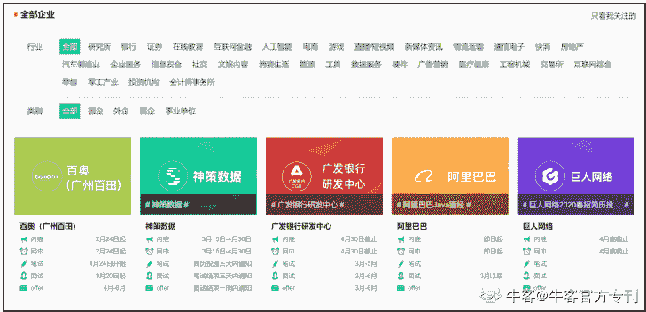

# 第二章 第 1 节 校招介绍

> 原文：[`www.nowcoder.com/tutorial/10028/d1780450dd1448bc9413c6dfdd91f308`](https://www.nowcoder.com/tutorial/10028/d1780450dd1448bc9413c6dfdd91f308)

# 一、前言

## 1.1 校招介绍

**校招**，即**校园招聘**，是企业面向应届生专门举办的招聘，一年举办两次，即秋招和春招。秋招，秋季校园招聘，是**面向应届生的最大****规模****的校园招聘**，一般在每年的秋季举办（8 月-10 月），但近年来，秋招开始的时间越来越早，最早 6 月末 7 月初就有公司开始招聘了；春招，即春季校园招聘，时间一般在每年的春节之后（3 月-5 月），春招是秋招的补充，规模相较于秋招会小很多，而且招聘节奏快，招满就会关闭通道。

 有些同学的观念是：找工作是毕业前的事情，大四下学期才开始找。结果导致春招的时候才行动。这个想法是错误的，秋招是最大规模的校园招聘，机会和选择都更多，到了春招，招聘岗位会变少，每个岗位的招聘人数也会很有限，甚至有的公司并没有春招。因此，请大四的同学们一定要抓住秋招机会。

 今年因为疫情原因，大部分企业会选择将整个流程转到线上，像往年的线下招聘渠道，例如校园宣讲会，线下双选会都会改为线上进行，招聘节奏会变快，整个招聘流程时间会缩短，所以 21 届毕业生从 7 月初就要开始密切关注线上的招聘信息，进行网申或者内推，千万不要想着等企业到学校进行宣讲，才开始投递简历。

###  1.1.1 秋招时间

7 月-8 月：内推&校招提前批

9 月：正式校招

###  1.1.2 秋招面向对象

秋招是面向应届生的招聘，今年的秋招是面向 2021 届毕业生的。

如果是留学生，由于国外的毕业时间跟国内存在差异，一般企业也允许 20 年毕业的留学生参与 21 届的校招的。

具体流程：**应聘>****>****公司****发正式 offer****>****>****学生****接 offer>>****签订实习合同，到公司实习（有的公司不需要）****>>****毕业领毕业证>****>****正式入职、签订劳动合同**。

###  1.1.3 秋招信息渠道

*   **公司官网+官方招聘公众号**

正常的校园招聘信息获取途径最快捷最准确的是公司官网或官微，但是是招聘的公司这么多，一个个翻找会浪费很多时间和精力，而且还容易遗漏或者错过简历投递时间。**这时候，认准牛客网就可以了**。可通过牛客校招指南，一键直达各个公司官网：牛客网>求职>校招日程汇总（地址： [`www.nowcoder.com/school/schedule?from=CZ2021`](https://www.nowcoder.com/school/schedule?from=CZ2021)）

*   **牛客网**

**实习广场**：企业最新招聘信息，由用人部门/企业 HR 直接发布，信息真实可靠，简历处理效率快，岗位齐全，随时可以找到职位发布者直接联系。  

**网站地址****:****牛客网>求职>实习广场****：**

[`www.nowcoder.com/job/center?from=CZ2021`](https://www.nowcoder.com/job/center?from=CZ2021)

**移动端地址****:****牛客 APP>求职**

**企业校招日程汇总**: 一站获得所有公司最近招聘动态，不再遗漏任何一家心仪公司的简历投递时间。 

**网站地址：牛客网>求职>校招日程**

[`www.nowcoder.com/school/schedule?from=CZ2021`](https://www.nowcoder.com/school/schedule?from=CZ2021)

**移动端地址：牛客 APP>求职>****求职工具>校招日程****** 

小程序地址：扫描右方二维码即可观看，小程序订阅企业校招进度，第一时间获取最新校招信息。 

**讨论区：**数百万已拿到 offer 的老牛友以及 HR 发布各企业各岗位地内推消息，消息来源真实可靠，助力大家快人一步拿到 offer。

**网站地址：牛客网>讨论区>招聘信息**

[ https://www.nowcoder.com/discuss/referral/index?from=CZ2021](https://www.nowcoder.com/discuss/referral/index?from=CZ2021)

小程序地址：扫描下方二维码即可观看

** **

**公众号**：

牛客网：牛客网公众号新增岗位订阅功能，关注“牛客网”公众号 - 点击菜单“资源汇总”-“实习职位订阅” 就能每天收到新职位的推送啦。

招聘日程汇总：每日推送校招/内推资讯以及面经干货。

牛客招聘助手：绑定手机号，可及时查询自己的笔试面试进度和信息。

牛客求职：每天推送互联网/金融/房地产/快消/机械 5 大行业校招实习信息。

     

               牛客网                     招聘日程汇总                 牛客招聘助手               牛客求职

**求职内推群**：为了帮助正在进行春招的同学牛客网建立了校招资源群。

群资源如下：

*   海量春招、实习内推资源
*   企业历年招聘真题汇总
*   精选笔经面经
*   专业导师在线指导

       扫码进群                                                      

 **牛客资料大全**：互联网求职简历制作、优质面经、名企校招笔试、面试真题等资料大汇总。

小程序地址：扫描下方二维码即可领取

 

**O****ffer 神器**：基于牛客网真实 Offer 大数据的预测神器。根据求职意向，帮大家发现未来可能拿到的 Offer，分析手头 Offer 的竞争力，了解校招薪资情况，为大家地 Offer 选择提供参考。

网站地址：牛客网>发现>offer 神器

[`www.nowcoder.com/show-offer/index?from=CZ2021`](https://www.nowcoder.com/show-offer/index?from=CZ2021)

移动端地址：牛客 APP>求职>求职工具>offer 神器

通过以上方式，大家能更快获取招聘信息，避免浪费大量时间在查找信息上。事半功倍，将时间运用到更重要的事情——准备秋招。