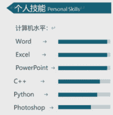
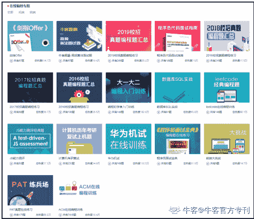
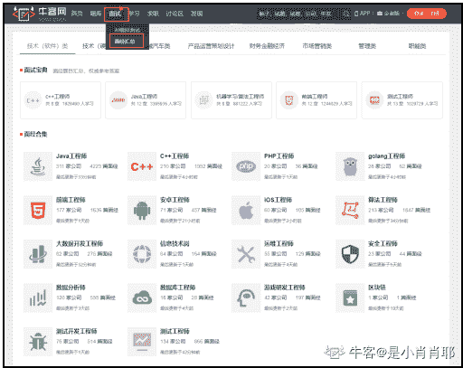
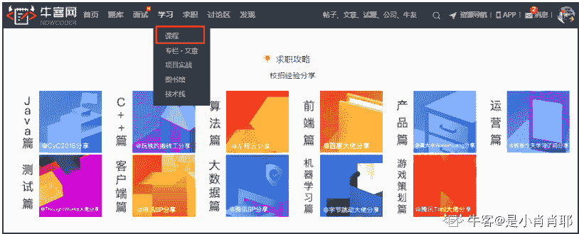

# 第二章 第 2 节 技术岗位考前须知

> 原文：[`www.nowcoder.com/tutorial/10028/bf1f32dec6714ba4a16be178e4287366`](https://www.nowcoder.com/tutorial/10028/bf1f32dec6714ba4a16be178e4287366)

# 技术岗位考前须知

越来越多的企业在校招笔试中采取线上笔试的方式进行，尤其是技术岗位。部分考生由于线上编程经验缺乏，很容易在考场上出现手足无措的情况，影响做题速度和笔试成绩。

下面将对**如何使用在线考试系统**进行详细说明，以及**在线编程所必须要知道的重点**！

## 在线考试系统使用说明

下面详细讲述在线笔试的**完整流程以及注意事项**

**第一步****：投递简历**

注意：邮箱和手机号等信息一定检查仔细，因为后续通知全是通过邮件和短信提醒。

**第二步****：笔试通知邮件和短信**

注意：如果收到短信没有收到邮件，可能是你邮箱填错或者邮箱设置了拒收等原因，可以通过关注公众号：**牛客招聘助手> 绑定收到短信的手机号 > 查询我的笔试。**

**第三步****：****检查考试设备**

1、请使用**谷歌 Chrome、火狐浏览器**访问笔试网址。

如遇到页面加载不出来、摄像头不好使等情况，**优先采取措施：换另一个浏览器试一下。**

**浏览器下载地址：**[`www.nowcoder.com/discuss/3793?from=CZ2021`](https://www.nowcoder.com/discuss/3793?from=CZ2021)

2、确保电脑带有摄像头，并确保摄像头能够正常使用。

摄像头检测：[`www.nowcoder.com/cts/3942933/summary#0?from=CZ2021`](https://blog.nowcoder.net/detail/0#0?from=CZ2021)

（1）**摄像头黑屏、无法拍照等情况：**优先采取措施：换另一个浏览器。其次检查浏览器有没有 adblock adguard 等这种广告屏蔽插件，关闭后重试

（2）**更换为前置摄像头：**请点击地址栏右侧的设置>高级>隐私设置和安全性>内容设置>摄像头，进行调试即可

3、考试前**请关闭其他浏览器窗口，关闭 QQ、微信、Skype 等即时通信软件，关闭屏保，关闭 Outlook 等有弹窗提示消息的软件，**否则会被记录离开网页。

4、确保网络连接畅通，网速应在 100KB/S 以上，**建议使用手机 4G 热点连接网络。**

5、考试时允许使用草稿纸，请**提前准备纸笔**。考试过程中允许上厕所等短暂离开，但请控制离开时间。

**第四步****：****笔试做题流程**

1、试卷中会有一种以上个题型，进入考试后**请仔细查看共有几个题型。**

2、可选择任意题型进入做题，**所有题型一旦提交后将无法返回修改。**

3、**可通过试卷页面底部答案卡进行同一题型试题切换**，但一旦进入某一类题型，提交后方可进入下一题型。

4、如**遇突发情况**，如断网、电脑死机、断电等，请直接刷新页面，或**关闭浏览器后重新通过考试地址进入**。题目会自动保存，所以不用担心。

5、考试环境体验：[`www.nowcoder.com/cts/3942933/summary#?from=CZ2021`](https://blog.nowcoder.net/detail/0#?from=CZ2021)

## 在线编程题重点须知

### 循环输入输出处理常见问题

1、为什么需要循环输入输出：通常来说 OJ 对于每道题里面有.in 和.out 文件，分别表示测试数据的输入和输出。如果某些编程题的所有数据都只做在一个.in 和一个.out 中，这样就会变成多组测试了，所以需要提交的代码中循环处理。

2、处理方法：其实这个问题可以避免，就是编程题后台每个样例做一组对应的.in 和.out 文件，这样就变成单组测试，代码就不需要循环处理，但是平时练习的题目质量不一，这个问题都会出现。

代码里面循环处理了即使是单组测试也会完全没问题，所以为了偷懒，可以全写成循环处理。

3、还有一个坑：这里会发生一个问题(十分常见！！！！)，如果测试数据是多组的，但是恰巧你代码里面需要一些标记数组，map，set 等，在循环内一定记得清空，不然可能会产生前面的测试样例影响了后续数据的答案。

### 对于各种语言的一些基本知识

做编程题强烈建议使用 C/C++，做编程题强烈建议使用 C/C++，做编程题强烈建议使用 C/C++，做编程题强烈建议使用 C/C++。

重要的事情比三遍再多说一遍，下面说说具体理由：

1、出题人通常会使用 C/C++编写标程，数据也是由标程制造的，所以使用跟出题人一样的语言会比较稳妥

2、C/C++效率比较高，通常来说一般 OJ 对于一道题目的时限限制会区分 C/C++和其他语言，通常处理方式是假设 C/C++时限是 1s，其他语言就会给 2 倍时限，甚至更多。

3、关于 cin cout 和 scanf printf。做题的时候尽量使用 scanf printf。下面告诉一个小常识，不要惊讶：cin cout 比 scanf printf 慢 20 倍左右！！！！！！！

一旦遇到大数据量，光是读入就有可能跪掉。

你或许可以使用 std::ios::sync_with_stdio(false); 这条语句关掉 scanf 和 cin 的同步，加快效率。但是即使这样 cin 还要慢 5 倍左右，而且一旦使用了这条语句，scanf 和 cin 混用可能就会造成一些奇怪的错误

4、Java 相关：Java 整体效率大概比 C/C++慢 2~3 倍，但是 Java 写编程题也没什么问题，主要就是处理好各种输入输出的情况。

5、python 等等其他语言，做编程题真心不建议使用这些语言，要么效率低下，要么会有些更深的坑。

### 关于输出格式

格式问题经常令人抓狂，其实主要都有几个常见的坑

1、行末空格：比如我输出需要打印多个数需要使用空格分隔的时候，我们循环使用 printf("%d ",x);这种会很方便，但是这样会导致行末多一个空格，后台系统会严格比对你的输出和.out 文件，这样也会被判错误

2、换行问题，对于每个样例，建议输出完全之后都换行一下。对于一些题目，可能就是不换行就导致了后面输入数据错位，那就肯定不可能过了。

### 关于时间复杂度分析：

通常来说一般的系统 1s 能跑的算法量级是不足 1e8 的，所以做题的时候评估算法效率很重要，直接判断你的做法能否通过，当然这是以 C/C++为标准的，其他语言自己乘个时间倍数。

举个例子，比如题目 n = 1e5，那么我就可以很敏感的知道我的算法需要一个 O(n) 或者 O(nlogn)。平方复杂度直接拜拜！

### 最后关于"我本地能通过，交上去就是不对"

这个问题很蠢！通不过就是有一些问题。一个是要累积经验，分析到底可能出现的问题在哪里。另外不要使用一些奇怪的函数和行为。之前有见过有人使用了 windows 和 linux 平台那个功能的函数名都不一样的奇葩函数。 如果你使用 C/C++，最好别使用 VS 来写算法 code，这个默认是 MS 的，一般 OJ 上面编译器都不会是这个鬼。

## 春招备战资源总结

### 简历攻略

相信大家对简历准备都有一些困惑，不知道该写什么不该写什么，怎么写才能更受企业青睐，下面帮大来家总结一下。 

完整的简历需包括：**基本信息+实习经历+项目经历+校园经历+掌握技能**。

*   **基本信息****：**

**个人信息****：****姓名****+****手机号****+****邮箱地址**

该部分需在简历中显著的标识出来，HR 每天要看很多很多简历，需要一眼可以看见你的联系方式。

简历照片的展示上，建议大家放一张干净大方精神的照片，可以增加 HR 对你简历的印象。注意请一定要去认真的拍一张证件照，不要随便放一张自己的生活照或者过分美颜的照片，正式大方的照片可以增 HR 对你简历的印象。如果企业无特殊要求，也可以选择不放照片。

**学校学历：**你的**毕业院校+你的学历**，如果是本科生，写本科院校，如果是研究生，需写上你的本科毕业院校+研究生毕业院校。

这部分很重要，硬性条件，有些公司部分岗位会对学校学历有额外要求。

相信这时候一部分同学会说：“我的毕业院校不够好，怎么办？”说实话，说学校对找工作没有影响，一定在说笑。但这也并不是能对你一锤定音的指标，在毕业院校不是特别好的情况下，请一定在简历上充分表现你的**实习经历+项目经历**！这一点在接下来介绍实习经历&项目经历的时候，会再给大家详细介绍！ 

 **加分项：个人博客&**** G****ithub**

如果有非常优秀的博客，或者在 Github 有贡献开源项目，可以写到简历上，对自己绝对是一个加分项。如果暂时没有，现在开始写也来得及，养成一个好习惯，写的有条理一些。但是前提是其他基本方面没有问题了，可以额外提升一下这一块。尤其是大二大三的同学，这对将来的校招会有很大的帮助。

但如果到了要投递简历的时候，仍然没有出色的加分项，就不要硬往上写，因为如果你的个人博客&Github 并不出色，HR 会认为你在浪费他的时间，结果可能会适得其反

*   **实习经历****：**

实习经历是简历中的重中之重！如果你有**大厂实习经历**，绝对是秋招时叩响名企大门的一块最有力的敲门砖。

因为大厂的实习经历代表着你曾被大厂认可过，且具有相应的技能和一定的工作经验，用人单位会很欢迎这样的学生！

有实习经历后，要怎么通过简历表现出来也是一门学问，以下有几点大家需要注意：

**（1）实习经历不是写得越多越好**

把与你要应聘的职位匹配度高且含金量高的实习经历写上去即可，例如在奶茶店打过暑期工的这些经历不需要往上写；又例如你要应聘的是后端工程师，但实习经历写的是某公司运营实习，这样非但没有展现出你的优势，还会让面试官更加慎重地考虑你是否适合后端工程师这个岗位。

**（2）无需交代细枝末节的工作任务**

之所以实习经历重要，是因为面试官希望通过实习经历，了解你的专业能力、工作能力，以便他们更好地评估你是否适合他们公司。因此在描述实习经时，只需要把你主要负责的、能够体现你专业能力的工作清晰地描述出来即可，可以使用 STAR 法进行描述。无需把一些细枝末节的工作内容往上写。

**（3）分点描述工作内容，切勿流水账**

有的同学在写简历的时候，会有一个毛病，就是容易写成流水账，长篇大论，字数非常多，且不会分段。试想一下，如果你是面试官，看到简历上密密麻麻的字，找不到重点，你还会有心情认真去看这份简历吗？所以，建议大家养成分点描述的好习惯，将自己要表达的内容好好梳理，分 1、2、3 点进行简单明了的描述，提高简历的可读性。

*   **项目经历****：**

**项目经历也是 HR 和面试官会非常看重的一部分**！因为项目经历代表着你可能了解的技术栈，好的项目经历能够帮助你渡过简历筛选这一关。

且面试时面试官可能会针对你的项目提问，如果你确实认认真真做过项目、熟悉其中的技术难点与技术亮点，你甚至可以引导面试官向你熟悉且擅长的方面提问。

相比实习经历，项目经历可以说是比较容易在短期内准备的东西了。

如果你还没有做过什么项目并且基础还很薄弱，建议先来**牛客****-****学习****-****项目实践**，**这里有从初级到高级的项目教程，从配置环境到项目实现，一步步详细讲解，并且全部免费。**

项目平台地址：[`www.nowcoder.com/project/recommend?from=CZ2021`](https://www.nowcoder.com/project/recommend?from=CZ2021)

 

如果你有基础，但是还缺少一个像样的项目，那么建议你来报名一下牛客网中级项目课。牛客网中级项目课主讲人为由牛客网 CEO 叶神叶向宇——10 多年一线编程老司机，亲自手把手带你做项目，真正从企业实战角度带你从 0 到 1 搭建项目！

牛客网中级项目课：

[`www.nowcoder.com/courses/semester/medium?`](https://www.nowcoder.com/courses/semester/medium?)from=CZ2021

相信很多同学都想知道如何在简历上通过项目经历充分展示自己的能力，那项目经历应该如何写，有什么注意事项？我们总结了以下几点：

**（1）****项目经历不要只写产品功能，重点要写自己使用的技术**

如果使用了算法，就要讲用了 xx 算法后，与其他 xx 算法比较有什么提高，达到了什么目标。

例如：我通过 xx 算法，解决了 xxx 任务中 xxx 问题，xxx 结果数据显示有 xxx 的提高/改进。如果没有用什么牛的算法就总结写通过 xx 组件，xx 开源库实现了 yy 功能，最终熟悉 zz 的 sdk、框架、开源库等。啥都没学会那就写自己写了 xxxxx 行代码，熟悉了设计模式，标准类库之类的。

例子：

有个同学写了下面的项目经历：

2015.03 - 2015.04iunClub 新闻站 PHP 程序员

1.构建服务器端，爬取各大网站的 RSS 数据并存储数据库。

2.构建客户端，解析数据库返回的数据。页面设计由其他成员负责

**修改后：**

1、通过 Python 的 urllib2 和 HTMLParser 实现爬虫的基本功能，对爬取页面解析后的结果通过敏感哈希算法来去重，最终通过 pymysql 把新闻内容存储到数据库。

2、通过采用多线程，多代理模式手段优化系统提高爬取速度，最终达到单台服务器每天爬取有效的 xxx 个页面。

**（2****）****学会用数据量化自己的成果**

客观的数据可以增强说服力，如果一段经历，没有任何数字，要么说明这个工作只是执行或完成了，没有关注结果；要么说明对数字不敏感，缺乏优化和思考的过程。这两者在求职过程中都是硬伤。

举个简单直观的例子

1、我通过 xx 算法，解决了 xxx 任务中 xxx 问题，结果数据显示较大的提高/改进

2、我通过 xx 算法，解决了 xxx 任务中 xxx 问题，xxx 结果数据显示有 xxx 的提高/改进

很显然，第二个描述相比第一个能让别人更直观地了解优化的效果，同时也会增加这段经历的可信度。

看到这里有同学会问，我做项目的时候没有统计过这些数据，那我能不能随便编一组数据？在这里建议大家不要抱着侥幸的心理，数字与数字之间是可以交叉验证的，面试官比你想象的更加聪明细致，要编一组不被面试官察觉的数据可没那么容易，还是老老实实复盘一下项目经历，把需要展示的数据都计算一遍。

**（3****）****不需要长篇大论地介绍技术原理**

有的同学生怕面试官不清楚这个技术、在描述项目经历的时候会花费大量篇幅介绍技术的原理，其实大可不必。且不说面试官非常有可能了解你写的技术，即使不了解，他也不会有兴趣在面试的时候看你写的原理介绍。

面试官关注的重点不是这是一项什么技术，而是你怎么攻克难点实现这个技术，通过这项技术实现了什么。

*   **校园经历****：**

如果你即没有实习经历，也没有项目经历，那就需要在校园经历上花点心思了。 

校园经历的描述，需要尽量与应聘行业、岗位相关，将经历描述尽可能贴近岗位 JD。比如你要应聘互联网技术类岗位，你可以写在学生会技术部、技术相关社团中担任过什么要职，举办过哪些活动，参加过什么技术相关的比赛，获得什么名次等等。

可以适当体现自己的学习能力和合作/组织能力等，注意在书写校园经历的时候不要好像要写大学 4 年回忆录似的，把自己大大小小的经历都往上堆，尽量挑自己挑大梁的且与应聘行业、岗位沾上边的活动写在简历上。那些与应聘行业、岗位毫无干系的校园经历最好不要写。

另外在这一部分可以列举一些你获得的奖学金。

*   **掌握技能：**

你可以通过简历告诉面试官你都掌握了哪些相关的技术。

注意“了解”、“基本掌握”、“熟练掌握”和“精通”的区别，注意词汇上的应用。防止过于夸大而适得其反，在面试时，面试官跟你交流的谈资就是你的简历，简历上写的所有内容，都有可能会被问到。虽说技能掌握这块看似很快就能写完，但是这部分的坑可不少，大家要注意以下几点：

**（1****）****把握技术名词列举的数量**

应聘技术岗的同学，在描述掌握技能的时候往往习惯罗列多一些技术名词，想着技术名称越多，越能体现自己的知识储备。

其实并非如此，面试官清楚地知道大学 4 年，或者大学+研究生 7 年，一般的同学所能掌握技术的广度和深度，过多地罗列技术名字，除了有夸大之嫌外，还会让面试官认为，你对技术的认知比较片面，基本处于了解阶段，没有 1-2 个熟练掌握甚至精通的技术。

其实技术的学习贵精不贵广，精通 1-2 个技术比了解几十个技术来得更难能可贵。因此当你发现自己在罗列技术名词的时候，不妨给自己掌握的这些技术排个序，优先罗列自己真正从原理到应用都清晰掌握的技术。

**（2****）****描述要清晰明了，不要使用过于花哨、含糊不清的表现方式**

有的同学为了追求样式美观，会采用图形的形式去表达自己掌握技能的程度，进度条就是最常见的了。

这样一来，样式确实很美观，但是面试官看了之后会不明所以，无法通过进度条进行量化，清晰明了地了解你各项技能的掌握程度，下面例子，我相信大家看了，也无法判断这位同学各项技能的掌握程度。

所以，尽量用文字表达的方式，清楚地描述你掌握技能的程度，不要让面试官有所疑惑。

 

*   **其他注意事项：**

**（1）简历****排版****整齐有序****、主次突出（该加粗的字体加粗）****，没有过多细节问题**

*   英文部分注意大小写，比如 GitHub，而非 github，O2O 而非 020 
*   中文始终保持一种字体，英文始终保持一种字体
*   简历模板简单不花哨，慎用图标、进度条等附加元素
*   简历字体不要使用过多的颜色，1-3 种即可
*   简历内容安排合理，描述调理清晰，分点论述，标点符号使用正确
*   谨慎使用了解、熟悉、精通等词汇

**（2）****去除和目标职位无效的内容**

比如个人兴趣爱好、自我评价、年龄、生日、住址等这些无关的信息。

**（3）尽****量压缩简历到一页**

如果超过一页，可以根据各个模块的重要性优先级进行删减，各模块重要性优先级如下：技术类实习>完整项目经历>技术比赛获奖>自娱性小工具项目经历>个人技能和博客>学校内获奖>社团工作>班长支书>非技术实习>自我评价>兴趣爱好。

**（4）不断通过修改简历去匹配不同企业的不同岗位**

简历的制作过程并不是一蹴而就的，因为每个公司、每个职位的招聘要求都有所不同，每次投递简历前，都要通过修改简历去更好地匹配不同企业的不同职位，这样才能增大简历通过的概率。面试后也要针对简历不足的地方进行修改。

**（5）****不要造假**

简历制作切记：可以美化，但是不可以撒谎！有些同学实习周期 1 个月，洋洋洒洒写了一大段产品功能，让人觉得根本不是你做的项目。

**（6）****使用 pdf 投递简历，不要使用 word**

如果对于简历制作还是没有什么头绪的话，推荐观看视频：[《技术类应届毕业生简历制作与面试技巧》](https://www.nowcoder.com/live/4/1/1?from=CZSX2021)

观看地址：[`www.nowcoder.com/live/4/1/1?from=CZ2021`](https://www.nowcoder.com/live/4/1/1?from=CZ2021)

## 笔试备考

技术岗位一般都是需要笔试的，而笔试唯一的捷径就是：**刷题！刷题！有意****义的刷题！**

什么叫有意义的刷题，是指要制定自己的刷题计划。 

**1、基础知识巩固：**网络基础+操作系统+Linux+数据库+编程语言基础

基础知识往往是最容易被忽略的，总认为自己都会了就不再去练习。如果基础不牢固，你的笔试很可能就败在这一道简单题上了。

**2、数据结构和算法****：**学校的课程中一般都会设置数据结构，但是学校所讲的仅仅是基础中的基础，不足以让你应对严格的笔试。所以千万不可满足于学校所授，自己也要自主去学习新的知识。

**（1）日常刷题**

*   **企业校招真题**

每个公司的笔试都是不同的，侧重知识点都是不一样的，大家可以通过企业历年的笔试真题，找准企业重点考察点，有针对性地进行查漏补缺。考生可以直接去**牛客题库****>****公司真题****。该题库包含众多企业技术岗位笔试试卷和解析**，直接进行原卷练习。

（地址：[`www.nowcoder.com/contestRoom?from=CZ2021`](https://www.nowcoder.com/contestRoom?from=CZ2021)）

*   **专项练习**

技术岗笔试考点分门别类，根据应聘岗位有针对性地刷题，笔试考点逐个击破。考生可以直接去**牛客题库****>专项练习**进行练习

（地址：[`www.nowcoder.com/intelligentTest?from=CZ2021`](https://www.nowcoder.com/intelligentTest?from=CZ2021)）

*   **在线编程题库**

把这些题目认认真真刷几遍，这是每位前辈都会给的建议。因为编程题在笔试中所占比重很大，可谓得编程者得天下。

**网页端地址：牛客网>****题库>****在线编程**

（[`www.nowcoder.com/activity/oj?from=CZ2021`](https://www.nowcoder.com/activity/oj?from=CZ2021)）

《2019 校招真题编程题汇总》

《剑指 offer》

《leetcode 经典编程题》

《前端技能大挑战》

… …  

**（2）校招全国统一模拟笔试**

除了日常刷题，考前进行模拟测试也是很重要的，可以提前熟悉流程和环境，还能定期对自己的水平进行全面的评估，从而查漏补缺，更快的提高能力。

**校招全国统一模拟笔试**

**网页端****地址****：牛客网>****题库****> ****模拟笔试**

（[`www.nowcoder.com/mockexam/MockExam?from=CZ2021`](https://www.nowcoder.com/mockexam/MockExam?from=CZ2021)） 

**时间****：**3 月至 7 月，每月一场

**收获****：**

*   求职竞争力报告
*   牛币奖励
*   全真校招笔试流程体验
*   企业校招内推机会

**（3）多读书，多读学长推荐的书**

技术书籍千千万，唯有好书值得看。

牛客图书馆特邀技术大佬为大家推荐书单，帮助后来牛油可以更快更有效率的学习知识。

**网页端****地址****：牛客网>学习>图书馆**

（地址：[`www.nowcoder.com/library?from=CZ2021`](https://www.nowcoder.com/library?from=CZ2021)）

**（4）参加在线课程**

算法不管在笔试中还是在面试中都占重要角色的，如果你的算法优秀，校招就已经成功一半了，笔试面试能过的概率大幅增加。

算法的学习主要通过：**看书+刷题+跟大佬学习**。

至于怎么学好算法，推荐看看算法大佬左程云亲笔写的：[**程序员该如何学习算法**](https://blog.nowcoder.net/n/7b34f123e21046aa9d5e5a85b996062a?from=CZSX2021)

观看地址：

[`blog.nowcoder.net/n/7b34f123e21046aa9d5e5a85b996062a?from=CZ2021`](https://blog.nowcoder.net/n/7b34f123e21046aa9d5e5a85b996062a?from=CZ2021)

在这里给给大家推荐牛客网一些**王牌算法直播课**，从入门到面试，为大家搭建完整的算法知识体系，帮助大家快速攻克编程难关，收获高薪 offer

（报名地址：[`www.nowcoder.com/courses?from=CZ2021`](https://www.nowcoder.com/courses?from=CZ2021)） 

 

虽然每次笔试成绩都不会公开，但可以先看看自己是否有笔试通过的公司，所占比例为多少。

·如果**超过了 50%**，说明你的笔试成绩还算凑合的，每天留出一些时间巩固、提升即可，学习计划要针对自己的情况去制定。

·如果**低于 50%**，说明你的基础还是不够扎实，需要抓紧每天强化基础部分和提升部分，不要以为准备笔试是浪费时间，准备笔试的同时也是在提升自己的能力，面试这关也更好过一些，合理安排好时间和计划才是最重要的。

## 面试备考

面试环节是所有招聘环节中至关重要的一项，考察也会更全面更严格。而提高自己面试应对能力的方法就是：**看面经**。

面经是学长学姐的亲身经历和总结，参考价值之重无需多说。

*   **面试法宝****1：****看面经**

牛客网上有非常多各行业、各岗位的面经，这些面经都是往届师兄师姐求职后的经验汇总，涵盖了很多实用性的干货，对准备校招的同学非常有帮助。我们强烈建议大家多研读面经。

**面经位置：面试>面经汇总****>****选择公司、****职业方向**

网页端地址：[`www.nowcoder.com/interview/center?from=CZ2021`](https://www.nowcoder.com/interview/center?from=CZ2021)

**移动端位置：牛客 app>社区>讨论区>笔经面经** 

 

大家也可以关注“**面经大全**”和“**牛客论坛**”小程序，这里面有**上千篇高品质面经汇总以及众多行内人士信息分享**，助你了解心仪公司/岗位的面试真题，面试官套路各个击破。

                      

 扫一扫，面经装进口袋           看一看，关注行内新态

*   **面试法宝 2****：看专栏**

为了让同学们能更系统地备战秋招，牛客邀请了各领域大佬分享求职攻略，帮助大家利用碎片化的时间系统化地进行复习，提高复习效率。

**网页端位置：学习>专栏·文章****>****专栏推荐**

地址：[`www.nowcoder.com/blog/blogCenter?from=CZ2021`](https://www.nowcoder.com/blog/blogCenter?from=CZ2021)

**移动端位置：牛客 app>学习>牛客专刊**  

*   **面试法宝 3****：模拟面试**

目前，越来越多的企业为了提高招聘效率，都会采用线上面试的模式，加上今年的特殊情况，绝大部分的公司都会选择将面试改为线上。

但很多同学**因为缺少面试经验**，在面试中表现得很紧张、胆怯，导致自身实力无从发挥，面试失败。因此建议大家在正式面试前进行模拟面试练习。

推荐大家通过牛客网的**AI 模拟面试系统**进行模拟面试练习，该系统利用名企面试真题进行全真模拟面试，可以帮助大家提前熟悉真实面试流程，**全面提升面试能力！**

**A****I****模拟面试位置：牛客网****> ****面试****> AI****模拟面试**

链接：[`www.nowcoder.com/interview/ai/index?from=CZ2021`](https://www.nowcoder.com/interview/ai/index?from=CZ2021)

 

如果看了上文的攻略还是对秋招没什么头绪的话也别慌，牛客网为大家准备了针对各岗位的**求职攻略**，从简历到笔试面试，层层细讲。

**网页端位置：牛客网****>****学习****>****课程****>****求职攻略**

链接：[`www.nowcoder.com/courses?from=CZ2021`](https://www.nowcoder.com/courses?from=CZ2021)

**移动端位置：牛客 app>学习>求职攻略**

感谢腾讯、字节跳动、百度、京东、美团、小米、拼多多、网易、猿辅导、哔哩哔哩、爱奇艺、网易雷火、盛趣游戏、小红书、360、快手、vivo、网易互娱、4399、深信服、搜狐畅游等 21 家企业对于本次《2021 名企笔试面试求职攻略》活动的大力支持。

 下面将会对题型进行详细的讲解。