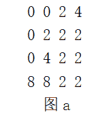
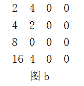

# 第三章 第 5 节 小米 2020 秋招笔试真题

> 原文：[`www.nowcoder.com/tutorial/10028/dd57e181737d4d42b63d2577196ebae9`](https://www.nowcoder.com/tutorial/10028/dd57e181737d4d42b63d2577196ebae9)

# 小米 2020 秋招笔试真题


### 1、请判断一个链表是否为回文链表

【题目描述】请判断一个链表是否为回文链表

输入: 1->2->2->1 输出: True

**输入**

数组

**输出**

True 或者 False

**输入样例** 

```cpp
1 2 2 1
```

**输出样例** 

```cpp
True
```

**【解题思路】**

链表题。

**【参考代码】** 

```cpp
class ListNode:
    def __init__(self, x):
        self.val = x
        self.next = None

class Solution:
    def isPalindrome(self, head):
        """
        :type head: ListNode
        :rtype: bool
        """
        if head is None&nbs***bsp;head.next is None:
            return True
        if head.next.next is None:
            return head.val == head.next.val
        fast = slow = q = head
        while fast.next and fast.next.next:#这里快指针的判读条件跟判断环形有一点不同
            fast = fast.next.next
            slow = slow.next
        def reverse_list(head):
            if head is None:
                return head
            cur = head
            pre = None
            nxt = cur.next
            while nxt:
                cur.next = pre
                pre = cur
                cur = nxt
                nxt = nxt.next
            cur.next = pre
            return cur
        p = reverse_list(slow.next)
        while p.next:
            if p.val != q.val:
                return False
            p = p.next
            q = q.next
        return p.val == q.val

def list2Node(array):
    if not array:
        return None
    head = None
    cur = None

    for num in array:
        if not head:
            head = ListNode(num)
            cur = head
        else:
            cur.next = ListNode(num)
            cur = cur.next
    return head

s = input()
a = []
if s != "":
    for x in s.split():
        a.append(int(x))
head = list2Node(a)
print(Solution().isPalindrome(head))
```

### 2、吃薯片

【题目描述】现在有一盒薯片，小米和大米两个人想要吃薯片。每次只能从薯片盒两端拿出一片薯片吃掉，每次拿取薯片吃掉可以获得快乐值 a[i], i 代表薯片在盒子中的位置。小米先拿，然后大米再从剩余薯片的两端再次取出一片薯片吃掉,……，依次类推直至薯片盒空掉。最终快乐值最大的人获胜。给定一个表示薯片快乐值的数组，预测小米是否会成为赢家（两人快乐值相同时小米赢），假设小米和大米都足够聪明。

**输入描述**

数组 a 代表薯片盒内薯片的快乐值

**输出描述**

Yes/No

Yes 代表小米是快乐值最大的

No 代表小米不是快乐值最大的那个

**输入样例** 

```cpp
1 4 2
```

**输出样例** 

```cpp
No
```

**【解题思路】**

动态规划维护每个人每轮的最优决策所得到的的值。

**【参考代码】** 

```cpp
import java.io.*;
import java.io.File;
import java.util.*;

public class Main {

    public static boolean PredictTheWinner(int[] nums) {
        int n = nums.length;
        int[][] dp = new int[n][n];
        dp[n - 1][n - 1] = nums[n - 1];

        for (int left = n - 2; left >= 0; left--) {

            for (int right = left; right < n; right++) {

                if (left == right) {

                    dp[left][right] = nums[left];

                } else {

                    dp[left][right] = Math.max(nums[left] - dp[left + 1][right], nums[right] - dp[left][right - 1]);

                }

            }

        }

        return dp[0][nums.length - 1] >= 0;

    }

    public static void main(String[] args) throws IOException {
        Scanner sc = new Scanner(System.in);
        String str = sc.nextLine();
        String[] token = str.split(" ");
        int[] a = new int[token.length];
        for (int i = 0; i < token.length; i++) {
            a[i] = Integer.valueOf(token[i]);
        }
        boolean ans = PredictTheWinner(a);
        if (ans == true) {
            System.out.println("Yes");
        } else {
            System.out.println("No");
        }
    }
}
```

### 3、玩游戏

【题目描述】《2048》是一款热门的数字游戏。游戏中，每个方块上的数字都有 2 的幂，数字方块会根据指令整体进行上下左右移动，如果两个数字相同的方块在移动中碰撞，他们就会合成一个新的方块。例如下图为 4*4 格子的游戏，0 表示格子为空，图 a 为移动前格子中的数字，图 b 为图 a 左移后的结果:

    

问，给定 n*n 的矩阵 M，输出进行左移操作后的矩阵结果。

**【解题思路】**

将矩阵保存到二维数组，遍历每行相邻元素相等，即累加到前一位，后一位置 0，之后将非零元素前移即可。

**【参考代码】**

```cpp
import java.util.Scanner;

public class Main {
    /*
     * 请完成下面这个函数，实现题目要求的功能 当然，你也可以不按照下面这个模板来作答，完全按照自己的想法来 ^-^ 开始写代码
     ******************************/
    static String solution(String[] input, int _input_size) {

        int[][] ints = new int[_input_size][];
        for (int i = 0; i < input.length; i++) {
            String[] split = input[i].split(" ");
            ints[i] = new int[split.length];
            for (int j = 0; j < split.length; j++) {
                ints[i][j] = Integer.parseInt(split[j]);
            }
        }
        for (int i = 0; i < ints.length; i++) {
            for (int j = 0; j < ints[i].length - 1; j++) {
                if (ints[i][j] == ints[i][j + 1]) {
                    ints[i][j] *= 2;
                    ints[i][j + 1] = 0;
                }
            }
        }

        for (int i = 0; i < ints.length; i++) {
            int index = 0;
            int[] re = new int[ints[i].length];
            for (int j = 0; j < ints[i].length; j++) {
                if (ints[i][j] != 0) {
                    re[index] = ints[i][j];
                    index++;
                }
            }
            int dec = ints[i].length - index;
            for (int j = dec, k = 1; j > 0; j--, k++) {
                re[ints.length - k] = 0;
            }
            ints[i] = re;
        }

        StringBuffer sb = new StringBuffer();
        for (int i = 0; i < ints.length; i++) {
            for (int j = 0; j < ints[i].length; j++) {
                sb.append(ints[i][j] + " ");
            }
            sb.append("\n");
        }

        return sb.toString();

    }

    /****************************** 结束写代码 ******************************/

    public static void main(String[] args) {

        Scanner in = new Scanner(System.in);
        String res;

        int _input_size = 0;
        _input_size = Integer.parseInt(in.nextLine().trim());
        String[] _input = new String[_input_size];
        String _input_item;
        for (int _input_i = 0; _input_i < _input_size; _input_i++) {
            try {
                _input_item = in.nextLine();
            } catch (Exception e) {
                _input_item = null;
            }
            _input[_input_i] = _input_item;
        }

        res = solution(_input, _input_size);
        System.out.println(res);
    }
}
```

### 4、数据移动

【题目描述】给定一个数列，每一次移动可以将数列某个数移动到某个位置上，移动多次后，形成新的数列。定义数列中相邻两两之间的差的绝对值为“移动距离”，定义所有移动距离的总和为“总移动距离”。希望计算出最少的移动次数，使得新数列的“总移动距离”最小。

例如原数列为[4,2,7,6]，总移动距离为 2+5+1=8，将 6 移动到 7 之前，会变成[4,2,6,7]，总移动距离变成 2+4+7=7。

**输入样例**

数组：4, 2, 7, 6

**输出样例**

最少移动次数：2

需要编写一个函数，输入为一个 int 数组表示数列内容，输出为一个 int 数字，表示最小移动次数

**【解题思路】**

动态规划最长上升子序列

**【参考代码】**

```cpp
#include <bits/stdc++.h>

using namespace std;

int max(int a, int b) { return a > b ? a : b; }

int main() {
    int a[] = {1, 6, 4, 3, 7, 8, 9, 2, 5, 11};
    int b[] = {1, 6, 3, 4, 8, 9, 7, 2, 5, 11};
    int dp[10] = {0};
    int maxn = 0;
    for (int i = 0; i < 9; i++) {
        for (int j = 0; j < i; j++) {
            if (a[j] < a[i]) // a[j] > a[i] 降序
            {
                maxn = max(dp[j], maxn);
                printf("%d, %d\n", a[i], maxn);
            }
        }
        dp[i] = maxn + 1;
    }
    maxn = dp[0];
    for (int i = 0; i < 9; i++) {
        maxn = max(dp[i], maxn);
    }
    printf("%d", maxn);
    getchar();
}
```

### 5、相似性字符串

【题目描述】给定若干个只包含小写字母的非空字符串数组 strArr，和一个只包含小写字母的非空字符串 strB，从 strArr 中找出与 strB 相似度最高的一个或多个字符串。

相似度定义：把一个字符串转换成另一个字符串所需要的“最少编辑次数”越少则相似度越高，增加一个字符或修改一个字符或删除一个字符都算作一次编辑。比如"abcdefghi"要转换成"abcpeghi"最少编辑次数是 2，把"d"修改成"p"算一次编辑，删除"f"算一次编辑，"abcdefghi"和"abcpeghi"的相似度可以使用相互转换的最少编辑次数的倒数 1/2 来表示。

**输入描述**

字符串数组 strArr 和字符串 strB 作为同一行输入，字符串数组 strArr 的多个字符串之间用单个英文逗号","分隔，字符串数组 strArr 的最后一个字符串和字符串 strB 之间使用单个英文冒号":"分隔。

**输出描述**

将找到的相似度最高的一个或多个字符串在同一行输出，多个字符串之间使用单个英文逗号","分隔。

**输入样例**

```cpp
abcedfg,sjfkafjadasadf,bcderfg,abceweef,jk,jabcerfh,kabdced,dafafa,akceedrf,sdfasdfadfa:dabceerf
abceweef,jabcerfh,akceedrf"
```

**【解题思路】**

经典动态规划。字符串最小编辑距离

**【参考代码】**

```cpp
import java.util.Scanner;

public class Main {
    public static void main(String[] args) {
        Scanner sc = new Scanner(System.in);
        while (sc.hasNext()) {
            String str1 = sc.next();
            String str2 = sc.next();
            System.out.println(calculateStringDistance(str1, str2));
        }
    }

    private static String calculateStringDistance(String str1, String str2) {
        if (str1 == null || str2 == null || str1.length() <= 0 || str2.length() <= 0)
            return null;
        char[] chs1 = str1.toCharArray();
        char[] chs2 = str2.toCharArray();
        int dp = getDp(chs1, chs2);
        System.out.println(dp);
        return String.valueOf("1/" + (dp + 1));
    }

    private static int getDp(char[] chs1, char[] chs2) {
        int[][] dp = new int[chs1.length + 1][chs2.length + 1];
        for (int i = 1; i <= chs1.length; i++) {
            dp[i][0] = i;
        }
        for (int j = 1; j <= chs2.length; j++) {
            dp[0][j] = j;
        }
        for (int i = 1; i <= chs1.length; i++) {
            for (int j = 1; j <= chs2.length; j++) {
                if (chs1[i - 1] == chs2[j - 1]) {
                    dp[i][j] = dp[i - 1][j - 1];
                } else {
                    dp[i][j] = dp[i - 1][j - 1] + 1;
                }
                dp[i][j] = Math.min(dp[i][j], dp[i][j - 1] + 1);
                dp[i][j] = Math.min(dp[i][j], dp[i - 1][j] + 1);
            }
        }
        return dp[chs1.length][chs2.length];
    }
}

```