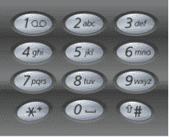

# 第三章 第 17 节 快手 2020 秋招笔试真题

> 原文：[`www.nowcoder.com/tutorial/10028/5043d23daeb0434583d09f3cf6ac5db3`](https://www.nowcoder.com/tutorial/10028/5043d23daeb0434583d09f3cf6ac5db3)

# 快手 2020 秋招笔试真题


### 1、字母组合

【题目描述】给定一个仅包含数字 2-9 的字符串，返回所有它能表示的字母组合，按照字典序升序排序,如果有重复的结果需要去重给出数字到字母的映射如下（与电话按键相同）。注意 1 不对应任何字母。

 

**输入描述**

输入 2-9 数字组合， 字符串长度 1<=length<=20

**输出描述**

输出所有组合

**示例 1**

**输入**

```cpp
23
```

**输出**

```cpp
[ad, ae, af, bd, be, bf, cd, ce, cf]
```

**示例 2**

**输入**

```cpp
92
```

**输出**

```cpp
[wa, wb, wc, xa, xb, xc, ya, yb, yc, za, zb, zc]
```

**示例 3**

**输入**

```cpp
458
```

**输出**

```cpp
[gjt, gju, gjv, gkt, gku, gkv, glt, glu, glv, hjt, hju, hjv, hkt, hku, hkv, hlt, hlu, hlv, ijt, iju, ijv, ikt, iku, ikv, ilt, ilu, ilv]
```

**【解题思路】**

直接深搜递归暴力枚举所有情况。

**【参考代码】**

```cpp
import java.util.ArrayList;
import java.util.HashSet;
import java.util.List;
import java.util.Scanner;
import java.util.Set;
import java.util.TreeSet;

public class Main {
    public static void main(String[] args) {
        Scanner sc = new Scanner(System.in);
        String str = sc.next();
        TreeSet<String> s = new TreeSet<>(letterCombinations(str));
        System.out.println(s);
    }

    // 定义每个数字对应的字符
    static String[] a = new String[] { "", "", "abc", "def", "ghi", "jkl", "mno", "pqrs", "tuv", "wxyz" };
    static StringBuffer sb = new StringBuffer();

    public static List<String> letterCombinations(String digits) {
        if (digits.length() == 0) {
            return null;
        }
        List<String> answer = new ArrayList<String>();

        // 开始回溯
        zuhe(digits, 0, answer);
        return answer;
    }

    private static void zuhe(String digits, int n, List<String> answer) {
        if (n == digits.length()) {
            answer.add(sb.toString());
            return;
        }
        for (int i = 0; i < a[digits.charAt(n) - '0'].length(); i++) {
            sb.append(a[digits.charAt(n) - '0'].charAt(i));
            zuhe(digits, n + 1, answer);
            sb.deleteCharAt(sb.length() - 1);
        }
    }

}
```

### 2、字符统计

【题目描述】统计字符串（字符串最大长度<=100000）中字符出现的次数，并按出现次数降序输出。

**输入描述**

Ababca

**输出描述**

a:3,b:2,c:1

**示例 1**

**输入**

```cpp
Ababca
```

**输出**

```cpp
a:3,b:2,c:1
```

**【解题思路】**

直接使用计数排序统计。

**【参考代码】**

```cpp
# coding=utf-8
s = input()

d = {i: 0 for i in set(s)}
for n in s:
    d[n] += 1
r = [{'k': k, 'v': v} for k, v in d.items()]
r = sorted(r, key=lambda x: x['v'], reverse=True)
print(','.join([str(x["k"])+":"+str(x["v"]) for x in r]))
```

### 3、石头碰撞

【题目描述】给定一组石头，每个石头有一个正数的重量。每一轮开始的时候，选择两个石头一起碰撞，假定两个石头的重量为 x，y，x<=y,碰撞结果为：
1\. 如果 x==y，碰撞结果为两个石头消失。
2\. 如果 x != y，碰撞结果两个石头消失，生成一个新的石头，新石头重量为 y-x。
最终最多剩下一个石头为结束。求解最小的剩余石头质量的可能性是多少。

**输入描述**

第一行输入石头个数(<=100)
第二行输入石头质量，以空格分割，石头质量总和<=10000

**输出描述**

最终的石头质量

**示例 1**

**输入**

```cpp
6
2 7 4 1 8 1
```

**输出**

```cpp
1
```

**【解题思路】**

利用 0-1 背包方法求出能将石头合并成 2 堆的情况，dp[j]代表是否能将石头分成其中一堆为 j，另一堆为(sum-j)，其中一堆的最小值肯定不超过总和的一半，最后最接近的两堆即为最小值。

【**参考代码】**

```cpp
#include <iostream>
#include <vector>

using namespace std;
class Solution {
  public:
    int lastStoneWeightII(vector<int> &stones) {
        int n = stones.size(), sum = 0;
        for (int i = 0; i < n; i++)
            sum += stones[i];

        vector<bool> f(sum + 1, false);
        f[0] = true;

        for (int i = 0; i < n; i++)
            for (int j = sum / 2; j >= stones[i]; j--)
                f[j] = f[j] | f[j - stones[i]];

        for (int i = sum / 2; i >= 0; i--)
            if (f[i])
                return sum - i - i;
        return sum;
    }
};
int main(int argc, char *argv[]) {
    int n = 0;
    std::cin >> n;
    std::vector<int> stones;
    for (int i = 0; i < n; ++i) {
        int v = 0;
        std::cin >> v;
        stones.push_back(v);
    }
    Solution sol;
    auto result = sol.lastStoneWeightII(stones);
    std::cout << result;
}
```

### 4、求最小长方形

【题目描述】 给定一系列 2 维平面点的坐标(x, y)，其中 x 和 y 均为整数，要求用一个最小的长方形框将所有点框在内。长方形框的边分别平行于 x 和 y 坐标轴，点落在边上也算是被框在内。

**输入描述**

测试输入包含一系列坐标，每对坐标之间用英文逗号分割，x 坐标与 y 坐标之间以空格分割，其中|x|和|y|小于 231

**输出描述**

输出 4 对坐标，分别是长方形的 4 个顶点，以 x、y 均为最小的点开始，顺时针显示，格式与输入一致

**示例 1**

**输入**

```cpp
0 1,2 0,2 3
```

**输出**

```cpp
0 0,0 3,2 3,2 0
```

**【解题思路】**

维护能框下当前所有点的边界即可。

**【参考代码】**

```cpp
a = input()
res = []
if a != "":
    items = a.split(',')
    for item in items:
        res.append(list(map(int, item.split())))
    print('%s %s,%s %s,%s %s,%s %s' % (min(map(lambda c: c[0], res)),min(map(lambda c: c[1], res)),
                                     min(map(lambda c: c[0], res)),max(map(lambda c: c[1], res)),
                                     max(map(lambda c: c[0], res)),max(map(lambda c: c[1], res)),
                                     max(map(lambda c: c[0], res)),min(map(lambda c: c[1], res))))
```

 ### 5、蓄水池大作战

【题目描述】在你面前有 n 个蓄水池，他们组成了树形结构（由 n-1 条边连接）。蓄水池节点编号从 1 开始到 n。对每个蓄水池节点来说，他的儿子蓄水池节点都摆放在他的下面，并且和它用水管相连，根据重力，水会向下流动。现在我们要在蓄水池上做一些操作：

1\. 把节点 v 填满水。然后 v 的所有儿子节点水也会被填满。

2\. 清空节点 v 的水。然后 v 所有的父亲节点水都会被清空。

3\. 询问每个蓄水池节点是否有水。

初始状态时候，每个节点都是空的。

现在我们会依次进行一系列操作，我们想提前知道每次操作后的结果，你能帮忙解决吗？

**输入描述**

·第一行包含一个正整数 n(1<=n<=1000)，表示蓄水池节点的数量。
后面 n-1 行，每行有两个数字 a[i], b[i]。（1<=a[i], b[i]<= n, a[i]!=b[i])表示蓄水池的连接关系。
·接下来的一行包含一个整数 q(1<=q<=1000)，表示我们要进行的操作的数量。
·最后的 q 行中，每行包含两个数字 c[i] (1<=c[i]<=3)和 vi。其中 c[i]表示操作类型(1,2 或者 3)。v[i]表示操作对应的蓄水池节点。
·输入数据保证合理，是一个连通的树。

**输出描述**

对于每个操作 3（c[i] == 3)，输出一个数字 1 或者 0。1 表示 v[i]蓄水池节点有水，0 表示没水。

**示例 1**

**输入**

```cpp
5
1 2
5 1
2 3
4 2
12
1 1
2 3
3 1
3 2
3 3
3 4
1 2
2 4
3 1
3 3
3 4
3 5
```

**输出**

```cpp
0
0
0
1
0
1
0
1
```

**【解题思路】**

map<int ,vector>  mp1,mp2;分别是某个蓄水池的子节点和父节点的链表，然后一个简单的 dfs 即可。

**【参考代码】**

```cpp
#include <bits/stdc++.h>
using namespace std;
void dfs(map<int, vector<int>> mp, vector<int> &v, int k, int m) {
    int index;
    v[k] = m;
    for (int i = 0; i < mp[k].size(); i++) {
        index = mp[k][i];
        v[index] = m;
        dfs(mp, v, index, m);
    }
}
int main() {
    int n;
    cin >> n;
    map<int, vector<int>> mp1, mp2;
    vector<int> v(n + 1, 0);
    vector<int> res;
    int a, b;
    while (n > 1) {
        cin >> a >> b;
        if (a > b)
            swap(a, b);
        mp1[a].push_back(b);
        mp2[b].push_back(a);
        n--;
    }
    int num;
    cin >> num;
    while (num--) {
        cin >> a >> b;
        if (a == 1)
            dfs(mp1, v, b, 1);
        else if (a == 2)
            dfs(mp2, v, b, 0);
        else {
            res.push_back(v[b]);
        }
    }
    for (int i = 0; i < res.size(); i++)
        cout << res[i] << endl;
    return 0;
}

```