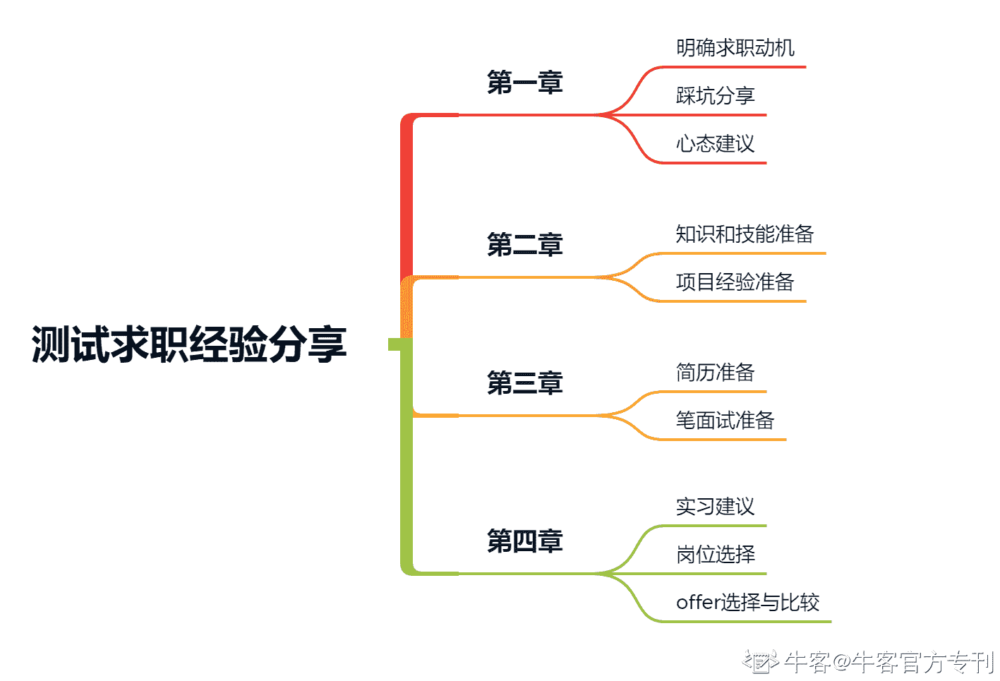

# 第一章 第 1 节 开篇词

> 原文：[`www.nowcoder.com/tutorial/10046/124b039d65104fd5a22205b6f2cbc65e`](https://www.nowcoder.com/tutorial/10046/124b039d65104fd5a22205b6f2cbc65e)

亲爱的读者，你好~

如果你是想把测试工程师作为校招的求职目标的话，那么请珍惜此攻略。本攻略会分享给你应对测试工程师的校园招聘面试应该做的准备，全文包含了四章内容：

（1）第一章内容主要是为了帮助大家明确从事测试工程师的动机，同时笔者也会分享求职过程中所踩的一些坑；

（2）第二章内容主要是给大家讲解从事软件测试所需要的知识和技能，以及如何准备项目经验；

（3）第三章内容将会教大家如何写一份优秀的简历，以及如何准备笔试面试；

（4）第四章内容则是给大家分享如何更好地累积实习经验、以及如何在多个实习和校招 offer 中进行选择。

# 学习本专刊你能收获什么

*   优秀简历模板
*   岗位技能树
*   如何点满技能点
*   笔面试通关秘籍

# 本专刊适合哪些用户

1.  基础较为薄弱，想要找对学习方向；
2.  复习时间较短，希望在短时间内能达到面试要求；
3.  面试经验不足，想要在面试中有更好的表现；
4.  对校招不了解，想要快速了解加入秋招。

# 专刊大纲

