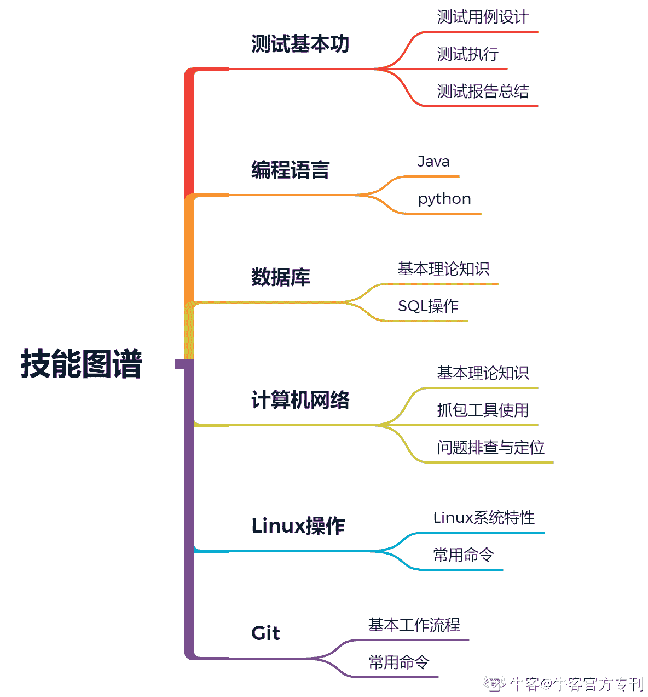
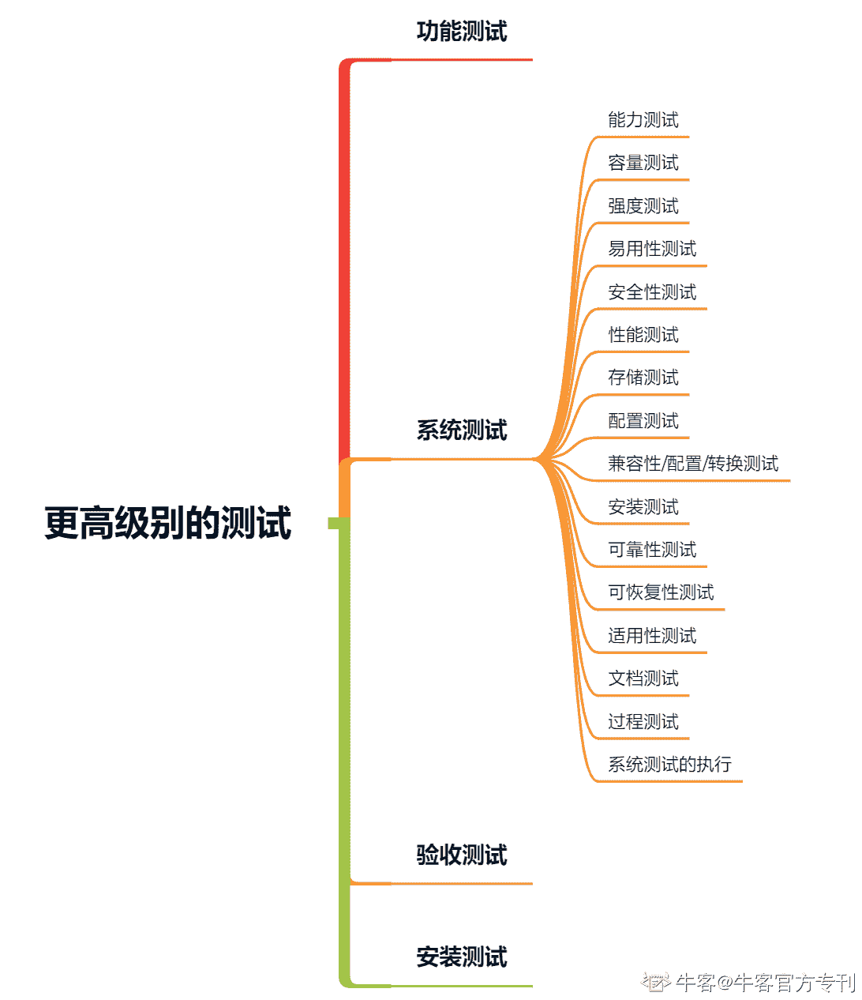
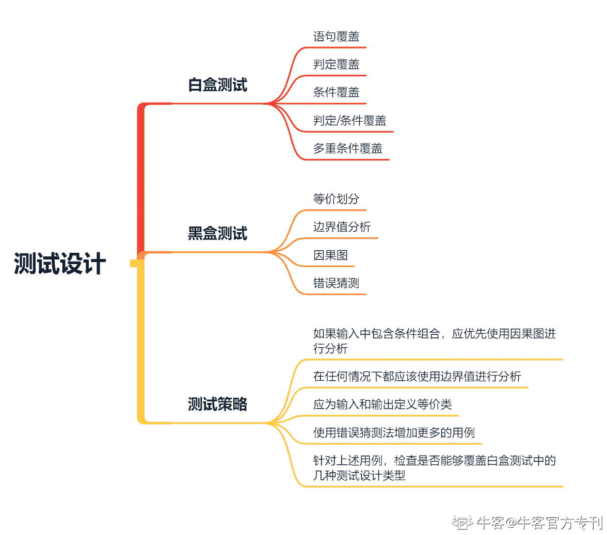
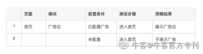
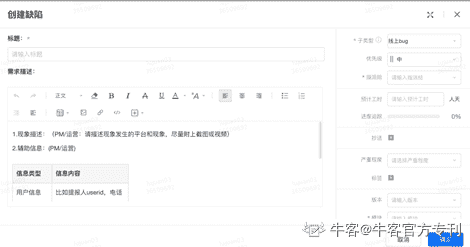
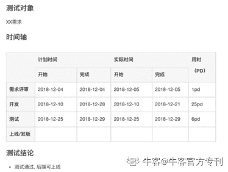
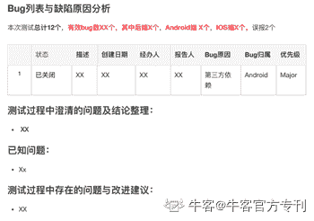

# 第二章 第 1 节 接触知识和技能—测试基本功

> 原文：[`www.nowcoder.com/tutorial/10046/e5f039917c374d48836f1f28e1536047`](https://www.nowcoder.com/tutorial/10046/e5f039917c374d48836f1f28e1536047)

在测试岗位或者测试开发岗位的校园招聘的面试中，一般会有 3～4 轮面试，其中前两轮主要对应聘者的过往经历以及所具备的专业技能进行考察，面试官是你所面试部门的比较资深的员工以及直属 leader，第三面的面试官一般会是直属 leader 的上级，而第四面则是 HR 面试。本篇内容教给大家的则是如何准备前两轮的面试，主要包含了：

（1）基础知识和技能准备。对于该岗位所需要基础知识和技能的考察是面试中必不可少环节，同时只有掌握了这些，你入职之后才能快速的上手，更好地适应。

（2）项目经验准备。在公司中进行工作，除了必要的知识和技能，我们还需要一些必要的软素质，如团队合作能力、沟通能力、表达能力、自我复盘与学习能力等。这些能力我们只能通过对应聘者过往的项目经历或者实习经历进行考察，所以没有这些内容的同学相对来说要吃亏很多，因为面试官没有途径来了解这些内容。

（3）学习经验分享。笔者会分享给大家我之前的学习经验以及一些比较好用的计划清单管理工具。帮助大家进一步落实学习计划，有节奏的进行相应的准备。

为了更好的测试，对于测试工程师来说，我们需要掌握开发所需要掌握的知识和技能，同时还需要额外掌握开发所不具备的测试技能，所以一名优秀的测试其实是需要比开发懂的更多。而现实中能做到的却很少，优秀的测试通常是凤毛麟角的。为了应对面试，同时也使我们能更好的完成测试工作，我们需要掌握的基础知识和技能包括以下几个方面：

（1）测试基本功。我们需要对测试这件岗位有一定的认知，包括测试的主要工作，如何进行测试用例设计，如何执行测试，在测试过程中如何提 Bug，测试完成后如何整理测试报告，同步测试结论等。

（2）学习和掌握一门编程语言。现在做测试不会编程的基本上都是要被淘汰的。

（3）掌握数据库的基础理论知识和 SQL 的使用。

（4）掌握计算机网络的基础知识以及相应抓包工具，测试过程遇到问题后有排除思路。

（5）了解 Linux 系统的特性，并掌握通过命令后使用 Linux 系统功能的方法。

（6）掌握代码版本管理工具 Git 的使用。

（7）为了应付面试，我们还需要需要刷一定数量的算法题目。

上述内容是我们一定要做准备的，这些内容不仅会帮助你应对面试，其实在真实工作的过程中除了第 7 点之外都是有实际使用场景的知识，所以务必要进行相应的学习。接下来我会分类、分小节的进行说明和总结。

# 1\. 基础知识和技能-测试基本功

我们投递的岗位是测试岗，那么最为首要的是我们要知道测试岗位的职责以及主要工作内容，然后才能更加清楚我们需要掌握哪些基本功。概述的讲，测试工程师的基本职责是：“发现项目代码中的缺陷，确保项目上线的质量”。这里我要强调的是这些仅是我们的基本工作，实际上测试人员的角色在不断的发生变化，工作内容也在不断的扩充，我们要：

（1）能够完成服务端性能测试以及客户端专项测试此类比较复杂的测试工作

（2）有通过规范和优化研发流程做好质量运营和过程度量的意识和方法，提高 RD 的质量风险意识以及自测能力；

（3）能够建设前后端自动化持续集成的经验和能力，帮助我们更好的完成持续交付；

（4）结合业务痛点去做相应的质量改进，包括可测性改造、丰富测试手段等工作。

在公司中，我们的基本的测试工作包含了以下几个主要环节：

（1）了解我们的被测对象所具有的属性和功能，进行相应的测试方案设计；

（2）执行测试，发现和提出缺陷，在 RD 修复缺陷后进行验证；

（3）最后要给出测试是否终止，是否运行功能上线的结论，整理相应的测试报告对测试过程进行总结。

所以对应的我会给给大家讲解以下 3 方面的基本功：

（1）如何学习测试用例设计。

（2）缺陷的定义、如何提缺陷以及验证缺陷。

（3）如何书写测试报告

## 1.1 测试方案设计

在测试用例设计学习的过程中，有两本经典的书籍需要大家阅读《软件测试的艺术》以及《探索式软件测试》，看完之后大家对测试会有进一步的认识和了解。第一本让我学习了软件测试的基本理论，同时在工作中也应用比较多。而第二本书则让我感受到了软件测试的魅力，看到了真正热爱软件测试的人是如何看待软件测试这份职业的，并意识到这是一份带有挑战的职业，而不是一份简单的工作，更加坚定了自己的求职方向。

测试工作需要有一套理论来保证每一次测试方案设计的有效性以及完备性，《软件测试的艺术》这本书就给出了在进行测试方案设计时需要关注的 Check Point。但是对于具体的 Check Point 如何去做相应的测试用例设计，则非常依赖软件测试工程师本身所具备的经验，因为不同系统所具备的特性是不一样的，这也是软件测试本身又具有一定复杂性的原因。

实际工作中，在进行测试方案设计时需要参考产品的需求文档以及开发提供的技术方案文档来提炼我们所需要的测试类型，然后才是针对具体的测试类型去设计详细的用例。

我们通常需要覆盖的测试类型如图 1 所示，这也是在《软件测试的艺术》这本书中“更高级别的测试”章节中所包含的内容。其中在目前工作中我所使用的几个测试类型有：

（1）功能测试，这应该是我们在工作中涉及到的最多种类的测试，主要保证产品功能在正常的条件下正常使用。

（2）兼容性测试，通常会包含应用设备的兼容性，比如不同的手机设备、不同浏览器类型；多个产品之间的兼容性，在一些复杂系统中需要考虑；新的功能对历史版本数据的兼容性，尤其是未处理完成的数据。

（3）性能测试，其中会包含服务端性能测试和客户端专项性能测试两部分，这两类性能测试中其实也包含了图 1 中的所提到的强度测试、能力测试、容量测试、存储测试和配置测试。

（4）安装卸载测试，对于需要安装的 APP 应用以及 PC 应用来说会特别强调安装卸载之后应用的功能正常。

（5）安全测试，对应这种测试类型我目前知道的确有，但因为这种测试类型需要专业的知识背景，笔者目前没有相关方面的知识储备，无法做更多的说明。

（6）可靠性以及可恢复性测试，对于后端服务来说，在企业中通常是用故障注入以及故障演练的方式进行；而对于前端应用来说我们通常会模拟无网络以及接口异常来测试前端应用的表现。

（7）易用性测试，这种测试主要是站在用户的角度来思考产品功能是否合理，是否足够好用，其实需要在需求评审的前期就进行关注。

（8）过程测试，这种测试类型在笔者的实践过程中主要是会对整个项目的上线过程进行模拟，确保系统的无缝升级，不影响线上用户的功能使用。

（9）验收测试，这种测试类型其实在我们实际的工作中会演变成运营验收、App 版本灰度的测试过程。主要是希望在用户真实使用的过程中对产品功能再次进行测试，暴露问题。

对于剩下的文档测试，在实际的工作中对于文字描述类的部分是由产品进行验收，我们一般不进行测试。

在明确一次测试过程所包含的测试类型之后，接下来就是针对某一个具体的测试类型进行详细的测试用例设计了。其中对于功能测试，我们可以参照《软件测试的艺术》一书中的“测试设计”章节所提出的黑盒测试和白盒测试几种方法进行测试用例的设计，在实际的工作过程中我们可能没有充分的时间来自己 review 开发所写的每一行代码，但是我们要知道开发所实现代码的具体的逻辑，用一种黑盒+灰盒的测试方法来进行 Case 的设计，才能做到全面逻辑覆盖，发现其中的代码缺陷，同时也能帮助我们删减一些从黑盒角度出发所设计出的冗余的用例。

在测试工程师职位的校园招聘中，测试设计题目是必考察的内容。针对校招面试过程中给的测试用例设计题目，大家可以采取上述先制定测试类型，再针对测试类型进行详细用例设计的方法来解答相应的题目。

## 1.2 测试缺陷管理

测试缺陷是测试工程师工作产出以及项目是否能够上线的重要数据指标，因此作为测试工程师而言一定要明白什么是缺陷、如何提报缺陷以及如何对缺陷进行管理。

按照我们在 1.1 节中的方法进行用例设计后，我们会将设计出的 Case 用文档的方式进行管理，方便我们执行测试并进行测试结果记录。每个 Case 会按照以下的方式进行书写：

其中页面和模块主要是为了把我们的 Case 按照相应的维度进行汇总，方便我们后期对 Case 进行查看和理解，前置条件描述的是我们要测试系统当前的状态，测试步骤则是我们所要执行的操作，预期结果则对应的是在相应操作下我们预期的系统表现以及新的系统状态。当我们在执行用例的过程中，发现实际的系统状态和表现和预期结果不符合的，那么此时我们就发现了缺陷，就可以对缺陷进行提报。那么我们应该如何描述一个缺陷呢?

在工作时，公司一般都会有自己的项目以及缺陷管理系统，也有一些开放的第三方项目和缺陷管理系统，如 Jira。我们需要做的就是在这样的系统中新建一个缺陷类型的 task 并指派给对应的开发，并且在缺陷单中具体的描述我们所发现的问题，需要包含以下的内容：

 

**（1）缺陷标题：**对发现的缺陷的简单总结。便于开发快速意识到这是一个问题。

**（2）现象描述：**仔细的描述缺陷的详情。通常需要包含预期结果、实际结果。如果有相关的数据库、接口参数、服务端日志等关键证据信息，那么也需要提供出来，开发可以根据这些信息快速定位问题，节约研发时间。

**（3）复现步骤：**需要说明在什么样的前置条件做了什么样的操作发现了该问题，方便开发复现问题。如要说明在什么样的测试环境、测试设备上执行的测试。

**（4）缺陷等级：**需要做出判断并选择相应的等级，通常的缺陷等级有 Blocker（阻塞测试流程对缺陷）, Critical（非阻塞但影响比较严重）, Major（影响主功能的缺陷）, Normal（一般缺陷）, Trival（即使不修复也影响不大的缺陷）。开发可能同时在并行开发其他的需求，所以我们需要通过缺陷等级来将缺陷进行优先级分类，我们希望的是开发优先解决比较严重的问题，特别对于会阻塞测试进度的严重缺陷，我们应提升相应的缺陷等级。

开发认可我们所提缺陷之后会进行相应的修复，修复之后我们需要再次验证相关的测试场景并确保未引入新的功能缺陷。当我们测试用例执行完成、所提的缺陷均得到解决并确认已修复，不再有新的缺陷提出时，我们的测试就可以终止，项目则被允许上线。

## 1.3 测试报告总结

虽说测试工程师本职工作就是发现项目开发代码中的缺陷，但是我们更为重要的作用是识别项目中潜在的质量风险，并进行相应的风险预防。

这些质量风险通常会散落在项目研发过程的各个环节中，比如产品设计的功能不合理，而如果我们只是按照产品设计去测试那么最终可能上线的功能会被用户严重的吐槽；比如开发过程中，开发随意更改一些影响核心功能的代码，但却未经过充分测试就上线；比如在修改测试过程中缺陷时，如果开发未阐述修改所涉及到功能范围，我们没有做相应的全回归测试，那么就会引发新的代码缺陷；比如上线过程中，未准备全面的上线计划，而导致线上环境配置的缺失引起线上问题等。所以作为测试工程师，我们需要发挥更大的价值是，提升整个项目成员的质量意识。那么要如何做呢？

在测试完成项目上线后，我们可以通过整理测试报告的方式，来对项目整体研发上线过程中发生的问题、缺陷进行梳理总结，并提出相应的改善建议和措施，提升项目成员整体的质量意识，降低后续项目上线的质量风险。

测试报告中主要包含几个重要的部分：

（1）对需求从开始的评审到最终上线过程中关键节点的时间轴的梳理，发现研发过程中的瓶颈和 dealy 的环节。

（2）对测试过程以及上线中的缺陷的发生原因进行总结，并提出相应的改善意见，如果有特别典型的缺陷则需要重点说明和强调。

（3）如果项目迭代过程中有相应的质量数据积累，那么可以对比多个项目的质量数据情况，从中也会有所发现和收获。

