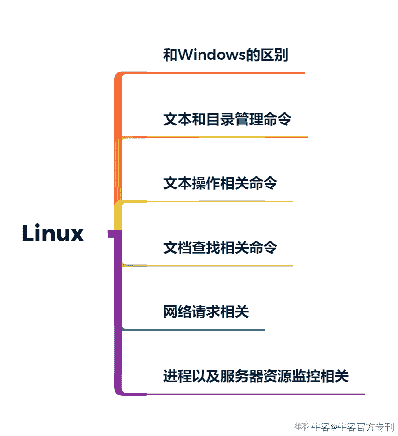

# 第二章 第 2 节 基础知识和技能-公共基础

> 原文：[`www.nowcoder.com/tutorial/10046/4f45ab72f12b4c8b89e408fba8432b3c`](https://www.nowcoder.com/tutorial/10046/4f45ab72f12b4c8b89e408fba8432b3c)

无论开发还是测试，有一些我们都需要掌握的基础知识，本小节讲解的是针对这些公共的部分我们应该如何储备相应的知识，包括了数据库、计算机网络以及 Linux 三个部分。

# 1.数据库知识

在对数据库的知识进行学习时，大家应该从四个方面进行学习：首先需要学习相关的基础理论知识，包括如何进行库表建模等；其次要掌握 SQL 语法，能够熟练的进行单表数据以及多表数据的增删改查操作；第三，为了能够进行测试工具的开发，我们应该能熟练的使用代码来实现服务端的数据库的操作以及客户端的数据库查询操作的实现；最后，再深入一点，我们需要对某一个具体的数据库实现（例如 MySQL 的实现细节）要有所了解。在我看来，应对校园招聘，我们至少要掌握前两部分，并且只有掌握了前两部分，入职之后你才能得心应手的开展工作。第三个部分，我们可以在进行项目经验的准备过程中进行学习，第四个部分则需要大家根据自己的学习进度去阅读相关的书籍。本节主要专注前两部分中相关知识点的总结。

对于数据库基础理论知识的学习，我推荐大家从学校的图书馆中任意借一本出版年份比较新的书籍看起，之所这样推荐，是因为我们的目的不是为了成为专门的数据库开发工程师，所以一般的书籍就足以。出版年份越新，相应的会包含一些新兴的数据库技术，可以进一步开阔视野。在学习时要关注与常见面试题目相关的知识点，常考的知识点有：

**（1）常见的数据库类型有哪些，每一类数据库典型的代表有哪些。关系型数据库以及非关系型数据库的区别**

**（2）要能够看懂****ER****图，明白关系结果中的几种关系模型**

**（3）数据的三级模式和二级映像是什么**

**（4）数据库的范式是什么，典型的范式的含义**

**（5）事务是什么，具有哪些特性？事务的隔离级别有哪些**

**（6）数据库的索引是什么？索引的好处？当过渡使用索引所带来的坏处是什么？我们应该如何建立索引**

**（7）视图和存储过程的概念是什么，他们的好处是什么**

**（8）在数据库并发读写时会出现什么情况？数据库中的锁是用来做什么的？乐观锁和悲观锁的区别？****MySQL****中有行锁和表锁的区别**

对于 SQL 语法的掌握，推荐大家多练习，目前牛客网上已经有专门针对 SQL 语法的练习。我这里给大家强调一下写 SQL 时的重点：

（1）对不同的数据库厂商，在某些实现上提供的 SQL 会有所不同，所以在学习的时候大家不要搞混乱了，明白 SQL、T-SQL、PL/SQL 之间的区别

（2）要明白 SQL 语法在执行时的逻辑顺序。

（3）掌握表数据操作的常用命令：增、删、改、查、去重、排序、分组与聚合函数的使用、多表联合查询，在多表查询中明白内连接和外连接的区别以及实现

（4）掌握表结构操作的常用命令：创建、修改、删除、查询

（5）了解数据库的操作常用命令：建立数据库、删除数据库、切换使用某一个数据库

# 2\. 计算机网络

对于计算机网络知识的学习，推荐大家学习的参考书籍为谢希仁的《计算机网络》，如果大家时间有空闲，可以看看《TCP/IP 详解》，作为补充知识更加深入的学习，但是不够的话就不建议大家再去琢磨了，要把有限的时间花在对的地方。

在计算机网络这门课程中大家要明白其核心内容：它是解决信息传输的一种分层机制。举个简单的例子就是，学习了这门知识之后你会明白，你在浏览器上输入一个 URL 之后，底层都发生了那些信息交换，使得你最终能够在浏览器上看到你想要的信息。这也是为什么这个问题是面试的时候高频考察的问题之一。在学习时需要关注的常见考点有：

（1）计算机网络的分层模型，五层模型分别包含什么，每一层主要解决的问题是什么

（2）在数据链路层的 MAC 地址和网络层的 IP 地址间的区别是什么

（3）交换机和路由器的区别是什么

（4）在网络层中 域名解析的过程包含了那些步骤？

（5）IPv4 和 IPv6 的区别是什么？

（6）IP 地址的分类有哪些？

（7）TCP 和 UDP 的区别

（8）TCP 和 UDP 三次握手和四次挥手的过程是什么，为什么要如此设计

（9）TCP 中的流量控制和拥塞控制的大概过程

（10）HTTP 请求和响应报文的格式

（11）HTTP 请求中常见的请求方法有哪些？

（12）GET 请求和 POST 请求的区别

（13）Cookie、Session 和 Token 的区别

（14）HTTP1.0 和 1.1 的区别

（15）HTTPs 和 HTTP 的区别

（16）在浏览器中输入一个网址到网页加载完成，发生了什么

# 3. Linux 知识

对于 Linux 知识的学习，推荐给大家的学习资料是《鸟哥的 Linux 私房菜》。这本资料大家看完前半部分的内容即可，后面关于建站的是想要从事运维工作的同学需要关注的内容，想要学习 Linux，大家首先要安装一个 Linux 环境。如果在 Windows 系统上的话大家可以安装一个虚拟机来练习，虚拟机也有很多种，大家根据自己的操作系统去搜索相应的虚拟机安装即可。

关于 Linux，我们需要掌握两方面的知识点：首先是，Linux 本身的系统特性，他和 Windows 系统的区别；其实是要掌握一些我们工作中常用以及面试中高频考察的 Linux 命令。学习过程中要关注以下几方面的内容：

（1）掌握关于 Linux 操作系统的常识性内容。其发展历史、主要特色是什么、有那些发行版本，各个发行版本之间的不同点在什么地方

（2）掌握 Linux 中与文件和目录属性管理的知识与命令：明白文件的软连接和硬链接的区别，文件包含的 9 种属性，Linux 中根目录和家目录的区别、Linux 一般的目录结构。具体需要掌握的命令有：ls，chmod、chown、cd 、pwd、mkdir、rmdir、cp、rm、mv

（3）掌握与文本内容操作相关的 Linux 命令。需要重点掌握 Linux 中 vi 及 vim 的使用、grep、sed、awk、cat、less、head、tail 、touch、sort、wc 命令。

（4）和文档查找相关的几个命令：find、which、where

（5）网络请求相关的命令：ping、netstat、ifconfig、wget、curl。

（6）进程相关的命令：ps、top、kill、jobs、fg、bg

对于 Linux 知识的考察会分布在笔试和面试中，因此需要大家仔细阅读《鸟哥的 Linux 私房菜》的第一个大章节的内容，并按照上面的列表来检查对应知识点的掌握程度。