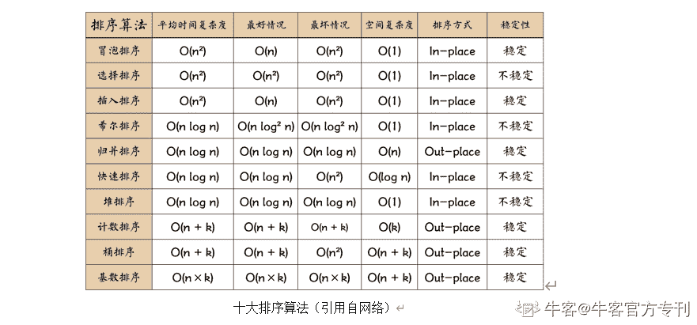

# 第二章 第 3 节 基础知识和技能-开发基本功

> 原文：[`www.nowcoder.com/tutorial/10046/87918dba4b53404380448172ff8f7348`](https://www.nowcoder.com/tutorial/10046/87918dba4b53404380448172ff8f7348)

测试行业发展到现在，对测试人员代码能力的要求也在逐年的增高，所以无论大厂还是小厂，校招面试和笔试过程中对求职人员的代码功底都会做相应的考察。同时在企业中，我们会使用代码版本管理工具来对我们开发的代码进行管理，目前互联网公司中流行的工具为 Git，因此在面试过程中也会对相应的技能做考察。每年都有很多的学生想要进入互联网行业之中，所以为了加快筛选速度，在一些大厂的笔试和面试中都会加入算法题目的考察，我们也需要做相应的准备。

# 1\. 编程语言

在 IT 行业中，比较主流的编程语言有 Java、Python、C++、C、C#、Javascript，Golang、Object-c、Ruby 等。在这么多编程语言中，对测试工程师或者测试工程师中最常使用的编程语言是 Java 或者 Python，不同公司的技术栈可能不同，对应的使用编程语言也会有所不同。互联网公司中诸如美团、阿里、网易、滴滴、拼多多使用的是 Java 系的技术栈，而对于不使用 Java 系技术栈的公司，测试往往使用的编程语言为 Python。所以在编程语言的选择方面我建议大家根据自己的以往经历从这两个中选择一个进行学习，对于没有任何编程基础的同学，那么我会建议你们直接学习 Java。在当年面试时，笔者两种语言都学习过。但在面试的过程中基本没有面试官问到 Python 相关的知识，问 Java 语言的相对来说会比较多。

对于 Java 语言的学习，牛客网上有适合大家从 0 到 1 开始学习的视频课程。在编程语言的学习上没有什么捷径可走，需要大家投入时间和精力去学习，用编辑器真实的敲代码进行练习，并在做项目的过程中进一步实践和掌握。对于 Java 语言，我们至少需要掌握：

（1）学会写第一个 hello world 程序，并能明白程序在运行过程中发生了什么。

（2）掌握 Java 语言的基础知识：关键词、基本数据类型、基本语法的相关知识（对齐 C 语言，有 C 语言功底的话这个部分可以很快的掌握）

（3）Java 中的面向对象的设计，类的封装、继承和多态、接口的概念和实现

（4）需要掌握 Java JDK 帮我们封装好的常用的集合类，如 String、StringBiulder、List、Set、Map，对这些集合类的使用考察是面试中经常会考察的内容

（5）学习 Java 中的 IO 操作以及常用的 IO 操作类之间关系

（6）在网络请求中类的序列化和反序列的过程，以及实现方法

（7）学习反射（这也是在后面学习 AOP 的时候要用到的知识）、类加载机制、注解、泛型编程等进行框架以及工具类开发时比较实用的知识

（8）学习多线程编程的相关知识，这部分在部分大厂的面试过程中会考察

（9）Java 8 的典型的特性。

（10）关于 Java 的 Jvm 运行机制，这也是大厂面试过程中喜欢考察的内容

对于学习 Python 语言的同学，其实可以按照同样的思路出发进行相应的知识点的梳理和总结。有三个点是需要首先掌握的：（1）找一本经典的教科书写一个 hello word（2）学习基本的数据类型以及常用的数据结构在该语言中的实现（3）学习面向对象编程思想在该语言中的实现。然后其次才是掌握这个语言中特有的一些知识点。

# 2. Git 使用

Git 这个工具在日常的工作中主要用来帮助我们进行代码的版本管理的，现在基本上所有的公司都使用它。面试的时候也会考察这部分内容，考察的知识点也比较简单。大家可以参照 [`www.runoob.com/git/git-tutorial.html`](https://www.runoob.com/git/git-tutorial.html) 来进行学习。首先要掌握的是 Git 的工作流程，在 Git 仓库中工作区、暂存区、版本库之间的关系。然后是要练习常用的 Git 命令，练习时大家可以在 Github 上注册一个账号，然后在本地安装一个 Git，在本地起一个小项目，重点练习：

**（1）如何初始化一个本地****Git****仓库，进行分支创建和切换**

**（2）如何暂存以及提交代码到本地仓库**

**（3）如何将本地分支与远程仓库分支进行关联，将本地代码推送到远程仓库中**

**（4）如何从远程仓库拉取代码**

**（5）以及在合代码的过程中出现冲突如何解决**

# 3\. 算法题准备

最近几年无论是校园招聘还是社会招聘，面试过程中手撕代码越来越常见，而且题目可能会越来越难，这一个环节的准备也是大家的痛点所在。但是这个环节的准备过程大家是不会吃亏的，因为如果你选择了互联网的研发行列，这些在将来你们跳槽的时候（至少会是工作 5 年内的跳槽）也是有用的，所以我强烈建议大家在刷题的过程中做好总结和笔记，以便后续可以快速的复习。

我仔细回忆了一下 18 年校园招聘，对于测试开发这个岗位来说，其实如果简历写的足够的符合岗位，很少会因为笔试过程中算法题目没有做出来而不给大家面试的机会，面试过程中的算法题目也是比较常见的。所以首先想要告诉大家的是不要焦虑，耐住性子刷题。

刷题的话，我比较建议大家把 10 大排序算法+剑指 offer 的六十几道题目+leetcode 的热题 hot 100，从前往后，把这些刷完并复习 2 遍，并且一定要熟悉你所使用的编程语言的高级数据结构的支持，借助高级数据结构，在笔试的时候能够帮助我们快速解决题目，这也是为什么我比较建议大家学习 java 和 python 的原因，里面封装了很多高级数据结构，有各种可用的集合可以使用，这在笔试的时候是非常有用的。关于 10 大排序算法作为面试算法题目非常常见的，有很多总结的博客，大家搜索之后花 1 天的时间学习完，弄明白具体的时间和空间复杂度是如何计算的，刷完之后一定要做笔记，可以使用牛客网的博客进记录，写一下自己在学习过程中的思考误区，以便大家能够熟悉各种排序方法的思路，手写的时候能快速优雅的写出来。

剑指 offer 的题目在[牛客网](https://www.nowcoder.com/ta/coding-interviews)上刷就好了，现在校园招聘和社会招聘都有在用牛客网上的在线 IDE 进行手写代码，所以在[牛客网](https://www.nowcoder.com/ta/coding-interviews)上刷题能帮助大家熟悉在线编程的环境，面试起来也更得心应手一点。常考的分类有：双指针-》二叉树-》链表-》数组-》字符串-》动态规划-》回溯方法-》栈-》队列-》。