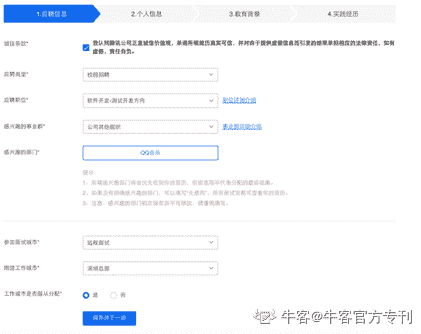
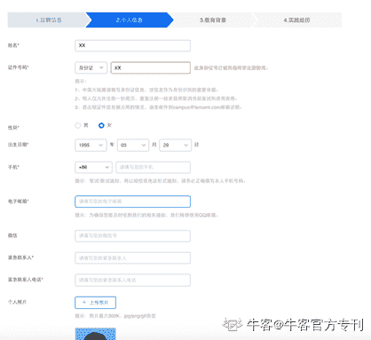
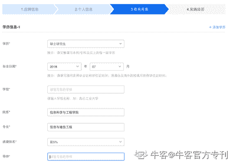
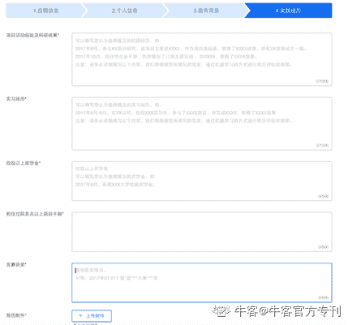

# 第三章 第 1 节 网申及注意事项

> 原文：[`www.nowcoder.com/tutorial/10046/505c09e0944c4a04a4d817ae6618518d`](https://www.nowcoder.com/tutorial/10046/505c09e0944c4a04a4d817ae6618518d)

前期的准备工作做好之后，我们就可以在合适的时间节点进行网申，申请相应的实习岗位和校园招聘岗位。和大家再强调一下：每年的大规模实习生招聘时间为当年的 3-5 月份，校园招聘时间大部分为 8-11 月份，有的公司可能会提前。一些履历和面试表现都比较好的同学会手握多个 offer，但最终只能去一家，所以在 11 月份大部分同学都做出选择之后，一些公司还会有补招的岗位，往年通常会有春季校园招聘，但目前来看补招也不再局限于春季招聘了，只要有合适的简历和岗位空缺，招聘就一直在进行。所以大家可以根据自己的情况，合理把握应聘时间。

本章主要给大家讲解如何进行网申、如何写简历、如何进行笔试以及如何准备面试。

# 1\. 如何网申

网申作为求职的过程中的第一步，决定了你是否有机会参加笔试和后续的面试，因此需要大家认真的对待。通常每个公司都有自己的网申系统，我们需要按照系统上的要求去填写相应的内容，一般来说在进行网申前大家就应该把自己的过往经历进行一次梳理，整理好自己的履历，然后对着自己要投递的岗位的要求重点突出符合要求的经历。

## 1.1.招聘信息来源

各个公司每年的实习生招聘和校园招聘的网申截止时间都会有所不同，需要大家提前关注各个公司的具体的招聘进度，以免错过了网申时间。大家可以获取招聘信息的来源有：

（1）学校的就业招聘网站、BBS 论坛

（2）牛客网的校招板块

（3）企业自己的官方招聘公众号。

在这几种途径中，优先推荐大家先重点列出自己心仪的公司，关注相关的招聘公众号，从而可以在第一时间获得相应的招聘计划安排。然后，在网申阶段每天定点关注牛客网的校招版本。一般来说会在学校发布招聘信息公司，一定是把该校作为目标招聘高校的，因此大家也可以重点关注学校就业网站发布的相关信息。

## 1.2.简历筛选与时间

网申的过程中也会对简历有一定筛选比例，所以在公司的选择上，网申阶段可以广撒网。对于硬性指标条件（如学校、成绩、是否做过班干部）比较好的同学基本上不用担心网申被卡，相对稍微弱一点的同学就会有一定的失败概率。所以不要只盯着头部的腾讯、阿里、美团、头条这些公司，对测试这个职位来说，其实有很多公司可以选择，银行类、证券类、硬件类、外企、游戏类的公司都可以进行关注。

关于网申完成的时间，建议大家准备好自己的简历内容之后尽早的投递。具有相关招聘需求的部门会在一定的时间从库里面筛选一定数量的简历发起面试，有的时候数量够了其实就不会再去筛选了，除非面试过程中几乎没有遇到合适的人。

在每年实习以及校园招聘阶段，大家会遇到到处都是内推码的情况。关于选择内推后到底有什么用，会因人因公司而异。目前来说，内推更多的是简历收集的一种渠道，很多时候你的内推人只能看到的是内推的进度。大家可以选择用内推的方式投递简历，只是不要放太多的期待在内推会帮助你加分这件事情上。选择内推之后，和内推人保持适当的联系也是有必要的。可以适当的从内推人那里了解一下目前该公司整体的招聘名额情况以及目前各部门的简历分布情况。如果某个部门招聘量大，但是简历还比较紧缺，那内推的时候可以选择对应的部门作为目标部门投递，提高自己的网申以及面试通过率。

## 1.3.网申填写内容

那网申的时候需要大家填写什么内容呢？其实各大公司校招时要填写的信息基本上类似，我们就以腾讯校招官网填写的内容为例给大家做一个讲解。填写的内容大致会分为应聘信息、个人信息、教育背景和实践经历四个板块。

应聘信息板块主要包含了应聘职位、感兴趣事业群和部门等。关于应聘职位，以前有很多公司在应聘职位上还会有第一志愿和第二志愿给大家选择，遇到这种情况其实可以忽略第二志愿，因为现在校园招聘竞争程度真的是逐年上升，尤其是互联网行业，所以第一志愿一定要选择自己为之做了充分准备的岗位，对我们来说就是要选择测试开发岗或者软件测试岗。关于参加面试的城市和期望工作的城市，这一部分往年有很多同学不注意填写，这里要给大家提醒的是期望工作城市要结合自己投递的目标部门所在的城市合理的填写。大家会比较纠结的地方在于感兴趣的事业群和部门要如何填写，是要选择一个具体的部门还是要选择都感兴趣。其实无论选择哪个都有利有弊。一般来说有招聘需求的部门会优先从意向部门为自己所在部门的简历中优先选择，然后发起面试，只有在候选人数量不足的时候才会去公共的资源池中筛选并锁定相关的简历。如果你能提前知道你选择的部门招聘需求量比较大并且简历紧张，那么你简历通过的概率也会相应增大，但如果你选择的部门基本上没有招聘需求，那么其他部门能够查看到你的简历概率就会减小。所以如果你不了解你目标部门当年的招聘情况而去做了一定的投递，是会有一定风险的，此时选择“无意向”会比较稳妥一点。

在个人信息板块中主要是一些基本信息的填写，大家按照自己的真实情况如实填写即可。每次网申基本上都会有上传个人照片的选项，大家可以选择是否上传，但如果选择上传的话一定要上传自己看起来比较积极阳光的照片，适当的可以请人帮忙 PS 一下，因为不得不说在大家简历都差不多的情况下，长得好看，稍微会有一点点优势，因为会给面试官另外一个给你发起面试的理由。
在教育背景这一块基本上如实填写就好，这里的信息往往会被公司作为简历筛选的硬性条件。在简历比较多的情况下，势必会优先筛选 985、211 高校毕业的学生。
最后一部分是“实践经历”，这个部分是整个网申简历中的重点部分，需要大家认真并详细的填写。其实具体的填写格式官网的提示中已经进行了充分的说明。可以填写自己的科研项目经历、在学校做过的项目开发经历，自己参加比赛所取得的一些成果、在学校里面组织过的大型活动的经历、实习经历等。内容一定要详实，要重点突出自己的优点，让简历筛选者有给你发起面试的理由。对于本科同学来说，可能科研经历没那么重要。但对于研究生同学来说，科研其实是我们的主要学习成果，不管其是否和我们的目标岗位相符合，我都建议大家填写相关的履历。因为他能够表现出一个人是否踏实，是否能完成好领导交代的任务，如果大家有这方面优秀的品质，即使经历和目标岗位不符合，也强烈建议在网申以及面试过程中表现自己这方面的品质素养。网申最后一个部分会请大家上传附件简历，需要给大家提醒的是简历要导成 PDF 之后再上传。

以上是按照腾讯校园招聘网申系统给大家做的详细的说明，其他公司要填写的内容基本上也都一致，只不过有的公司可能会有额外的开放式问题，对于自己在网申系统中所填写过的问题请大家都统一用文档记录下来，便于后续再次填写时可以方便的进行复制黏贴，也便于大家在填写的过程中不断的进行自我认知迭代，优化相应的答案。

网申完成后，大家另外会比较关心的是自己网申到底有没有过。其实完全不用去在意，如果网申通过，一定会收到相应的笔试和面试通知。认真的完成网申之后，我们要抓紧时间为接下来的笔试和面试做准备。如果实在压抑不住内心想知道的结果的冲动，大家再次登校园招聘官网查询网申进度，关注校招的 FAQ 板块，里边会有企业校招的整体的笔试、面试的时间安排。一般情况下，在网申截止后笔试开始前的几天内，网申通过的同学能收到后续通知。大家在静待通知的同时，可以多做一些其他公司的网申，并做好后续的相关准备，